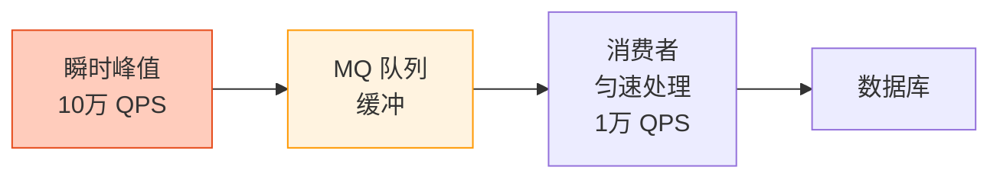

# 异步处理：MQ 削峰与 CompletableFuture 异步编排

创建日期：2026-06-06

## 为什么需要异步？

- **削峰填谷**：瞬时大流量，用 MQ 缓冲，平滑消费，保护系统。
- **提升吞吐**：同步等待浪费线程，异步处理让线程干更多活。
- **解耦**：下单后，通知、积分、物流都可以异步处理，下单主流程更快。
- **用户体验**：非关键操作异步做，页面响应更快。

## MQ 削峰设计

### 削峰原理



- 把瞬时流量转换成平稳流量。
- 系统按平时流量设计，不用按峰值扩容。
- 降低成本，保护系统。

### 设计要点

| 要点 | 说明 |
|------|------|
| **队列长度控制** | 太大导致 MQ 存储爆，太小还是会被冲。根据业务峰值设置合理容量。 |
| **消费速度控制** | 根据系统能力调整消费线程数，不能太快打垮 DB，不能太慢积压过多。 |
| **消息可靠性** | 保证消息不丢：持久化 + 手动 ACK。 |
| **过期丢弃** | 对时效性要求不高的，可以设置消息过期，超过时间直接丢弃。 |

### 典型案例：秒杀异步下单

用户秒杀请求 → Redis 预扣库存成功 → 发消息到 MQ → 立即返回用户"排队中"。消费者慢慢消费，创建订单扣数据库库存。瞬时 10 万 QPS，MQ 拦住，消费者几千 QPS 慢慢处理，DB 扛得住。

## CompletableFuture 异步编排

### 为什么用 CompletableFuture？

传统 Future 的缺点：
1. `get()` 会阻塞，不能非阻塞回调。
2. 多个 Future 不能组合编排。
3. 异常处理不友好。

CompletableFuture 解决了这些问题，支持流式 API、链式调用、任务组合。

### 核心 API 实战

```java
// 1. 异步执行，有返回值
CompletableFuture<String> future = CompletableFuture.supplyAsync(() -> {
    return queryFromDB();
}, executor);

// 2. 异步执行，无返回值
CompletableFuture.runAsync(() -> {
    sendLog();
}, executor);

// 3. 链式处理：上一个结果交给下一个
future.thenApply(result -> process(result))
      .thenAccept(finalResult -> System.out.println(finalResult));

// 4. 异常处理
future.exceptionally(ex -> {
    log.error("error", ex);
    return defaultValue;
});

// 5. 组合两个独立 future，都完成再处理
CompletableFuture<String> f1 = getInfo1();
CompletableFuture<String> f2 = getInfo2();
f1.thenCombine(f2, (a, b) -> a + b);

// 6. 等待所有 future 完成
CompletableFuture.allOf(f1, f2, f3).join();

// 7. 只要一个完成（哪个快用哪个）
CompletableFuture.anyOf(f1, f2).get();
```

### 实战案例：商品详情页并行查询

商品详情需要查多个数据：基本信息、推荐、库存、评价。这些来自不同服务，可以并行查询。

**串行做法（慢）：**
```java
info = getBaseInfo();     // 100ms
recommend = getRecommend(); // 100ms
stock = getStock();       // 100ms
// 总时间: 300ms
```

**CompletableFuture 并行（快）：**
```java
CompletableFuture<Info> info = CompletableFuture
    .supplyAsync(() -> baseService.get(id), executor);
CompletableFuture<Recommend> recommend = CompletableFuture
    .supplyAsync(() -> recommendService.get(id), executor);
CompletableFuture<Stock> stock = CompletableFuture
    .supplyAsync(() -> stockService.get(id), executor);

// 等待所有完成
CompletableFuture.allOf(info, recommend, stock).join();
// 总时间 ≈ 最慢一步的时间 ≈ 100ms，提升 3 倍
```

### 常见坑点

1. **默认用 ForkJoinPool，自定义线程池更好**：大量阻塞操作要自定义线程池，避免占满公共线程池。
2. **异常吞掉问题**：必须处理 `exceptionally` 或 `handle`，不然异常被吞了不知道。
3. **线程池混用**：不同类型业务用不同线程池，IO 密集和 CPU 密集线程数设置不同。

## 响应式编程（Reactor / WebFlux）

### 核心思想

- 基于事件流，异步非阻塞。
- **背压（Backpressure）**：消费者能控制生产者速度，防止生产者太快压垮消费者。
- 代表实现：Reactor（Spring WebFlux）、RxJava。

### 适用场景

- IO 密集型，大量并发连接（网关、代理服务）。
- 流媒体处理。

### vs CompletableFuture

- CompletableFuture 适合编排**少数几个异步任务**。
- 响应式适合处理**无限事件流**，适合整个链路全异步化。
- 复杂度：响应式 > CompletableFuture。业务开发推荐 CompletableFuture 足够。

## 请求合并（Request Collapsing）

### 原理

把一段时间窗口内的多个小查询请求攒起来，合并成一次批量查询，结果分发回各个请求。减少网络 IO 和 DB 查询次数，提升吞吐。

### 优缺点

- ✅ 减少 DB 查询次数，提升整体吞吐。
- ❌ 增加延迟，要等窗口攒齐请求。
- ❌ 实现复杂。

**适用场景：** 请求频率高，单个请求处理很快，批量收益远大于延迟增加。Hystrix 原生支持请求合并。

---

## 经典高频面试题

### Q1：MQ 削峰原理是什么？能解决什么问题？

**知识要点：** 把瞬时洪峰流量存入 MQ 队列缓冲，消费者按系统承受能力匀速消费，将"尖峰"变"平流"。

**项目场景：** 我们秒杀系统，开抢瞬间请求 QPS 约 15 万，而实际下单能力只有 5000 QPS。如果不削峰，DB 瞬间就会被冲垮。

**踩坑经历：** 第一次做秒杀没经验，用了同步下单——用户请求直接写 DB。活动开始后 2 秒内，15 万 QPS 全打在 MySQL 上，连接池 500 瞬间耗尽，CPU 飙到 100%。接下来 3 分钟整个系统 503，用户疯狂刷新导致更多请求涌进来，形成恶性循环。

**决策过程：** 改为异步下单：用户请求 → Redis 预扣库存（检查+扣减，约 0.5ms）→ 发 MQ 消息 → 立即返回"正在排队"。消费者按 5000 QPS 匀速处理，慢慢写 DB 创建订单。MQ 充当了缓冲池，把 15 万瞬时 QPS 转换成 5000 匀速消费。

**量化结果：** 秒杀期间接口 RT 从 2000ms 降到 10ms（因为只做 Redis 操作不写 DB），下单成功率从 30% 提升到 99%，系统零故障。MQ 积压最多 200 万条消息，消费者花 6-7 分钟消化完，用户 80% 在 3 分钟内收到下单结果通知。

**面试官追问：**
1. MQ 消息积压太多怎么办？消费者消费速度不够快怎么扩容？
2. 如果 Redis 预扣库存成功但 MQ 消息丢失了，用户的订单就没了，怎么保证可靠性？
3. 异步下单后用户等太久了怎么办？怎么知道排队排到哪了？

### Q2：CompletableFuture 的 allOf 和 anyOf 有什么区别？用在什么场景？

**知识要点：** allOf 等待所有任务完成，适合并行查询后聚合；anyOf 只要一个完成就继续，适合多备份择优。

**项目场景：** 订单详情页需要聚合 5 个数据源：订单基本信息、物流轨迹、支付记录、退款记录、评价信息。这些来自 5 个不同微服务，串行调用需要约 500ms。

**踩坑经历：** 最初串行调用，RT 稳定在 450-500ms。有一次流量高峰期，物流服务偶发性慢（RT 飙到 800ms），导致整个订单详情页 RT 变成 1300ms，用户体验很差。后来改了 allOf 并行调用，终于降下来了。

**决策过程：** 用 CompletableFuture.allOf 并行调用 5 个服务，每个服务独立线程池，互不阻塞。对于非核心的推荐模块，用 anyOf 同时调主推荐服务和备用推荐服务，哪个先返回用哪个，500ms 没返回就降级到热门商品。

**量化结果：** 并行后订单详情 RT 从 450ms 降到 120ms（取决于最慢的服务），吞吐从 200 QPS 提升到 600 QPS（因为线程没有在等 IO，可以做更多事）。anyOf 方案让推荐模块的可用性从 99.5% 提升到 99.99%。

**面试官追问：**
1. allOf 里如果有一个服务超时了，怎么处理？会不会拖慢整体？
2. anyOf 你拿到了第一个结果，后面的结果怎么办？要取消吗？
3. 5 个服务用同一个线程池还是不同线程池？为什么？

### Q3：CompletableFuture 中 thenApply 和 thenAccept 的区别？

**知识要点：** thenApply 有返回值（继续链式调用），thenAccept 无返回值（消费结束，通常是最后一步）。

**项目场景：** 我们对一个异步查询结果做连锁处理——查订单 → 计算优惠 → 格式化展示，每一步都靠 CompletableFuture 链式传递。

**踩坑经历：** 新来的同事在 thenApply 里做了日志打印然后没 return 任何有意义的值，下一个 thenApply 拿到的是 null，结果 NPE 了。原因是没理解 thenApply 的返回值会传给下一步，thenAccept 才是消费型的不需要返回值。

**决策过程：** 订了代码规范：中间步骤有值要传下去用 thenApply，最后一步只消费用 thenAccept。CR 时重点检查这个。

**量化结果：** 纯粹是代码规范问题，修掉后没再出现 NPE。但这给我们提了个醒——CompletableFuture 的链式调用每一步的入参都依赖上一步的返回，理解每个 API 的语义很关键。

**面试官追问：**
1. thenApply 和 thenApplyAsync 有什么区别？什么时候用哪个？
2. 链式调用中某一步抛异常了，后面的 thenApply 还会执行吗？
3. thenCompose 和 thenApply 有什么区别？

### Q4：异步一定比同步快吗？什么时候不该用异步？

**知识要点：** 异步不是免费的，有线程切换和编排开销。简单逻辑、强一致性要求、CPU 密集型场景不适合异步。

**项目场景：** 我们有一个配置查询接口，从 MySQL 查一个配置值，RT 只有 2ms。有同事觉得"异步可以提高性能"，把查询改成 CompletableFuture.supplyAsync，结果 RT 从 2ms 变成了 10ms。

**踩坑经历：** 异步化后 RT 反而变慢了 5 倍。排查发现时间全花在 ForkJoinPool 的线程调度上——请求本身的逻辑 2ms 就执行完了，但线程切换和任务提交花了 8ms。而且因为是异步返回，Spring MVC 的 Filter 链路也要适配，又加了 1ms 的适配开销。

**决策过程：** 我们定了规则：IO 密集型且 IO 耗时占比超过 50% 的用异步；CPU 密集型或 IO 占比低于 50% 的用同步。代码里这个配置查询（IO 占比 90% 以上），但总共才 2ms，改成异步得不偿失。

**量化结果：** 恢复同步后 RT 回到 2ms。团队也不再盲目追求异步，而是先用 APM 工具分析请求的耗时分布，再决定是否异步化。

**面试官追问：**
1. 你怎么判断一个请求的 IO 耗时占比？用什么工具？
2. 同步改异步后，线程模型变了，对 GC 有什么影响？
3. 如果不确定该不该用异步，有什么灰度验证方案？

### Q5：什么是背压（Backpressure）？响应式编程为什么需要背压？

**知识要点：** 背压是消费者告诉生产者"我处理不过来了，你慢点"。响应式是推送模型，没有背压消费者会被压垮。

**项目场景：** 我们做实时数据看板，WebSocket 推送交易数据给前端。每秒约 5000 条交易，高峰期前端渲染不过来，数据在浏览器端堆积导致页面卡死。

**踩坑经历：** 生产者（服务端）不管消费者（浏览器）能不能处理，就疯狂推送。开发环境数据少（每秒 10 条）看不出问题，一上线 5000 条/秒浏览器直接白屏。WebSocket 缓冲队列从几百条涨到几万条，内存泄漏 OOM。

**决策过程：** 引入背压机制：浏览器通过 WebSocket 回复 ack，告知服务端"我还能处理 X 条"，服务端按此速率推送。超过窗口不推送，改为聚合——1 秒内的多条相似交易合并成一条摘要推送。

**量化结果：** 前端从白屏到流畅 60fps，内存占用从 500MB 降到 50MB。服务端推送速率从无控制到自适应，单页面的 WebSocket 最大缓冲从几万条降到 200 条以内。

**面试官追问：**
1. 背压导致数据延迟怎么办？用户看到的数据是不是过期的？
2. Reactor 里背压具体怎么实现的？用了什么操作符？
3. 如果消费者永远说"处理不过来"，生产者是不是永远不发数据？

### Q6：请求合并的优缺点？什么时候用？

**知识要点：** 把多个小查询合并成一次批量查询，减少网络开销和 DB 次数。适合请求密集、单条查询快、批量收益大的场景。

**项目场景：** 我们的商品列表页，每个 Item 需要单独查库存服务获取库存信息。一页 20 个商品就是 20 次 RPC，首页加载时库存查询的 RPC 开销占了总 RT 的 60%。

**踩坑经历：** 20 次 RPC 串行调用下来约 200ms，加上其他数据聚合，首页 RT 超过 800ms，远高于 500ms 的目标。

**决策过程：** 用请求合并：收集 10ms 窗口内的所有库存查询请求，合并成一次批量查询（`batchGetStock(itemIds)`），库存服务一次返回所有 ID 的库存，然后分发回各个调用方。

**量化结果：** 库存查询的 RPC 次数从每次请求 20 次降到 1 次，库存模块 RT 从 200ms 降到 15ms（批量查询本身约 10ms + 等待窗口 5ms）。首页整体 RT 从 800ms 降到 350ms。

**面试官追问：**
1. 等待窗口设 10ms，这 10ms 的等待会不会让接口变慢？
2. 合并请求的一个请求超时了，会影响其他请求吗？
3. 如果批量查询的结果里有部分 ID 没查到数据，你怎么区分哪个 ID 没数据哪个是查询失败？