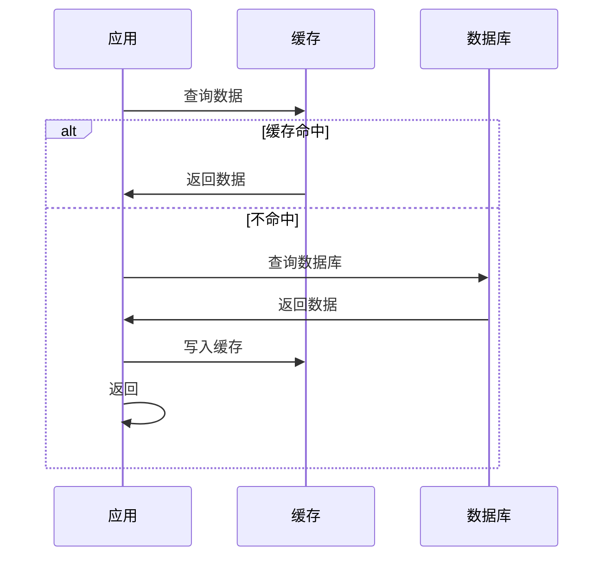
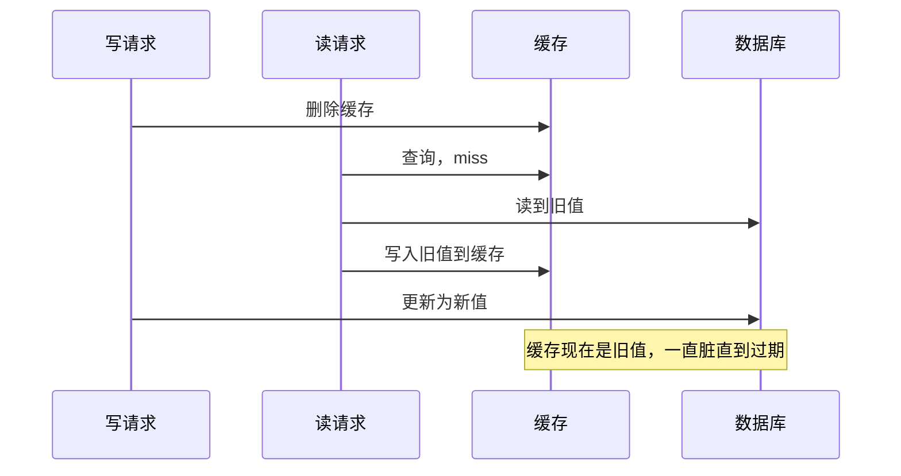

# 缓存策略：四种更新模式对比与缓存一致性

创建日期：2026-06-06

## 问题背景

缓存是高并发系统第一性能优化手段。"缓存一响，黄金万两"——合理使用缓存能让 QPS 提升数十倍。但缓存引入了很多问题：怎么更新缓存？缓存和数据库怎么保持一致？热点 Key 怎么处理？这些都是面试最高频考点。

## 多级缓存架构


每一级缓存目的不同：
- **浏览器缓存**：减少重复请求，浏览器本地存储。
- **CDN 缓存**：静态资源就近返回，减轻源站压力。
- **Nginx 缓存**：热点静态资源缓存到接入层，不回源。
- **应用本地缓存（Caffeine）**：超高速，适合变化不频繁的热点数据。
- **Redis 分布式缓存**：整个集群共享，解决本地缓存一致性问题。

## 四种缓存更新模式

### 1. Cache Aside（旁路缓存）—— 最常用

**读流程：**



**写流程：**
1. 先更新数据库
2. 再删除缓存

**为什么不更新缓存而是删除？** 并发写场景下，更新缓存容易导致脏数据。删除缓存，下次读自然会回源加载最新值。

**适用场景：** 绝大多数业务场景，Redis 分布式缓存标准用法。

---

### 2. Read Through（读透）

**原理：** 应用只读缓存，缓存不命中时由缓存组件自己回源到数据库加载。应用不需要关心回源逻辑。

**适用场景：** Guava / Caffeine 本地缓存常用这种模式。

---

### 3. Write Through（写透）

**原理：** 应用写缓存，缓存组件同步写数据库。对应用来说只需要写缓存，缓存负责写 DB。

**特点：** 保证缓存和 DB 同步更新，一致性好。但写入延迟高，因为要等 DB 写成功才返回。

**适用场景：** 对一致性要求高，读写比例均衡的场景。

---

### 4. Write Behind（Write Back，写回）

**原理：** 先写缓存，成功就返回。异步批量刷盘到数据库。操作系统的 Page Cache 就是这个模式。

**优缺点：**

- ✅ 写入性能极高，延迟极低。
- ❌ 有丢数据风险，机器宕机缓存没刷盘就丢了。
- ❌ 实现复杂，需要处理合并、刷盘、宕机恢复。

**适用场景：** 极高并发写入，能接受少量数据丢失（如商品浏览量统计、日志数据）。

### 四种模式对比

| 模式 | 读写复杂度 | 一致性 | 写入性能 | 适用场景 |
|------|-----------|---------|---------|---------|
| **Cache Aside** | 简单（应用控制） | 最终一致 | 好 | 绝大多数业务（推荐） |
| **Read Through** | 中等（缓存控制） | 最终一致 | 好 | 本地缓存 |
| **Write Through** | 中等（缓存控制） | 强一致 | 一般 | 一致性要求高 |
| **Write Behind** | 复杂 | 最终一致（可能丢） | 极好 | 高并发写入统计 |

## 缓存一致性问题

这是面试最高频考点：**先更新数据库还是先删缓存？**

### 方案一：先删缓存，再更数据库

**问题：** 并发写场景下，另一个读操作可能在删缓存后、更新 DB 前读到旧数据，写入缓存，导致缓存一直是脏数据。



### 方案二：先更数据库，再删缓存（推荐）

**问题：** 会不会不一致？会，但概率极低，需要同时满足：
1. 缓存刚好过期
2. 读请求在写完成前读到旧值并写入缓存

这种情况概率非常低，一般可以接受。

### 延迟双删方案

**原理：** 更新 DB 删缓存后，延迟一段时间（如 1 秒）再删一次，把可能已写入的旧值清理掉。

```java
void update(Data data) {
    db.update(data);      // 1. 更新数据库
    cache.delete(key);    // 2. 删除缓存
    // 异步延迟第二次删除
    executor.schedule(() -> cache.delete(key), 1, TimeUnit.SECONDS);
}
```

### Canal 订阅 Binlog 方案（更完美）

- 用 Canal 订阅 MySQL Binlog，解析出更新操作，异步删除缓存。
- 应用只需要更新 DB，不需要管缓存删除。
- 彻底解决一致性问题，但需要额外维护 Canal 组件。

::: tip 选型建议
- 一般业务：先更新 DB 再删缓存，足够用。
- 对一致性要求非常高：Canal 方案。
- 不需要因此引入过度复杂的方案。
:::

## 缓存三大问题

### 穿透、击穿、雪崩

| 问题 | 原因 | 场景 | 核心解决方案 |
|------|------|------|-------------|
| **穿透** | 查询不存在的数据 | 恶意攻击或异常 ID | 布隆过滤器 / 缓存空值 |
| **击穿** | 热点 Key 过期瞬间 | 单个热点 Key 过期 | 互斥锁 / 永不过期 |
| **雪崩** | 大面积 Key 同时过期 | 批量过期 / Redis 宕机 | 过期加随机 / 高可用 |

### 缓存穿透

**问题：** 查询一个不存在的数据，缓存不命中，每次都查 DB，缓存等于废了。

**解决方案：**
1. **布隆过滤器**：把所有存在的 Key 放进布隆过滤器，不存在直接拒绝。
2. **缓存空值**：查询 DB 不存在，也缓存一个空值，设置短过期时间。

### 缓存击穿

**问题：** 一个热点 Key，缓存过期瞬间，大量并发请求同时击穿去查 DB。

**解决方案：**
1. **互斥锁**：缓存 miss，只有一个线程能去 DB 加载，其它线程等待。
2. **永不过期**：热点 Key 不设过期，异步后台更新。
3. **预热**：热点 Key 提前加载进缓存。

### 缓存雪崩

**问题：** 大面积 Key 同时过期，或 Redis 宕机，DB 被打垮。

**解决方案：**
1. **过期时间加随机扰动**：`expire = base + random`，避免同时过期。
2. **多级缓存**：本地缓存 + 分布式缓存，Redis 挂了还有本地缓存顶着。
3. **缓存集群高可用**：Redis Sentinel / Cluster。
4. **限流降级**：真雪崩了，限流降级，保护 DB。

## 热点 Key 处理

**问题：** 某个 Key 特别热，几万 QPS 都打在这一个 Key 上，Redis 单节点压力大。

**解决方案：**

1. **多级缓存**：本地缓存（Caffeine）+ Redis，应用本地读，不访问 Redis。
2. **热点分片**：把一个热点 Key 拆成多个副本 `key_1, key_2, ... key_n`，分散压力。
3. **缓存预热**：系统启动就把热点数据加载进缓存，避免冷启动。

## 缓存预热

**预热方案：**

- **定时任务预热**：启动后扫 DB，把热点数据加载进缓存。
- **流量回放**：把线上真实流量录下来，重启后回放一遍，自然加载缓存。
- **人工触发**：活动开始前，调用接口手动预热。

---

## 经典高频面试题

### Q1：Cache Aside、Read Through、Write Through、Write Behind 四种模式区别？怎么选型？

**知识要点：** Cache Aside 是最通用的模式（应用自己控制缓存），另外三种是缓存组件控制读写。90% 场景用 Cache Aside 就够了。

**项目场景：** 我们电商商品详情页，日均 PV 2 亿，QPS 峰值约 8000。最初缓存没有统一模式，各个模块自己搞一套。

**踩坑经历：** 有一次做数据统计的后台同事用了 Write Behind 模式——先写缓存，异步批量写 MySQL。有一次统计服务重启，缓存里积压了约 30 万条数据没刷到 MySQL，直接丢了。虽然是统计数据（商品浏览量）不是核心数据，但运营团队追了 2 周的数据对不上。

**决策过程：** 我们统一推行 Cache Aside 模式：读的时候先查缓存，miss 则查 DB 写缓存；写的时候先更新 DB，再删缓存。对商品详情这种读多写少的场景（读写比约 100:1），这个模式最合适——简单、可靠、数据一致性可控。统计数据类就用 Write Behind 放缓存兜底。

**量化结果：** 统一 Cache Aside 后，缓存命中率从 85% 提升到 97%（因为缓存逻辑统一了，之前有些模块写漏了缓存），数据库读 QPS 从 15000 降到 3000，RT 从 200ms 降到 30ms。丢数据事故再没发生过。

**面试官追问：**
1. Cache Aside 模式下，如果缓存删除失败了怎么办？
2. 读写比是多少时，Cache Aside 就不太合适了？
3. Write Behind 丢数据你怎么防？有没有不丢的方案？

### Q2：先更新数据库还是先删缓存？为什么？延迟双删原理是什么？

**知识要点：** 推荐先更新 DB 再删缓存。先删缓存容易出现脏数据。延迟双删是第二次异步删缓存，消除并发读写入的旧值。

**项目场景：** 我们商品编辑后台，运营修改商品信息后，C 端用户看到的是旧数据，投诉"改了为什么没生效"。

**踩坑经历：** 最初我们用的是"先删缓存，再更新 DB"。结果出现了一个经典并发场景：运营点保存→删了缓存→在这瞬间有用户访问商品详情→缓存 miss→读了还未更新的旧数据→把旧数据写进缓存→运营的更新执行，DB 已经是新数据了，但缓存里是用户读的旧数据。这个旧数据会一直在缓存里直到过期（我们设了 30 分钟），运营改了等于没改。

**决策过程：** 换成"先更新 DB，再删缓存"，这个并发路径概率极低——需要在删缓存和下一个读之间刚好有一个读请求查 DB 并写缓存。如果实在担心，再加延迟双删：定时 500ms 后再删一次缓存，把可能写入的旧值清掉。

**量化结果：** 改造后，商品编辑后 C 端 95% 的情况下 1 秒内就看到最新数据（因为缓存删了后下次读会回源），剩下的 5% 延迟双删也兜住了。没有再出现运营改完看不到效果的问题。

**面试官追问：**
1. 延迟双删的延迟时间怎么定？500ms 是拍出来的还是算出来的？
2. 如果 DB 主从延迟很大，主库更新了但从库还是旧数据，你的缓存策略还有效吗？
3. 有没有比延迟双删更优雅的方案？

### Q3：缓存穿透、缓存击穿、缓存雪崩的区别？各自怎么解决？

**知识要点：** 穿透是查不存在的数据（缓存永远 miss），击穿是热点 Key 过期瞬间并发打 DB，雪崩是大面积 Key 同时过期。

**项目场景：** 我们秒杀系统的缓存设计，这三个问题全都遇到过，一次比一次惨。

**踩坑经历——穿透：** 有人用脚本批量请求不存在的商品 ID（爬虫扫库），这些 ID 缓存里永远没有，每次打 DB。MySQL QPS 从 3000 飙到 8000，CPU 100%，连正常查询都慢。我们加布隆过滤器拦截不存在 ID，再用缓存空值短过期兜底。

**踩坑经历——击穿：** 秒杀商品缓存设了 5 分钟过期，活动开始后缓存过期瞬间，5000 并发请求同时穿透到 DB 查同一个商品，DB 连接池 50 个直接被打满，30 秒内该商品 RT 从 10ms 飙到 30000ms，整台机器负载爆表。紧急加了分布式互斥锁——缓存 miss 时只让一个线程去查 DB 加载缓存，其他线程等锁或返回旧值。

**踩坑经历——雪崩：** 冷启动时所有缓存为空，加上其中一台 Redis 宕机，全部流量打到 MySQL，MySQL 直接挂掉，整个系统 503 了 20 分钟。

**决策过程：** 穿透→布隆过滤器+空值缓存；击穿→互斥锁+热点永不过期；雪崩→过期加随机（5分钟 ± 30秒）+ Redis Cluster 高可用 + 本地 Caffeine 多级缓存兜底。

**量化结果：** 三层防护后，穿透从每天 5000+ 次降到零；热 Key 过期后 DB 最多收到 1 个查询请求；Redis 宕机时本地缓存兜住 70% 的请求，剩余 30% 走 DB 但可控。

**面试官追问：**
1. 布隆过滤器有误判率，如果误判了一个实际存在的 Key 说不存在，怎么办？
2. 互斥锁方案里，等锁的线程是阻塞还是直接返回旧数据？这两种各有什么优劣？
3. 三高场景（高并发、高可用、高性能），这些问题优先级怎么排？

### Q4：热点 Key 问题怎么发现？怎么解决？

**知识要点：** 热点 Key 是单个 Key 承载极高 QPS，单 Redis 节点压力大。发现靠监控+采样，解决靠多级缓存+分片。

**项目场景：** 我们有个活动的页面，日均流量 500 万，90% 的请求都打在了活动配置这一个 Key 上，峰值 QPS 约 3500，Redis 单节点 CPU 飙到 90%。

**踩坑经历：** 一开始没发现是热点 Key 问题，感觉"Redis 那么快，怎么可能扛不住"。直到 Redis 监控显示单分片 CPU 100% 而其他分片不到 20%，才发现是热点 Key 把单分片打爆了。Redis 虽然是单线程很快，但 3500 QPS 集中在单个 Key 上，加上序列化反序列化开销，确实扛不住。

**决策过程：** 三层方案：1) 应用层加 Caffeine 本地缓存，5 秒刷新，3500 QPS 变成本地调用，Redis 只剩每 5 秒 1 次刷新请求；2) 本地缓存也没覆盖的节点，Key 拆 10 份（key_0 ~ key_9），随机取一份，把 3500 分散到 10 个 Key 每个 350 QPS；3) 监控热 Key：Redis 的 hotkey 命令或客户端采样统计。

**量化结果：** 改造后 Redis 单分片 CPU 从 90% 降到 5%，本地缓存命中率 99%+，RT 从 5ms 降到 0.1ms。多级缓存方案后来推广到所有核心配置类数据。

**面试官追问：**
1. 本地缓存和 Redis 数据不一致怎么处理？5 秒刷新够不够？
2. Key 拆了 10 份，更新的时候怎么保证 10 份都更新到位？
3. 如果热点 Key 是动态变化的（今天是商品 A，明天是商品 B），怎么自动识别和应对？

### Q5：什么是缓存雪崩？怎么预防？

**知识要点：** 缓存大面积失效或 Redis 宕机，流量全部压到 DB，导致 DB 崩溃。预防靠过期时间随机化+高可用+多级缓存+限流降级。

**项目场景：** 我们做商品中心，Redis 内存打满后触发了淘汰策略，大量 Key 被批量淘汰，加上没有随机过期时间，缓存瞬时大面积失效。

**踩坑经历：** 某天凌晨 Redis 内存达到 maxmemory，触发了 allkeys-lru 淘汰。因为所有 Key 的过期时间设置为同一时刻（定时任务批量刷入），一瞬间 30% 的 Key 同时过期+淘汰，商品中心的 MySQL QPS 瞬间从 2000 飙到 25000，连接池 200 个被耗尽，大量请求超时，持续了 15 分钟才恢复。此时正值海外用户访问高峰，造成了批量客诉。

**决策过程：** 四层防御：1) 过期时间加随机扰动（base + random(1,180) 秒），不让同时过期；2) Redis 做 Cluster 分片 + Sentinel 高可用；3) 应用层加 Caffeine 本地缓存，Redis 挂了本地也能撑一波；4) 终极兜底——限流降级，如果数据库压力过大直接熔断，返回缓存旧数据。

**量化结果：** 改造后 Redis 宕机模拟测试中，Caffeine 本地缓存兜住了 70% 的请求，加上限流兜底，DB 峰值 QPS 控制在 3000 以内。Redis 故障时系统不会完全不可用，能做到"降级可用"。大促期间 0 次雪崩故障。

**面试官追问：**
1. 过期时间随机扰动，范围怎么定？1-180 秒的依据是什么？
2. 如果 Redis Cluster 整个集群都挂了，你的本地缓存能撑多久？
3. 限流降级的入口在哪里？网关层还是应用层？为什么？

### Q6：为什么 Cache Aside 要删除缓存而不是更新缓存？

**知识要点：** 更新缓存容易产生并发写脏数据，删除缓存让下次读自然回源，比更新更安全。

**项目场景：** 用户信息缓存，多个业务线都能修改用户信息（基础信息、会员等级、积分），并发写场景很常见。

**踩坑经历：** 一开始做的是更新缓存——写 DB 后同步更新缓存的值。结果出现了一个坑：A 线程更新会员等级（V1→V2），B 线程更新积分（100→200），两个线程同时更新 DB 和缓存。DB 层面因为行锁保证了最终正确（V2, 200），但缓存更新时序不对，A 先更新缓存（V2, 100），B 后更新缓存（V1, 200），缓存里变成了不伦不类的脏数据。

**决策过程：** 改成删除缓存而不是更新缓存。并发写再多，最终都是删缓存，下次读的时候回源加载 DB 最新值。虽然多了一次读 DB，但避免了脏数据，而且用户信息这种数据读远多于写（读写比 50:1），多一次读 DB 完全可以接受。

**量化结果：** 改成删除缓存后，用户信息缓存不一致的客诉从每月 3-5 起降到 0。缓存命中率从 98% 降到 96%（因为删了缓存后有短暂的 miss），但这点代价和"数据正确"相比不值一提。

**面试官追问：**
1. 如果更新非常频繁（比如秒杀扣库存），删缓存导致命中率大幅下降，怎么折中？
2. 有一种做法是"写 DB 成功后异步更新缓存"，和删缓存比优劣是什么？
3. 如果删缓存的操作失败了，你有什么补偿机制？