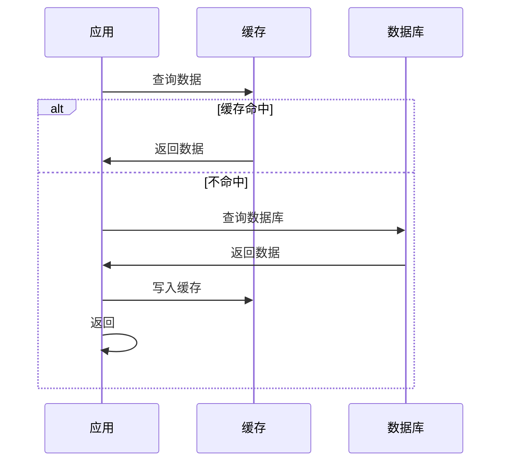
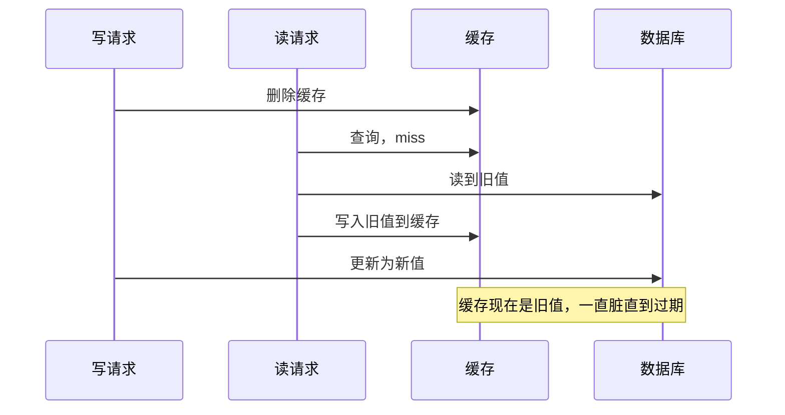

# 缓存策略：四种更新模式对比与缓存一致性

创建日期：2026-06-06

## 问题背景

缓存是高并发系统第一性能优化手段。"缓存一响，黄金万两"——合理使用缓存能让 QPS 提升数十倍。但缓存引入了很多问题：怎么更新缓存？缓存和数据库怎么保持一致？热点 Key 怎么处理？这些都是面试最高频考点。

## 多级缓存架构


每一级缓存目的不同：
- **浏览器缓存**：减少重复请求，浏览器本地存储。
- **CDN 缓存**：静态资源就近返回，减轻源站压力。
- **Nginx 缓存**：热点静态资源缓存到接入层，不回源。
- **应用本地缓存（Caffeine）**：超高速，适合变化不频繁的热点数据。
- **Redis 分布式缓存**：整个集群共享，解决本地缓存一致性问题。

## 四种缓存更新模式

### 1. Cache Aside（旁路缓存）—— 最常用

**读流程：**



**写流程：**
1. 先更新数据库
2. 再删除缓存

**为什么不更新缓存而是删除？** 并发写场景下，更新缓存容易导致脏数据。删除缓存，下次读自然会回源加载最新值。

**适用场景：** 绝大多数业务场景，Redis 分布式缓存标准用法。

---

### 2. Read Through（读透）

**原理：** 应用只读缓存，缓存不命中时由缓存组件自己回源到数据库加载。应用不需要关心回源逻辑。

**适用场景：** Guava / Caffeine 本地缓存常用这种模式。

---

### 3. Write Through（写透）

**原理：** 应用写缓存，缓存组件同步写数据库。对应用来说只需要写缓存，缓存负责写 DB。

**特点：** 保证缓存和 DB 同步更新，一致性好。但写入延迟高，因为要等 DB 写成功才返回。

**适用场景：** 对一致性要求高，读写比例均衡的场景。

---

### 4. Write Behind（Write Back，写回）

**原理：** 先写缓存，成功就返回。异步批量刷盘到数据库。操作系统的 Page Cache 就是这个模式。

**优缺点：**

- ✅ 写入性能极高，延迟极低。
- ❌ 有丢数据风险，机器宕机缓存没刷盘就丢了。
- ❌ 实现复杂，需要处理合并、刷盘、宕机恢复。

**适用场景：** 极高并发写入，能接受少量数据丢失（如商品浏览量统计、日志数据）。

### 四种模式对比

| 模式 | 读写复杂度 | 一致性 | 写入性能 | 适用场景 |
|------|-----------|---------|---------|---------|
| **Cache Aside** | 简单（应用控制） | 最终一致 | 好 | 绝大多数业务（推荐） |
| **Read Through** | 中等（缓存控制） | 最终一致 | 好 | 本地缓存 |
| **Write Through** | 中等（缓存控制） | 强一致 | 一般 | 一致性要求高 |
| **Write Behind** | 复杂 | 最终一致（可能丢） | 极好 | 高并发写入统计 |

## 缓存一致性问题

这是面试最高频考点：**先更新数据库还是先删缓存？**

### 方案一：先删缓存，再更数据库

**问题：** 并发写场景下，另一个读操作可能在删缓存后、更新 DB 前读到旧数据，写入缓存，导致缓存一直是脏数据。



### 方案二：先更数据库，再删缓存（推荐）

**问题：** 会不会不一致？会，但概率极低，需要同时满足：
1. 缓存刚好过期
2. 读请求在写完成前读到旧值并写入缓存

这种情况概率非常低，一般可以接受。

### 延迟双删方案

**原理：** 更新 DB 删缓存后，延迟一段时间（如 1 秒）再删一次，把可能已写入的旧值清理掉。

```java
void update(Data data) {
    db.update(data);      // 1. 更新数据库
    cache.delete(key);    // 2. 删除缓存
    // 异步延迟第二次删除
    executor.schedule(() -> cache.delete(key), 1, TimeUnit.SECONDS);
}
```

### Canal 订阅 Binlog 方案（更完美）

- 用 Canal 订阅 MySQL Binlog，解析出更新操作，异步删除缓存。
- 应用只需要更新 DB，不需要管缓存删除。
- 彻底解决一致性问题，但需要额外维护 Canal 组件。

::: tip 选型建议
- 一般业务：先更新 DB 再删缓存，足够用。
- 对一致性要求非常高：Canal 方案。
- 不需要因此引入过度复杂的方案。
:::

## 缓存三大问题

### 穿透、击穿、雪崩

| 问题 | 原因 | 场景 | 核心解决方案 |
|------|------|------|-------------|
| **穿透** | 查询不存在的数据 | 恶意攻击或异常 ID | 布隆过滤器 / 缓存空值 |
| **击穿** | 热点 Key 过期瞬间 | 单个热点 Key 过期 | 互斥锁 / 永不过期 |
| **雪崩** | 大面积 Key 同时过期 | 批量过期 / Redis 宕机 | 过期加随机 / 高可用 |

### 缓存穿透

**问题：** 查询一个不存在的数据，缓存不命中，每次都查 DB，缓存等于废了。

**解决方案：**
1. **布隆过滤器**：把所有存在的 Key 放进布隆过滤器，不存在直接拒绝。
2. **缓存空值**：查询 DB 不存在，也缓存一个空值，设置短过期时间。

### 缓存击穿

**问题：** 一个热点 Key，缓存过期瞬间，大量并发请求同时击穿去查 DB。

**解决方案：**
1. **互斥锁**：缓存 miss，只有一个线程能去 DB 加载，其它线程等待。
2. **永不过期**：热点 Key 不设过期，异步后台更新。
3. **预热**：热点 Key 提前加载进缓存。

### 缓存雪崩

**问题：** 大面积 Key 同时过期，或 Redis 宕机，DB 被打垮。

**解决方案：**
1. **过期时间加随机扰动**：`expire = base + random`，避免同时过期。
2. **多级缓存**：本地缓存 + 分布式缓存，Redis 挂了还有本地缓存顶着。
3. **缓存集群高可用**：Redis Sentinel / Cluster。
4. **限流降级**：真雪崩了，限流降级，保护 DB。

## 热点 Key 处理

**问题：** 某个 Key 特别热，几万 QPS 都打在这一个 Key 上，Redis 单节点压力大。

**解决方案：**

1. **多级缓存**：本地缓存（Caffeine）+ Redis，应用本地读，不访问 Redis。
2. **热点分片**：把一个热点 Key 拆成多个副本 `key_1, key_2, ... key_n`，分散压力。
3. **缓存预热**：系统启动就把热点数据加载进缓存，避免冷启动。

## 缓存预热

**预热方案：**

- **定时任务预热**：启动后扫 DB，把热点数据加载进缓存。
- **流量回放**：把线上真实流量录下来，重启后回放一遍，自然加载缓存。
- **人工触发**：活动开始前，调用接口手动预热。

---

## 经典高频面试题

### Q1：Cache Aside、Read Through、Write Through、Write Behind 四种模式区别？怎么选型？

**参考答案：**

- **Cache Aside**：应用控制缓存，读 miss 回源，写更新 DB 后删缓存。90% 场景用这个，简单可靠。
- **Read Through**：缓存组件控制回源，适合本地缓存。
- **Write Through**：缓存同步写 DB，一致性好但写入慢，适合一致性要求高的场景。
- **Write Behind**：先写缓存异步刷盘，性能极高但可能丢数据，适合统计类场景。

### Q2：先更新数据库还是先删缓存？为什么？延迟双删原理是什么？

**参考答案：**

- 推荐**先更新数据库，再删缓存**。一致性问题概率极低，可接受。
- 先删缓存再更 DB，并发下容易产生脏数据，旧数据留在缓存很久。
- **延迟双删**：更新 DB 删缓存后，延迟一段时间再删一次，解决并发读可能写入的旧值。第二次删异步做，不影响主流程。

### Q3：缓存穿透、缓存击穿、缓存雪崩的区别？各自怎么解决？

**参考答案：**

- **穿透**：查不存在的数据 → 布隆过滤器 / 缓存空值。
- **击穿**：热点 Key 过期 → 互斥锁 / 永不过期 / 预热。
- **雪崩**：大面积同时过期 → 过期加随机 / 高可用集群 / 多级缓存。

### Q4：热点 Key 问题怎么发现？怎么解决？

**参考答案：**

- **发现**：客户端采集热点 Key 上报；Redis 监控发现某个 Key 流量异常大。
- **解决**：本地缓存多级缓存；拆分多个副本分散压力（`key_1, key_2...`）；提前预热。

### Q5：什么是缓存雪崩？怎么预防？

**参考答案：**

缓存雪崩是大面积缓存同时失效，或 Redis 宕机，导致所有请求都打去 DB，DB 扛不住宕机。

预防措施：
1. 过期时间加随机，不要同时过期。
2. Redis 做高可用集群，避免单点。
3. 多级缓存，本地缓存兜底。
4. 限流降级，真出问题保护 DB。

### Q6：为什么 Cache Aside 要删除缓存而不是更新缓存？

**参考答案：**

- 并发写场景下，如果两个写同时更新缓存，可能导致脏数据。
- 删除缓存，下次读自然回源加载最新，比更新更安全。
- 如果数据很少更新，更新缓存性能更好，但一般业务还是删除更安全。
- 更新缓存如果写 DB 失败了，缓存已经是新值，不一致时间更长。