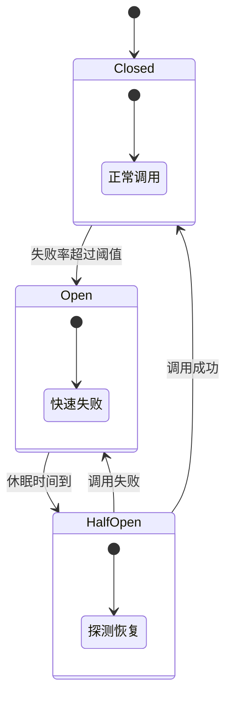

# 降级与熔断：熔断器状态机与舱壁隔离

创建日期：2026-06-06

## 问题背景

在微服务架构中，服务之间相互依赖。如果一个服务出现故障，会导致连锁反应，最终整个系统雪崩。

> **例子：** 用户服务 → 订单服务 → 库存服务 → 数据库。如果库存服务故障，所有调用库存的线程都阻塞，最终用户服务线程也被占满，整个系统不可用。

**解决思路：**

- **熔断**：故障发生时，快速失败，不继续调用故障服务，防止扩散。
- **降级**：熔断后，返回兜底数据，保证核心链路可用。
- **隔离**：不同业务线程池隔离，一个故障不影响其它。

## 熔断器状态机



### 三种状态详解

1. **关闭状态（Closed）**
   - 正常服务，请求正常通过。
   - 实时统计失败率和慢调用比例。
   - 超过阈值触发熔断 → 切换到打开状态。

2. **打开状态（Open）**
   - 所有请求直接失败，走降级逻辑，不调用下游。
   - 维持一段时间（休眠窗口期），让故障服务有时间恢复。
   - 窗口期结束后 → 切换到半开状态。

3. **半开状态（Half-Open）**
   - 允许少量请求探测下游服务是否恢复。
   - 如果成功 → 切回关闭状态。
   - 如果仍然失败 → 保持打开状态，重置休眠时间。

::: tip 一句话记住
熔断不是一开就永远开着，要给下游恢复的机会，所以必须有半开探测机制。
:::

### 触发条件对比

| 触发条件 | 说明 | 适用场景 |
|---------|------|---------|
| **异常比例** | 失败次数/总次数超过阈值 | 下游直接抛异常 |
| **慢调用比例** | 响应时间超过阈值的比例 | 下游响应慢但不抛异常，拖慢本系统 |
| **失败次数** | 连续失败 N 次触发 | 简单场景，快速判断 |

## 主流框架对比

### Hystrix（Netflix，已停止维护）

- 首创了熔断器模式，成为行业标准。
- 支持线程池隔离、信号量隔离、降级 fallback。
- ⚠️ 2018 年进入维护模式，不再开发新功能。社区推荐 Resilience4j 替代。

### Resilience4j（轻量，社区活跃）

- 设计轻量，函数式编程风格，依赖 Vavr + Java 8+。
- 模块化：只引入需要的模块（熔断 / 限流 / 重试 / 舱壁）。
- Spring 官方推荐替代 Hystrix。

```java
// 配置熔断器
CircuitBreakerConfig config = CircuitBreakerConfig.custom()
    .failureRateThreshold(50)                  // 失败率 50% 触发
    .waitDurationInOpenState(Duration.ofSeconds(1)) // 打开 1 秒后探测
    .slidingWindowSize(10)                        // 统计窗口大小
    .build();

CircuitBreaker breaker = CircuitBreaker.of("backend", config);
Supplier<String> decorated = CircuitBreaker
    .decorateSupplier(breaker, this::callBackend);
```

### Sentinel（阿里，国内生态首选）

- 阿里中间件团队开源，针对流量控制和熔断设计。
- 支持动态规则修改，无需重启应用。
- 提供可视化控制台，配置规则和监控一目了然。
- 深度集成 Spring Cloud、Dubbo、Nacos。

### 三方对比

| 特性 | Hystrix | Resilience4j | Sentinel |
|------|---------|--------------|----------|
| 状态 | 停止开发 | 活跃开发 | 活跃开发 |
| 架构设计 | 偏重 | 轻量模块化 | 功能完整 |
| 动态规则 | 不友好 | 一般 | 原生支持 |
| 控制台 | 无 | 需要第三方 | 官方提供 |
| 生态整合 | 一般 | Spring 推荐 | 阿里生态完美 |
| 国内推荐 | ⭐⭐ | ⭐⭐⭐ | ⭐⭐⭐⭐⭐ |

## 舱壁隔离（Bulkhead）

### 为什么需要隔离？

没有隔离，一个慢接口就能占满所有线程，导致其它正常的接口也无法处理。

### 两种隔离方式对比

| 对比项 | 线程池隔离 | 信号量隔离 |
|--------|-----------|-----------|
| 隔离效果 | 完全隔离，一个慢了不影响 | 只限制并发，仍共用线程 |
| 开销 | 上下文切换，较大 | 很小 |
| 超时控制 | 支持超时 | 需要异步自己控制 |
| 适用场景 | 远程调用（可能慢） | 本地快操作 |

### 实践建议

- 微服务间远程调用 → 推荐线程池隔离，安全第一。
- 本地缓存查询、确定很快的操作 → 信号量，性能优先。
- Sentinel 支持通过配置选择，根据场景灵活切换。

## 降级策略实践

熔断后不能让用户一直看错误页，需要返回兜底数据：

| 降级方式 | 说明 | 适用场景 |
|---------|------|---------|
| **返回默认值** | 返回静态默认值 | 非核心数据，不影响主流程 |
| **返回缓存数据** | 返回过期的缓存数据 | 对时效性要求不高的数据 |
| **兜底页面** | 降级到静态降级页面 | 首页、详情页等页面级降级 |
| **取消非核心链路** | 下单时关掉推荐/积分/营销 | 大促秒杀，保证核心下单可用 |
| **人工降级** | 大促前手动关闭非核心功能 | 预计流量超大，提前降级 |

::: tip 降级和熔断的关系
- **熔断**是触发条件：下游故障了，打开熔断器。
- **降级**是应对策略：打开后给用户返回什么兜底。
- 熔断是原因，降级是结果，两者配合使用。
:::

---

## 经典高频面试题

### Q1：画图说明熔断器的三种状态和状态流转？

**参考答案：**

- **Closed（关闭）**：正常调用，统计失败率。失败率超过阈值 → Open。
- **Open（打开）**：直接失败，不调用下游。等待休眠窗口期结束 → Half-Open。
- **Half-Open（半开）**：放少量请求探测。成功 → 回到 Closed；失败 → 继续 Open，重置计时器。

核心设计：给下游恢复的机会，不能让熔断器永远打开。

### Q2：降级和熔断有什么区别？什么时候降级，什么时候熔断？

**参考答案：**

- **熔断**：是一种故障保护机制。当下游失败率超过阈值，打开熔断器，不再调用下游，防止故障扩散。
- **降级**：是一种业务可用性策略。当下游不可用，返回兜底数据，保证核心功能可用。
- 熔断是保护系统不被拖垮，降级是保证用户体验还能用。
- 一般熔断触发后走降级，熔断是原因，降级是结果。

### Q3：Hystrix 已经停更了，为什么还有人问？现在用什么替代？

**参考答案：**

Hystrix 是熔断器模式的先行者，很多概念都是它定义的，所以面试还会问基础概念。2018 年后停止开发。

替代方案：
- Spring 生态官方推荐 **Resilience4j**，轻量模块化。
- 国内阿里生态用 **Sentinel**，功能更全，有控制台，动态规则方便。
- 微服务场景推荐 Sentinel，纯 Java 应用推荐 Resilience4j。

### Q4：舱壁隔离是什么意思？线程池隔离和信号量隔离怎么选？

**参考答案：**

舱壁来源于轮船设计，把船分成多个独立舱室，一个漏水不沉。在高并发中就是把不同业务的资源（线程）隔离开：

- **线程池隔离**：每个业务用自己的线程池，一个占满不影响其它。缺点是有上下文切换开销。适合变慢概率大的远程调用。
- **信号量隔离**：只用计数器限并发，不换线程，开销小。缺点是不能隔离慢调用。适合确定很快的本地操作。
- 微服务间远程调用推荐线程池隔离，安全优先；本地缓存查询推荐信号量，性能优先。

### Q5：什么是半开状态？为什么需要半开状态？

**参考答案：**

熔断器打开一段时间后，切到半开状态，允许少量请求去探测下游是否恢复：
- 探测成功 → 下游已恢复，切回关闭状态。
- 探测失败 → 下游还没恢复，继续打开，重置计时器。
- 如果没有半开状态，熔断打开后就永远打开了，下游恢复了系统也不知道。所以必须有半开探测机制。

### Q6：降级的时候，为什么要优先降级非核心功能？

**参考答案：**

高并发大流量场景下，系统资源有限，要把资源留给核心业务：
- 秒杀场景，核心是下单扣库存。推荐、积分、日志都可以降级。
- 保住核心功能，系统整体还能用，用户还能下单。非核心功能暂时不可用影响不大。
- 如果不降级，所有功能都抢资源，最后核心功能也不可用，整个系统就崩了。