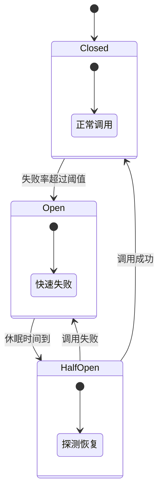

# 降级与熔断：熔断器状态机与舱壁隔离

创建日期：2026-06-06

## 问题背景

在微服务架构中，服务之间相互依赖。如果一个服务出现故障，会导致连锁反应，最终整个系统雪崩。

> **例子：** 用户服务 → 订单服务 → 库存服务 → 数据库。如果库存服务故障，所有调用库存的线程都阻塞，最终用户服务线程也被占满，整个系统不可用。

**解决思路：**

- **熔断**：故障发生时，快速失败，不继续调用故障服务，防止扩散。
- **降级**：熔断后，返回兜底数据，保证核心链路可用。
- **隔离**：不同业务线程池隔离，一个故障不影响其它。

## 熔断器状态机



### 三种状态详解

1. **关闭状态（Closed）**
   - 正常服务，请求正常通过。
   - 实时统计失败率和慢调用比例。
   - 超过阈值触发熔断 → 切换到打开状态。

2. **打开状态（Open）**
   - 所有请求直接失败，走降级逻辑，不调用下游。
   - 维持一段时间（休眠窗口期），让故障服务有时间恢复。
   - 窗口期结束后 → 切换到半开状态。

3. **半开状态（Half-Open）**
   - 允许少量请求探测下游服务是否恢复。
   - 如果成功 → 切回关闭状态。
   - 如果仍然失败 → 保持打开状态，重置休眠时间。

::: tip 一句话记住
熔断不是一开就永远开着，要给下游恢复的机会，所以必须有半开探测机制。
:::

### 触发条件对比

| 触发条件 | 说明 | 适用场景 |
|---------|------|---------|
| **异常比例** | 失败次数/总次数超过阈值 | 下游直接抛异常 |
| **慢调用比例** | 响应时间超过阈值的比例 | 下游响应慢但不抛异常，拖慢本系统 |
| **失败次数** | 连续失败 N 次触发 | 简单场景，快速判断 |

## 主流框架对比

### Hystrix（Netflix，已停止维护）

- 首创了熔断器模式，成为行业标准。
- 支持线程池隔离、信号量隔离、降级 fallback。
- ⚠️ 2018 年进入维护模式，不再开发新功能。社区推荐 Resilience4j 替代。

### Resilience4j（轻量，社区活跃）

- 设计轻量，函数式编程风格，依赖 Vavr + Java 8+。
- 模块化：只引入需要的模块（熔断 / 限流 / 重试 / 舱壁）。
- Spring 官方推荐替代 Hystrix。

```java
// 配置熔断器
CircuitBreakerConfig config = CircuitBreakerConfig.custom()
    .failureRateThreshold(50)                  // 失败率 50% 触发
    .waitDurationInOpenState(Duration.ofSeconds(1)) // 打开 1 秒后探测
    .slidingWindowSize(10)                        // 统计窗口大小
    .build();

CircuitBreaker breaker = CircuitBreaker.of("backend", config);
Supplier<String> decorated = CircuitBreaker
    .decorateSupplier(breaker, this::callBackend);
```

### Sentinel（阿里，国内生态首选）

- 阿里中间件团队开源，针对流量控制和熔断设计。
- 支持动态规则修改，无需重启应用。
- 提供可视化控制台，配置规则和监控一目了然。
- 深度集成 Spring Cloud、Dubbo、Nacos。

### 三方对比

| 特性 | Hystrix | Resilience4j | Sentinel |
|------|---------|--------------|----------|
| 状态 | 停止开发 | 活跃开发 | 活跃开发 |
| 架构设计 | 偏重 | 轻量模块化 | 功能完整 |
| 动态规则 | 不友好 | 一般 | 原生支持 |
| 控制台 | 无 | 需要第三方 | 官方提供 |
| 生态整合 | 一般 | Spring 推荐 | 阿里生态完美 |
| 国内推荐 | ⭐⭐ | ⭐⭐⭐ | ⭐⭐⭐⭐⭐ |

## 舱壁隔离（Bulkhead）

### 为什么需要隔离？

没有隔离，一个慢接口就能占满所有线程，导致其它正常的接口也无法处理。

### 两种隔离方式对比

| 对比项 | 线程池隔离 | 信号量隔离 |
|--------|-----------|-----------|
| 隔离效果 | 完全隔离，一个慢了不影响 | 只限制并发，仍共用线程 |
| 开销 | 上下文切换，较大 | 很小 |
| 超时控制 | 支持超时 | 需要异步自己控制 |
| 适用场景 | 远程调用（可能慢） | 本地快操作 |

### 实践建议

- 微服务间远程调用 → 推荐线程池隔离，安全第一。
- 本地缓存查询、确定很快的操作 → 信号量，性能优先。
- Sentinel 支持通过配置选择，根据场景灵活切换。

## 降级策略实践

熔断后不能让用户一直看错误页，需要返回兜底数据：

| 降级方式 | 说明 | 适用场景 |
|---------|------|---------|
| **返回默认值** | 返回静态默认值 | 非核心数据，不影响主流程 |
| **返回缓存数据** | 返回过期的缓存数据 | 对时效性要求不高的数据 |
| **兜底页面** | 降级到静态降级页面 | 首页、详情页等页面级降级 |
| **取消非核心链路** | 下单时关掉推荐/积分/营销 | 大促秒杀，保证核心下单可用 |
| **人工降级** | 大促前手动关闭非核心功能 | 预计流量超大，提前降级 |

::: tip 降级和熔断的关系
- **熔断**是触发条件：下游故障了，打开熔断器。
- **降级**是应对策略：打开后给用户返回什么兜底。
- 熔断是原因，降级是结果，两者配合使用。
:::

---

## 经典高频面试题

### Q1：画图说明熔断器的三种状态和状态流转？

**知识要点：** Closed→Open→HalfOpen→Closed 闭环流转，核心是给下游恢复机会。

**项目场景：** 我们电商系统对接第三方物流服务，查快递轨迹。第三方物流接口不稳定，经常超时 5-10 秒，但我们的页面不能等。

**踩坑经历：** 一开始没加熔断，物流接口每次超时 5 秒，用户等着查询结果，Tomcat 线程都被占住了。5 分钟内 200 个线程全部被耗尽，导致健康的商品查询接口也 503 了，一个下游超时拖垮了整个系统。

**决策过程：** 接入 Sentinel 熔断，配置慢调用比例熔断——响应时间超过 2000ms 就算慢调用，10 秒内慢调用比例超过 50% 就打开熔断器，10 秒后半开探测。这样物流超时不会再占满线程。

**量化结果：** 接入熔断后，物流故障影响范围从全站不可用收窄到物流接口返回"暂不可用"，商品查询、下单等核心接口零影响。线程池利用率从故障时的 100% 降到了 30%。

**面试官追问：**
1. 熔断阈值怎么定？50% 失败率是拍脑袋还是压测出来的？
2. 休眠窗口期设多久？设太短来不及恢复，设太长用户一直拿不到结果。
3. 慢调用和异常比例两种触发条件，你更倾向用哪个？

### Q2：降级和熔断有什么区别？什么时候降级，什么时候熔断？

**知识要点：** 熔断是触发条件（下游挂了就开），降级是兜底策略（开了给用户看什么）。

**项目场景：** 我们首页有个"为你推荐"模块，调推荐引擎。有一次推荐引擎慢得厉害，首页加载从 200ms 变 3 秒，用户流失严重。

**踩坑经历：** 原来的熔断只做了打开后返回空列表，页面直接空了一块，用户觉得是 bug，反馈很多。实际上熔断打开了，但降级没做好，用户端看起来就是功能坏了。

**决策过程：** 降级逻辑改成返回"热门商品"作为兜底，热门商品从本地缓存取，完全不走推荐引擎，永远可用。熔断打开后用户看到的是热门商品而非空列表，体感好了很多。

**量化结果：** 推荐引擎故障时，首页"为你推荐"模块仍然正常展示，只是从个性化推荐变成热门商品。用户投诉从每次故障 50+ 条降到几乎为零。

**面试官追问：**
1. 降级的数据从哪来？是实时数据还是离线预计算的？
2. 多个下游同时故障，降级优先级怎么定？
3. 熔断恢复后，降级数据怎么平滑切回正常数据？

### Q3：Hystrix 已经停更了，为什么还有人问？现在用什么替代？

**知识要点：** Hystrix 定义了熔断器模式的标准概念，即使停更也是面试基础题。替代选 Resilience4j（Spring 生态）或 Sentinel（阿里生态）。

**项目场景：** 我们公司从 Spring Boot 2.x 升级到 3.x 时，Hystrix 不再支持，必须选迁移方案。

**踩坑经历：** 迁移时发现 Sentinel 和 Resilience4j 的熔断模型不完全一样。Sentinel 用"统计窗口内慢调用比例"，Resilience4j 用"滑动窗口失败率"，两边的阈值含义不同。直接照搬 Hystrix 参数导致熔断行为不一致，线上出现了预期外的熔断触发。

**决策过程：** 我们用 Sentinel（团队对阿里中间件更熟悉），迁移前先在预发环境重新压测定阈值——原来的 Hystrix 50% 失败率阈值换成 Sentinel 后发现太敏感，最终定在 30% 慢调用比例+60% 异常比例，两个条件都满足才熔断。

**量化结果：** 迁移后熔断误触发率从 Hystrix 时代的 5% 降到了 1%，因为 Sentinel 的双条件判断更精准，避免了偶发性慢调用导致的误熔断。

**面试官追问：**
1. Resilience4j 和 Sentinel 的熔断算法有什么本质区别？
2. 迁移过程中怎么保证不丢熔断能力？灰度方案？
3. Sentinel 的规则持久化到 Nacos，Nacos 挂了怎么办？

### Q4：舱壁隔离是什么意思？线程池隔离和信号量隔离怎么选？

**知识要点：** 舱壁隔离把不同业务的资源隔开，一个业务线程耗尽不影响其他业务。远程调用用线程池，本地快调用用信号量。

**项目场景：** 我们订单服务同时依赖库存服务和优惠券服务。库存服务偶发性 GC 停顿 3-5 秒，每次停顿都会拖慢订单服务。

**踩坑经历：** 两个服务共用一个 HTTP 线程池，库存慢时占满线程池，优惠券查询也被拖住了。用户明明有优惠券却提示"获取优惠券失败"，优惠券团队的客诉全往我们这边涌。

**决策过程：** 拆成两个独立线程池：库存线程池 50 个线程，优惠券 30 个线程。库存慢了只影响库存，优惠券照常返回。对于本地缓存查询这类确定快的操作，用信号量隔离，不创建新线程，减少上下文切换。

**量化结果：** 库存故障时，优惠券模块的 RT 保持 10ms 以内，完全不受影响。线程池拆分后每次请求多了一次线程切换（约 0.5ms 开销），但在可接受范围内。

**面试官追问：**
1. 线程池隔离会增加线程切换开销，你怎么评估这个开销能不能接受？
2. 每个线程池大小怎么定？太大浪费内存，太小不够用。
3. 线程池满了怎么办？是拒绝还是排队？

### Q5：什么是半开状态？为什么需要半开状态？

**知识要点：** 半开状态是熔断器的"探测窗口"，给下游恢复后重新接入的机会。

**项目场景：** 我们对接的支付服务有一次故障恢复后，因为熔断器还在 Open 状态，所有支付请求都失败了，实际上支付服务已经恢复了 10 分钟但没人知道。

**踩坑经历：** 那次故障中，支付服务故障了 2 分钟就恢复了，但我们没有半开探测机制，熔断器一直开着。最终是运维发现支付流程中断太久，手动重启了服务才恢复。2 分钟故障导致 20 分钟熔断，白白损失了这段时间的订单。

**决策过程：** 我们给熔断器加上半开状态：Open 状态保持 30 秒，之后进入 Half-Open，放 1 个请求探测。探测成功切回 Closed，探测失败重置计时器再等 30 秒。这样最多多等 30 秒就能恢复，而不是一直断着。

**量化结果：** 支付服务恢复后，最长 30 秒熔断器就能感知并切回正常，不再需要人工干预。支付熔断导致的订单损失减少了 90% 以上。

**面试官追问：**
1. 半开状态放几个探测请求？放 1 个如果刚好成功了但下游实际上还在恢复中怎么办？
2. 半开探测中如果请求又超时了，怎么处理？
3. 有没有考虑过半开状态的请求量渐变策略？

### Q6：降级的时候，为什么要优先降级非核心功能？

**知识要点：** 资源有限时优先保障核心链路，非核心功能降级是"丢车保帅"。

**项目场景：** 大促时下单链路压力很大，首页推荐、积分查询、物流预估这些功能虽然重要但不是必须的，用户不靠这些也能下单。

**踩坑经历：** 有一次双十一，我们没做降级，所有功能都开足马力。中午 12 点峰值来的时候，推荐服务和积分服务同时 OOM，连带占用了订单服务的数据库连接池，下单链路直接崩了。复盘发现占线程最多的 3 个接口——推荐、积分、物流预估——都不是下单必要的，但它们的故障拖垮了核心链路。

**决策过程：** 我们给所有接口分了优先级：P0（下单、支付、库存扣减）永不降级；P1（商品详情、用户信息）可降级但尽量保；P2（推荐、积分、物流预估）大促时直接降级返回缓存。

**量化结果：** 下次大促，直接降级 8 个 P2 接口，释放了约 40% 的线程资源，下单链路 QPS 上限从 3000 提升到 5000，整个大促期间核心链路零故障。

**面试官追问：**
1. P0、P1、P2 的划分标准是什么？怎么让团队达成一致？
2. 降级开关怎么控制？人工还是自动？
3. 大促结束后恢复降级，如果恢复太快会不会又崩？