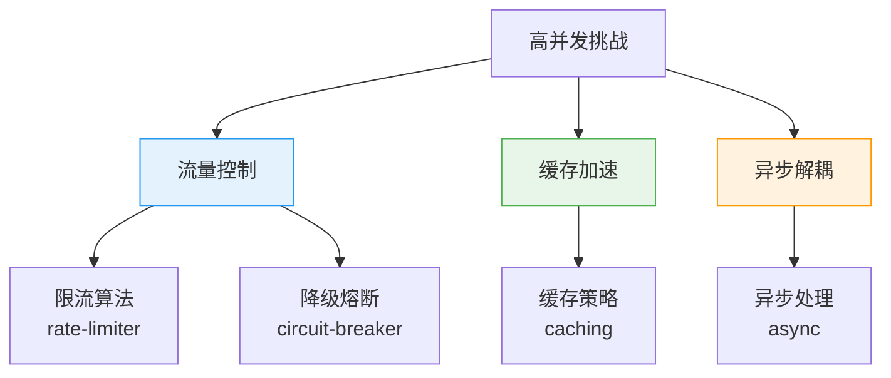
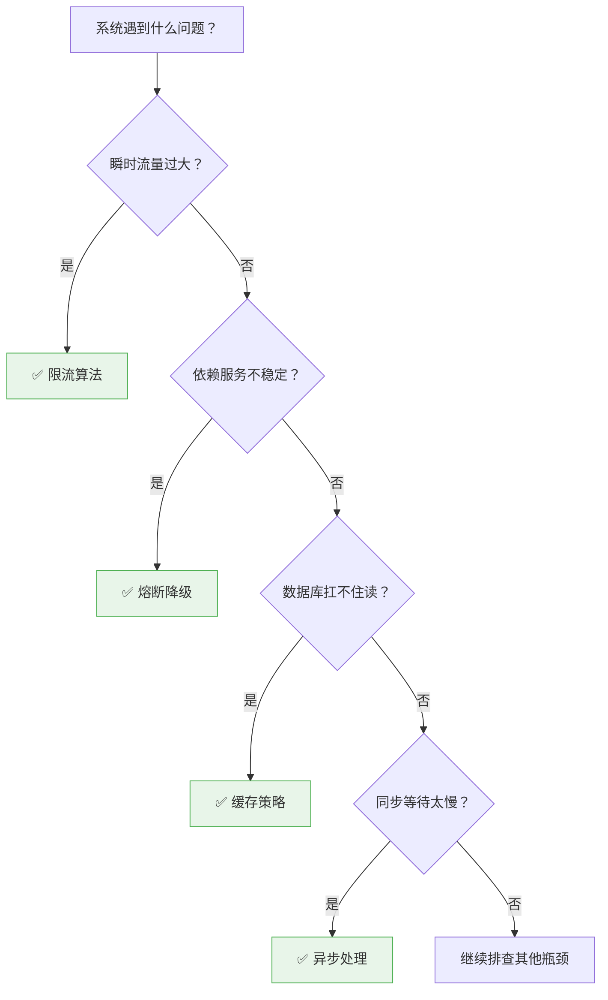

# 高并发设计模式总览

创建日期：2026-06-06

## 模块概述

高并发设计模式是解决系统在高流量场景下保持可用性、稳定性和性能的"兵器库"。本模块从**流量控制**、**缓存加速**、**异步解耦**三个维度，系统讲解 4 种最核心的高并发设计模式，帮助你在面试中能够清晰阐述每种模式的适用场景、实现原理和选型对比。

::: tip 核心思想
高并发设计的本质不是消除并发，而是**将并发控制在系统可承受范围内**，同时通过空间换时间、异步换吞吐等手段，提升系统整体处理能力。
:::

## 设计模式全景图

## 各模式核心问题

| 模式 | 解决什么问题 | 核心思想 | 典型场景 |
|------|-------------|---------|---------|
| **限流** | 请求突刺冲垮系统 | 控制单位时间请求量，超过阈值直接拒绝 | API 网关、开放平台、秒杀入口 |
| **熔断降级** | 依赖服务故障扩散 | 快速失败 + 降级兜底，防止故障扩散 | 微服务调用链、第三方依赖 |
| **缓存策略** | 读请求打垮数据库 | 空间换时间，热点数据加速，减少 DB 压力 | 商品详情、首页推荐、配置数据 |
| **异步处理** | 同步等待浪费资源 | 削峰填谷，解耦非关键链路，提升吞吐 | 下单、通知、日志、统计 |

## 设计模式选型决策树

## 面试考察重点

::: warning 高频考点
1. **限流算法对比**：计数器、滑动窗口、漏桶、令牌桶各自优缺点是什么？什么场景选什么？
2. **熔断器三态**：Closed → Open → Half-Open 状态流转是什么？慢调用和异常比例哪个更准确？
3. **缓存更新**：Cache Aside vs Write Behind vs Write Through，画图说明读写流程
4. **缓存一致性**：先删缓存还是先更新数据库？延迟双删原理是什么？
5. **CompletableFuture**：如何用它编排多个异步任务？allOf vs anyOf 区别？
6. **舱壁隔离**：线程池隔离和信号量隔离有什么区别？什么时候用什么？
:::

::: danger 容易翻车的点
- 把单机方案直接用到分布式场景，漏掉分布式环境需要考虑的问题
- 只说概念不说具体实现，不能说出框架（Guava/Sentinel/Resilience4j）的具体用法
- 忽略异常处理和降级兜底，设计出来的系统不可用
- 选型不看场景，盲目追新技术
- 混淆限流、降级、熔断三个概念，答非所问
:::

## 学习路径建议

1. **先理解问题**：每种模式解决的痛点是什么？不这么做会有什么后果？
2. **对比算法**：不同算法实现思路有什么差异？时间空间复杂度如何？
3. **落地实现**：了解主流框架的实现，能说出核心配置和坑点
4. **画图总结**：把每种模式的流程图画出来，形成肌肉记忆
5. **模拟面试**：用自己的话把每种模式讲清楚，不要背概念

## 参考资料

- 《大型网站技术架构：核心原理与案例分析》—— 李智慧
- 《亿级流量网站架构核心技术》—— 张开涛
- [Sentinel 官方文档](https://sentinelguard.io/)
- [Resilience4j 官方文档](https://resilience4j.readme.io/)
- [Guava RateLimiter 文档](https://github.com/google/guava/wiki)

---

## 经典高频面试题

### Q1：高并发系统设计中，限流、降级、熔断三个概念有什么区别？

**知识要点：** 限流控制入口流量，降级保证核心可用，熔断防止故障扩散。三个概念经常配合使用。

| 概念 | 作用时机 | 解决问题 | 目标 |
|------|---------|---------|------|
| **限流** | 入口处 | 防止总流量超过系统承载能力 | 保护整个系统，拒绝超限请求 |
| **降级** | 业务执行时 | 非核心链路出问题时保证核心可用 | 牺牲非核心功能，保障核心链路 |
| **熔断** | 依赖调用时 | 防止下游故障导致本系统资源耗尽 | 快速失败，防止故障扩散 |

**项目场景：** 我们双十一大促系统，这三样东西全用上了，少了哪个都会出问题。

**踩坑经历：** 限流把流量挡在门外没问题，但有一次限流阈值设太保守（5000 QPS），实际系统能扛 8000 QPS。多余的 3000 个用户全部看到"系统繁忙"，但其实系统很空闲。降级也有坑——有一次把"优惠券查询"降级了，结果用户下单时优惠券没生效，后续客诉处理花了 2 个客服一整天。熔断最坑的一次是熔断恢复太慢，支付服务恢复了 10 分钟熔断器还没打开，白白丢了订单。

**决策过程：** 限流阈值用压测确定（压测极限 × 0.7），上线后监控一周再微调。降级要精确到功能粒度而非服务粒度——优惠券服务可以不调优惠列表，但下单时的优惠券校验不能降。熔断要配半开探测，恢复后 30 秒内自动切回。

**量化结果：** 三件套配齐后，双十一大促核心链路零故障，99.99% 的可用性。即使有 2 个下游服务同时故障，用户依然能完成下单支付。

**面试官追问：**
1. 限流、降级、熔断三者在请求链路上的执行顺序是什么？
2. 如果都要做，哪个先做哪个后做？有没有推荐的优先级？
3. 这三个概念在实际代码里怎么体现？能画个简化的流程图吗？

### Q2：为什么高并发系统需要设计模式？直接堆机器不行吗？

**知识要点：** 设计模式是从架构层面解决根本性问题，堆机器解决不了热点集中、数据一致性、资源竞争等问题。

**项目场景：** 我们公司最初创业时，日活 10 万，一台 4C8G 服务器搞定。后来日活涨到 500 万，CTO 说"加机器"，从 1 台加到 20 台，结果还是扛不住。

**踩坑经历：** 加机器没有解决任何实质问题。库存超卖还是超卖（因为单机 Redis 变多机 Redis，分布式锁没跟上）；热点商品还是打爆了 MySQL（因为缓存没做本地缓存，所有机器都穿透到同一台 MySQL）；限流还是不行（因为每台机器自己限 500 QPS，20 台 = 10000 QPS，下游早被打穿了）。

**决策过程：** 不是不加机器，而是先搞清问题本质。超卖→分布式锁+Redis 原子操作；热点→本地缓存+多级缓存；限流失效→分布式限流 Sentinel。架构问题用设计模式解决，容量问题用机器解决。

**量化结果：** 架构改造后，同样 20 台机器，支撑的用户量从 500 万涨到 2000 万。扩容成本从之前"每加 100 万用户加 5 台机器"变成"每加 500 万用户加 5 台机器"。架构优化带来的成本节省每年约 50 万服务器费用。

**面试官追问：**
1. 怎么判断一个性能问题是架构问题还是单纯的容量不足？
2. 创业早期，资源有限，你会优先投入哪个高并发设计模式？
3. 水平扩容有上限吗？什么情况下再加机器也没用了？

### Q3：高并发设计中，"空间换时间"和"时间换空间"各自什么时候用？

**知识要点：** 高并发读多用空间换时间（缓存、预计算），存储容量敏感多用时间换空间（压缩、按需计算）。

**项目场景：** 我们商品详情页，每天 2 亿次访问，QPS 峰值 8000。商品数据存在 MySQL，每次查 RT 200ms，根本扛不住。

**踩坑经历：** 没做缓存的时候（纯空间换时间），MySQL 只存 50 万商品，磁盘使用 20GB，但 QPS 只能到 500。后来全量缓存到 Redis（空间换时间），50 万商品在 Redis 占约 8GB 内存，QPS 提到 8000，RT 降到 5ms。但随之而来的是 Redis 成本——8GB × 主从 × 集群 ≈ 每月 3000 元。

**决策过程：** 我们对商品做了冷热分离。核心 5 万热商品全量缓存 Redis（约 800MB），剩余 45 万冷商品用"按需加载+LRU 淘汰+较短过期"，平均在 Redis 只占 2GB。这样空间换时间用在了刀刃上（热点），冷门商品用时间换空间（按需查 DB，多等一会儿）。

**量化结果：** Redis 内存需求从 8GB 降到 3GB，成本降低 60%，缓存命中率从 99.2% 降到 97.5%（冷商品不常缓存），整体 RT 从 5ms 变 8ms，仍然远低于 50ms 的 SLA 目标。

**面试官追问：**
1. 冷热分离的冷热标准是什么？怎么动态调整？
2. 时间换空间的极致就是不做缓存每次都查 DB，你怎么找到缓存比例的最佳平衡点？
3. 除了缓存，还有哪些空间换时间/时间换空间的典型例子？

### Q4：舱壁隔离（Bulkhead）模式是什么？解决什么问题？

**知识要点：** 把不同业务的资源（线程池/连接池）物理隔离，一个业务的故障不拖垮其他业务。

**项目场景：** 我们的订单服务同时提供"创建订单"和"查询订单"两个接口。创建订单慢（需要调多个下游），查询订单快（只读缓存）。

**踩坑经历：** 大促时大量创建订单请求占满了 Tomcat 200 个线程，用户想点"我的订单"查看结果，发现页面打不开——因为查询订单的请求也被阻塞了，线程池全被创建订单占着。用户以为订单丢了，重复下单，又加重了创建订单的压力。

**决策过程：** 拆成两个独立的业务线程池：创建订单 80 个线程，查询订单 120 个线程。创建订单满了只影响创建，用户还是能查询自己的订单。对于本地缓存查询这种 1ms 就返回的操作，用信号量隔离（限并发数），不额外创建线程。

**量化结果：** 线程池拆分后，即使创建订单超时率 30%，查询订单接口的 RT 仍保持 10ms 以内，零超时。用户投诉"查不到订单"从每天 100+ 降到 2 起以内。

**面试官追问：**
1. 舱壁隔离和熔断有什么区别？能用舱壁代替熔断吗？
2. 线程池隔离后，怎么监控每个线程池的健康状态？线程池满了怎么告警？
3. 如果把舱壁隔离做到极致（每个接口一个线程池），会有什么问题？

### Q5：高并发设计中，"Fail-Fast"和"Fail-Safe"有什么区别？

**知识要点：** Fail-Fast 是快速失败不消耗资源，Fail-Safe 是故障后仍安全返回兜底。前者用于保护系统，后者用于保证体验。

**项目场景：** 我们的物流查询，调第三方物流接口。第三方接口偶发性超时 5-10 秒，不能让用户等。

**踩坑经历：** 第一次设计时既没有 Fail-Fast 也没有 Fail-Safe。物流超时 10 秒，用户等了 10 秒看到空白页。看了日志才发现是物流接口超时，返回了 500。

**决策过程：** 加了两层。Fail-Fast：熔断器，物流接口连续失败 5 次直接打开熔断，后续请求直接失败不走物流接口，不浪费线程。Fail-Safe：降级兜底，熔断打开后返回"物流信息暂不可用，请稍后查看"，并展示上次查询到的缓存数据（哪怕是 1 小时前的）。

**量化结果：** 熔断器让物流故障的影响从"每个请求等 10 秒"变成"直接 1ms 返回降级数据"，线程没有被占着等超时，其他模块完全不受影响。用户看到的是"有数据但可能延迟"而不是"什么都没有"，投诉少了很多。

**面试官追问：**
1. Fail-Fast 和 Fail-Safe 冲突吗？能不能同时用？
2. 如果物流接口只是变慢（5 秒），没有直接失败，你的 Fail-Fast 策略怎么处理？
3. 有第三种策略叫"Fail-Over"，和这两者有什么区别？