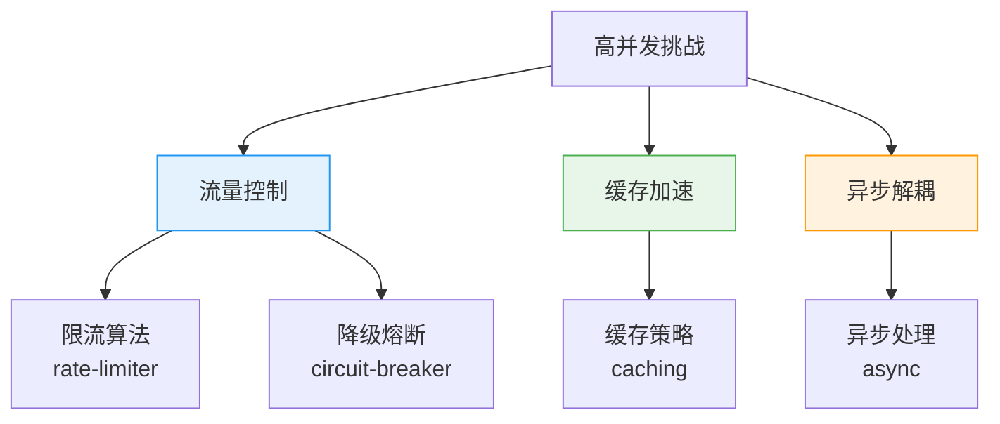
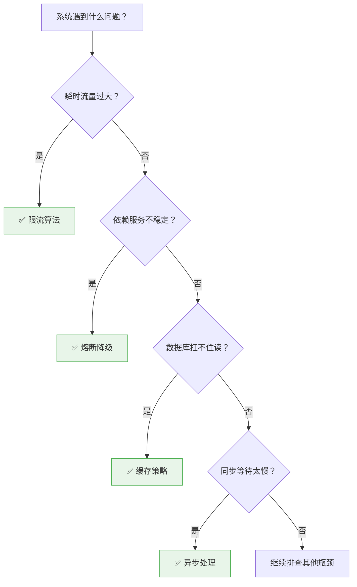

# 高并发设计模式总览

创建日期：2026-06-06

## 模块概述

高并发设计模式是解决系统在高流量场景下保持可用性、稳定性和性能的"兵器库"。本模块从**流量控制**、**缓存加速**、**异步解耦**三个维度，系统讲解 4 种最核心的高并发设计模式，帮助你在面试中能够清晰阐述每种模式的适用场景、实现原理和选型对比。

::: tip 核心思想
高并发设计的本质不是消除并发，而是**将并发控制在系统可承受范围内**，同时通过空间换时间、异步换吞吐等手段，提升系统整体处理能力。
:::

## 设计模式全景图

## 各模式核心问题

| 模式 | 解决什么问题 | 核心思想 | 典型场景 |
|------|-------------|---------|---------|
| **限流** | 请求突刺冲垮系统 | 控制单位时间请求量，超过阈值直接拒绝 | API 网关、开放平台、秒杀入口 |
| **熔断降级** | 依赖服务故障扩散 | 快速失败 + 降级兜底，防止故障扩散 | 微服务调用链、第三方依赖 |
| **缓存策略** | 读请求打垮数据库 | 空间换时间，热点数据加速，减少 DB 压力 | 商品详情、首页推荐、配置数据 |
| **异步处理** | 同步等待浪费资源 | 削峰填谷，解耦非关键链路，提升吞吐 | 下单、通知、日志、统计 |

## 设计模式选型决策树

## 面试考察重点

::: warning 高频考点
1. **限流算法对比**：计数器、滑动窗口、漏桶、令牌桶各自优缺点是什么？什么场景选什么？
2. **熔断器三态**：Closed → Open → Half-Open 状态流转是什么？慢调用和异常比例哪个更准确？
3. **缓存更新**：Cache Aside vs Write Behind vs Write Through，画图说明读写流程
4. **缓存一致性**：先删缓存还是先更新数据库？延迟双删原理是什么？
5. **CompletableFuture**：如何用它编排多个异步任务？allOf vs anyOf 区别？
6. **舱壁隔离**：线程池隔离和信号量隔离有什么区别？什么时候用什么？
:::

::: danger 容易翻车的点
- 把单机方案直接用到分布式场景，漏掉分布式环境需要考虑的问题
- 只说概念不说具体实现，不能说出框架（Guava/Sentinel/Resilience4j）的具体用法
- 忽略异常处理和降级兜底，设计出来的系统不可用
- 选型不看场景，盲目追新技术
- 混淆限流、降级、熔断三个概念，答非所问
:::

## 学习路径建议

1. **先理解问题**：每种模式解决的痛点是什么？不这么做会有什么后果？
2. **对比算法**：不同算法实现思路有什么差异？时间空间复杂度如何？
3. **落地实现**：了解主流框架的实现，能说出核心配置和坑点
4. **画图总结**：把每种模式的流程图画出来，形成肌肉记忆
5. **模拟面试**：用自己的话把每种模式讲清楚，不要背概念

## 参考资料

- 《大型网站技术架构：核心原理与案例分析》—— 李智慧
- 《亿级流量网站架构核心技术》—— 张开涛
- [Sentinel 官方文档](https://sentinelguard.io/)
- [Resilience4j 官方文档](https://resilience4j.readme.io/)
- [Guava RateLimiter 文档](https://github.com/google/guava/wiki)

---

## 经典高频面试题

### Q1：高并发系统设计中，限流、降级、熔断三个概念有什么区别？

**参考答案：**

| 概念 | 作用时机 | 解决问题 | 目标 |
|------|---------|---------|------|
| **限流** | 入口处 | 防止总流量超过系统承载能力 | 保护整个系统，拒绝超限请求 |
| **降级** | 业务执行时 | 非核心链路出问题时保证核心可用 | 牺牲非核心功能，保障核心链路 |
| **熔断** | 依赖调用时 | 防止下游故障导致本系统资源耗尽 | 快速失败，防止故障扩散 |

一句话总结：**限流控制进入系统的总流量，降级保证核心功能可用，熔断防止故障扩散。**

### Q2：为什么高并发系统需要设计模式？直接堆机器不行吗？

**参考答案：**

- 堆机器成本高，资源浪费严重。设计模式通过架构优化提升吞吐，性价比更高。
- 单纯堆机器不能解决所有问题，比如热点 Key 还是会打垮缓存，超卖问题还是会发生。
- 高并发场景下，正确的设计模式能让系统在有限机器下支撑更大流量。
- 设计模式是工程经验的总结，避免重复踩坑。比如 Redis 缓存击穿，不提前设计好，上线后流量一来就崩。

### Q3：高并发设计中，"空间换时间"和"时间换空间"各自什么时候用？

**参考答案：**

- **空间换时间**：用更多内存/存储来减少计算/IO 时间。典型场景：缓存（Redis）、预计算、索引、数据冗余（反范式化）。以存储成本换取更低延迟。
- **时间换空间**：用更多计算来节省存储空间。典型场景：压缩编码、按需计算（懒加载）、请求合并（攒一批再处理）。以计算时间换取更少资源占用。
- 一般高并发读场景多用空间换时间（缓存），存储量大的场景多用时间换空间（压缩、按需计算）。

### Q4：舱壁隔离（Bulkhead）模式是什么？解决什么问题？

**参考答案：**

舱壁隔离来源于轮船设计，船舱被分隔成多个独立舱室，一个漏水不影响整体。在高并发中：

- 将不同业务的线程池隔离开，比如支付用自己的线程池，查询用自己的线程池。
- 一个业务被打满，不会耗尽所有线程导致其它业务也无法处理。
- Sentinel 和 Hystrix 都支持这种隔离方式。
- 分为**线程池隔离**和**信号量隔离**两种：
  - 线程池隔离：完全隔离，安全但上下文切换有开销，适合远程调用。
  - 信号量隔离：轻量，只限制并发数，不能隔离慢调用，适合本地快操作。

### Q5：高并发设计中，"Fail-Fast"和"Fail-Safe"有什么区别？

**参考答案：**

- **Fail-Fast（快速失败）**：一旦检测到故障就立刻失败，不继续执行。比如熔断器打开后直接返回失败，节省资源，不继续等待。
- **Fail-Safe（故障安全）**：即使出现故障也能继续安全执行，返回部分结果或默认值。比如降级兜底，返回缓存数据或默认值。
- 限流熔断一般采用 Fail-Fast（快速拒绝），然后通过降级实现 Fail-Safe（兜底返回），两者配合使用。
- 在系统设计中，应该优先保证 Fail-Safe：即使部分功能挂了，核心功能仍然可用。