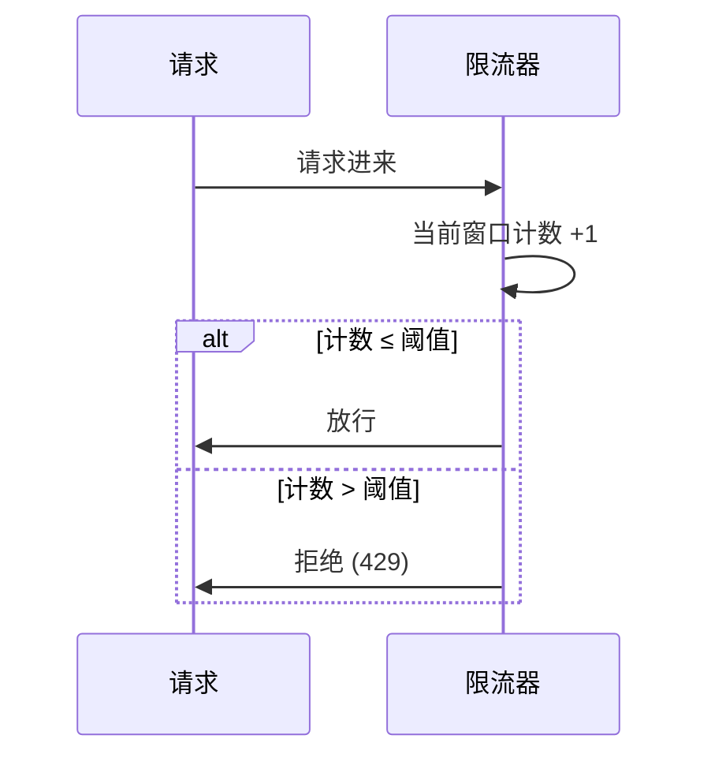
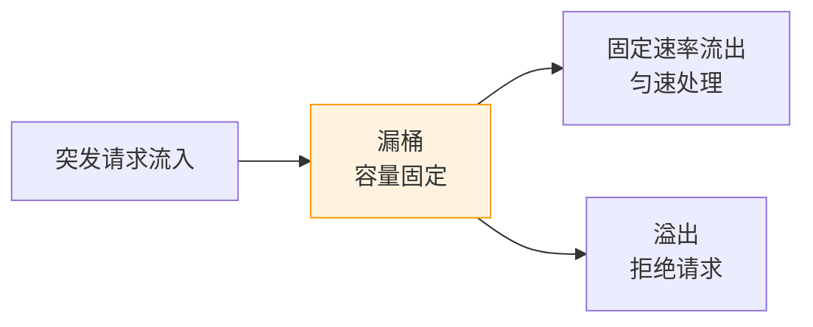
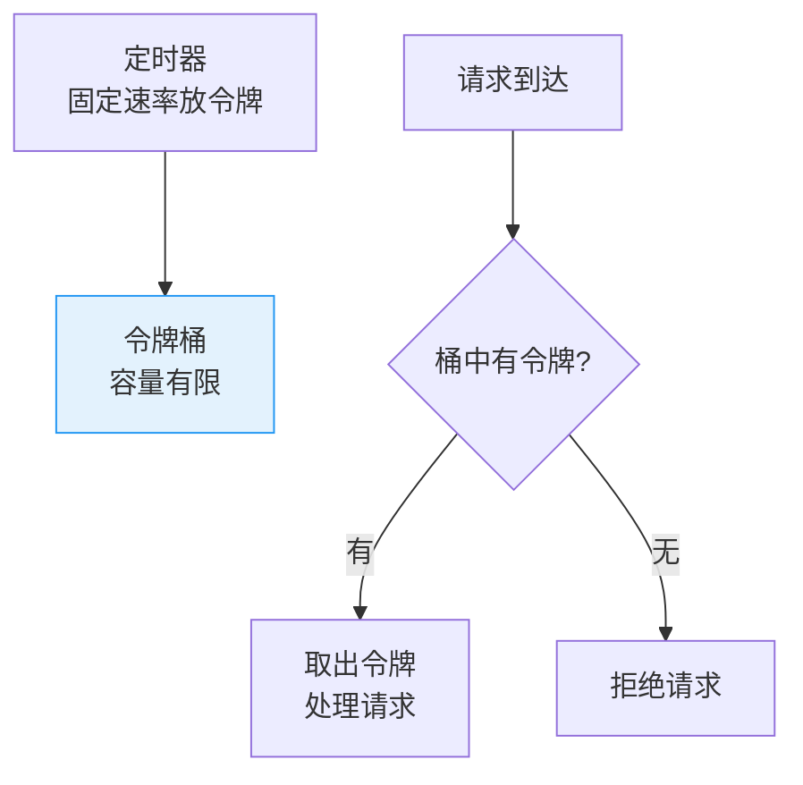

# 限流算法：计数器 / 滑动窗口 / 漏桶 / 令牌桶对比

创建日期：2026-06-06

## 问题背景

为什么需要限流？

- **防止恶意刷接口**：爬虫、脚本攻击、撞库，消耗系统资源。
- **防止突发流量冲垮系统**：秒杀、大促瞬间流量远超平时，系统扛不住。
- **保护下游依赖服务**：上游不受控，下游会被打垮，形成雪崩。
- **控制成本**：避免资源耗尽，按容量规划，超限拒绝，保护整个系统。

::: tip 一句话总结
限流不是让所有请求都能处理，而是**把请求量控制在系统能承受的范围内**，超出的直接拒绝。
:::

## 四种限流算法详解

### 1. 固定窗口计数器（Fixed Window Counter）

**原理：** 将时间划分为固定窗口（如 1 分钟），每个窗口内用一个计数器统计请求数，超过阈值则拒绝，窗口结束后计数器重置。



**关键代码思路：**

```java
public class FixedWindowLimiter {
    private final int limit;          // 窗口内最大请求数
    private final long windowMs;      // 窗口大小（毫秒）
    private AtomicInteger counter = new AtomicInteger(0);
    private volatile long windowStart = System.currentTimeMillis();

    public boolean tryAcquire() {
        long now = System.currentTimeMillis();
        // 进入新窗口，重置计数器
        if (now - windowStart > windowMs) {
            synchronized (this) {
                if (now - windowStart > windowMs) {
                    counter.set(0);
                    windowStart = now;
                }
            }
        }
        return counter.incrementAndGet() <= limit;
    }
}
```

**优缺点：**

- ✅ 优点：实现极其简单，内存占用极小。
- ❌ 缺点：**临界突变问题** —— 窗口边界处的两个时间窗口都可能放行，导致实际通过的流量是阈值的两倍。

> 例子：1 分钟限流 100 次。第 59 秒进来 100 个请求（窗口 1 放行），第 1 秒又进来 100 个请求（窗口 2 放行），两秒内实际放行了 200 个请求。

**适用场景：** 对精度要求不高的内部接口、简单的防爬虫场景。

---

### 2. 滑动窗口（Sliding Window Log）

**原理：** 记录每个请求的到达时间戳。新请求到达时，删除时间窗口之外的旧记录，统计当前窗口内的请求数，超过阈值则拒绝。

**Redis 实现（ZSet 方案）：**

- 使用 ZSet，member = 唯一请求 ID，score = 时间戳。
- 删除窗口外过期请求：`ZREMRANGEBYSCORE key -inf (currentTime - window)`
- 统计当前数量：`ZCARD key`
- 若数量 < 阈值，添加当前请求：`ZADD key currentTime requestId`
- 整个操作放在 Lua 脚本中原子执行。

**优化：滑动窗口分片（Sentinel 做法）**

将窗口再细分为多个小格子（如 1 秒一个格子），每个格子独立计数。滑动时整格移动，避免存储每个请求的时间戳，空间复杂度从 O(QPS) 降到 O(窗口大小/格子大小)。

**优缺点：**

- ✅ 优点：精确度高，解决了固定窗口的边界问题。
- ❌ 缺点：纯滑动窗口需要存储所有请求时间戳，内存占用大；Redis ZSet 方案每次都要网络 IO。

**适用场景：** API 网关精确限流、开放平台对第三方调用限制。

---

### 3. 漏桶算法（Leaky Bucket）

**原理：** 请求像水一样流入桶中，桶底以固定速率漏水（处理请求）。如果流入速度超过出水速度，水溢出（请求被拒绝）。



**优缺点：**

- ✅ 优点：强制平滑流量，把突发流量整形为平稳流量，对下游保护效果好。
- ❌ 缺点：即使系统空闲，也只能匀速处理，不能应对突发流量。不够灵活。

**适用场景：** 对下游保护需要强制匀速的场景、MQ 消费速率控制。

---

### 4. 令牌桶算法（Token Bucket）

**原理：** 以恒定速率向桶中放入令牌，桶满则丢弃新令牌。请求到达时，需要从桶中取出一个令牌才能被处理，桶空则拒绝。



**核心特点：**

- 允许一定程度的突发流量：只要桶里还有积攒的令牌，就能处理突发请求。
- 长期平均速率不超过限制，符合限速目标。
- Guava RateLimiter 就是令牌桶实现。

**优缺点：**

- ✅ 优点：允许突发流量，同时保证长期平均速率不超限，灵活。
- ❌ 缺点：实现相对复杂，需要定时器生成令牌。

**适用场景：** 绝大多数业务限流场景，尤其适合允许一定突发的场景。

---

### 四种算法对比总结

| 算法 | 实现复杂度 | 内存占用 | 精确度 | 允许突发 | 平滑流量 | 典型场景 |
|------|-----------|---------|--------|---------|---------|---------|
| **固定窗口** | 很低 | 极小 | 低（有边界问题） | 允许（边界处可能翻倍） | 不支持 | 内部简单防刷 |
| **滑动窗口** | 中等 | 中高 | 高 | 按规则允许 | 不支持 | API 网关精确限流 |
| **漏桶** | 中等 | 小 | 中 | 不允许 | 强支持 | 下游保护、MQ 消费 |
| **令牌桶** | 中等 | 小 | 中 | 允许 | 支持（可预热） | 一般业务限流（推荐） |

---

## 典型实现对比

### Guava RateLimiter（单机限流）

```java
// 创建每秒 10 个令牌的限流器
RateLimiter limiter = RateLimiter.create(10);

// 阻塞获取令牌
limiter.acquire();

// 非阻塞尝试获取
if (limiter.tryAcquire()) {
    // 处理请求
} else {
    // 限流，返回 429
}
```

**适用场景：** 单机全局限流、本地依赖保护。**局限性：** 只支持单机，分布式多实例不适用。

### Redis + Lua（分布式限流）

```lua
-- KEYS[1]: 限流 key
-- ARGV[1]: 窗口大小（毫秒）
-- ARGV[2]: 限流阈值
-- ARGV[3]: 当前时间戳
-- 返回值: 1=允许, 0=拒绝

local currentTime = tonumber(ARGV[3])
local window = tonumber(ARGV[1])
local limit = tonumber(ARGV[2])
local clearBefore = currentTime - window

redis.call('ZREMRANGEBYSCORE', KEYS[1], 0, clearBefore)
local count = redis.call('ZCARD', KEYS[1])

if count < limit then
    redis.call('ZADD', KEYS[1], currentTime, currentTime)
    redis.call('EXPIRE', KEYS[1], math.ceil(window / 1000) + 1)
    return 1
else
    return 0
end
```

**为什么必须用 Lua？** 判断+计数是两条 Redis 命令，并发下不是原子的，可能导致计数不准。Lua 脚本在 Redis 端单线程执行，整个过程是原子的。

### Sentinel 限流（阿里生态推荐）

支持多种限流效果：
- **直接拒绝**（默认）：超过阈值直接抛出 FlowException。
- **Warm Up（预热）**：冷启动时逐渐增加通过量，给系统预热时间。
- **匀速排队**：漏桶实现，让请求匀速通过，适合秒杀排队。

::: tip 选型建议
- 单机简单限流 → Guava RateLimiter，依赖少
- 分布式环境、微服务 → Sentinel，有控制台，动态规则
- 自定义分布式限流 → Redis + Lua，灵活可控
:::

## 限流层级设计

| 层级 | 位置 | 技术方案 | 目的 |
|------|------|---------|------|
| 第一层 | CDN / Nginx | Nginx `limit_req` | 拦截恶意流量，减少回源 |
| 第二层 | API 网关 | Gateway + Redis 限流 | 全局限流 |
| 第三层 | 应用层 | Guava / Sentinel | 单实例保护 |
| 第四层 | 业务层 | 代码层面控制 | 业务定制化限流 |

多层限流提高可靠性，避免单点故障导致限流失效。

---

## 经典高频面试题

### Q1：四种限流算法对比？漏桶和令牌桶的核心区别是什么？

**知识要点：** 四种算法精度、内存、适用场景不同，大多数业务场景推荐令牌桶，需要强制匀速选漏桶。

**项目场景：** 我们当时做电商开放平台，要对第三方商家调用做接口限流，阈值是 1000 QPS。一开始选型纠结用固定窗口还是滑动窗口。

**踩坑经历：** 一开始图简单用了固定窗口，上线后发现整点秒杀时，刚好在分钟边界处，前后两个窗口各通过 1000，实际瞬间打过来 2000 QPS，下游服务的 RT 直接从 50ms 涨到 500ms，触发告警。

**决策过程：** 分析后发现固定窗口边界问题确实无法接受，但纯滑动窗口用 ZSet 存储每个请求时间戳，内存占用太高，1000 QPS 每秒就要存 1000 个 key，长期运行吃不消。最后采用分片滑动窗口，分成 10 个 1 秒小格子，空间复杂度从 O(QPS) 降到 O(窗口数/格子数)，精度也够。

**量化结果：** 改造后边界问题解决，峰值误差控制在 10% 以内，内存占用降低了 80%，线上运行 2 年没再出现过限流不准导致的雪崩。

**面试官追问：**
1. 如果让你实现分片滑动窗口，具体怎么分片怎么计数？
2. 开放平台对不同商家不同限流，怎么存储这些限流数据？
3. 你刚才说令牌桶适合大多数场景，那什么场景必须用漏桶？

### Q2：分布式限流为什么用 Redis + Lua？不用 Lua 会有什么问题？

**知识要点：** 判断+修改必须原子执行，Lua 在 Redis 单线程执行保证原子性，不用 Lua 并发下计数不准。

**项目场景：** 我们做秒杀活动，全局限流要求总共只能有 10000 QPS 进入下单接口，用 Redis 做分布式限流，一开始没写 Lua 脚本。

**踩坑经历：** 压测的时候发现，并发 1000 QPS 下，实际限流失效，有时候能放出去超过阈值 20% 的流量。追踪下来是因为分了三次网络请求：GET 计数 → 判断 → SET 计数，并发下多个请求同时 GET 都读到没超限，都放行，相当于计数失效了。

**决策过程：** 把整个逻辑整合成一个 Lua 脚本，让 Redis 原子执行，避免多次网络往返，也保证了原子性。

**量化结果：** 压测 10000 并发下，限流误差控制在 1% 以内，没有再出现超限情况，网络请求次数从 3 次减到 1 次，RT 降低了 40%。

**面试官追问：**
1. 如果 Redis 宕机了，分布式限流怎么办？有什么兜底方案？
2. Lua 脚本执行时间太长会有什么问题？Redis 对 Lua 有什么限制？
3. 除了 Redis + Lua，还有什么分布式限流方案？各有什么优缺点？

### Q3：滑动窗口和固定窗口的区别？边界问题怎么解决？

**知识要点：** 固定窗口有临界突变问题，滑动窗口通过时间滑动精确统计解决边界问题。

**项目场景：** 还是刚才那个开放平台的例子，就是因为固定窗口边界问题吃了亏。当时我们设置 1 分钟 1000 次调用，结果在第 59 秒和第 0 秒，两分钟窗口重叠处，两秒内进来了 2000 请求。

**踩坑经历：** 那次第三方商家做活动推广，刚好在整点启动，流量在边界处叠加，下游订单服务直接被打夯，RT 飙升到 2 秒，超时率 15%，持续了大概 1 分钟才恢复。那一次故障影响了大概 3000 多笔订单。

**决策过程：** 换成分片滑动窗口，把 1 分钟分成 60 个 1 秒的小格子，每个格子独立计数，滑动的时候把过期格子整个丢掉。这样既不用存每个请求的时间戳，又能精确控制流量。

**量化结果：** 改造后，边界处最大误差从 100% 降到不到 2%，那次之后再也没出现过类似故障，内存占用只增加了 60 个计数器，可以忽略。

**面试官追问：**
1. 分片滑动窗口的精度和什么有关？格子分越细精度越高吗？代价是什么？
2. Redis 滑动窗口用 ZSet 实现，删除过期数据用 ZREMRANGEBYSCORE，这个操作时间复杂度是多少？
3. 如果你要自己写一个滑动窗口，数据结构怎么设计？

### Q4：Sentinel 的限流和 Guava RateLimiter 有什么区别？怎么选型？

**知识要点：** Guava 是单机限流，Sentinel 支持分布式，功能更全，有动态规则。

**项目场景：** 我们从单体应用拆成微服务后，原来单体用 Guava 单机限流，现在需要全局限流。

**踩坑经历：** 一开始不懂分布式和单机区别，直接每个实例用 Guava 限流 100 QPS，集群 10 台机器实际放行 1000 QPS，超出了下游预期，下游还是被冲垮了。原来 Guava 是单机的，每个实例自己限自己的，不知道全局总量。

**决策过程：** 调研后换成 Sentinel，集成 Nacos 配置中心，统一管理限流规则，控制台可以动态修改，不用重启应用。核心接口用 Sentinel 分布式限流，非核心内部接口还保留 Guava 单机限流，双层限流更安全。

**量化结果：** 接入 Sentinel 后，全局流量控制精准，误差在 5% 以内，运维同学可以在控制台随时调整阈值，不用发版，效率提升很多。

**面试官追问：**
1. Sentinel 分布式限流是基于什么实现的？是基于 Redis 还是本地内存？
2. 如果我既要分布式限流又不想依赖 Redis，有什么方案？
3. Sentinel 的热点参数限流是什么？解决什么问题？

### Q5：什么是令牌桶预热（WarmUp）？解决什么问题？

**知识要点：** 冷启动时令牌生成速率逐渐提升，给系统缓存预热时间，避免冷启动雪崩。

**项目场景：** 我们做商品搜索服务，重启后本地缓存（Caffeine）是空的，所有请求都要回源查数据库。如果一启动就放 500 QPS 进来，MySQL 直接扛不住。

**踩坑经历：** 有一次上线发布重启，没有预热，刚启动流量全打过来，数据库连接池直接被打满，所有请求超时，服务启动 5 分钟都不能正常对外服务，最后只能切流量到备用集群才恢复。

**决策过程：** 开启 Guava RateLimiter 的 WarmUp 模式，设置预热周期 5 分钟，从 100 QPS 逐渐升到 500 QPS，给缓存足够时间加载热点数据。同时配合定时任务提前把热点商品加载到本地缓存。

**量化结果：** 重启后 MySQL QPS 峰值从 500 降到 120，RT 稳定在 50ms 以内，没有再出现过冷启动雪崩问题，服务启动后 1 分钟就能正常对外服务。

**面试官追问：**
1. WarmUp 的预热周期一般设置多少？根据什么来定？
2. 如果不用 RateLimiter，你自己怎么实现预热？
3. 除了限流预热，还有哪些冷启动优化手段？

### Q6：限流被拒绝了，业务上怎么处理？

**知识要点：** 根据业务场景选择不同降级策略，核心是保证核心链路可用，提升用户体验。

**项目场景：** 我们做秒杀活动，限流后用户请求被拒绝，不能直接抛 500 错误，得友好处理。

**踩坑经历：** 第一次做秒杀，限流直接返回 500，用户不知道怎么回事，疯狂刷新，越刷新请求越多，反而加重了系统压力，本来能扛住的也扛不住了。

**决策过程：** 我们改了几个处理：1) 返回 429 状态码，前端按钮置灰 60 秒，禁止重复点击；2) 弹出明确提示"当前人数过多，请稍后再试"；3) 对部分非核心请求返回静态缓存兜底；4) 支持排队，用户可以排队等，有位置了再通知。

**量化结果：** 改造后，重复请求减少了 70%，用户投诉从每天 20 多起降到 2 起以内，用户体验好很多，系统也稳了。

**面试官追问：**
1. 如果业务要求必须处理，不能拒绝，有什么方案？
2. 限流后用户重试，你怎么控制重试频率？
3. 不同用户等级限流阈值不同，比如VIP更大额度，怎么实现？