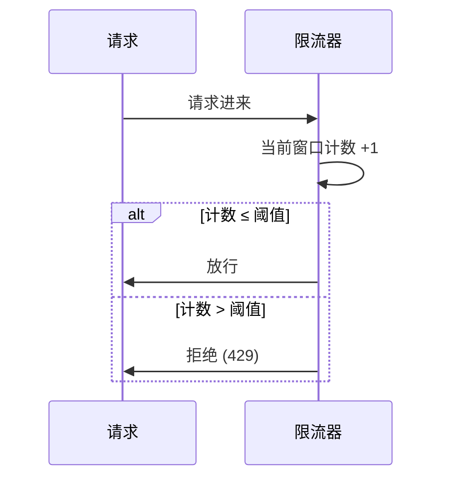
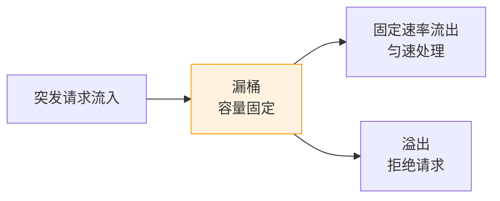
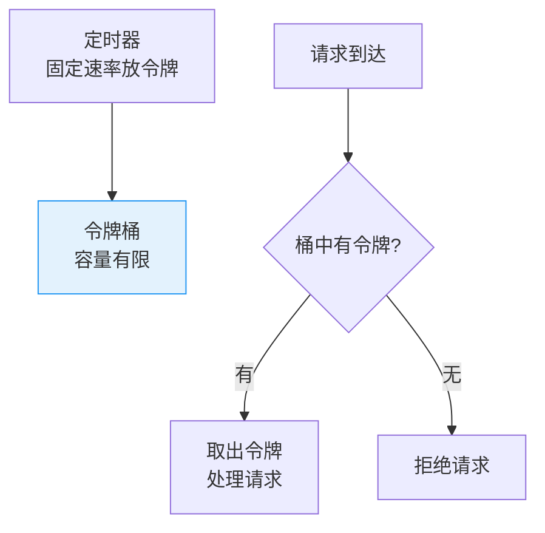

# 限流算法：计数器 / 滑动窗口 / 漏桶 / 令牌桶对比

创建日期：2026-06-06

## 问题背景

为什么需要限流？

- **防止恶意刷接口**：爬虫、脚本攻击、撞库，消耗系统资源。
- **防止突发流量冲垮系统**：秒杀、大促瞬间流量远超平时，系统扛不住。
- **保护下游依赖服务**：上游不受控，下游会被打垮，形成雪崩。
- **控制成本**：避免资源耗尽，按容量规划，超限拒绝，保护整个系统。

::: tip 一句话总结
限流不是让所有请求都能处理，而是**把请求量控制在系统能承受的范围内**，超出的直接拒绝。
:::

## 四种限流算法详解

### 1. 固定窗口计数器（Fixed Window Counter）

**原理：** 将时间划分为固定窗口（如 1 分钟），每个窗口内用一个计数器统计请求数，超过阈值则拒绝，窗口结束后计数器重置。



**关键代码思路：**

```java
public class FixedWindowLimiter {
    private final int limit;          // 窗口内最大请求数
    private final long windowMs;      // 窗口大小（毫秒）
    private AtomicInteger counter = new AtomicInteger(0);
    private volatile long windowStart = System.currentTimeMillis();

    public boolean tryAcquire() {
        long now = System.currentTimeMillis();
        // 进入新窗口，重置计数器
        if (now - windowStart > windowMs) {
            synchronized (this) {
                if (now - windowStart > windowMs) {
                    counter.set(0);
                    windowStart = now;
                }
            }
        }
        return counter.incrementAndGet() <= limit;
    }
}
```

**优缺点：**

- ✅ 优点：实现极其简单，内存占用极小。
- ❌ 缺点：**临界突变问题** —— 窗口边界处的两个时间窗口都可能放行，导致实际通过的流量是阈值的两倍。

> 例子：1 分钟限流 100 次。第 59 秒进来 100 个请求（窗口 1 放行），第 1 秒又进来 100 个请求（窗口 2 放行），两秒内实际放行了 200 个请求。

**适用场景：** 对精度要求不高的内部接口、简单的防爬虫场景。

---

### 2. 滑动窗口（Sliding Window Log）

**原理：** 记录每个请求的到达时间戳。新请求到达时，删除时间窗口之外的旧记录，统计当前窗口内的请求数，超过阈值则拒绝。

**Redis 实现（ZSet 方案）：**

- 使用 ZSet，member = 唯一请求 ID，score = 时间戳。
- 删除窗口外过期请求：`ZREMRANGEBYSCORE key -inf (currentTime - window)`
- 统计当前数量：`ZCARD key`
- 若数量 < 阈值，添加当前请求：`ZADD key currentTime requestId`
- 整个操作放在 Lua 脚本中原子执行。

**优化：滑动窗口分片（Sentinel 做法）**

将窗口再细分为多个小格子（如 1 秒一个格子），每个格子独立计数。滑动时整格移动，避免存储每个请求的时间戳，空间复杂度从 O(QPS) 降到 O(窗口大小/格子大小)。

**优缺点：**

- ✅ 优点：精确度高，解决了固定窗口的边界问题。
- ❌ 缺点：纯滑动窗口需要存储所有请求时间戳，内存占用大；Redis ZSet 方案每次都要网络 IO。

**适用场景：** API 网关精确限流、开放平台对第三方调用限制。

---

### 3. 漏桶算法（Leaky Bucket）

**原理：** 请求像水一样流入桶中，桶底以固定速率漏水（处理请求）。如果流入速度超过出水速度，水溢出（请求被拒绝）。



**优缺点：**

- ✅ 优点：强制平滑流量，把突发流量整形为平稳流量，对下游保护效果好。
- ❌ 缺点：即使系统空闲，也只能匀速处理，不能应对突发流量。不够灵活。

**适用场景：** 对下游保护需要强制匀速的场景、MQ 消费速率控制。

---

### 4. 令牌桶算法（Token Bucket）

**原理：** 以恒定速率向桶中放入令牌，桶满则丢弃新令牌。请求到达时，需要从桶中取出一个令牌才能被处理，桶空则拒绝。



**核心特点：**

- 允许一定程度的突发流量：只要桶里还有积攒的令牌，就能处理突发请求。
- 长期平均速率不超过限制，符合限速目标。
- Guava RateLimiter 就是令牌桶实现。

**优缺点：**

- ✅ 优点：允许突发流量，同时保证长期平均速率不超限，灵活。
- ❌ 缺点：实现相对复杂，需要定时器生成令牌。

**适用场景：** 绝大多数业务限流场景，尤其适合允许一定突发的场景。

---

### 四种算法对比总结

| 算法 | 实现复杂度 | 内存占用 | 精确度 | 允许突发 | 平滑流量 | 典型场景 |
|------|-----------|---------|--------|---------|---------|---------|
| **固定窗口** | 很低 | 极小 | 低（有边界问题） | 允许（边界处可能翻倍） | 不支持 | 内部简单防刷 |
| **滑动窗口** | 中等 | 中高 | 高 | 按规则允许 | 不支持 | API 网关精确限流 |
| **漏桶** | 中等 | 小 | 中 | 不允许 | 强支持 | 下游保护、MQ 消费 |
| **令牌桶** | 中等 | 小 | 中 | 允许 | 支持（可预热） | 一般业务限流（推荐） |

---

## 典型实现对比

### Guava RateLimiter（单机限流）

```java
// 创建每秒 10 个令牌的限流器
RateLimiter limiter = RateLimiter.create(10);

// 阻塞获取令牌
limiter.acquire();

// 非阻塞尝试获取
if (limiter.tryAcquire()) {
    // 处理请求
} else {
    // 限流，返回 429
}
```

**适用场景：** 单机全局限流、本地依赖保护。**局限性：** 只支持单机，分布式多实例不适用。

### Redis + Lua（分布式限流）

```lua
-- KEYS[1]: 限流 key
-- ARGV[1]: 窗口大小（毫秒）
-- ARGV[2]: 限流阈值
-- ARGV[3]: 当前时间戳
-- 返回值: 1=允许, 0=拒绝

local currentTime = tonumber(ARGV[3])
local window = tonumber(ARGV[1])
local limit = tonumber(ARGV[2])
local clearBefore = currentTime - window

redis.call('ZREMRANGEBYSCORE', KEYS[1], 0, clearBefore)
local count = redis.call('ZCARD', KEYS[1])

if count < limit then
    redis.call('ZADD', KEYS[1], currentTime, currentTime)
    redis.call('EXPIRE', KEYS[1], math.ceil(window / 1000) + 1)
    return 1
else
    return 0
end
```

**为什么必须用 Lua？** 判断+计数是两条 Redis 命令，并发下不是原子的，可能导致计数不准。Lua 脚本在 Redis 端单线程执行，整个过程是原子的。

### Sentinel 限流（阿里生态推荐）

支持多种限流效果：
- **直接拒绝**（默认）：超过阈值直接抛出 FlowException。
- **Warm Up（预热）**：冷启动时逐渐增加通过量，给系统预热时间。
- **匀速排队**：漏桶实现，让请求匀速通过，适合秒杀排队。

::: tip 选型建议
- 单机简单限流 → Guava RateLimiter，依赖少
- 分布式环境、微服务 → Sentinel，有控制台，动态规则
- 自定义分布式限流 → Redis + Lua，灵活可控
:::

## 限流层级设计

| 层级 | 位置 | 技术方案 | 目的 |
|------|------|---------|------|
| 第一层 | CDN / Nginx | Nginx `limit_req` | 拦截恶意流量，减少回源 |
| 第二层 | API 网关 | Gateway + Redis 限流 | 全局限流 |
| 第三层 | 应用层 | Guava / Sentinel | 单实例保护 |
| 第四层 | 业务层 | 代码层面控制 | 业务定制化限流 |

多层限流提高可靠性，避免单点故障导致限流失效。

---

## 经典高频面试题

### Q1：四种限流算法对比？漏桶和令牌桶的核心区别是什么？

**参考答案：**

- **固定窗口**：简单但有边界问题，临界时间点可能被冲两倍流量。
- **滑动窗口**：精确，但内存占用大。
- **漏桶**：强制匀速，不允许突发流量，适合保护下游。
- **令牌桶**：允许一定突发流量，平均速率可控，适合一般业务限流。

**漏桶 vs 令牌桶核心区别：** 漏桶强制**匀速输出**，不关心系统是否空闲；令牌桶允许**积攒令牌**应对突发。大多数业务场景推荐令牌桶，需要强制下游匀速则选漏桶。

### Q2：分布式限流为什么用 Redis + Lua？不用 Lua 会有什么问题？

**参考答案：**

分布式限流核心是**原子性**——判断和计数必须是原子操作。不用 Lua 的错误流程：

1. GET 计数 → 2. 判断是否超限 → 3. SET 计数

这三步不是原子的，并发下多个请求可能同时读到计数未超限，都放行，实际限流失效。用 Lua 把整个逻辑放在 Redis 服务端一次执行，单线程保证原子性，不会被打断。

### Q3：滑动窗口和固定窗口的区别？边界问题怎么解决？

**参考答案：**

- 固定窗口：时间窗口是固定分段（0-1分，1-2分），边界处两个窗口都可能计数，导致两倍流量通过。
- 滑动窗口：窗口随着时间滑动，任意时刻看过去都是一个完整的窗口，精确统计，解决了边界问题。
- 优化：分片滑动窗口，把窗口分成多个小格，整格移动，用空间换计算时间。

### Q4：Sentinel 的限流和 Guava RateLimiter 有什么区别？怎么选型？

**参考答案：**

| 维度 | Guava RateLimiter | Sentinel |
|------|-------------------|----------|
| 范围 | 单机 | 分布式 + 单机 |
| 功能 | 只支持限流 | 限流 + 降级 + 熔断 + 系统保护 |
| 规则 | 代码配置，不支持动态 | 动态规则，支持控制台修改 |
| 生态 | 通用，无集成 | 深度集成 Spring Cloud / Dubbo |

- 单机简单限流用 Guava，依赖少。
- 微服务环境，需要动态配置用 Sentinel。

### Q5：什么是令牌桶预热（WarmUp）？解决什么问题？

**参考答案：**

系统冷启动后，缓存是空的，如果一下子进来大量流量，会打垮数据库。预热模式下，令牌生成速率从低逐渐升到目标速率，给系统时间完成缓存预热，避免冷启动雪崩。Guava RateLimiter 和 Sentinel 都支持这个特性。

### Q6：限流被拒绝了，业务上怎么处理？

**参考答案：**

- 返回 **429 Too Many Requests**，带上 `Retry-After` 响应头告诉客户端多久后重试。
- 放入队列排队等待处理（适合长连接、异步场景）。
- 返回默认缓存数据（降级兜底）。
- 前端配合：按钮置灰，防止重复点击，减少无效请求。