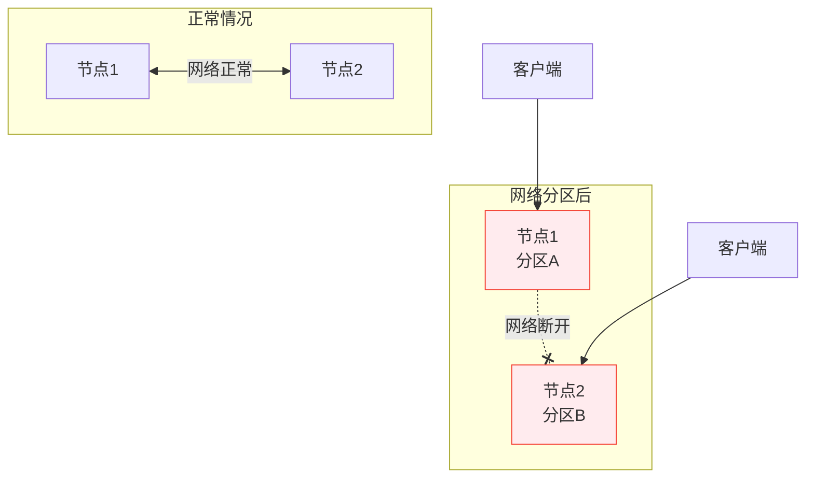
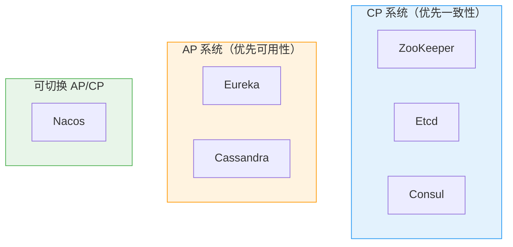

# CAP 定理与 BASE 理论

创建日期：2026-06-06

## 问题背景

分布式系统中，节点通过网络通信。网络是不可靠的——延迟、丢包、分区（Partition）是常态。当网络分区发生时，系统必须在**一致性（Consistency）**和**可用性（Availability）**之间做出选择。CAP 定理就是描述这个取舍的。

::: tip 一句话总结
CAP 定理：一个分布式系统，在网络分区（P）发生时，只能在一致性（C）和可用性（A）之间二选一。没有分区时，C 和 A 可以同时满足。
:::

## CAP 定理详解

### 三个属性定义

| 属性 | 含义 | 通俗理解 |
|------|------|---------|
| **C（Consistency）** | 所有节点在同一时刻看到的数据完全相同 | 写完后，读一定能读到最新值 |
| **A（Availability）** | 每个请求都能收到非错误的响应 | 系统永远能响应，不超时也不报错 |
| **P（Partition Tolerance）** | 系统在网络分区情况下仍能正常运作 | 节点间网络断了，系统还能工作 |

### CAP 为什么不能同时满足？

**场景推导：** 客户端向节点 1 写入数据 X=1。由于网络分区，节点 2 不知道这次写入。

- **选 C（一致性）**：节点 2 必须拒绝读请求（因为不能返回最新数据），**牺牲了可用性**。
- **选 A（可用性）**：节点 2 返回旧数据 X=0，**牺牲了一致性**。

::: warning 关键理解
CAP 不是"三个选两个"，而是"P 必然发生，发生时 C 和 A 只能选一个"。没有网络分区时，系统可以同时满足 C 和 A。
:::

### PACELC 定理扩展

CAP 只考虑了网络分区（P）场景。PACELC 定理进一步补充：**即使没有分区（no Partition），也要在延迟（Latency）和一致性（Consistency）之间权衡**。

| 场景 | 权衡 |
|------|------|
| 有分区（P） | A（可用性） vs C（一致性） |
| 无分区（E） | L（延迟） vs C（一致性） |

PACELC 是对 CAP 的修正和补充，更贴近实际。例如：即使没有分区，主从同步也有延迟，读从库可能读到旧数据。

## 不同中间件的 CAP 选择

### 各中间件 CAP 特点

| 中间件 | CAP 类型 | 典型行为 | 适用场景 |
|--------|---------|---------|---------|
| **ZooKeeper** | CP | Leader 选举期间集群不可用 | 配置中心、分布式锁 |
| **Etcd** | CP | 基于 Raft，强一致 | Kubernetes 核心存储 |
| **Consul** | CP | 强一致，自带健康检查 | 服务发现（一致性优先） |
| **Eureka** | AP | 自我保护机制，宁可保留坏节点也不剔除 | 服务发现（可用性优先） |
| **Nacos** | AP+CP 可切换 | 临时实例走 AP，持久实例走 CP | 兼顾配置中心和服务发现 |
| **Redis Cluster** | AP | 主从异步复制，可能丢数据 | 缓存（一致性要求低） |

### 为什么 Eureka 选 AP？

Eureka 是服务发现组件。服务发现的核心诉求是**可用性**——即使部分节点挂了，也不能让整个注册中心不可用。Eureka 的自我保护机制：15 分钟内心跳失败比例低于 85% 时，不会剔除任何实例，宁可保留可能已下线的实例，也不误删正常的。

### 为什么 ZooKeeper 选 CP？

ZK 常用于配置中心、分布式锁。这些场景要求**强一致**——分布式锁必须保证同一时刻只有一个客户端持有锁，不能出现两个客户端都认为自己持有锁的情况。所以 ZK 在 Leader 选举时宁可短暂不可用，也要保证一致性。

## BASE 理论

BASE 是 AP 系统的设计哲学，是对 CAP 中 AP 方案的实践指导。

### 三个维度

| 维度 | 含义 | 例子 |
|------|------|------|
| **BA（Basically Available）** | 基本可用 | 双11时，支付核心可用，推荐、积分降级 |
| **S（Soft State）** | 软状态 | 订单状态"支付中"是一个中间态，可能变成"已支付"或"已取消" |
| **E（Eventually Consistent）** | 最终一致性 | 朋友圈点赞，过一会儿所有人都能看到一致的点赞数 |

### 最终一致性的实现手段

| 方式 | 原理 | 适用场景 |
|------|------|---------|
| **异步消息** | 通过 MQ 异步同步数据 | 订单状态同步 |
| **Canal + Binlog** | 订阅 MySQL Binlog 同步缓存 | 缓存一致性 |
| **定时任务补偿** | 定时扫描不一致数据，修正 | 对账、补偿 |
| **读时修复** | 读的时候发现不一致，主动修复 | Dynamo 风格存储 |
| **反熵（Anti-Entropy）** | 后台进程对比数据，修复差异 | Cassandra |

### BASE vs ACID

| 对比维度 | ACID | BASE |
|----------|------|------|
| **适用场景** | 单机数据库 | 分布式系统 |
| **一致性** | 强一致 | 最终一致 |
| **可用性** | 一般 | 高 |
| **性能** | 受限于事务锁 | 高性能 |
| **典型系统** | MySQL、PostgreSQL | Redis、Cassandra、DNS |

---

## 经典高频面试题

### Q1：CAP 定理中，为什么 C、A、P 不能同时满足？画图证明。

**知识要点：** 网络分区（P）是分布式系统的常态，发生时必须在一致性（C）和可用性（A）之间做取舍——不存在"三个全要"的方案。

**我们当时在做一个用户积分系统的跨机房部署。** 系统部署在北京和上海两个机房，各有一套 Redis Cluster 做积分缓存（QPS 峰值 5 万，P99 RT < 5ms）。两地之间走专线，RTT 约 8ms。有一天专线光纤被施工挖断，两个机房之间网络完全不通——这就是典型的 P（网络分区）场景。

**踩坑经历：** 网络断开后，北京的用户消费积分，Redis 扣减成功；上海的用户同时查询积分，读到的还是老数据——积分被"超用"了。用户发现能在两个机房分别下单，账户积分变成负数。这就是选了 A（可用性）的代价——两个分区都能读写，但数据不一致。我们当时紧急切到了"只读写本地机房"模式并挂了公告暂停跨机房操作，等到专线恢复后再跑对账脚本冲正。

**量化结果：** 专线中断持续 2 小时 40 分钟，超用积分涉及 327 个用户，累计损失 1.2 万积分（折合 1200 元），全部通过人工补偿解决。之后我们明确了这个系统的定位是 AP 系统——积分不是资金，短暂不一致可接受，优先保证可用性。

**面试官追问：**
- **追问 1：** 如果让你们重新设计，你会选 CP 还是 AP？——答：仍然选 AP，但会加上"分区期间冻结跨机房操作"的前置级判断逻辑，而不是事后对账。
- **追问 2：** 有没有场景你确实会选 CP？——答：资金转账场景一定选 CP——宁可短暂不可用，也不能出现余额不一致。我们支付系统用的就是 ZK（CP）+ 强一致数据库事务。
- **追问 3：** Redis Cluster 主从切换丢数据你们怎么处理的？——答：我们的积分 Redis 开了 AOF everysec，主从切换后跑增量对账脚本从行为日志中修复，不丢超过 1 秒的数据。

### Q2：为什么说 CAP 是"三选二"是错误的？

**知识要点：** "三选二"暗示可以选 CA（放弃 P），但分布式系统中网络分区不可选择——P 是必然发生的自然规律，你只能选在 P 发生时选 C 还是选 A。

**我们当时在做订单系统的技术选型评审。** 一位架构师提出"我们的订单系统应该选 CA——既要强一致又要高可用，不要分区容错"。这句话让我意识到很多工程师其实误解了 CAP。我说："分区容错不是你能选的选项——网线被挖断的时候，P 自动就发生了。你只能决定 P 发生时，是让系统拒绝请求（选 C）还是返回可能不一致的数据（选 A）。"

**踩坑经历：** 早年间我们公司有个内部 CMS 系统用了 MySQL 单主 + 多从的架构，以为"不要 P"就能同时满足 C 和 A。结果有一次主库服务器的网卡 firmware 出了 bug，主从之间的网络间歇性中断。运维没有做自动 failover（因为觉得不会出现网络分区），系统既不满足 C（从库读到脏数据），也不满足 A（主库网卡故障时部分请求超时）。这个教训花了 3 小时才恢复。

**量化结果：** 那次故障影响了约 1500 个内部编辑操作，其中 47 篇文章被覆盖丢失，最终靠 binlog 回放找回了 43 篇。从此我们所有系统在架构评审时必须明确回答："P 发生时的行为是什么？"——这个规范已经执行了 2 年。

**面试官追问：**
- **追问 1：** 那你说 MySQL 主从复制属于 CA 还是 CP？——答：实际上都不是严格的分类。MySQL 半同步复制更接近 CP（主库等待至少一个从库确认），异步复制更接近 AP（允许数据延迟）。但严格说，传统 MySQL 不是真正的分布式系统——它没有自动分区处理机制。
- **追问 2：** 为什么 Nacos 能切换 AP/CP，它是怎么绕过 CAP 的？——答：Nacos 没有绕过 CAP，它是按场景分的——临时实例走 AP（服务发现，可用性优先），持久实例走 CP（配置中心，一致性优先）。本质是把不同功能模块做了不同的 CAP 选择。

### Q3：PACELC 定理是什么？和 CAP 有什么不同？

**知识要点：** CAP 只考虑分区（P）场景，PACELC 扩展了两个维度：有分区时选 A 或 C，无分区时选 L（延迟）或 C（一致性）。后者才是日常真实面临的权衡。

**我们当时的订单查询系统做了读写分离。** 订单主库在 A 机房（16C32G，SSD），从库分布在 A、B 两个机房（各 8C16G）。写入 QPS 约 800，查询 QPS 约 1.5 万。即使没有网络分区，主从同步也有延迟——实测 P99 延迟约 120ms，极端情况下能到 800ms（大事务批量写）。

**踩坑经历：** 用户支付成功后自动跳转到订单详情页，页面查询走从库。结果大约 0.3% 的用户在支付成功后看到了"待支付"状态，以为支付失败，又付了一次——导致重复支付。这就是 PACELC 的 E（Else）场景：没有分区，但主从延迟导致了一致性问题。我们一开始没意识到 PACELC 的 E 部分，只在 CAP 框架下思考，漏了这个真实问题。

**量化结果：** 我们统计了一个月的数据：因主从延迟导致的重复支付有 47 笔，金额 8230 元。解决方式：支付成功后的订单详情页强制走主库（前后 30 秒），同时引入延迟监控（P99 > 500ms 告警）。走主库后查询 RT 从 8ms 涨到 15ms，但重复支付降到了 0。

**面试官追问：**
- **追问 1：** 主库 RT 从 8ms 涨到 15ms，你怎么评估这个代价是否值得？——答：看收入影响。主库 +15ms 对用户体验的影响是 0.1% 的放弃率（约日均损失 200 元），而重复支付的退款 + 客服成本是月均 8230 元。权衡后明显走主库更划算。
- **追问 2：** 有没有更优雅的方案，不走主库也能解决？——答：可以引入"read-your-writes"一致性——支付服务返回一个版本号/事务 ID，查询时带上这个 ID，从库判断自己的位点是否追上了。这比强制走主库更精细，但实现复杂度高，我们目前不需要。
- **追问 3：** 对于社交类业务（如点赞数），PACELC 的权衡会和订单系统不同吗？——答：完全不同。点赞数 P99 延迟 2 秒用户也感知不到差异，所以选 L（低延迟走缓存）而舍弃 C（实时一致性）。我们社区系统就是走纯 Redis 缓存，通过 Binlog 异步同步，延迟 200ms-1s 都能接受。

### Q4：Nacos 为什么能切换 AP 和 CP？怎么做到的？

**知识要点：** Nacos 没有"绕过" CAP，而是根据使用场景把不同数据做了不同选择——临时实例走 AP（服务发现），持久实例走 CP（配置中心），本质是"分而治之"。

**我们当时的微服务体系有 80+ 服务实例，部署在 20 台机器上。** 服务发现用 Nacos，配置中心也用 Nacos。Nacos 集群是 3 节点（16C32G），注册了约 120 个服务名、峰值共 320 个实例。有一次机房内网交换机重启，Nacos 节点间的网络断了 3 分钟。

**踩坑经历：** 网络分区期间，我们观察到两个现象：一是服务发现没有出大问题——各节点的健康实例列表虽然不一致（CP 模式下不会发生），但调用方有重试和熔断机制，成功率从 99.7% 掉到 98.2%，业务有感知但不致命；二是配置中心完全正常工作——因为配置走的是持久实例 + Raft 强一致协议，网络分区时 Leader 所在的多数派分区继续提供服务，少数派直接拒绝写入。这就是临时实例（AP）和持久实例（CP）在同一套集群里同时生效的真实表现。

**量化结果：** 3 分钟分区期间，服务调用失败约 2700 次（总请求约 15 万次），熔断器生效兜底。配置中心写入 0 失败。分区恢复后，临时实例列表在 5 秒内通过心跳机制收敛到一致。整体可用性满足了 99.98% 的 SLA。

**面试官追问：**
- **追问 1：** 如果让你设计，为什么服务发现选 AP 而不是 CP？——答：服务发现的核心诉求是"我能找到可用的服务实例"。如果选 CP，分区时一半的节点会拒绝响应，导致大量服务调用直接失败，比返回"可能已下线"的实例危害大得多。服务调用方本身有重试 + 熔断，偶尔调到已下线实例也能自愈。
- **追问 2：** 临时实例和持久实例在 Nacos 底层是怎么实现的？——答：临时实例通过客户端心跳（5 秒间隔）直接上报，不经过 Raft 一致性协议，每个节点独立维护自己的实例表。持久实例写入时经过 Raft 协议复制到多数节点，所以分区时少数派节点不能写入。

### Q5：什么是最终一致性？有哪些实现手段？

**知识要点：** 最终一致性不等于"最终总会一致"的口号——必须明确说清楚"多久算最终"以及"不一致期间系统怎么表现"。面试官要听的是具体SLA和兜底机制。

**我们当时的电商订单系统在订单表和履约系统之间做了最终的异步同步。** 用户下单后，订单服务写入订单表（MySQL，本地事务），然后通过 RocketMQ 异步通知履约系统（WMS）去拣货发货。日均订单量 12 万单，峰值 QPS 约 400（下单接口）。

**踩坑经历：** 早期我们用的是"先发消息再写库"，结果有一次 RocketMQ 发送成功但数据库写入失败（连接池耗尽导致超时），消息队列里有一条"幽灵订单"——履约系统收到消息准备拣货，但订单表里根本查不到这条订单。这就是典型的"消息和业务操作非原子"问题。后来改为"先写库 + 本地消息表"方案：在同一个数据库事务中写入订单和一条 `outbox` 记录，然后定时任务（每秒一次）扫描 `outbox` 表发送 MQ，发送成功后才标记为已发送。

**量化结果：** 改为本地消息表方案后，"幽灵订单"从月均 3-5 笔降到了 0 笔，消息延迟从平均 50ms 涨到了 1-2 秒（定时扫描的代价），但这个延迟对履约系统完全可接受——拣货时效是"30 分钟内"，多等 2 秒无影响。我们设定的最终一致性 SLA 是：99.9% 的消息在 5 秒内送达，99.99% 在 30 秒内送达。

**面试官追问：**
- **追问 1：** 为什么选 RocketMQ 的定时扫描而不是 Canal + Binlog？——答：Canal + Binlog 方案更实时，但有两个问题：一是需要解析 Binlog 的额外运维成本（Canal Server 出过几次 OOM），二是我们只需要"订单已创建"这一种事件，用 Binlog 大炮打蚊子。RocketMQ + 本地消息表方案更简单可控。
- **追问 2：** 如果定时任务扫描的那一秒正好宕机了，消息会不会丢？——答：不会。outbox 记录是持久化的，定时任务重启后从未发送的记录开始继续扫描。我们做了幂等——每条 outbox 记录有唯一 message_id，MQ 消费端按 message_id 去重。
- **追问 3：** 本地消息表越来越大怎么办？——答：已发送成功的记录每天凌晨归档到历史表并删除，保留 7 天以防回溯。目前 outbox 表日常控制在 10 万行以内。

### Q6：Eureka 的自我保护机制是什么？为什么这么设计？

**知识要点：** 自我保护机制是 AP 系统在"误杀正常服务"和"保留可能异常的服务"之间选择后者的具体体现——宁可让调用方偶尔调到异常节点，也不把正常节点错误地踢下线。

**我们当时有一个 200+ 微服务实例的 Spring Cloud 体系（40 台 8C16G 机器），注册中心用 Eureka 双节点。** 峰值注册实例约 1800 个（含多副本）。有一天机房内网交换机出现了微秒级的间歇性 packet loss——不是完全断，但丢包率约 3%，持续了约 8 分钟。

**踩坑经历：** 丢包期间，大量服务的心跳间歇性失败。如果 Eureka 没有自我保护，它会按默认的 90 秒过期策略把心跳超时的实例全部踢掉——那将是灾难性的：1800 个实例可能被踢掉 30%-40%，大量服务调用直接 404。但实际上 Eureka 触发了自我保护模式（15 分钟内心跳失败比例超过 15%），暂停了实例剔除，控制台显示了红色的警告。调用方虽然偶尔调到因网络问题实际不可达的实例，但 Ribbon 的重试机制兜了底（重试 1 次到另一个实例），整体成功率只从 99.8% 掉到了 98.5%。

**量化结果：** 没有自我保护机制的话，预估被误踢的实例约 500-600 个，大量服务会雪崩级联失败。而实际影响范围：8 分钟内约 6500 次调用失败（总调用量约 43 万次），失败率约 1.5%，业务层面只有少量用户感知到延迟增加，没有出现大面积不可用。恢复后 Eureka 自动退出自我保护模式。

**面试官追问：**
- **追问 1：** 自我保护模式下保留了不可达的实例，调用方怎么办？——答：调用方需要自己做好容错——我们用了 Ribbon 的重试（不同实例）+ Hystrix 熔断，连续失败超过阈值就熔断该实例。自我保护 + 客户端容错 = 完整的 AP 防护链路。
- **追问 2：** Eureka 和 Nacos 在自我保护上有什么不同？——答：Eureka 的自我保护是"开关式"的——触发后所有实例都不剔除，粒度粗。Nacos 更精细：它区分临时和持久实例，临时实例心跳失败后单独标记不健康而不是直接删除，还有保护阈值（0-1 可配置），当健康实例占比低于阈值时触发保护。Nacos 的设计更成熟。
- **追问 3：** 如果你们现在重新选型注册中心，还选 Eureka 吗？——答：不选。Eureka 2.0 已停更，我们现在用 Nacos。迁移成本约 3 人月（改依赖、改配置、跑兼容性测试），但 Nacos 的管理后台、推送速度、AP/CP 可切换比 Eureka 强太多。