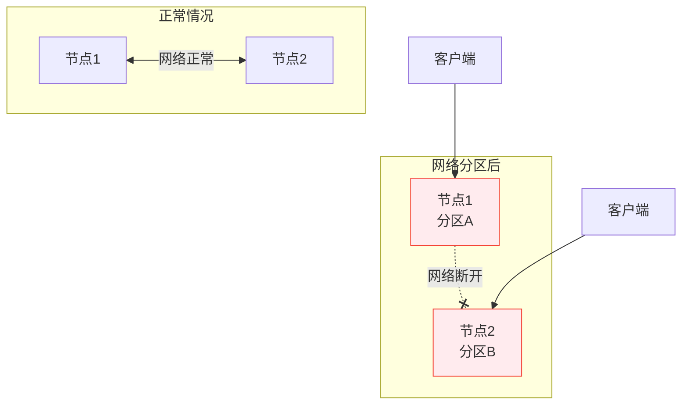
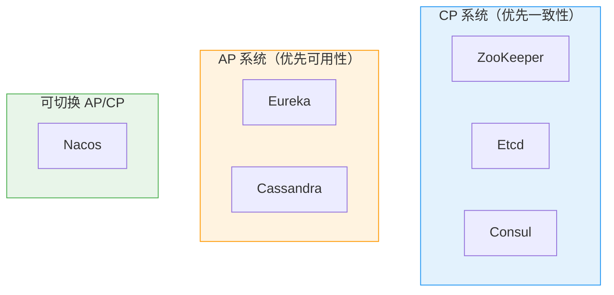

# CAP 定理与 BASE 理论

创建日期：2026-06-06

## 问题背景

分布式系统中，节点通过网络通信。网络是不可靠的——延迟、丢包、分区（Partition）是常态。当网络分区发生时，系统必须在**一致性（Consistency）**和**可用性（Availability）**之间做出选择。CAP 定理就是描述这个取舍的。

::: tip 一句话总结
CAP 定理：一个分布式系统，在网络分区（P）发生时，只能在一致性（C）和可用性（A）之间二选一。没有分区时，C 和 A 可以同时满足。
:::

## CAP 定理详解

### 三个属性定义

| 属性 | 含义 | 通俗理解 |
|------|------|---------|
| **C（Consistency）** | 所有节点在同一时刻看到的数据完全相同 | 写完后，读一定能读到最新值 |
| **A（Availability）** | 每个请求都能收到非错误的响应 | 系统永远能响应，不超时也不报错 |
| **P（Partition Tolerance）** | 系统在网络分区情况下仍能正常运作 | 节点间网络断了，系统还能工作 |

### CAP 为什么不能同时满足？

**场景推导：** 客户端向节点 1 写入数据 X=1。由于网络分区，节点 2 不知道这次写入。

- **选 C（一致性）**：节点 2 必须拒绝读请求（因为不能返回最新数据），**牺牲了可用性**。
- **选 A（可用性）**：节点 2 返回旧数据 X=0，**牺牲了一致性**。

::: warning 关键理解
CAP 不是"三个选两个"，而是"P 必然发生，发生时 C 和 A 只能选一个"。没有网络分区时，系统可以同时满足 C 和 A。
:::

### PACELC 定理扩展

CAP 只考虑了网络分区（P）场景。PACELC 定理进一步补充：**即使没有分区（no Partition），也要在延迟（Latency）和一致性（Consistency）之间权衡**。

| 场景 | 权衡 |
|------|------|
| 有分区（P） | A（可用性） vs C（一致性） |
| 无分区（E） | L（延迟） vs C（一致性） |

PACELC 是对 CAP 的修正和补充，更贴近实际。例如：即使没有分区，主从同步也有延迟，读从库可能读到旧数据。

## 不同中间件的 CAP 选择

### 各中间件 CAP 特点

| 中间件 | CAP 类型 | 典型行为 | 适用场景 |
|--------|---------|---------|---------|
| **ZooKeeper** | CP | Leader 选举期间集群不可用 | 配置中心、分布式锁 |
| **Etcd** | CP | 基于 Raft，强一致 | Kubernetes 核心存储 |
| **Consul** | CP | 强一致，自带健康检查 | 服务发现（一致性优先） |
| **Eureka** | AP | 自我保护机制，宁可保留坏节点也不剔除 | 服务发现（可用性优先） |
| **Nacos** | AP+CP 可切换 | 临时实例走 AP，持久实例走 CP | 兼顾配置中心和服务发现 |
| **Redis Cluster** | AP | 主从异步复制，可能丢数据 | 缓存（一致性要求低） |

### 为什么 Eureka 选 AP？

Eureka 是服务发现组件。服务发现的核心诉求是**可用性**——即使部分节点挂了，也不能让整个注册中心不可用。Eureka 的自我保护机制：15 分钟内心跳失败比例低于 85% 时，不会剔除任何实例，宁可保留可能已下线的实例，也不误删正常的。

### 为什么 ZooKeeper 选 CP？

ZK 常用于配置中心、分布式锁。这些场景要求**强一致**——分布式锁必须保证同一时刻只有一个客户端持有锁，不能出现两个客户端都认为自己持有锁的情况。所以 ZK 在 Leader 选举时宁可短暂不可用，也要保证一致性。

## BASE 理论

BASE 是 AP 系统的设计哲学，是对 CAP 中 AP 方案的实践指导。

### 三个维度

| 维度 | 含义 | 例子 |
|------|------|------|
| **BA（Basically Available）** | 基本可用 | 双11时，支付核心可用，推荐、积分降级 |
| **S（Soft State）** | 软状态 | 订单状态"支付中"是一个中间态，可能变成"已支付"或"已取消" |
| **E（Eventually Consistent）** | 最终一致性 | 朋友圈点赞，过一会儿所有人都能看到一致的点赞数 |

### 最终一致性的实现手段

| 方式 | 原理 | 适用场景 |
|------|------|---------|
| **异步消息** | 通过 MQ 异步同步数据 | 订单状态同步 |
| **Canal + Binlog** | 订阅 MySQL Binlog 同步缓存 | 缓存一致性 |
| **定时任务补偿** | 定时扫描不一致数据，修正 | 对账、补偿 |
| **读时修复** | 读的时候发现不一致，主动修复 | Dynamo 风格存储 |
| **反熵（Anti-Entropy）** | 后台进程对比数据，修复差异 | Cassandra |

### BASE vs ACID

| 对比维度 | ACID | BASE |
|----------|------|------|
| **适用场景** | 单机数据库 | 分布式系统 |
| **一致性** | 强一致 | 最终一致 |
| **可用性** | 一般 | 高 |
| **性能** | 受限于事务锁 | 高性能 |
| **典型系统** | MySQL、PostgreSQL | Redis、Cassandra、DNS |

---

## 经典高频面试题

### Q1：CAP 定理中，为什么 C、A、P 不能同时满足？画图证明。

**参考答案：**

当网络分区（P）发生时，两个节点无法通信。客户端向节点 1 写入数据，节点 2 不知道这次写入。此时：
- 如果要求 C（一致性），节点 2 必须拒绝读请求（因为不能返回最新数据），牺牲了 A。
- 如果要求 A（可用性），节点 2 返回旧数据，牺牲了 C。

没有 P 时，C 和 A 可以同时满足。所以 CAP 的准确表述是：**发生 P 时，必须在 C 和 A 之间二选一**。

### Q2：为什么说 CAP 是"三选二"是错误的？

**参考答案：**

"三选二"暗示可以选 CA 系统（不要 P），但分布式系统中网络分区是不可避免的——P 是必然发生的。CAP 的正确理解是：**P 发生时，C 和 A 只能选一个**。没有 P 时，C 和 A 可以共存。所以不存在"选 CA"的分布式系统。

### Q3：PACELC 定理是什么？和 CAP 有什么不同？

**参考答案：**

PACELC 是对 CAP 的补充和修正：
- 有分区（P）时：权衡 A（可用性）和 C（一致性）。
- 无分区（E）时：权衡 L（延迟）和 C（一致性）。

CAP 只考虑了分区场景，PACELC 指出即使没有分区，主从同步的延迟也会导致一致性问题，需要在延迟和一致性之间权衡。PACELC 更贴近实际。

### Q4：Nacos 为什么能切换 AP 和 CP？怎么做到的？

**参考答案：**

Nacos 通过区分**临时实例**和**持久实例**来实现 AP/CP 切换：
- **临时实例**走 AP 模式：客户端心跳上报，服务端不持久化，网络分区时优先保证可用性。
- **持久实例**走 CP 模式：服务端持久化存储，基于 Raft 协议保证一致性。

配置中心通常用 CP（持久实例），服务发现通常用 AP（临时实例）。

### Q5：什么是最终一致性？有哪些实现手段？

**参考答案：**

最终一致性是指：系统不保证实时一致，但最终会达到一致状态。实现手段：
1. **异步消息**：通过 MQ 异步同步数据。
2. **Canal + Binlog**：订阅 Binlog 同步缓存。
3. **定时任务补偿**：定时扫描不一致数据并修正。
4. **读时修复**：读的时候发现不一致，主动修复。
5. **反熵**：后台进程对比数据，修复差异。

### Q6：Eureka 的自我保护机制是什么？为什么这么设计？

**参考答案：**

Eureka 的自我保护机制：15 分钟内心跳失败比例低于 85% 时，不会剔除任何实例。宁可保留可能已下线的实例，也不误删正常的。

这么设计因为 Eureka 是 AP 系统，优先保证可用性。如果因为网络抖动误删了正常实例，会导致服务调用失败。保留可能已下线的实例最多导致一次调用失败，但误删会导致大量调用失败。两害相权取其轻。