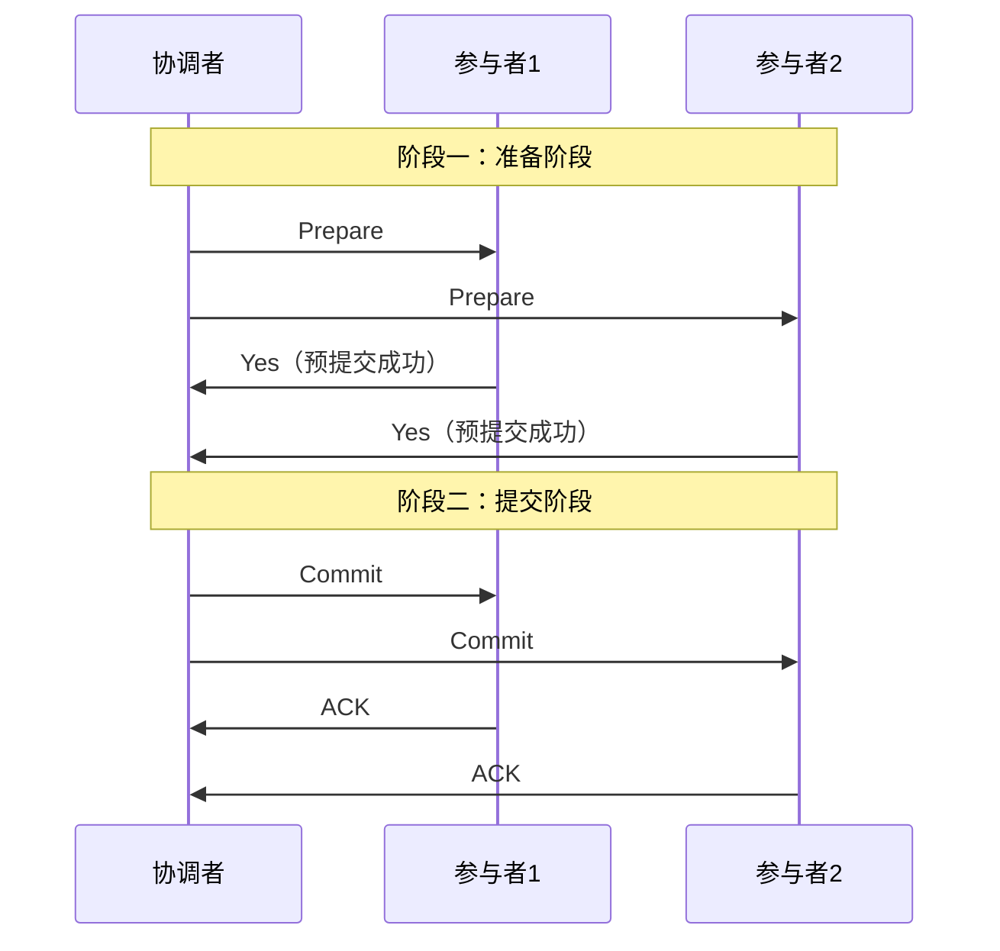
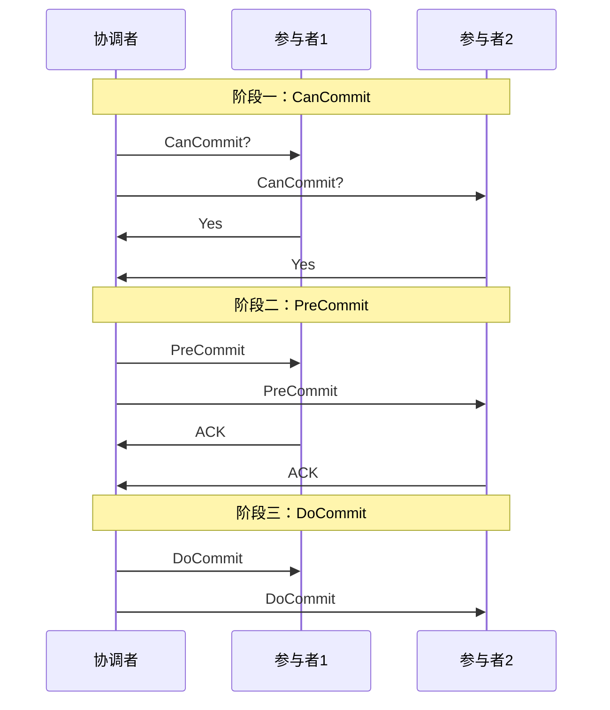
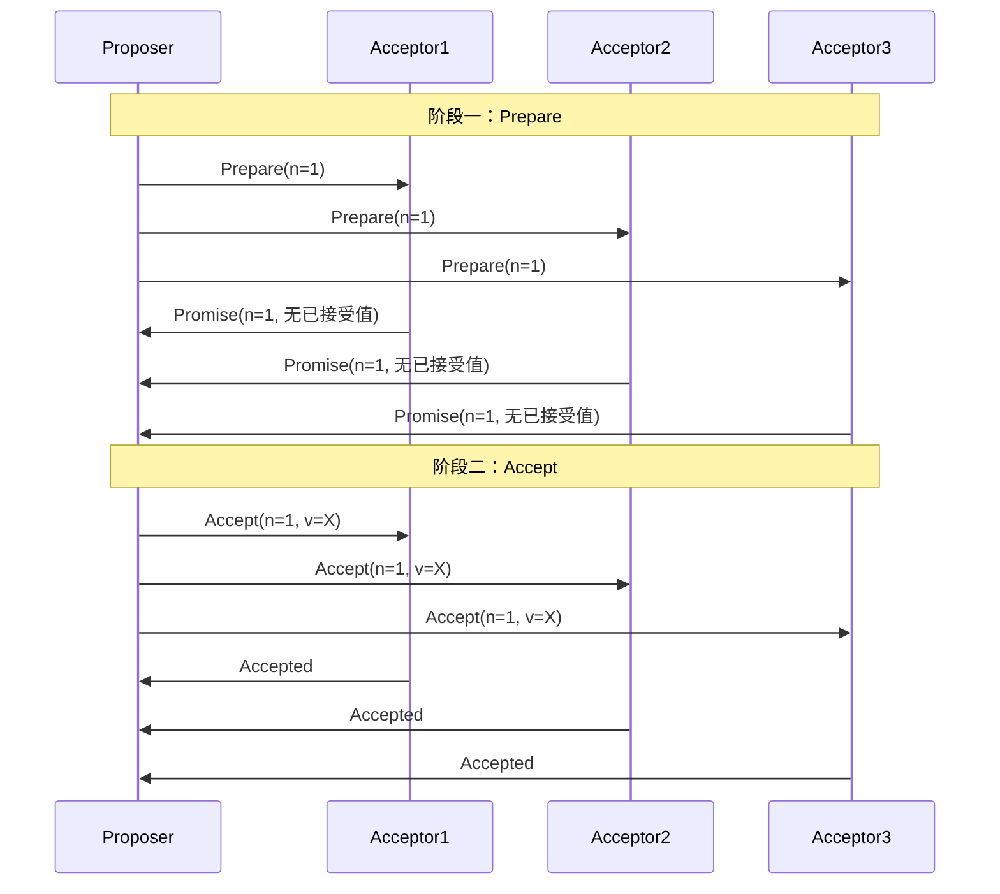
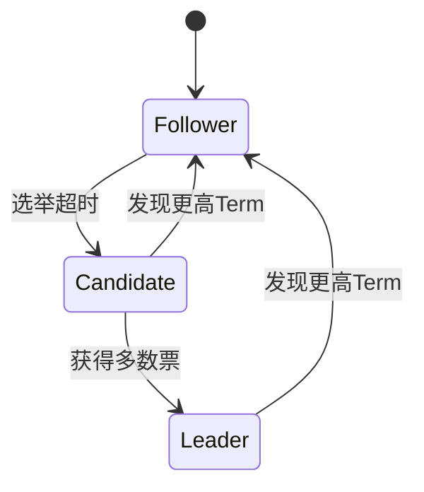
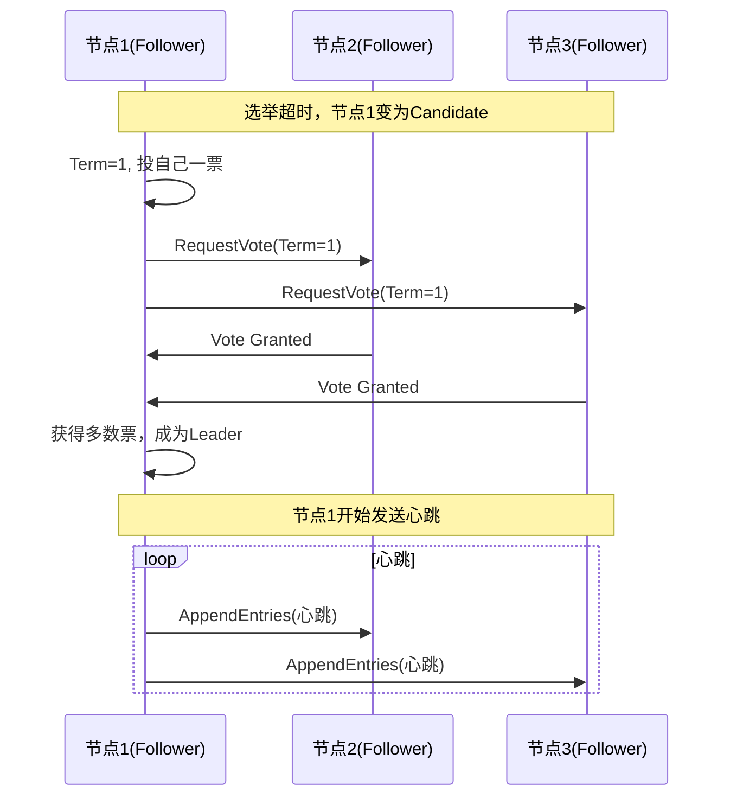

# 一致性协议：2PC / 3PC / Paxos / Raft

创建日期：2026-06-06

## 问题背景

在分布式系统中，多个节点如何就某个值达成一致？这是分布式系统最核心的问题。例如：分布式事务中多个参与者是否都提交？Raft 集群中谁是 Leader？这些都需要一致性协议来解决。

::: tip 一句话总结
一致性协议解决的是：**在网络不可靠、节点可能故障的分布式环境下，如何让多个节点就某个提案达成一致。**
:::

## 2PC（两阶段提交）

### 协议流程

### 核心问题

| 问题 | 描述 | 后果 |
|------|------|------|
| **同步阻塞** | 所有参与者在 Prepare 阶段锁定资源，等待协调者指令 | 资源被长时间占用，并发性能差 |
| **单点故障** | 协调者宕机，所有参与者阻塞等待 | 整个事务阻塞，无法继续 |
| **数据不一致** | 阶段二部分参与者收到 Commit，部分没收到 | 一部分提交了，一部分没提交 |

### 2PC 的致命缺陷

协调者在发出 Commit 后宕机，部分参与者收到 Commit 并提交了，部分没收到。此时数据已经不一致，且无法自动恢复——需要人工介入。这就是 2PC 的"脑裂"问题。

## 3PC（三阶段提交）

### 协议改进

### 3PC 的改进点

1. **引入超时机制**：参与者等待超时后可以自动提交（假设协调者已发出 Commit）。
2. **增加 CanCommit 阶段**：提前判断参与者是否可以执行，减少无效的资源锁定。

### 3PC 真的解决问题了吗？

**没有完全解决。** 3PC 引入了超时自动提交，但如果协调者在 PreCommit 后发出 Abort 但参与者没收到（网络分区），参与者超时后自动提交，数据仍然不一致。3PC 增加了网络分区场景下的可用性，但牺牲了一致性。

## Paxos 算法

### 核心角色

| 角色 | 职责 |
|------|------|
| **Proposer** | 提出提案，推动共识达成 |
| **Acceptor** | 接受提案，投票 |
| **Learner** | 学习已达成共识的值 |

### Basic Paxos 两阶段

### Paxos 核心约束

1. **Acceptor 必须接受第一个到达的 Prepare 请求**（如果 Proposal Number 更大）。
2. **如果 Acceptor 已经接受过值，Promise 时必须带上已接受的值**。
3. **Proposer 收到多数 Promise 后，必须使用已接受值中 Proposal Number 最大的那个值**。

::: tip 一句话记住 Paxos
Paxos 的核心是：**一旦一个值被多数 Acceptor 接受，后续所有提案都必须使用这个值。**
:::

### Multi-Paxos

Basic Paxos 每次达成共识需要两轮 RPC，效率低。Multi-Paxos 优化：选出一个 Leader，Leader 直接发起 Accept 阶段（跳过 Prepare），大幅减少 RPC 次数。

## Raft 算法

Raft 将共识问题分解为三个子问题：**Leader 选举**、**日志复制**、**安全性**。

### 节点角色

### Leader 选举

### 日志复制

1. Leader 收到客户端请求，将日志条目追加到本地日志。
2. Leader 通过 AppendEntries RPC 将日志条目复制到所有 Follower。
3. 当多数 Follower 确认复制成功后，Leader 提交日志。
4. Leader 通知 Follower 提交日志，并应用到状态机。

### Paxos vs Raft 对比

| 对比维度 | Paxos | Raft |
|----------|-------|------|
| 可理解性 | 难，论文晦涩 | 易，专为可理解性设计 |
| 工程实现 | 复杂，需大量优化 | 相对简单 |
| 日志连续性 | 允许空洞 | 日志严格连续 |
| 成员变更 | 复杂 | 联合共识（Joint Consensus） |
| 代表实现 | Chubby、Spanner | Etcd、Consul、TiKV |
| 面试难度 | 讲清楚 Basic Paxos 即可 | 要求能画出选举流程 |

---

## 经典高频面试题

### Q1：2PC 的同步阻塞问题是什么？怎么解决？

**参考答案：**

2PC 在第一阶段 Prepare 后，所有参与者锁定资源，等待协调者的第二阶段指令。如果协调者宕机，所有参与者一直阻塞，资源无法释放。

解决方案：引入超时机制和协调者高可用（如 3PC 的超时自动提交），或者使用 TCC 柔性事务替代刚性 2PC。

### Q2：3PC 真的解决了 2PC 的问题吗？

**参考答案：**

3PC 通过引入超时机制和 CanCommit 阶段，减少了阻塞问题，但**没有完全解决一致性问题**。如果协调者在 PreCommit 后发出 Abort 但参与者没收到（网络分区），参与者超时后自动提交，数据仍然不一致。3PC 用一致性换取了可用性，对于一致性要求高的场景，3PC 并不比 2PC 更好。

### Q3：Paxos 两阶段的核心是什么？一句话总结。

**参考答案：**

阶段一（Prepare）：Proposer 向多数 Acceptor 询问，获取已接受的值。
阶段二（Accept）：Proposer 根据 Promise 回复中的值，选择正确的值，向多数 Acceptor 发起 Accept。

核心约束：**一旦一个值被多数 Acceptor 接受，后续所有提案都必须使用这个值**。这保证了共识的安全性。

### Q4：Raft 的 Leader 选举过程是怎样的？

**参考答案：**

1. 所有节点初始为 Follower，每个 Follower 有一个随机的选举超时时间。
2. 超时后 Follower 变为 Candidate，Term+1，投自己一票，向其他节点发送 RequestVote。
3. 其他节点在同一 Term 内未投过票，则投票给 Candidate。
4. Candidate 获得多数票 → 成为 Leader，开始发送心跳。
5. 如果两个 Candidate 同时选举，都没获得多数票 → 重新选举（随机超时减少冲突）。

### Q5：Raft 如何保证日志一致性？

**参考答案：**

1. Leader 通过 AppendEntries RPC 复制日志，包含 `prevLogIndex` 和 `prevLogTerm`。
2. Follower 检查本地日志是否与 `prevLogIndex` 处匹配，不匹配则拒绝。
3. Leader 递减 `nextIndex` 重试，直到找到匹配点，然后覆盖 Follower 的不一致日志。
4. 当多数 Follower 确认复制后，Leader 提交日志（更新 `commitIndex`）。

### Q6：Paxos 和 Raft 的核心区别是什么？选哪个？

**参考答案：**

- **Paxos**：理论完备但理解困难，工程实现复杂。适合需要深入理解共识原理的场景。
- **Raft**：专为可理解性设计，日志严格连续，选举和复制分离。工程上 Raft 更受欢迎。

选型：绝大多数场景选 Raft（Etcd、Consul、TiKV 都用 Raft）。Paxos 更多是学术和理论价值，工程中 Chubby 和 Spanner 使用 Paxos 变体。