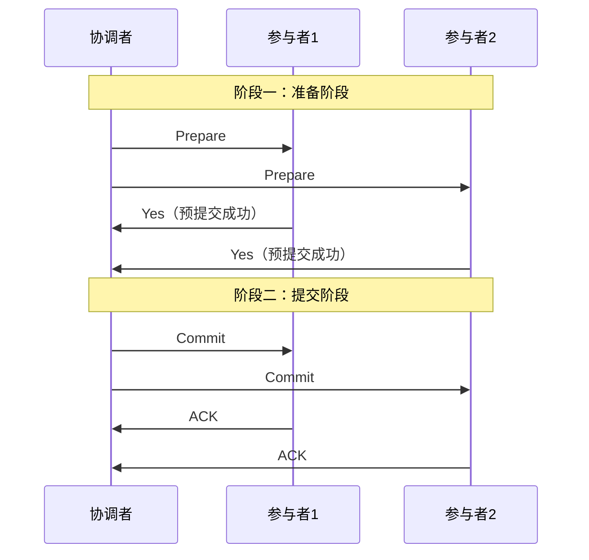
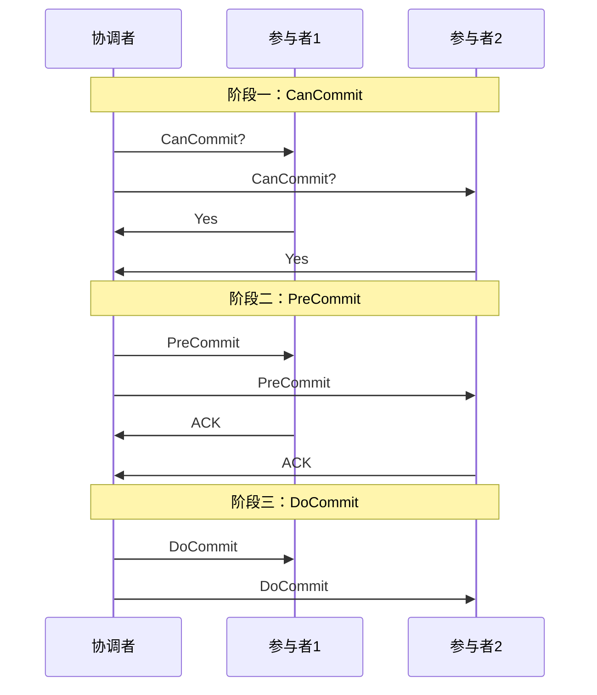
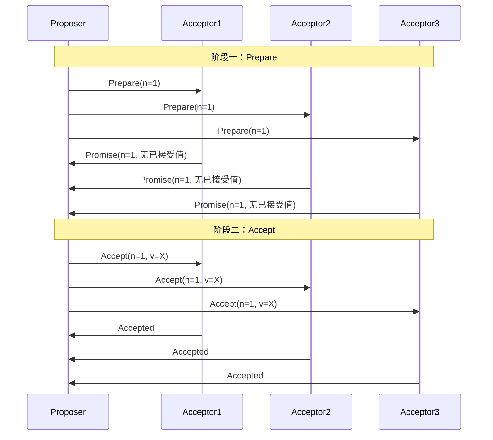
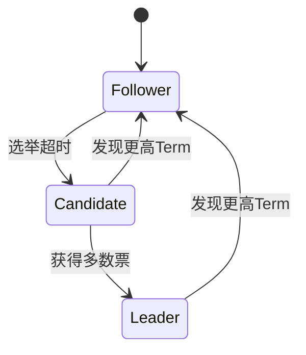
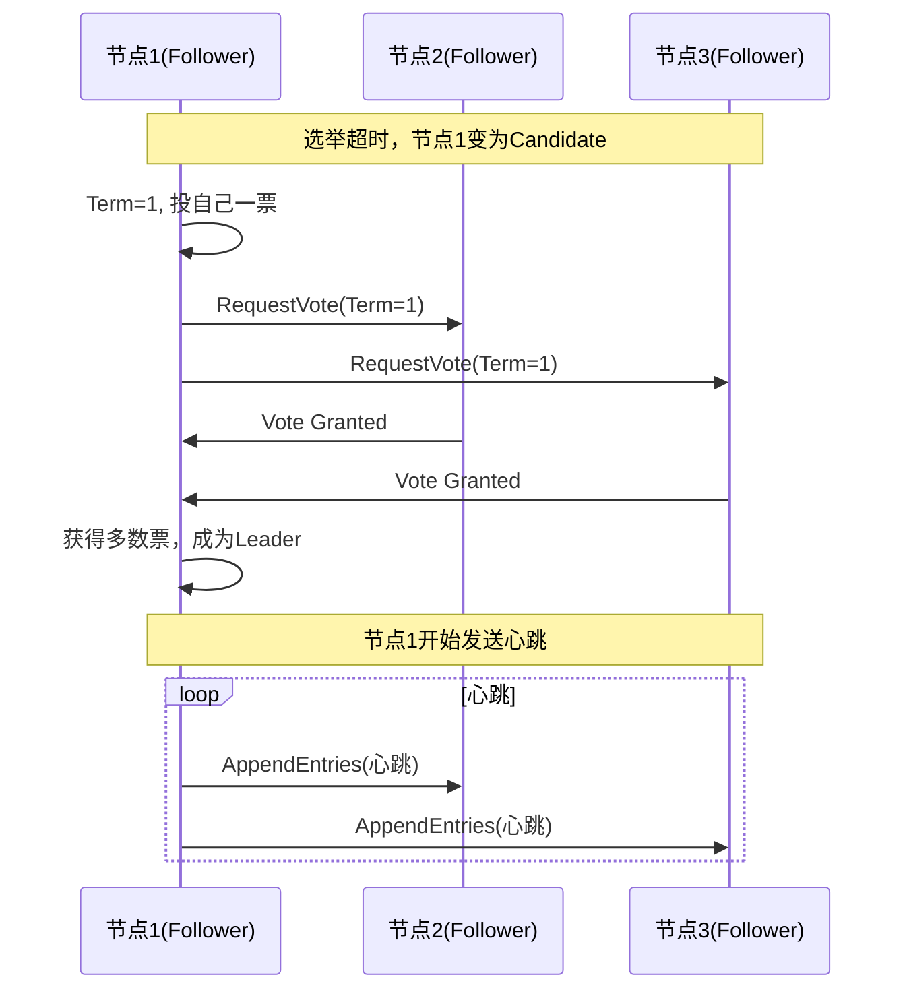

# 一致性协议：2PC / 3PC / Paxos / Raft

创建日期：2026-06-06

## 问题背景

在分布式系统中，多个节点如何就某个值达成一致？这是分布式系统最核心的问题。例如：分布式事务中多个参与者是否都提交？Raft 集群中谁是 Leader？这些都需要一致性协议来解决。

::: tip 一句话总结
一致性协议解决的是：**在网络不可靠、节点可能故障的分布式环境下，如何让多个节点就某个提案达成一致。**
:::

## 2PC（两阶段提交）

### 协议流程

### 核心问题

| 问题 | 描述 | 后果 |
|------|------|------|
| **同步阻塞** | 所有参与者在 Prepare 阶段锁定资源，等待协调者指令 | 资源被长时间占用，并发性能差 |
| **单点故障** | 协调者宕机，所有参与者阻塞等待 | 整个事务阻塞，无法继续 |
| **数据不一致** | 阶段二部分参与者收到 Commit，部分没收到 | 一部分提交了，一部分没提交 |

### 2PC 的致命缺陷

协调者在发出 Commit 后宕机，部分参与者收到 Commit 并提交了，部分没收到。此时数据已经不一致，且无法自动恢复——需要人工介入。这就是 2PC 的"脑裂"问题。

## 3PC（三阶段提交）

### 协议改进

### 3PC 的改进点

1. **引入超时机制**：参与者等待超时后可以自动提交（假设协调者已发出 Commit）。
2. **增加 CanCommit 阶段**：提前判断参与者是否可以执行，减少无效的资源锁定。

### 3PC 真的解决问题了吗？

**没有完全解决。** 3PC 引入了超时自动提交，但如果协调者在 PreCommit 后发出 Abort 但参与者没收到（网络分区），参与者超时后自动提交，数据仍然不一致。3PC 增加了网络分区场景下的可用性，但牺牲了一致性。

## Paxos 算法

### 核心角色

| 角色 | 职责 |
|------|------|
| **Proposer** | 提出提案，推动共识达成 |
| **Acceptor** | 接受提案，投票 |
| **Learner** | 学习已达成共识的值 |

### Basic Paxos 两阶段

### Paxos 核心约束

1. **Acceptor 必须接受第一个到达的 Prepare 请求**（如果 Proposal Number 更大）。
2. **如果 Acceptor 已经接受过值，Promise 时必须带上已接受的值**。
3. **Proposer 收到多数 Promise 后，必须使用已接受值中 Proposal Number 最大的那个值**。

::: tip 一句话记住 Paxos
Paxos 的核心是：**一旦一个值被多数 Acceptor 接受，后续所有提案都必须使用这个值。**
:::

### Multi-Paxos

Basic Paxos 每次达成共识需要两轮 RPC，效率低。Multi-Paxos 优化：选出一个 Leader，Leader 直接发起 Accept 阶段（跳过 Prepare），大幅减少 RPC 次数。

## Raft 算法

Raft 将共识问题分解为三个子问题：**Leader 选举**、**日志复制**、**安全性**。

### 节点角色

### Leader 选举

### 日志复制

1. Leader 收到客户端请求，将日志条目追加到本地日志。
2. Leader 通过 AppendEntries RPC 将日志条目复制到所有 Follower。
3. 当多数 Follower 确认复制成功后，Leader 提交日志。
4. Leader 通知 Follower 提交日志，并应用到状态机。

### Paxos vs Raft 对比

| 对比维度 | Paxos | Raft |
|----------|-------|------|
| 可理解性 | 难，论文晦涩 | 易，专为可理解性设计 |
| 工程实现 | 复杂，需大量优化 | 相对简单 |
| 日志连续性 | 允许空洞 | 日志严格连续 |
| 成员变更 | 复杂 | 联合共识（Joint Consensus） |
| 代表实现 | Chubby、Spanner | Etcd、Consul、TiKV |
| 面试难度 | 讲清楚 Basic Paxos 即可 | 要求能画出选举流程 |

---

## 经典高频面试题

### Q1：2PC 的同步阻塞问题是什么？怎么解决？

**知识要点：** 2PC 在 Prepare 阶段所有参与者锁定本地资源等待协调者指令，如果协调者宕机，所有参与者无限期阻塞——这是 2PC 最致命的可用性问题。

**我们当时有一个内部对账系统，使用 2PC（XA）跨两个 MySQL 库做资金划拨。** 两个库分别存储用户余额和商户余额，划拨操作需要同时扣减用户和增加商户，一致性要求极高。日均划拨量约 5000 笔，单笔金额平均 200 元，并发不高但每笔都不能出错。

**踩坑经历：** 有一次协调者服务所在机器在做内核热升级（kpatch），grad 过程中协调者进程被冻结了 47 秒。这 47 秒内，8 笔正在执行的事务全部卡在 Prepare 状态——用户余额被锁（InnoDB 行锁），商户余额也被锁。最严重的是，有一笔大额划拨（5 万元）涉及的用户在 47 秒内正好尝试再次支付，直接超时报错。协调者恢复后，其中 2 笔因为超时被回滚，但另外 6 笔正常提交了——万幸不是脑裂。

**量化结果：** 47 秒的阻塞导致 8 笔交易中 2 笔失败、1 笔用户投诉。我们后来定了两个改进：一是协调者加超时机制（等待参与者响应超过 30 秒自动 abort），二是引入了 Seata AT 模式替代 XA，不再依赖协调者持续存活。迁移后平均事务 RT 从 280ms 降到了 95ms，阻塞故障从月均 1-2 次降为 0。

**面试官追问：**
- **追问 1：** 为什么选了 Seata AT 而不是 TCC？——答：因为两个库都在我们自己的服务里，没有外部依赖，AT 模式的低侵入性优势很大。如果涉及外部合作方系统（比如对接银行），就必须用 TCC 了——因为银行不可能让你代理它的数据源记录前后镜像。
- **追问 2：** AT 模式怎么解决协调者单点问题？——答：Seata 的 TC（事务协调者）可以集群部署，通过数据库或 Redis 共享会话状态。我们部署了 2 个 TC 节点，其中一个挂了后全局事务会被另一个接管。这和 XA 的单协调者完全不同。

### Q2：3PC 真的解决了 2PC 的问题吗？

**知识要点：** 3PC 通过超时自动提交缓解了阻塞问题，但在网络分区场景下会引入不一致——参与者在超时后可能自动提交，而协调者实际发了 Abort，这是"以一致性换可用性"。

**我们当时在做一个消息推送系统的群发事务，需要同时写消息表和推送记录表。** 早期用了自己封装的简易 3PC 协议——在三阶段 DoCommit 中参与者等待 5 秒超时后自动提交。推送 QPS 约 200，消息平均长度 150 字，三个参与者节点。

**踩坑经历：** 有一次协调者服务的网卡出现故障——在 PreCommit 之后、DoCommit 之前，网卡丢包率骤升到 40%。协调者实际发出了 Abort（因为感觉到系统异常），但只有 1 个参与者收到了 Abort 并回滚。另外 2 个参与者没收到任何指令，5 秒超时后自动提交了。结果是：1 个参与者回滚、2 个参与者提交——数据彻底不一致。最终通过人工对账发现并手动修复了 32 条不一致的消息记录。

**量化结果：** 这次不一致事故影响了 32 条消息（总推送量 1200 条当日），其中 8 条被推送了但消息表里没有记录（幽灵推送），24 条有记录但没推送（消息丢失）。修复成本：2 个工程师花了 3 小时。之后我们废弃了自研 3PC，改为本地消息表 + 定时补偿方案。本质上我们重新审视了需求：消息推送不是金融交易，最终一致性即可，不需要 3PC 的复杂度。

**面试官追问：**
- **追问 1：** 那 3PC 有什么存在的意义？——答：3PC 的意义在于它证明了"在 2PC 基础上引入超时 + 预判阶段可以减少阻塞时间"。虽然它没有解决所有问题，但它启发了后续的 Paxos 和 Raft——证明解决一致性问题需要多数派投票，而不是单个协调者。
- **追问 2：** 如果让你们自己再实现一个 3PC，怎么避免自动提交导致的不一致？——答：participant 超时后不自动提交，而是向其他参与者询问"协调者到底说了什么"，然后按多数派的意见执行。但这其实已经接近 Paxos 的思路了——不如直接用 Paxos/Raft。

### Q3：Paxos 两阶段的核心是什么？一句话总结。

**知识要点：** 一句话：一旦一个值被多数 Acceptor 接受，后续所有提案都必须沿用这个值——这是 Paxos 安全性的核心约束。但工程上这句话背后的"值已被多数接受怎么发现"才是难点。

**我们当时在做配置中心的技术选型，需要评估 Etcd 的底层 Raft 和我们自研的配置同步方案的区别。** 为了理解 Raft 为什么能保证一致，我专门去读了 Paxos 论文并在一个 5 节点本地集群上模拟了 Basic Paxos 的整个过程。节点是 5 个 Docker 容器（每个 512MB 内存），模拟了 Acceptor 宕机和网络延迟的场景。

**踩坑经历：** 在模拟中我发现一个关键问题——如果有两个 Proposer 同时发起提案（Proposal Number 分别为 N=5 和 N=6），N=5 的 Proposer 先完成了 Prepare 阶段收集到了多数 Promise，但在准备发 Accept 时，N=6 的 Proposer 已经完成了 Accept。N=5 的 Proposer 如果不管不顾直接发自己的值，就会破坏一致性。Paxos 的约束在此刻发挥作用：N=5 的 Proposer 在 Promise 回复中发现"已有值被接受过"，必须放弃自己的值，转而用已有值发起 Accept。我一开始漏掉了这个逻辑，导致模拟中出现了一致性被破坏的 case。

**量化结果：** 我们最终选择了 Etcd（Raft），放弃了自研方案。原因：Paxos 的工程实现有太多 corner case（活锁、空洞日志、成员变更），而 Raft 把这些都显式规范了。评估结论：自研 Paxos 的开发和验证成本预估 6 人月，bug 风险高；而 Etcd 3 节点部署 + 客户端集成只需 2 周。Raft 比 Paxos 在工程上唯一的优势就是"可理解性"——但这个优势在实践中是决定性的。

**面试官追问：**
- **追问 1：** Basic Paxos 有什么工程问题导致不能直接用？——答：至少三个问题：一是活锁——两个 Proposer 交替提升 Proposal Number 相互抢占，永远达不成共识；二是每次达成共识需要两轮 RPC（Prepare + Accept），效率低；三是不支持连续日志——Basic Paxos 每次只对一个值达成共识，对于需要日志复制的场景不够用。
- **追问 2：** Multi-Paxos 怎么解决这些问题？——答：选出一个 Leader Proposer，跳过 Prepare 阶段直接发 Accept，一轮 RPC 搞定；Leader 稳定后没有活锁风险；通过实例编号（instance index）支持连续日志。
- **追问 3：** 你们线上出现过 Paxos/Raft 相关的问题吗？——答：Etcd 节点的磁盘 I/O 被其他进程打满时，Leader 的心跳超时导致了一次不必要的 Leader 切换，约 40 秒的不可用。我们后来给 Etcd 节点配置了独立的 SSD 磁盘并设置了 I/O 优先级，再没发生过。

### Q4：Raft 的 Leader 选举过程是怎样的？

**知识要点：** Raft 选举的核心是随机超时 + Term 递增 + 多数派投票，三者缺一不可。面试官真正想听的不是步骤描述，而是超时配置的取值依据和你遇到过的问题。

**我们当时线上 Etcd 集群（3 节点，K8s 核心存储）的选举超时经历了三次调整。** 初始配置：Heartbeat Interval = 100ms（默认），Election Timeout = 1000ms（默认）。集群部署在 3 台物理机上，通过万兆内网互联。Etcd 同时服务于约 600 个 Pod 的 ConfigMap 和 Secrets 读取，以及 Kubernetes API Server 的 Watch 连接。

**踩坑经历 1——过度选举：** 第一次出事是在一次全量 Pod 滚动更新时，Kubernetes API Server 对 Etcd 的读请求暴涨（QPS 从 2000 飙升到 8000），Leader 节点的 CPU 打到 90%，心跳延迟抖动到 200-500ms。有一个 Follower 的 Election Timeout 刚好到期没收到心跳，误以为 Leader 挂了，发起选举成为新 Leader。但老 Leader 还在正常工作——导致了 2 个 Leader 短暂并存（虽然 Raft 保证了安全性但短暂的不可用还是发生了）。整个过程约 8 秒。

**踩坑经历 2——配置调整：** 我们把 Election Timeout 从 1000ms 调到 3000ms、Heartbeat Interval 从 100ms 调到 500ms。结果又踩了另一个坑：Leader 真的宕机时，需要等 3000ms 才开始选举，加上选举本身耗时约 500ms，集群不可用窗口长达 3.5 秒。对于 K8s 的 Pod 创建操作来说这太长了——新 Pod 的调度被阻塞。

**量化结果：** 最终收敛配置：Heartbeat Interval = 200ms，Election Timeout = 1500-2000ms（随机范围）。实测结果：误选举率从月均 2-3 次降为 0 次，真故障恢复时间约 2 秒。Etcd 集群运行 18 个月选举相关故障为 0。

**面试官追问：**
- **追问 1：** 为什么 Election Timeout 要随机化？不随机会怎样？——答：不随机的话，如果多个 Follower 同时超时，同时发起选举，票数被分散导致谁也选不上，然后再次同时超时——形成活锁。随机化让超时时间分散（比如 150-300ms 的范围），大概率只有一个 Follower 先超时，直接当选。这是 Raft 比 Paxos 更工程化的体现之一。
- **追问 2：** 选举期间集群是不是完全不可用？——答：是的，Leader 空缺期间不接受写请求。读请求取决于实现——Etcd 默认线性一致性读需要走 Leader，所以读也不可用。但如果是"serializable read"，可以直接从 Follower 读（可能读到旧数据），选举期间仍然可用。
- **追问 3：** 你们后来配置的心跳 200ms + 超时 1500-2000ms，在跨机房部署时还适用吗？——答：不适用。跨机房 RTT 可能到 10-30ms，心跳间隔必须 >= RTT * 2。跨机房部署时的合理配置是心跳 500ms、超时 3000-5000ms。所以我们跨机房部署不用一套 Etcd，而是每个机房独立 Etcd + 异步同步。

### Q5：Raft 如何保证日志一致性？

**知识要点：** Raft 通过 Leader 的 AppendEntries 中的 prevLogIndex + prevLogTerm 做一致性检查，不一致时 Leader 递减 nextIndex 回溯直到找到匹配点，然后覆盖 Follower 的冲突日志。这是"以 Leader 为准"的强 Leader 策略。

**我们当时在一次 Etcd 节点宕机恢复后的日志追赶过程中遇到了一个具体问题。** 一个 Follower 因为磁盘满（日志文件占满）宕机了 40 分钟，期间 Leader 处理了约 30 万条日志。Follower 恢复后，Leader 开始往它同步日志。

**踩坑经历：** 恢复过程中，Leader 足足花了 8 分钟才把 30 万条日志同步完——因为 AppendEntries 每次最多带一批日志条目（默认最大 100KB），且需要一条条回溯确认匹配点。这 8 分钟期间，Leader 一直在消耗 CPU 和网络带宽去追赶这个落后节点，导致 Leader 对其他 Follower 的 AppendEntries 也受到了影响——心跳 RTT 从 2ms 胀到 40ms。更糟糕的是，Leader 因为忙于同步，自身响应外部请求的延迟也增加了。

**量化结果：** 8 分钟的追赶期，Etcd 集群的写请求 P99 RT 从 15ms 胀到 320ms。虽然集群仍可用（多数派正常），但性能明显劣化。我们的修复措施：一是给追赶上加了速率限制（Snapshot + 增量同步，而不是纯增量）；二是设置了 Etcd 的快照参数 `--snapshot-count=10000`（每 1 万条日志做一次快照）；三是对磁盘使用率做了监控告警（> 80% 告警）。

**面试官追问：**
- **追问 1：** 为什么不用全量快照直接同步，而是逐条追日志？——答：Etcd 实际上有快照机制——当 Follower 落后太多（nextIndex 超出 Leader 保留的最早日志），Leader 会发送快照（Snapshot）代替 AppendEntries。快照是一次性发送整个状态机，比逐条追快得多。我们那次 Follower 没落后到快照阈值，所以走了逐条追——如果落后更多反而恢复更快，这是个反直觉的现象。
- **追问 2：** Raft 日志的一致性是强一致还是最终一致？——答：已提交（committed）的日志是强一致的——被多数派确认后绝对不会丢失或被覆盖。未提交的日志可能被覆盖——如果 Leader 在提交前崩溃，新 Leader 可能覆盖旧 Leader 未提交的日志。所以 Raft 只保证"已提交日志的强一致"。
- **追问 3：** 如果 Leader 日志比 Follower 少怎么办（新 Leader 日志更短）？——答：这正是 Raft 的安全性保障场景。Raft 选举时有额外约束：Candidate 的日志必须至少和自己一样新（通过比较最后一条日志的 term 和 index）。所以日志短的节点根本选不上 Leader——这保证了新 Leader 一定拥有所有已提交的日志。

### Q6：Paxos 和 Raft 的核心区别是什么？选哪个？

**知识要点：** Paxos 是理论基础，Raft 是工程实现。核心区别不是"谁更正确"（两者都正确），而是 Raft 把 Paxos 中隐含的工程决策显式化——强 Leader、日志连续、成员变更规范——这让 Raft 的实现和调试难度下降了一个数量级。

**我们公司的分布式锁方案经历了从自研 Paxos → ZK → Etcd 的三次迁移。** 最早团队有个技术大牛用 Paxos 自研了一个分布式协调服务（类似 Chubby），代码约 1.2 万行 Go。功能上确实能跑，支持 50 个客户端并发获取锁，P99 RT 约 60ms。

**踩坑经历：** 随着业务从 50 个客户端涨到 1200 个（微服务化后），自研 Paxos 暴露了三个致命问题：一是活锁——高并发下 Proposer 频繁冲突，锁获取成功率从 99% 掉到 82%，20% 的请求需要 3 次以上重试；二是成员变更——加节点时 Paxos 论文没有给出明确规范，我们自己的实现有 bug，导致有一次加节点操作造成了 12 分钟的集群不可用；三是 debug 难度——活锁场景下日志中出现"Proposer N reject by Acceptor M with higher proposal"，排查需要同时看 5 个节点的日志，极其痛苦。

**量化结果：** 自研 Paxos → ZooKeeper 迁移用了 2 个月（ZK Curator 封装），P99 RT 从 60ms 降到了 25ms，锁获取成功率从 82% 恢复到 99.7%。后来 ZK → Etcd 迁移又用了 3 周（因为 ZK 的 Leader 选举期间不可用影响了我们的核心链路），P99 RT 进一步降到 12ms。

**面试官追问：**
- **追问 1：** 既然 ZK 和 Etcd 都是 CP，为什么还要从 ZK 迁移到 Etcd？——答：三个原因。一是 ZK 的 Leader 选举期间整个集群不可写（我们经历过最长 45 秒），而 Etcd 基于 Raft 的选举通常在 2 秒内完成；二是 ZK 的 Watch 是一次性的，大量 Watch 场景下需要反复注册，Etcd 的 Watch 是持久的；三是运维——ZK 是 Java 技术栈，GC 调优麻烦，Etcd 是 Go，内存可控。
- **追问 2：** 如果现在有一个新项目，你会选 Paxos 自研吗？——答：绝对不会。即使团队有能力实现 Paxos，投入产出比也极低。Paxos 的正确实现需要证明（TLA+ 验证），绝大多数公司的验证能力不足以保证自研 Paxos 的正确性。我会直接用 Etcd（Go 技术栈）或 Consul。
- **追问 3：** 你提到 ZK 选举期间 45 秒不可用，这是怎么产生的？——答：ZK 集群 3 节点，Leader 节点因为 Full GC（CMS 老年代回收）暂停了约 15 秒，期间 Follower 的 Session 超时（20 秒配置），触发选举。选举本身约 8 秒。新 Leader 选出后还要做数据同步（赶日志），又花了约 20 秒。总计约 43 秒不可用。