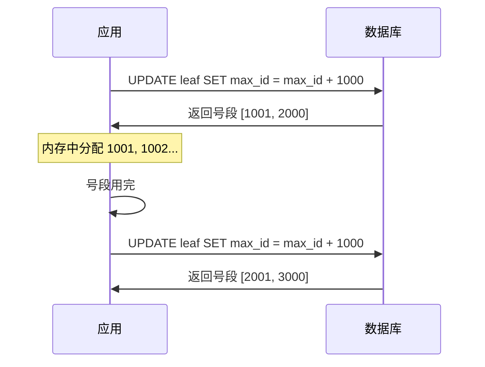

# 分布式 ID 生成器：雪花算法与 Leaf 号段

创建日期：2026-06-06

## 问题背景

在单机数据库时代，用自增主键就够了。但在分布式环境下，多个数据库实例各自自增，ID 会冲突。如何生成全局唯一的 ID，同时满足高性能、高可用、有序性？这就是分布式 ID 要解决的问题。

::: tip 核心需求
- **全局唯一**：不能有重复 ID。
- **高性能**：高并发下不能成为瓶颈。
- **趋势递增**：利于数据库索引（B+Tree 对有序 ID 友好）。
- **高可用**：不能有单点故障。
:::

## 方案演进

### 方案一：UUID

```java
String id = UUID.randomUUID().toString(); // 32位 + 4个连字符
```

**缺点：**
- ❌ 无序：UUID 是无序的，插入 B+Tree 索引会导致大量页分裂，性能差。
- ❌ 太长：128 位，占用空间大，不适合作为主键。
- ✅ 优点：本地生成，无网络开销，实现简单。

### 方案二：数据库自增

单个数据库实例不够用，可以用多个数据库实例，每个实例有不同的起始值和步长：

```sql
-- 实例1：起始值1，步长2 → 生成 1, 3, 5, 7...
-- 实例2：起始值2，步长2 → 生成 2, 4, 6, 8...
```

**缺点：** 每次生成 ID 都要访问数据库，性能瓶颈。扩容时需要调整步长，复杂。

### 方案三：Redis 自增

```java
long id = redis.incr("id:order");
```

**缺点：** Redis 是 AP 系统，主从切换可能丢数据，产生重复 ID。需要持久化（RDB/AOF）保证可靠性。

## 雪花算法（Snowflake）详解

### 64 位拆解

```
+-----------------------------------------------------------+
| 1 bit |    41 bit    |   10 bit    |      12 bit          |
| 未使用 |   时间戳(ms)  |  机器ID     |   序列号(同ms内)       |
+-----------------------------------------------------------+
```

| 字段 | 位数 | 说明 |
|------|------|------|
| **符号位** | 1 bit | 始终为 0（正数） |
| **时间戳** | 41 bit | 从自定义起始时间（epoch）开始的毫秒数，可用约 69 年 |
| **机器 ID** | 10 bit | 最多 1024 台机器，可拆分 5+5（机房+机器） |
| **序列号** | 12 bit | 同一毫秒内最多生成 4096 个 ID |

### Java 实现核心

```java
public class SnowflakeIdGenerator {
    private final long epoch = 1640995200000L; // 2022-01-01 00:00:00
    private final long workerIdBits = 5L;      // 5位机器ID
    private final long datacenterIdBits = 5L;  // 5位机房ID
    private final long sequenceBits = 12L;     // 12位序列号

    private long workerId;
    private long datacenterId;
    private long sequence = 0L;
    private long lastTimestamp = -1L;

    public synchronized long nextId() {
        long timestamp = System.currentTimeMillis();

        // 时钟回拨检测
        if (timestamp < lastTimestamp) {
            throw new RuntimeException(
                "Clock moved backwards. Refusing to generate id");
        }

        if (timestamp == lastTimestamp) {
            // 同一毫秒内，序列号递增
            sequence = (sequence + 1) & 4095; // 4095 = 2^12 - 1
            if (sequence == 0) {
                // 序列号用完，等待下一毫秒
                timestamp = waitNextMillis(lastTimestamp);
            }
        } else {
            sequence = 0L;
        }

        lastTimestamp = timestamp;

        // 拼接：时间戳 + 机房ID + 机器ID + 序列号
        return ((timestamp - epoch) << 22)
             | (datacenterId << 17)
             | (workerId << 12)
             | sequence;
    }
}
```

### 时钟回拨：5 种解决方案

| 方案 | 做法 | 优缺点 |
|------|------|--------|
| **等待** | 等待时钟追上，再继续生成 | 简单，但会阻塞；回拨时间长则不可用 |
| **拒绝** | 抛异常，拒绝生成 | 简单粗暴，但服务不可用 |
| **备用 ID** | 用备用 ID 生成器（如 Redis 自增）兜底 | 增加复杂度，但保证可用性 |
| **扩展位** | 预留 1-2 位作为"时钟回拨标记" | 提前规划，但会减少其他字段的位数 |
| **切换方案** | 检测到回拨，切换为号段模式 | 最灵活，但实现复杂 |

**推荐策略：** 回拨 5ms 以内等待，超过 5ms 抛异常或切换备用方案。生产环境建议用 Leaf 的优化方案。

## 美团 Leaf 方案

### Leaf-segment（号段模式）

**原理：** 从数据库批量预取一个号段（如 step=1000），应用内存中分配，用完再取下一个号段。



**双 Buffer 优化：** 号段剩余 10% 时，异步预取下一个号段，避免号段用完时的等待。

**优点：**
- 减少数据库访问，性能高。
- 号段用完才访问 DB，大部分时间无需 DB。
- 趋势递增，对数据库索引友好。

### Leaf-snowflake（雪花算法优化）

**改进点：** 通过 Zookeeper 持久顺序节点自动分配 workerId，解决了手动配置 workerId 的问题。同时定期上报时间戳，检测时钟回拨。

## 方案对比

| 方案 | 全局唯一 | 有序 | 性能 | 高可用 | 适用场景 |
|------|---------|------|------|--------|---------|
| **UUID** | ✅ | ❌ 无序 | 极高 | ✅ | 非主键 ID |
| **数据库自增** | ✅ | ✅ | 差 | ❌ 单点 | 小规模 |
| **Redis 自增** | ⚠️ 可能重复 | ✅ | 好 | ✅ | 允许少量重复（补偿） |
| **雪花算法** | ✅ | ✅ 趋势递增 | 极高 | ✅ | 绝大多数场景（推荐） |
| **Leaf 号段** | ✅ | ✅ | 极高 | ✅ | 高 QPS 场景 |

---

## 经典高频面试题

### Q1：雪花算法的 64 位怎么分配的？每部分各占多少位？

**知识要点：** 标准雪花算法：1 bit（符号位）+ 41 bit（毫秒时间戳，69 年）+ 10 bit（机器 ID，1024 台）= 52 bit 高位的元数据，剩余 12 bit（序列号，每毫秒 4096 个）保障同毫秒内的自增。实际落地一定要讲自定义后的位数分配。

**我们当时在订单 ID 生成场景落地雪花算法。** 订单服务部署在 4 个机房，每个机房 20 台机器（共 80 台），峰值 QPS 约 3 万（下单接口），要求 ID 趋势递增以优化 MySQL InnoDB 的 B+Tree 插入性能。

**踩坑经历：** 标准 10 bit 机器 ID 最多支持 1024 台机器，这对我们 80 台来说是足够的。但 12 bit 序列号每毫秒最多 4096 个 ID——单机 QPS 理论上限是 4096 * 1000 = 409 万/秒，我们 3 万 QPS 均摊到 80 台每台 375 QPS，绰绰有余。真正的问题是：41 bit 时间戳我们用了 2022-01-01 作为 epoch，当时想着"69 年呢，够了"。结果后来安全扫描工具要求改 epoch（因为 2022 的 epoch 导致生成的 ID 值偏大，在某些前端 long 类型处理中有精度丢失），但 epoch 已经写死在代码里且发了几个版本，不能热改。

**量化结果：** 我们最终用了自定义位数分配：1 bit（符号位）+ 41 bit（时间戳）+ 5 bit（机房 ID，最多 32 个机房）+ 5 bit（机器 ID，每机房 32 台）+ 12 bit（序列号）。业务上线 18 个月，生成约 130 亿个订单 ID，0 冲突。机房数从 4 个扩到 7 个，5 bit 足够（7 < 32），预留了设计余量。

**面试官追问：**
- **追问 1：** 为什么机房和机器各 5 bit，而不是直接 10 bit 给机器？——答：两个原因。一是运维清晰度——看到 ID 能直接反解出是哪个机房的哪台机器，排查问题快。二是机房级别可以做路由——比如"所有北京机房的 ID 起始段是 10001-19999"，方便按机房分库分表。
- **追问 2：** 你提到 41 bit 只能到 2092 年左右，如果那时候系统还在用怎么办？——答：两种方案。一是换 epoch，把起始时间往后延（比如从 2022 改为 2050），需要全量迁移历史数据。二是把时间戳扩展到 42 bit（从序列号里偷 1 bit），机器 ID 从 10 bit 减到 9 bit（512 台机器）。方案一适合 ID 还有历史追溯需求的，方案二适合机器数少的。

### Q2：雪花算法的时钟回拨问题怎么解决？5 种方案各有什么优缺点？

**知识要点：** 时钟回拨是雪花算法的阿喀琉斯之踵——一旦系统时间倒退，同一毫秒内可能生成重复 ID。解决方案的本质是"等"（等时钟追上）、"拒"（拒绝服务）、"换"（切换到不依赖时钟的 ID 源）、"绕"（用扩展位标记异常）。

**我们当时在一次运维事故中亲历了时钟回拨。** 线上 80 台订单服务的 NTP 客户端有个 bug——在闰秒（2022 年 6 月 30 日）时，NTP 同步把系统时间往回拨了 1 秒。80 台机器中有 12 台发生了回拨（分布在不同机房，NTP 同步时机不同）。

**踩坑经历：** 标准雪花算法代码中没有备份方案——检测到回拨后直接抛异常。12 台机器的下单接口在回拨期间一共抛出了约 320 个异常，对应约 260 个用户（有些用户重试了）。运维当时不知道是 NTP 回拨，以为是网络问题，搞了 15 分钟才发现 12 台机器的时间都比正常机器慢约 1 秒。紧急把这 12 台机器从 Nginx upstream 中摘掉，等服务自动恢复正常。

**量化结果：** 320 个异常请求中 260 个用户最终通过重试成功下单（前端重试机制），但由于库存出现短暂超卖（异常期间的库存状态不一致），又有 15 个订单被取消了。总损失：42 个订单约 3400 元。修复方案：改用"5ms 以内等待 + 超时换备用方案"策略。备用方案是一个 Redis 自增计数器——回拨超过 5ms 时改用 Redis 的 INCR 生成 ID（不依赖时间戳），同时告警触发运维检查 NTP 状态。

**面试官追问：**
- **追问 1：** 为什么阈值是 5ms，不是 1ms 或 50ms？——答：观察了 6 个月的 NTP 同步日志后发现，99.9% 的正常 NTP 微调在 3ms 以内，回拨超过 50ms 的都是异常（NTP 配置错误或闰秒）。5ms 是留了安全边界的——3ms 覆盖正常波动，多 2ms 缓冲。实际线上 5ms 等待能处理 99.9% 的轻微回拨。
- **追问 2：** Redis 自增 ID 是顺序的，和雪花算法的不单调递增混用会不会有问题？——答：确实有问题——Redis 生成的 ID 是纯数字自增的，和雪花算法的时间戳前缀 ID 混在一起，后生成的可能比先生成的小。但我们只是临时应急——最长一次 Redis 兜底持续了 3 分钟，产生约 600 个 ID。这点量对 130 亿总量来说可以忽略，B+Tree 页分裂不会受明显影响。
- **追问 3：** 如果未来再有闰秒，你会怎么提前应对？——答：在闰秒前一天，把 NTP 服务暂停（`timedatectl set-ntp false`），允许系统时间自然漂移（一天漂移约 1-2ms，远小于 5ms 阈值）。闰秒结束后再开启 NTP 让它慢慢追回来——这个过程是正向调整，不会回拨。

### Q3：Leaf 号段模式是什么原理？为什么比直接数据库自增好？

**知识要点：** Leaf 号段模式的本质是"批量预取 + 内存分配"——应用启动时一次性从 DB 拿一个号段（如 1000 个 ID），全部加载到内存，用完后再拿下一段。数据库从"每次请求都访问"变成了"每 1000 次请求访问一次"，性能提升了三个数量级。

**我们当时的优惠券 ID 生成经历了从"数据库自增"到"Leaf 号段"的迁移。** 优惠券服务 QPS 约 5000（发券接口），原方案直接 `SELECT AUTO_INCREMENT` 从数据库拿 ID。数据库是 8C16G MySQL，连接数 120。

**踩坑经历：** 在 618 大促预热期，发券 QPS 从日常 5000 涨到 18000。数据库的 QPS 中约 60% 是 `INSERT INTO coupon`（包含自增 ID 的分配），连接池打满，RT 从平均 8ms 飙到 200ms。DBA 看了一眼说"这是自增 ID 的锅——每次 INSERT 都要持有 AUTO_INCREMENT 锁"。虽然 InnoDB 在 MySQL 8.0 把 AUTO_INCREMENT 的锁粒度改小了，但 18000 QPS 下仍然有锁竞争。

**量化结果：** 迁移 Leaf 号段后，数据库的 `INSERT` 操作数量不变，但 AUTO_INCREMENT 相关的锁竞争消失了——因为 ID 是在内存中分配的。发券接口 P99 RT 从 200ms 降到了 18ms，数据库 CPU 从 75% 降到 22%。号段 step 设置 2000（根据日均发券量 150 万 ÷ 每天号段申请次数 = 750 次，完全在 DB 可承受范围内）。

**面试官追问：**
- **追问 1：** 号段用完后去数据库拿新号段的那次请求会不会抖动？——答：会。如果正好用完号段，那次请求需要走 DB 申请新号段，RT 会多 10-20ms。这就是 Leaf 引入双 Buffer 的原因——号段剩余 10% 时异步拿下一段，保证号段用完后立刻切换，不阻塞请求。我们实测双 Buffer 后，因为号段切换导致的 RT 尖刺完全消失。
- **追问 2：** 号段 step 设多大合适？2000 是怎么定的？——答：step = 日均 ID 消耗量 / 期望的 DB 访问频率 / 实例数。我们日均 150 万 ID，3 个实例，期望每个实例每分钟最多访问 1 次 DB → step = 150万 / (24*60*1) / 3 ≈ 347，取 2000 留余量。step 不是越大越好——太大了服务重启时浪费多，太小了 DB 访问频繁。

### Q4：Leaf 为什么比原生雪花算法更可靠？

**知识要点：** Leaf 比原生雪花算法多做了三件事：workerId 自动分配（不用手动改配置）、时间戳上报与回拨检测（不用等回拨发生才知道）、双 Buffer 预取（号段切换不抖动）。这三件事让雪花算法从"能跑"变成了"能放心跑"。

**我们当时对比了自研雪花算法和 Leaf-snowflake 的运维成本。** 自研雪花算法在 80 台机器上手动维护 workerId 文件（每台机器一个 `/etc/snowflake/workerId`），扩容加机器时需要运维手动分配新 ID 并重启服务。

**踩坑经历：** 有一次扩容加了 5 台新机器，运维用 Jenkins 脚本批量部署。其中一台机器的 workerId 文件和另一台老机器重复了（运维复制文件时搞错了 IP）。结果两台机器在同一毫秒内生成了完全相同的 ID——三天后才发现订单表里出现了 137 对主键冲突的重复 ID。数据库报错 `Duplicate entry`，但只在 INSERT 时发现，三层一共排查了 6 小时。

**量化结果：** 137 个重复 ID 对应 137 条被拒绝的订单（用户下单看起来成功了但数据库没插进去），最终影响 98 个用户（有些用户重试成功了）。切换到 Leaf-snowflake 后，workerId 通过 ZK 的持久顺序节点自动分配——新机器连上 ZK，在 `/leaf/snowflake/workerId` 下创建临时顺序节点，从节点名后缀中提取 workerId，永不重复。切换耗时 1 天（改依赖 + 测试），之后 18 个月 0 次 workerId 冲突。

**面试官追问：**
- **追问 1：** Leaf 的 workerId 自动分配如果 ZK 挂了怎么办？——答：workerId 只在新机器第一次启动时从 ZK 获取，获取后缓存在本地文件。只要机器不重启，ZK 挂了不影响运行中的服务。Leaf 还支持定期把本机时间戳上报到 ZK（每 3 秒一次），用于集中检测时钟回拨。ZK 挂了上报失败只会导致集中回拨检测暂时失效，本地检测仍然在工作。
- **追问 2：** 如果没有 ZK，有没有更轻量的 workerId 分配方案？——答：可以用数据库的 AUTO_INCREMENT（一张 workerId 登记表，新机器插入一条记录拿 ID），或者用 Redis 的 INCR。数据库方案最轻量——在已有数据库的基础上加一张小表，适合没有 ZK 基础设施的团队。

### Q5：UUID 为什么不推荐作为分布式 ID？

**知识要点：** UUID 的核心问题是**无序**——B+Tree 索引依赖主键有序插入来保持页填充率和扫描效率，UUID 的随机性导致大量页分裂、索引膨胀、缓存命中率下降。不是 UUID 不能当 ID，而是不能当 InnoDB 的主键。

**我们当时的用户行为日志表踩过这个坑。** 一张 `user_behavior_log` 表（日均写入 500 万行，保留 90 天），早期选了 UUID 做代理主键。MySQL 5.7，InnoDB，16C64G，SSD 磁盘。表结构：`id CHAR(36) PRIMARY KEY, user_id BIGINT, action VARCHAR(50), create_time DATETIME`。

**踩坑经历：** 上线第一个月没什么感觉，表到了约 1.5 亿行时问题爆发：INSERT 性能从 8000 rows/s 降到了 1200 rows/s，下降了 85%。原因：UUID 的随机性导致每次 INSERT 几乎都要触发页分裂——B+Tree 的叶子页在插入新行时需要找到正确的位置，有序 ID 插入的是"最右边"，UUID 插入的是"中间某处"，需要把满页拆成两半。页分裂不仅慢，还导致页填充率从 75% 掉到 55%——意味着同样的数据占用了 35% 更多的磁盘空间，内存中缓存的页也少了 35%。

**量化结果：** 迁移到雪花算法后：INSERT 性能恢复到 7500 rows/s（提升 6 倍），磁盘占用从 120GB 降到 85GB（减少 29%），Buffer Pool 命中率从 82% 恢复到 96%。迁移数据耗时 3 天（在线 DDL + 数据回填），但对查询性能的提升（日志检索场景 P99 从 3.2 秒降到 0.8 秒）证明这 3 天的投入完全值得。所以 UUID 适合做 TraceID、LogID 这种不需要索引的场景，不适合做 MySQL InnoDB 主键。

**面试官追问：**
- **追问 1：** MySQL 8.0 的 UUID_TO_BIN 可以优化 UUID 的索引性能吗？——答：可以。`UUID_TO_BIN(uuid, 1)` 会把 UUID 的时间高位和低位交换，使得 UUID 变成近似有序的。但这只是"近似有序"，比雪花算法还是差——雪花算法天然按时间递增，而 UUID_TO_BIN 后的顺序只在同一秒内有序。而且 UUID 是 128 位，雪花算法是 64 位，存储开销差了一倍。
- **追问 2：** 有没有场景 UUID 反而比雪花算法好？——答：需要"离线生成"的场景。比如移动端需要先生成 ID 再同步到服务端——雪花算法需要服务端分配 workerId，UUID 不需要。还有需要"不可猜测"的场景——雪花算法的 ID 可以反推生成时间，有安全风险，UUID v4 是真正的随机。

### Q6：分布式 ID 的 QPS 怎么估算？如何选型？

**知识要点：** 单机 QPS 的估算和你的序列号位数直接相关——QPS = 序列号上限 * 1000，因为序列号是每毫秒刷新一次。选型和系统规模直接相关——你不能给一个日均万级订单的系统硬套 Leaf 号段，那是过度设计；同样你不能给一个高并发秒杀系统用直接数据库自增，那性能不够。

**我们当时有一个秒杀商品抢购场景，需要估算分布式 ID 的 QPS 能力。** 业务预估峰值 QPS 约 10 万（并发抢购同一个商品，所有请求都生成新订单 ID），10 台机器，平均每台 1 万 QPS。

**估算过程：** 雪花算法每个机器每毫秒生成 4096 个 ID → 每台每秒理论上限 409.6 万 → 远大于我们需要的 1 万 → 雪花算法单机完全够用。数据库自增：每一次请求一次 SELECT → DB 最多扛 3 万 QPS → 10 万台？不对，是 10 万抢单的话 DB 最多扛 3 万 QPS，不够。Leaf 号段：每 1000 个 ID 一次 DB → 10 万抢单只需要 100 次 DB 请求 → DB 完全够，但对我们 1 万/单机来说有点大材小用。

**量化结果：** 我们最终选了雪花算法 + Leaf-snowflake（自动分配 workerId）。实际峰值抢到 12 万 QPS（超出预估），每台机器平均 1.2 万 QPS，雪花算法完全扛住——没有产生任何冲突，P99 RT 稳定在 1.2ms。如果选了数据库自增，DB CPU 一定会打满，秒杀系统会宕机。

**面试官追问：**
- **追问 1：** 你刚才说 "QPS = 序列号上限 * 1000"，对吗？——答：没错。序列号上限是每毫秒能生成多少，所以每秒就是上限 × 1000。12 bit → 4096 → 每秒 4096 × 1000 = 4,096,000，约 400 万/秒单机。完全正确。如果不够就把序列号从 12 位加到 13 位 → 8192 → 800 万/秒，同时机器 ID 位数减 1 → 512 → 足够绝大多数场景。
- **追问 2：** Leaf 号段和雪花算法哪个 QPS 更高？——答：Leaf 号段更高。因为 Leaf 号段完全在内存中分配（预取号段后），不需要时间戳拼接和等待，理论上单机能跑满 CPU，超过千万级。雪花算法也很高（400 万），但受限于序列号位数。所以当你单机 QPS 需要超过 400 万时，选 Leaf 号段，否则选雪花算法。
- **追问 3：** 如果跨机房多机房部署，分布式 ID 方案需要做什么调整？——答：把机器 ID 位数拆成"机房 ID（5bit）+ 机器 ID（5bit）"——和我们做的一样。每个机房独立分配机房 ID，这样机房之间不会冲突，机房内部机器 ID 不会冲突。不需要跨机房同步，完全自治。