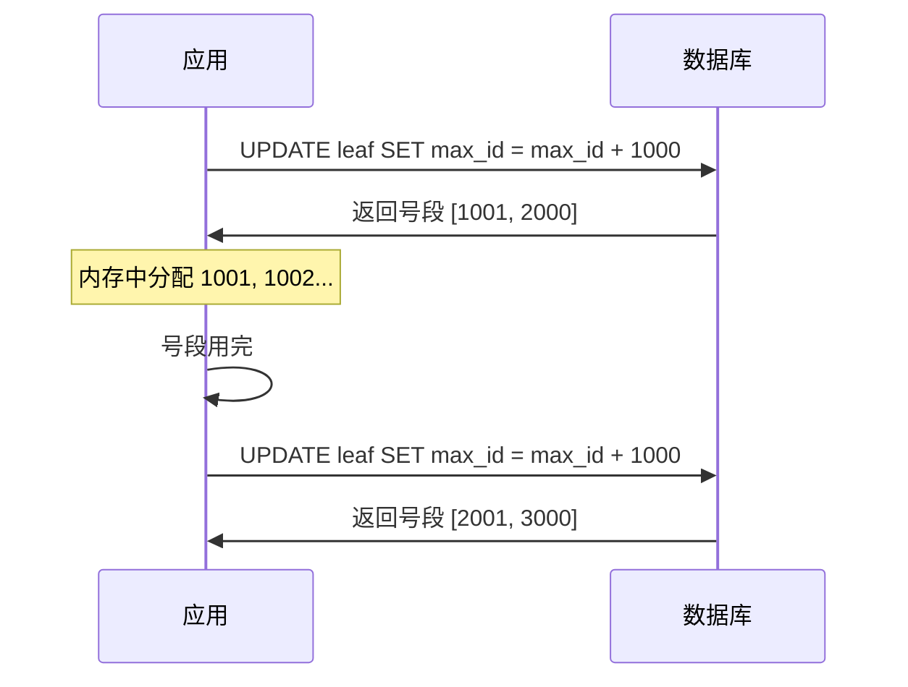

# 分布式 ID 生成器：雪花算法与 Leaf 号段

创建日期：2026-06-06

## 问题背景

在单机数据库时代，用自增主键就够了。但在分布式环境下，多个数据库实例各自自增，ID 会冲突。如何生成全局唯一的 ID，同时满足高性能、高可用、有序性？这就是分布式 ID 要解决的问题。

::: tip 核心需求
- **全局唯一**：不能有重复 ID。
- **高性能**：高并发下不能成为瓶颈。
- **趋势递增**：利于数据库索引（B+Tree 对有序 ID 友好）。
- **高可用**：不能有单点故障。
:::

## 方案演进

### 方案一：UUID

```java
String id = UUID.randomUUID().toString(); // 32位 + 4个连字符
```

**缺点：**
- ❌ 无序：UUID 是无序的，插入 B+Tree 索引会导致大量页分裂，性能差。
- ❌ 太长：128 位，占用空间大，不适合作为主键。
- ✅ 优点：本地生成，无网络开销，实现简单。

### 方案二：数据库自增

单个数据库实例不够用，可以用多个数据库实例，每个实例有不同的起始值和步长：

```sql
-- 实例1：起始值1，步长2 → 生成 1, 3, 5, 7...
-- 实例2：起始值2，步长2 → 生成 2, 4, 6, 8...
```

**缺点：** 每次生成 ID 都要访问数据库，性能瓶颈。扩容时需要调整步长，复杂。

### 方案三：Redis 自增

```java
long id = redis.incr("id:order");
```

**缺点：** Redis 是 AP 系统，主从切换可能丢数据，产生重复 ID。需要持久化（RDB/AOF）保证可靠性。

## 雪花算法（Snowflake）详解

### 64 位拆解

```
+-----------------------------------------------------------+
| 1 bit |    41 bit    |   10 bit    |      12 bit          |
| 未使用 |   时间戳(ms)  |  机器ID     |   序列号(同ms内)       |
+-----------------------------------------------------------+
```

| 字段 | 位数 | 说明 |
|------|------|------|
| **符号位** | 1 bit | 始终为 0（正数） |
| **时间戳** | 41 bit | 从自定义起始时间（epoch）开始的毫秒数，可用约 69 年 |
| **机器 ID** | 10 bit | 最多 1024 台机器，可拆分 5+5（机房+机器） |
| **序列号** | 12 bit | 同一毫秒内最多生成 4096 个 ID |

### Java 实现核心

```java
public class SnowflakeIdGenerator {
    private final long epoch = 1640995200000L; // 2022-01-01 00:00:00
    private final long workerIdBits = 5L;      // 5位机器ID
    private final long datacenterIdBits = 5L;  // 5位机房ID
    private final long sequenceBits = 12L;     // 12位序列号

    private long workerId;
    private long datacenterId;
    private long sequence = 0L;
    private long lastTimestamp = -1L;

    public synchronized long nextId() {
        long timestamp = System.currentTimeMillis();

        // 时钟回拨检测
        if (timestamp < lastTimestamp) {
            throw new RuntimeException(
                "Clock moved backwards. Refusing to generate id");
        }

        if (timestamp == lastTimestamp) {
            // 同一毫秒内，序列号递增
            sequence = (sequence + 1) & 4095; // 4095 = 2^12 - 1
            if (sequence == 0) {
                // 序列号用完，等待下一毫秒
                timestamp = waitNextMillis(lastTimestamp);
            }
        } else {
            sequence = 0L;
        }

        lastTimestamp = timestamp;

        // 拼接：时间戳 + 机房ID + 机器ID + 序列号
        return ((timestamp - epoch) << 22)
             | (datacenterId << 17)
             | (workerId << 12)
             | sequence;
    }
}
```

### 时钟回拨：5 种解决方案

| 方案 | 做法 | 优缺点 |
|------|------|--------|
| **等待** | 等待时钟追上，再继续生成 | 简单，但会阻塞；回拨时间长则不可用 |
| **拒绝** | 抛异常，拒绝生成 | 简单粗暴，但服务不可用 |
| **备用 ID** | 用备用 ID 生成器（如 Redis 自增）兜底 | 增加复杂度，但保证可用性 |
| **扩展位** | 预留 1-2 位作为"时钟回拨标记" | 提前规划，但会减少其他字段的位数 |
| **切换方案** | 检测到回拨，切换为号段模式 | 最灵活，但实现复杂 |

**推荐策略：** 回拨 5ms 以内等待，超过 5ms 抛异常或切换备用方案。生产环境建议用 Leaf 的优化方案。

## 美团 Leaf 方案

### Leaf-segment（号段模式）

**原理：** 从数据库批量预取一个号段（如 step=1000），应用内存中分配，用完再取下一个号段。



**双 Buffer 优化：** 号段剩余 10% 时，异步预取下一个号段，避免号段用完时的等待。

**优点：**
- 减少数据库访问，性能高。
- 号段用完才访问 DB，大部分时间无需 DB。
- 趋势递增，对数据库索引友好。

### Leaf-snowflake（雪花算法优化）

**改进点：** 通过 Zookeeper 持久顺序节点自动分配 workerId，解决了手动配置 workerId 的问题。同时定期上报时间戳，检测时钟回拨。

## 方案对比

| 方案 | 全局唯一 | 有序 | 性能 | 高可用 | 适用场景 |
|------|---------|------|------|--------|---------|
| **UUID** | ✅ | ❌ 无序 | 极高 | ✅ | 非主键 ID |
| **数据库自增** | ✅ | ✅ | 差 | ❌ 单点 | 小规模 |
| **Redis 自增** | ⚠️ 可能重复 | ✅ | 好 | ✅ | 允许少量重复（补偿） |
| **雪花算法** | ✅ | ✅ 趋势递增 | 极高 | ✅ | 绝大多数场景（推荐） |
| **Leaf 号段** | ✅ | ✅ | 极高 | ✅ | 高 QPS 场景 |

---

## 经典高频面试题

### Q1：雪花算法的 64 位怎么分配的？每部分各占多少位？

**参考答案：**

```
1 bit（未使用）+ 41 bit（时间戳）+ 10 bit（机器ID）+ 12 bit（序列号）
```
- 41 位时间戳：从 epoch 开始，可用约 69 年。
- 10 位机器 ID：最多 1024 台机器，可拆分 5+5（机房+机器）。
- 12 位序列号：同一毫秒内最多 4096 个 ID。

### Q2：雪花算法的时钟回拨问题怎么解决？5 种方案各有什么优缺点？

**参考答案：**

1. **等待**：等时钟追上，简单但可能长时间阻塞。
2. **拒绝**：抛异常，简单粗暴但服务不可用。
3. **备用 ID**：用 Redis 兜底，复杂但保证可用性。
4. **扩展位**：预留回拨标记位，但减少其他字段位数。
5. **切换方案**：回拨时切号段模式，最灵活但实现复杂。

推荐：回拨 5ms 以内等待，超过 5ms 抛异常或切换备用方案。

### Q3：Leaf 号段模式是什么原理？为什么比直接数据库自增好？

**参考答案：**

Leaf 号段模式从数据库批量预取一个号段（如 1000 个 ID），应用在内存中分配，用完再取下一个号段。比直接数据库自增好因为：
- 减少数据库访问，1000 个 ID 才访问一次 DB。
- 号段用完才访 DB，大部分时间无 DB 依赖。
- 双 Buffer 预取，号段剩余 10% 时异步取下一个，不阻塞。

### Q4：Leaf 为什么比原生雪花算法更可靠？

**参考答案：**

- workerId 自动分配：通过 ZK 持久顺序节点自动分配，不需要手动配置。
- 时间戳上报：定期上报时间戳到 ZK，检测时钟回拨。
- 双 Buffer 优化：号段模式双 Buffer 预取，排队不阻塞。

### Q5：UUID 为什么不推荐作为分布式 ID？

**参考答案：**

- **无序**：UUID 是无序的，插入 B+Tree 索引会导致大量页分裂，性能极差。
- **太长**：128 位（36 字符），占用空间大，索引效率低。
- 唯一好处：本地生成，无网络开销。适合非主键场景（如日志追踪 ID），不适合做数据库主键。

### Q6：分布式 ID 的 QPS 怎么估算？如何选型？

**参考答案：**

- 雪花算法：单机 QPS 可达 400 万/秒（12 位序列号，每毫秒 4096 个）。
- Leaf 号段：QPS 受限于号段 step 和分配速度，通常也能达百万级。

选型：
- 一般业务 → 雪花算法，简单够用。
- 高 QPS（百万级）→ Leaf 号段，双 Buffer 预取。
- 不需要有序 → UUID，最简单。