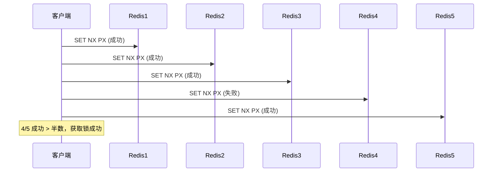
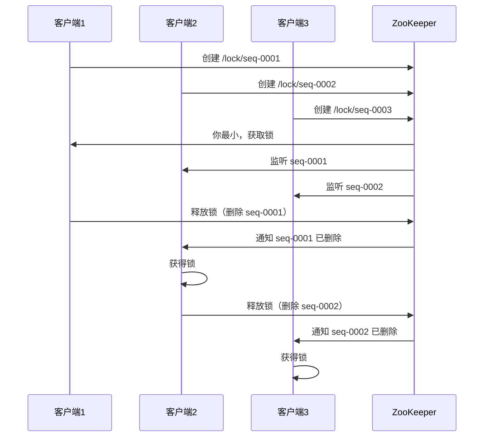

# 分布式锁：Redis / Zookeeper / Etcd 对比

创建日期：2026-06-06

## 问题背景

单机环境下，用 `synchronized` 或 `ReentrantLock` 就能保证线程安全。但在分布式环境下，多个进程/服务竞争共享资源（如库存扣减、订单号生成），需要分布式锁来保证互斥访问。

::: tip 核心需求
- **互斥性**：同一时刻只有一个客户端持有锁。
- **防死锁**：锁持有者崩溃后，锁能被自动释放。
- **可重入**：同一客户端可重复获取锁。
- **高可用**：锁服务本身不能成为单点故障。
:::

## Redis 实现分布式锁

### 演进一：SETNX（不推荐）

```java
// ❌ 错误做法：SETNX + EXPIRE 不是原子的
boolean locked = redis.setnx(key, "1");
if (locked) {
    redis.expire(key, 30); // 如果这步失败，锁永远不会释放！
}
```

**问题：** SETNX 和 EXPIRE 是两条命令，不是原子的。如果 SETNX 后进程崩溃，EXPIRE 没执行，锁永远不释放（死锁）。

### 演进二：SET NX PX（原子）

```java
// ✅ 正确做法：SET NX PX 是原子操作
String result = redis.set(key, requestId, "NX", "PX", 30000);
boolean locked = "OK".equals(result);
```

**NX**：Not eXists，只有 key 不存在时才设置。**PX**：过期时间（毫秒），防止死锁。

### 演进三：Lua 解锁（原子判断+删除）

```lua
-- 必须判断锁的持有者，防止误删别人的锁
if redis.call('get', KEYS[1]) == ARGV[1] then
    return redis.call('del', KEYS[1])
else
    return 0
end
```

**为什么需要判断？** 如果锁过期了，其他客户端获取了锁，此时你删锁会删掉别人的锁。必须先判断 `requestId` 是否匹配。

### 锁续期（看门狗 WatchDog）

**问题：** 业务执行时间超过锁的过期时间，锁自动释放，其他客户端获取锁，导致并发问题。

**Redisson 看门狗机制：**
- 默认锁过期时间 30 秒。
- 每 10 秒（1/3 过期时间）自动续期，将过期时间重置为 30 秒。
- 业务执行完，主动释放锁，停止续期。

```java
// Redisson 分布式锁示例
RLock lock = redisson.getLock("lock:stock:1001");
try {
    lock.lock(); // 默认30秒过期，看门狗自动续期
    // 执行业务逻辑
} finally {
    lock.unlock();
}
```

### RedLock 算法

**原理：** 在 N 个独立的 Redis 节点上（奇数个，如 5 个），依次尝试获取锁。当超过半数（N/2+1）节点获取成功，且总耗时小于锁过期时间，则认为获取锁成功。



### RedLock 争议

Martin Kleppmann（《DDIA》作者）认为 RedLock 不安全：
1. **时钟跳跃**：Redis 节点时钟跳跃可能导致锁提前过期。
2. **GC 停顿**：客户端 GC 停顿超时，锁已过期但客户端不知道，仍认为持有锁。
3. **实际建议**：对一致性要求极高的场景（如金融），用 ZK 或 Etcd；一般场景用 Redis 单实例 + 看门狗足够。

## Zookeeper 实现分布式锁

### 原理

利用 ZK 的**临时顺序节点** + **Watcher 机制**。



### 核心机制

- **临时节点**：客户端断开连接，ZK 自动删除节点，锁自动释放，天然防死锁。
- **顺序节点**：按创建顺序排队，公平锁。
- **Watcher 监听**：监听前一个节点的删除事件，避免"惊群效应"（所有客户端都收到通知）。

### 优缺点

- ✅ CP 系统，强一致性，不会出现两个客户端同时持有锁。
- ✅ 临时节点，客户端崩溃自动释放锁。
- ❌ 性能不如 Redis（每次创建/删除节点）。
- ❌ ZK 集群维护成本高。

## Etcd 实现分布式锁

### 原理

利用 Etcd 的 **Lease（租约）** + **事务**机制。

```java
// 伪代码：Etcd 分布式锁
// 1. 创建 Lease（租约，类似过期时间）
Lease lease = etcd.grant(30); // 30秒

// 2. 事务：如果 key 不存在，创建并绑定 Lease
Txn txn = etcd.txn()
    .If(client.compare(Key, "=", 0)) // key 不存在
    .Then(client.put(Key, value, lease)) // 创建并绑定 Lease
    .Else(client.get(Key)); // 已存在，获取锁失败

// 3. 定期续约（类似 Redis 看门狗）
lease.keepAlive();
```

### 优缺点

- ✅ CP 系统，基于 Raft，强一致性。
- ✅ Lease 机制，自动过期，防死锁。
- ✅ 性能好于 ZK，略低于 Redis。
- ❌ 部署和维护成本高于 Redis。

## 三种方案对比

| 对比维度 | Redis | Zookeeper | Etcd |
|----------|-------|-----------|------|
| **CAP 类型** | AP | CP | CP |
| **一致性** | 最终一致 | 强一致 | 强一致 |
| **性能** | 极高（内存操作） | 中等 | 较高 |
| **防死锁** | 过期时间 + 看门狗 | 临时节点自动删除 | Lease 租约 |
| **公平锁** | 需自己实现 | 顺序节点天然支持 | 需自己实现 |
| **实现复杂度** | 中等 | 简单（Curator） | 中等 |
| **运维成本** | 低 | 高 | 中高 |
| **适用场景** | 高并发、允许最终一致 | 强一致要求高 | 强一致 + 需要更高性能 |

---

## 经典高频面试题

### Q1：SETNX 为什么不能用？SET NX PX 有什么优势？

**参考答案：**

SETNX 和 EXPIRE 是两条命令，不是原子的。SETNX 后进程崩溃，EXPIRE 没执行，锁永远不释放（死锁）。SET NX PX 是 Redis 2.6.12 引入的原子命令，设置值和过期时间一步完成，避免了死锁问题。

### Q2：释放锁时为什么必须用 Lua 脚本？不能直接 DEL 吗？

**参考答案：**

直接 DEL 会导致误删别人的锁。场景：A 获取锁，业务执行超时，锁自动过期；B 获取了锁；A 执行完直接 DEL，删掉了 B 的锁。Lua 脚本原子判断 `get(key) == requestId`，只有持有者才能删除。

### Q3：Redisson 的看门狗（WatchDog）机制是什么？

**参考答案：**

Redisson 的看门狗默认每 10 秒（1/3 过期时间）自动续期，将过期时间重置为 30 秒。业务执行完主动释放锁，停止续期。这样即使业务执行时间超过初始过期时间，锁也不会被自动释放，同时崩溃后锁也会过期，不会死锁。

### Q4：RedLock 算法的争议是什么？实际项目中怎么用？

**参考答案：**

Martin Kleppmann 认为 RedLock 不安全，因为：
1. Redis 节点时钟跳跃可能导致锁提前过期。
2. 客户端 GC 停顿，锁过期后客户端仍认为持有锁。

实际建议：对一致性要求极高的场景（金融），用 ZK 或 Etcd；一般场景用 Redis 单实例 + 看门狗足够。RedLock 增加了复杂度和延迟，但收益有限。

### Q5：Redisson 和手动封装 Redis 分布式锁有什么区别？

**参考答案：**

Redisson 提供了：
- 看门狗自动续期，不需要手动管理过期时间。
- 可重入锁（基于 Redis Hash 计数）。
- 公平锁（基于 Redis 队列）。
- 读写锁、联锁、红锁等高级特性。

手动封装通常只实现了基础的互斥和过期，缺少看门狗、可重入等高级特性，容易出问题。推荐直接使用 Redisson。

### Q6：Redis / ZooKeeper / Etcd 分布式锁怎么选型？

**参考答案：**

- **Redis**：高并发、允许最终一致的一般业务场景。性能最好，运维成本最低（推荐 Redisson）。
- **ZooKeeper**：强一致要求高（如金融核心系统）。临时顺序节点天然支持公平锁，但性能不如 Redis。
- **Etcd**：强一致 + 需要比 ZK 更高性能。基于 Raft，Lease 机制简洁优雅。

大多数场景用 Redis + Redisson 足够，强一致场景用 ZK 或 Etcd。