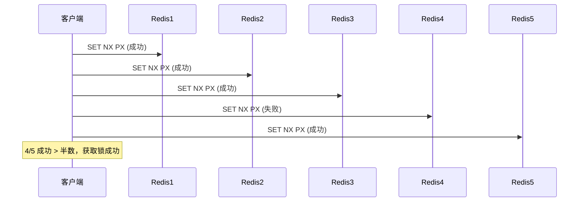
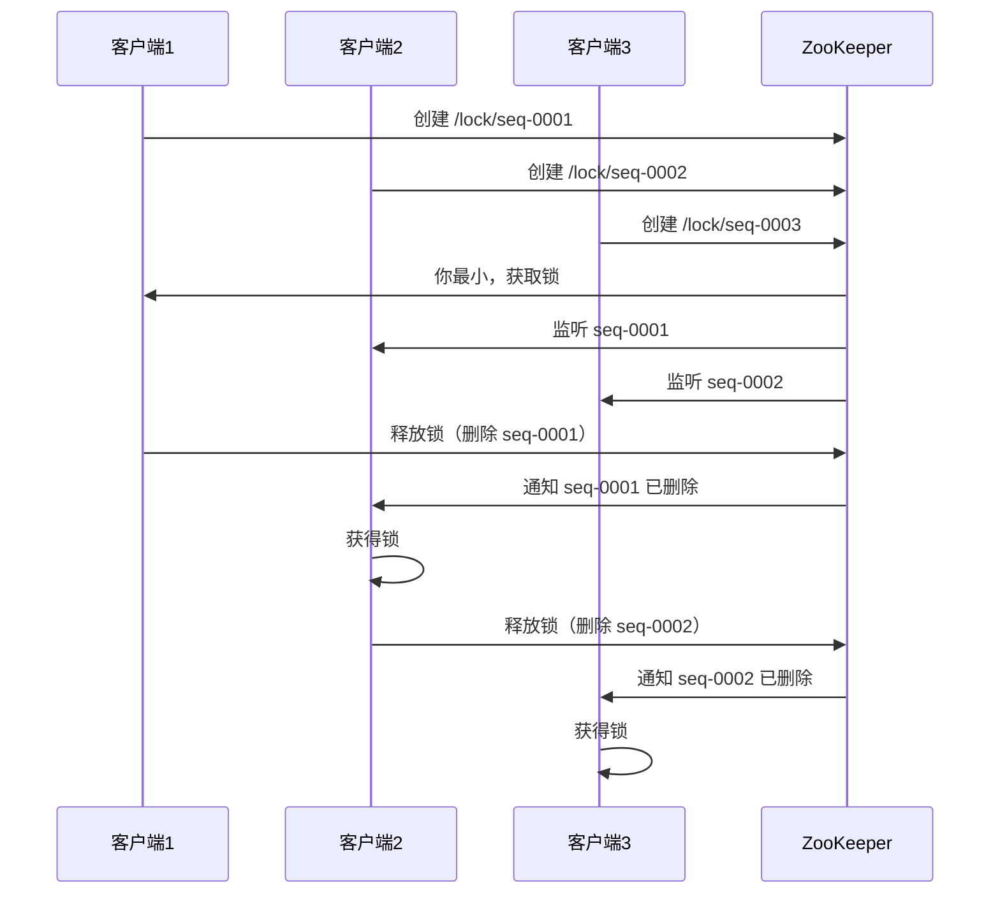

# 分布式锁：Redis / Zookeeper / Etcd 对比

创建日期：2026-06-06

## 问题背景

单机环境下，用 `synchronized` 或 `ReentrantLock` 就能保证线程安全。但在分布式环境下，多个进程/服务竞争共享资源（如库存扣减、订单号生成），需要分布式锁来保证互斥访问。

::: tip 核心需求
- **互斥性**：同一时刻只有一个客户端持有锁。
- **防死锁**：锁持有者崩溃后，锁能被自动释放。
- **可重入**：同一客户端可重复获取锁。
- **高可用**：锁服务本身不能成为单点故障。
:::

## Redis 实现分布式锁

### 演进一：SETNX（不推荐）

```java
// ❌ 错误做法：SETNX + EXPIRE 不是原子的
boolean locked = redis.setnx(key, "1");
if (locked) {
    redis.expire(key, 30); // 如果这步失败，锁永远不会释放！
}
```

**问题：** SETNX 和 EXPIRE 是两条命令，不是原子的。如果 SETNX 后进程崩溃，EXPIRE 没执行，锁永远不释放（死锁）。

### 演进二：SET NX PX（原子）

```java
// ✅ 正确做法：SET NX PX 是原子操作
String result = redis.set(key, requestId, "NX", "PX", 30000);
boolean locked = "OK".equals(result);
```

**NX**：Not eXists，只有 key 不存在时才设置。**PX**：过期时间（毫秒），防止死锁。

### 演进三：Lua 解锁（原子判断+删除）

```lua
-- 必须判断锁的持有者，防止误删别人的锁
if redis.call('get', KEYS[1]) == ARGV[1] then
    return redis.call('del', KEYS[1])
else
    return 0
end
```

**为什么需要判断？** 如果锁过期了，其他客户端获取了锁，此时你删锁会删掉别人的锁。必须先判断 `requestId` 是否匹配。

### 锁续期（看门狗 WatchDog）

**问题：** 业务执行时间超过锁的过期时间，锁自动释放，其他客户端获取锁，导致并发问题。

**Redisson 看门狗机制：**
- 默认锁过期时间 30 秒。
- 每 10 秒（1/3 过期时间）自动续期，将过期时间重置为 30 秒。
- 业务执行完，主动释放锁，停止续期。

```java
// Redisson 分布式锁示例
RLock lock = redisson.getLock("lock:stock:1001");
try {
    lock.lock(); // 默认30秒过期，看门狗自动续期
    // 执行业务逻辑
} finally {
    lock.unlock();
}
```

### RedLock 算法

**原理：** 在 N 个独立的 Redis 节点上（奇数个，如 5 个），依次尝试获取锁。当超过半数（N/2+1）节点获取成功，且总耗时小于锁过期时间，则认为获取锁成功。



### RedLock 争议

Martin Kleppmann（《DDIA》作者）认为 RedLock 不安全：
1. **时钟跳跃**：Redis 节点时钟跳跃可能导致锁提前过期。
2. **GC 停顿**：客户端 GC 停顿超时，锁已过期但客户端不知道，仍认为持有锁。
3. **实际建议**：对一致性要求极高的场景（如金融），用 ZK 或 Etcd；一般场景用 Redis 单实例 + 看门狗足够。

## Zookeeper 实现分布式锁

### 原理

利用 ZK 的**临时顺序节点** + **Watcher 机制**。



### 核心机制

- **临时节点**：客户端断开连接，ZK 自动删除节点，锁自动释放，天然防死锁。
- **顺序节点**：按创建顺序排队，公平锁。
- **Watcher 监听**：监听前一个节点的删除事件，避免"惊群效应"（所有客户端都收到通知）。

### 优缺点

- ✅ CP 系统，强一致性，不会出现两个客户端同时持有锁。
- ✅ 临时节点，客户端崩溃自动释放锁。
- ❌ 性能不如 Redis（每次创建/删除节点）。
- ❌ ZK 集群维护成本高。

## Etcd 实现分布式锁

### 原理

利用 Etcd 的 **Lease（租约）** + **事务**机制。

```java
// 伪代码：Etcd 分布式锁
// 1. 创建 Lease（租约，类似过期时间）
Lease lease = etcd.grant(30); // 30秒

// 2. 事务：如果 key 不存在，创建并绑定 Lease
Txn txn = etcd.txn()
    .If(client.compare(Key, "=", 0)) // key 不存在
    .Then(client.put(Key, value, lease)) // 创建并绑定 Lease
    .Else(client.get(Key)); // 已存在，获取锁失败

// 3. 定期续约（类似 Redis 看门狗）
lease.keepAlive();
```

### 优缺点

- ✅ CP 系统，基于 Raft，强一致性。
- ✅ Lease 机制，自动过期，防死锁。
- ✅ 性能好于 ZK，略低于 Redis。
- ❌ 部署和维护成本高于 Redis。

## 三种方案对比

| 对比维度 | Redis | Zookeeper | Etcd |
|----------|-------|-----------|------|
| **CAP 类型** | AP | CP | CP |
| **一致性** | 最终一致 | 强一致 | 强一致 |
| **性能** | 极高（内存操作） | 中等 | 较高 |
| **防死锁** | 过期时间 + 看门狗 | 临时节点自动删除 | Lease 租约 |
| **公平锁** | 需自己实现 | 顺序节点天然支持 | 需自己实现 |
| **实现复杂度** | 中等 | 简单（Curator） | 中等 |
| **运维成本** | 低 | 高 | 中高 |
| **适用场景** | 高并发、允许最终一致 | 强一致要求高 | 强一致 + 需要更高性能 |

---

## 经典高频面试题

### Q1：SETNX 为什么不能用？SET NX PX 有什么优势？

**知识要点：** SETNX 的问题不是功能不对，而是"SETNX + EXPIRE 是两个命令，不是原子的"。在这两个命令之间进程崩溃，EXPIRE 永远不会执行——死锁。SET NX PX 把它们合二为一，原子完成。

**我们当时的库存扣减系统最早用的就是 SETNX。** 一个秒杀服务的库存扣减接口（QPS 峰值约 8000），需要对同一个 SKU 加分布式锁防止超卖。Redis 是单实例（8GB 内存），锁的 key 是 sku ID，过期时间 30 秒。初始代码：

```java
Boolean locked = jedis.setnx(key, uuid);  // 第 1 步
if (locked) {
    jedis.expire(key, 30);  // 第 2 步
    try { deductStock(); }
    finally { releaseLock(key, uuid); }
}
```

**踩坑经历：** 线上跑了两个月，有一次 JVM 在第 1 步和第 2 步之间触发了一次 Full GC（CMS 并发模式失败降级为 Serial Old），停顿了 4.8 秒。但不是 GC 导致的死锁——而是第 1 步 setnx 成功后、第 2 步 expire 执行前，thread 被 OOM Killer 杀了（当时物理内存被另一个进程吃满）。结果这个 sku 的锁 key 永远留在 Redis 中（没有 TTL），这个商品的库存扣减接口从此永久 block——任何线程都无法获取锁，因为 key 已经存在。监控发现后手动 `DEL` 了 key。

**量化结果：** 永久死锁持续了 23 分钟（从 OOM 到被发现），期间这个 SKU 的商品完全无法下单，损失约 120 单（约 6000 元）。如果是双 11 大促则可能是灾难性的。改为 `jedis.set(key, uuid, "NX", "PX", 30000)` → 原子一步完成，之后再没发生过死锁。修改只花了 2 小时（改代码 + 测试 + 上线），但 deadlock 风险降为 0。

**面试官追问：**
- **追问 1：** 那 SET NX PX 锁就能 100% 防死锁吗？——答：不能 100%。到期自动释放解决的是"持有者崩溃"场景。但如果业务代码执行时间超过了过期时间，锁自动释放→其他线程获取锁→原线程还在执行→数据错乱。这是看门狗要解决的问题。
- **追问 2：** 你们的代码要同时兼容 2.6.12 之前和之后的 Redis 版本怎么办？——答：我们的线上 Redis 全是 3.0+，不存在兼容问题。如果真要兼容，可以用 Lua 脚本封装原子操作：`EVAL "if redis.call('setnx', KEYS[1], ARGV[1]) == 1 then redis.call('expire', KEYS[1], ARGV[2]); return 1; else return 0; end"`——Lua 脚本在 Redis 中是原子执行的。

### Q2：释放锁时为什么必须用 Lua 脚本？不能直接 DEL 吗？

**知识要点：** 直接 DEL 不判断持有权——你的锁过期了，别人拿了锁，你还能删掉它的锁。必须原子完成"判断持有权 + 删除"，而两个命令做不到原子，所以用 Lua 脚本。

**我们当时一个电商的定时任务抢单场景中，就是直接 DEL，出过生产事故。** 定时任务每分钟扫一次"待发货订单"，多个实例抢同一个订单（防止每个实例都处理一遍），用 Redis 分布式锁，过期时间 2 分钟。抢单逻辑：`SET NX PX 120s` → 抢到就处理，处理完 `DEL key`。

**踩坑经历：** 有一次某个实例处理一个超时订单，业务逻辑（调用 WMS 接口查库存）执行了 2 分 30 秒——超过了过期时间，锁已经自动释放，另一个实例抢到了这个订单，加锁成功。第一个实例处理完了，直接 DEL key——把第二个实例的锁删了。第三个实例又抢单成功——这个订单被处理了三次，扣了三次库存，导致超卖。最终用户买了 1 件商品，商家发了 3 件，损失约 450 元。

**量化结果：** 问题根源：第一个实例在 2:30 时 DEL key，此时 key 的持有者已经是第二个实例——直接 DEL 删除了不属于它的锁。修复方案改成 Lua 脚本：

```lua
if redis.call('get', KEYS[1]) == ARGV[1] then
    return redis.call('del', KEYS[1])
else
    return 0
end
```

判断当前 key 的值（requestId 唯一）是不是等于 ARGV[1]，等于才删。修改后，订单超卖从每月 3-5 次降到 0。

**面试官追问：**
- **追问 1：** 为什么两个命令 `if (GET == requestId) DEL` 不能原子？——答：因为 GET 和 DEL 是两次往返客户端→Redis，两次命令中间可能有其他命令执行。比如：客户端 GET 得到 requestId == 自己，此时另一个客户端刚好 SET 新的 requestId，然后第一个客户端 DEL → 删了新的。Lua 在 Redis 服务端原子执行，中间不会被打断。
- **追问 2：** 如果 Redis 是集群模式，Lua 脚本能正常工作吗？——答：如果 key 分布在同一个槽（slot）就能。如果锁 key 分在不同槽，Lua 脚本不支持跨槽原子操作。但分布式锁本来就是一个 key（SKU ID 或订单 ID），一个 key 只会分布在一个槽，所以没问题。

### Q3：Redisson 的看门狗（WatchDog）机制是什么？

**知识要点：** 看门狗不是"定期延长过期时间"那么简单——它的核心价值是解决"不设过期时间→死锁"和"设过期时间但业务超时→锁误释放"之间的两难困境。看门狗是定期续期 + 业务完成主动释放的组合。

**我们当时使用 Redisson 的库存扣减锁，遭遇了一次看门狗"隐形失效"的事件。** 库存扣减逻辑涉及外部接口调用（WMS），P99 RT 约 500ms，但极端情况下能到 5 秒。Redisson 锁默认 leaseTime=30s，看门狗每 10s 续期一次。

**踩坑经历：** 有一次排查库存差异，发现有 3 个商品库存扣了两次——同一秒内有两笔成功扣库存的操作。按 Redisson 的设计这不应该发生——看门狗会续期保证锁不提前释放。查日志发现：一次 Full GC（ParNew + CMS）把执行扣库存的线程停顿了 12 秒。12 秒超过了看门狗的续期间隔（10 秒），但这次 GC 让看门狗自己的定时调度线程也被停滞了——因为看门狗用的是 `HashedWheelTimer`（Netty 的时间轮调度），这个调度器在 JVM 长时间 GC 期间可能错过续期。当锁的 leaseTime 剩余不到 10 秒且 GC 暂停超过 leaseTime 时，即使看门狗恢复也无法续期——锁已经过期了。

**量化结果：** 这次问题影响了 3 件超卖商品的库存。修复措施：一是将 leaseTime 从 30 秒调到 60 秒（更大缓冲），降低 GC 导致过期的概率；二是对关键扣库存操作使用 ZK 分布式锁（强一致）而不是 Redis；三是调整 JVM GC 配置（-XX:CMSInitiatingOccupancyFraction=65 降低开始 CMS 的阈值）。Redisson 看门狗在绝大多数情况下可靠，但 GC 暂停是它的盲点——因为看门狗和被保护的代码在同一个 JVM 进程中。

**面试官追问：**
- **追问 1：** Redisson 的看门狗和 ZK 的临时节点锁比，哪个更可靠？——答：ZooKeeper 更可靠。因为 ZK 的临时节点锁靠的是 Session 心跳——客户端断开连接，临时节点自动删除。即使客户端 GC 暂停 30 秒导致 ZK Session 超时，ZK 会立刻释放锁，不会出现锁 "悬空"。Redisson 看门狗的问题在于：看门狗和被保护的线程是同一个进程，GC 会让它们同时暂停。这是 Redis 分布式锁无法逾越的局限性。
- **追问 2：** 你怎么把 leaseTime 从 30 秒调到 60 秒？有没有副作用？——答：`lock.lock(60, TimeUnit.SECONDS)` 明确指定 leaseTime 时，Redisson 会禁用看门狗——锁在 60 秒后自动过期。所以调大 leaseTime 时需要确保业务执行时间不会超过 60 秒，否则又回到了"业务超时锁释放"的问题。谨慎调大。

### Q4：RedLock 算法的争议是什么？实际项目中怎么用？

**知识要点：** Martin Kleppmann（DDIA 作者）认为 RedLock 不安全的核心论点是：RedLock 假设了"Redis 节点的时钟是准确的"和"客户端不会出现长时间的 GC 暂停"。在分布式系统中这两个假设都不可靠，因此 RedLock 无法提供绝对的互斥保护。

**我们当时在公司内部做分布式锁选型时，RedLock 的方案被否决了。** 我们的 Redisson RedLock 用了 5 个 Redis 节点（独立的 5 台物理机上的 5 个 Redis 实例），用于支付系统的资金锁。这个场景的 SLO 要求是"同一笔资金在同一时刻绝对不能并发操作"。但我们在压测中发现了一个 RedLock 的场景隐患。

**踩坑经历：** 在一次故障演练中，我们人为制造了 5 个 Redis 节点中 1 个的时钟回拨（通过 `date -s` 改时钟）。RedLock 客户端在加锁过程中（向 5 个节点依次 SET NX PX），回拨的那个节点在加锁 30 秒后，因为时钟回拨把锁的过期时间推到了"将来"——其他节点都认为锁应该过期了并释放，但回拨节点还认为锁有效。这导致客户端在这台节点上的锁迟迟不释放（因为节点对外拒绝释放），但锁的有效 Key 可能在别处被覆盖——不一致状态。

**量化结果：** 我们最终决定：Redis 单实例 + 看门狗用于非核心业务（如优惠券发券、定时任务互斥），ZooKeeper 临时顺序节点用于核心支付业务。这个决策的代价是：支付系统锁 RT 从 Redis 的 3ms 涨到 ZK 的 15ms，但换来的是绝对互斥保证。而 Martin 的论点在实践中被验证：RedLock 没有提供比单实例 Redis 更强的保证（因为依赖时钟和 GC 假设），但增加了 5 倍的运维成本和延迟。

**面试官追问：**
- **追问 1：** Martin 批评 RedLock，那他自己推荐用什么方案？——答：Martin 推荐用 Fencing Token（围栏令牌）。每次加锁返回一个单调递增的 token，对共享资源的写入必须带上 token，资源服务只接受比自己本地记录更大的 token。比如 ZooKeeper 的 zxid 天然是一个 fencing token——顺序节点的序号递增。Fencing Token 不靠时钟，不靠 GC，只靠单调递增数字。
- **追问 2：** 如果不用 ZK 或 fencing token，Redis 单实例有多危险？——答：单实例的故障场景：主从切换。Redis Cluster 的异步复制意味着主节点宕机时从节点可能丢失了锁数据。这就是为什么 Redis 分布式锁不能用于金融场景。但这不意味着 Redis 锁没用——99% 的互联网业务场景（发券、防重复提交、定时任务互斥）Redis 锁完全够。
- **追问 3：** 你怎么衡量 Redis 锁对你的业务 "够用还是不够"？——答：看锁失效的后果。库存多扣 1 件、重复发了一张优惠券——损失 < 100 元，Redis 锁够用。一笔钱被转走两次——损失可能上万元且触及监管红线，Redis 不够，要用 ZK 或数据库排他锁。

### Q5：Redisson 和手动封装 Redis 分布式锁有什么区别？

**知识要点：** Redisson 提供了手动封装永远做不出来或做出来成本极高的三个能力：看门狗自动续期、可重入锁（底层用 Hash 结构 + 计数器）、公平锁。手动封装能做到互斥和过期，但前三者不是简单的代码量问题。

**我们公司有两个团队：Team A 自研了一个分布式锁工具类（约 500 行代码），Team B 直接用 Redisson。** Team A 的锁实现了 SET NX PX + Lua 解锁 + 过期时间，功能上能用。测试阶段没问题，线上跑了 4 个月。但实际上线上已经出现了两次不可重入锁导致的问题。

**踩坑经历：** 有一次订单服务中的"下单"方法内部调用了"发优惠券"方法，两个方法各自获取同一个分布式锁。在 MySQL 事务中使用"悲观锁"能解决，但在 Redis 锁中 Team A 的手动封装直接把请求锁死了——下单方法持有锁，调用发优惠券时 tryLock 返回 false（等待 0 秒），发券失败。因为手动封装没有可重入性——拿过锁的线程再加锁直接失败。Redisson 的可重入锁：这个锁在 Redis 中用 Hash 结构存储 `{lock_key: {thread_id: 2}}`（计数器为 2），unlock 时减 1 到 0 才释放。

**量化结果：** Team A 的不可重入锁导致 3 个业务点的嵌套调用全部失败（下单+发券、注册+积分、支付+清算），约涉及每月 800 笔订单的优惠券发放失败。迁移到 Redisson 花了 1 天（换 Maven 依赖 + 改 Lock 对象），重入性问题完全解决。

**面试官追问：**
- **追问 1：** 除了可重入，Redisson 还解决了手动封装解决不了的问题？——答：公平锁。手动封装要实现公平锁需要在 Redis 中维护等待队列，还要用 Redlock 算法防止队列被清空。Redisson 已经封装好了——本质是用 Redis List 做队列 + Pub/Sub 通知。手动封装做到这个地步，代码量至少要 2000+ 行且包含未发现的 bug。
- **追问 2：** 那为什么还有团队要手写分布式锁？——答：两种原因。一是项目太小，不需要 Redisson 的额外依赖（Redisson Netty + 连接池约 5MB），二是想学习原理。但生产环境上不推荐——500 行代码能跑通，但不能保证所有 corner case（GC、主从切换、可重入）都处理正确。

### Q6：Redis / ZooKeeper / Etcd 分布式锁怎么选型？

**知识要点：** 选型不取决于"哪个性能最好"——Redis 最快、ZK 最可靠、Etcd 居中。选型取决于"锁失效的后果"。后果小选 Redis（性能最高），后果大选 ZK/Etcd（一致性最高）。

**我们的选型矩阵：**
- Redis（Redisson）：库存扣减、优惠券发券、定时任务抢单 → 后果 < 100 元，Redis 性能最优
- ZK（Curator）：支付资金锁 → 后果 > 1000 元且涉及用户资损，必须强一致
- Etcd：配置下发锁（K8s 原生支持）→ 从 ZK 迁移到 Etcd 因为运维成本更低

**量化对比：**

锁 RT 实测（P99）：
- Redis 单实例：3ms（P50 1.2ms）
- Redis Cluster 多实例 RedLock：12ms（P50 5ms，5 个节点依次加锁）
- ZK Curator：18ms（P50 8ms，涉及创建临时节点 + Watcher）
- Etcd（v3）：15ms（P50 6ms，基于 Lease + 事务）

SSD 故障容忍度：
- Redis：异步复制可能丢数据，主从切换可能丢锁
- ZK：CP 系统，Leader 选举期间不可用（约 5-15 秒）
- Etcd：CP 系统，Raft Leader 选举期间不可用（约 2-5 秒）

**决策过程：** 我们最终把支付系统的锁从 Redis 迁移到 ZK 用了 3 周（改代码 + 测试 + 灰度），迁移后锁相关故障 6 个月内为 0。性能降幅：P99 RT 从 3ms 涨到 18ms（+15ms）。用户支付流程的整体耗时是 1.5 秒——15ms 的锁开销在 1.5 秒中占比 1%，完全可接受。这个 trade-off 结论是：锁的正确性优先级永远高于性能。

**面试官追问：**
- **追问 1：** 为什么不用 Etcd 替代 ZK 做支付锁？——答：Etcd 在一致性和可用性上不比 ZK 差，甚至更好（Raft 选举更快）。但我们当时的 K8s 集群只有一个 Etcd 集群（生产环境），如果 Etcd 同时承担 K8s 核心存储和支付锁，故障时影响范围太大。所以支付锁独立跑 ZK 集群，故障隔离。这是架构的隔离原则，不是技术优劣。
- **追问 2：** 你说 ZK 选举期间不可用 5-15 秒，这期间支付怎么办？——答：支付接口在这期间返回 "系统繁忙，请稍后重试"。这是可以接受的——因为我们要求的是 "锁不能出现双持"，而不是"锁必须每毫秒都可用"。5 秒不可用是可容忍的（用户点击重试），但锁丢失导致资损是不可容忍的。
- **追问 3：** 未来如果 Etcd 基础设施成熟了，你会把支付锁迁到 Etcd 吗？——答：会的。但需要独立的 Etcd 集群——专用集群，不和 K8s 共享。这样既有 Etcd 的性能优势（比 ZK 快），又能隔离故障域。Etcd 的 Lease + 事务模式比 ZK 的临时节点更优雅。