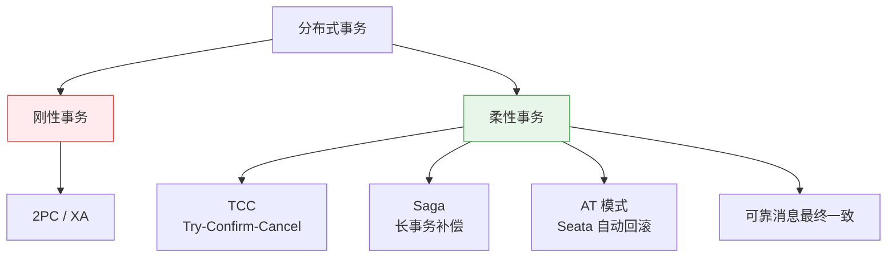
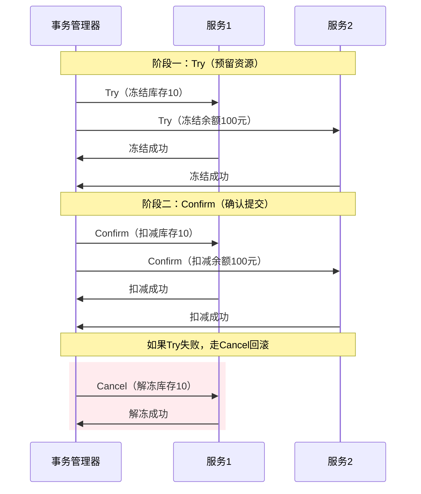
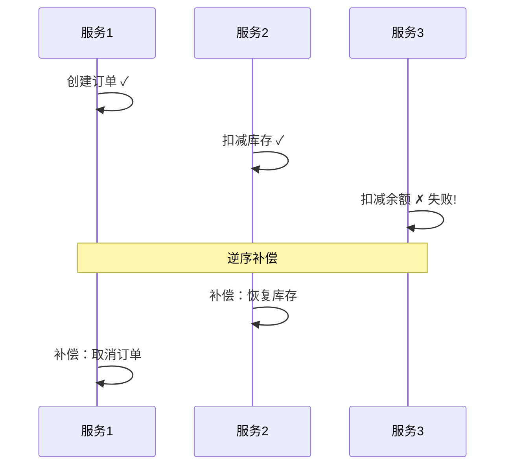
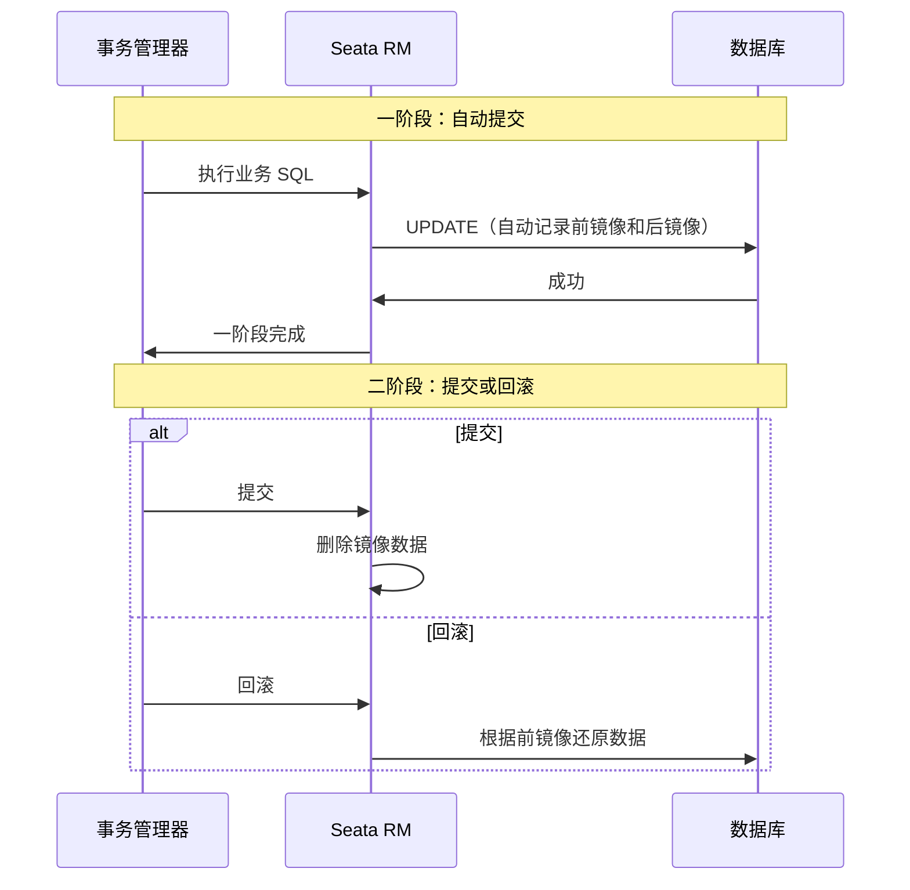
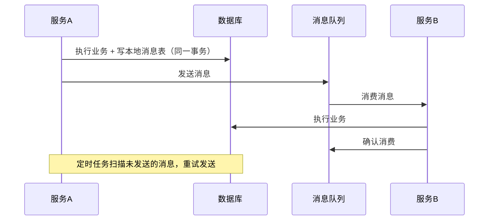

# 分布式事务：TCC / Saga / AT 模式

创建日期：2026-06-06

## 问题背景

单体应用中，数据库事务保证 ACID。微服务架构下，一个业务操作横跨多个服务、多个数据库。如何保证跨服务的数据一致性？这就是分布式事务要解决的问题。

::: tip 核心挑战
分布式事务不能简单使用数据库事务——ACID 只在单库内有效。跨服务、跨数据库时，必须在**一致性**和**可用性**之间权衡。
:::

## 分布式事务方案全景

## 刚性事务：2PC / XA

### 原理

2PC（两阶段提交）是 XA 规范的核心。协调者先向所有参与者发送 Prepare，都回复 Yes 后，再发送 Commit。

### 优缺点

- ✅ 强一致，要么全成功，要么全失败。
- ❌ 同步阻塞，资源锁定时间长。
- ❌ 协调者单点故障，整个事务阻塞。
- ❌ 性能差，不适合高并发场景。

### 适用场景

对一致性要求极高、并发量低的场景，如金融核心系统内部转账。

## TCC（Try-Confirm-Cancel）

### 三阶段详解

### 核心要点

| 阶段 | 含义 | 必须保证 |
|------|------|---------|
| **Try** | 预留资源，检查可行性 | 幂等 |
| **Confirm** | 确认提交，真正执行 | 幂等 |
| **Cancel** | 回滚，释放预留资源 | 幂等 |

### TCC 的两大难题

#### 空回滚（Empty Rollback）

**问题：** Try 阶段网络超时，事务管理器认为失败，发起 Cancel。但 Try 实际已执行，Cancel 时资源已被预留。Cancel 需要对未执行的 Try 也能正确处理。

**解决：** Cancel 时判断 Try 是否执行过，未执行则直接返回成功（空回滚）。

#### 悬挂（Suspension）

**问题：** Cancel 先于 Try 到达。Cancel 执行空回滚，随后 Try 到达并预留资源，但事务已回滚，资源永远无法释放。

**解决：** Try 执行前检查是否已有 Cancel 记录，有则拒绝执行。

### 适用场景

- 资金转账、库存扣减等对一致性要求高的核心业务。
- 需要精确控制回滚逻辑的场景。

## Saga 模式

### 原理

将长事务拆分为多个本地事务，每个本地事务有对应的补偿操作。如果某个步骤失败，逆序执行补偿操作。

### 两种实现方式

| 方式 | 原理 | 优缺点 |
|------|------|--------|
| **编排式（Orchestration）** | 一个协调器串行调用各服务 | 逻辑集中，易维护，但协调器是单点 |
| **协同式（Choreography）** | 各服务通过事件驱动，各自决定下一步 | 松耦合，但逻辑分散，难追踪 |

### 适用场景

- 长事务（多个服务、耗时长）。
- 无法使用 TCC（老系统不支持改造）。
- 事务步骤多，补偿逻辑相对简单。

## AT 模式（Seata）

### 原理

AT 模式是 Seata 提供的**自动回滚**方案，不需要业务手动编写补偿逻辑。

### 核心机制

- **一阶段**：执行业务 SQL，同时记录**前镜像**（修改前数据）和**后镜像**（修改后数据）。
- **二阶段提交**：删除镜像数据，完成。
- **二阶段回滚**：根据前镜像生成反向 UPDATE，还原数据。

### AT vs TCC 对比

| 对比维度 | AT 模式 | TCC 模式 |
|----------|---------|---------|
| 侵入性 | 低，无需改造业务代码 | 高，需要实现 Try/Confirm/Cancel |
| 性能 | 好（一阶段直接提交） | 好（资源预留，不锁定） |
| 回滚方式 | 自动（前镜像还原） | 手动（Cancel 逻辑） |
| 适用场景 | 通用业务 | 核心业务、需要精确控制回滚 |

## 可靠消息最终一致性

### 原理

通过**本地消息表**保证业务操作和消息发送的原子性。

### 核心要点

- **本地事务**：业务操作和消息记录在同一数据库事务中，保证原子性。
- **定时补偿**：定时扫描未成功发送的消息，重试发送。
- **消费幂等**：消费者必须保证幂等，防止重复消费。

## 方案选型对比

| 方案 | 一致性 | 性能 | 侵入性 | 适用场景 |
|------|--------|------|--------|---------|
| **2PC/XA** | 强一致 | 差 | 低 | 单应用内多库、低并发 |
| **TCC** | 强一致 | 好 | 高 | 核心业务、资金交易 |
| **Saga** | 最终一致 | 好 | 中 | 长事务、老系统 |
| **AT 模式** | 最终一致 | 好 | 低 | 通用业务（推荐） |
| **可靠消息** | 最终一致 | 好 | 中 | 异步解耦场景 |

---

## 经典高频面试题

### Q1：TCC 的空回滚和悬挂问题是什么？怎么解决？

**知识要点：** 空回滚（Cancel 先于 Try 到达）和悬挂（Cancel 之后 Try 才到导致资源被"悬挂"无法释放）是 TCC 模式的两大经典陷阱，根源都是网络不确定性导致的调用乱序。

**我们当时在做一个积分兑换礼品的 TCC 事务，涉及积分扣减服务和库存扣减服务。** 积分子系统是自研服务（日均 8 万笔兑换），库存子系统对接的是第三方 WMS（Web 端 API，P99 RT 约 350ms）。TCC 事务协调者设置的全局超时是 2 秒。

**踩坑经历——空回滚：** 第三方 WMS 的 Try 接口在高峰期偶尔超时（超过 2 秒），协调者判定 Try 失败发起 Cancel。但 Try 实际上在 WMS 侧已经执行成功（只是响应慢），此时库存已经被预留。如果 Cancel 直接调用 WMS 的 Cancel 接口，WMS 报错"没有找到对应的预留记录"——因为 WMS 说 Try 是成功的。这就是空回滚：Cancel 试图释放一个"理论上应该存在但当前找不到"的预留。

**踩坑经历——悬挂：** 更诡异的是另一个场景。有一次 Cancel 因为网络延迟先到了，执行了空回滚（记录了一条"该事务已取消"的标记）。而 Try 因为网络重传迟到了 3 分钟才到——Try 执行了预留，但事务已经取消，库存被永久"悬挂"——用户积分被扣了但也没拿到东西（因为事务已取消），库存也被锁死。

**量化结果：** 这两个问题在试运行第一周分别出现了 7 次（空回滚）和 2 次（悬挂）。解决方式：在数据库层面加了一张 `tcc_transaction_log` 表，Cancel 执行前先查是否有 Try 记录（没有就记录一条 Cancel 日志并返回成功——空回滚处理），Try 执行前先查是否已有 Cancel 记录（有就直接拒绝——防悬挂）。改造后第一周降为 1 次空回滚（WMS 的 Bug），悬挂降为 0。整体兑换成功率从 96.3% 提升到 99.6%。

**面试官追问：**
- **追问 1：** 如果 Try 和 Cancel 同时到达怎么办？——答：数据库层面用唯一约束（事务 ID + 操作类型）保证原子性。Try 和 Cancel 同时插入 `tcc_transaction_log`，只有一个能成功。成功的那一方按正常流程走，失败的那一方返回幂等成功。
- **追问 2：** 这个方案要求 Try 和 Cancel 幂等，你怎么保证幂等？——答：Try 的幂等靠业务唯一键（比如用户 ID + 兑换单号），Cancel 的幂等靠事务日志表的操作记录去重。两次同样的 Try 进来，第二次查到已有记录直接返回成功。

### Q2：Saga 模式的补偿和 TCC 的 Cancel 有什么区别？

**知识要点：** TCC Cancel 是"释放预留"（Try 阶段只预留未真正执行），Saga 补偿是"反向操作"（正向操作已经实际执行了）。前者是"撤回"一个承诺，后者是"抵消"一个已完成的动作——后者在设计上难得多。

**我们当时在做一个旅游订单系统，下单流程涉及：创建订单 → 锁定机票 → 扣款。** 机票供应商是第三方（携程/飞猪接口），不支持 TCC 的预留模式——机票只能直接下单，不能"预留座位然后确认"。所以我们用了 Saga 模式：先创建订单，再订机票，最后扣款。如果扣款失败，需要补偿前两步。

**踩坑经历：** 扣款失败后，我们需要"取消订单"（改状态为已取消），然后"退机票"。但机票已经出了——退票不是简单的"取消"，而是要走航空公司的退票流程，产生退票费（票价的 20%）。我们的 Saga 补偿逻辑写了"调用退票接口"，但发现退票接口是异步的——提交退票申请后，航空公司需要 1-3 个工作日才能确认退款。这意味着"补偿操作"本身也是异步的、可能失败的。

**量化结果：** 第一个月有 3 笔订单因为扣款失败进入了 Saga 补偿流程，退票费共计 1260 元由公司承担。更严重的是，有 1 笔退票申请被航空公司拒绝（因为特价票不支持退票），导致这 1200 元的机票费完全损失。这让我们意识到 Saga 补偿不能简单等于"调用反向接口"——必须考虑补偿失败的情况。

**面试官追问：**
- **追问 1：** 补偿失败了你们怎么处理的？——答：引入了"补偿重试 + 人工介入"两层机制。补偿失败后自动重试 3 次（间隔 1 分钟、5 分钟、15 分钟），3 次后还失败就创建工单人工处理。同时，我们在正向操作前做了更多的预校验（比如读航空公司的退改签规则），尽量避免不可逆的操作。
- **追问 2：** 如果让你们重新设计，还会用 Saga 吗？——答：对于这种涉及第三方、操作不可逆的场景，Saga 是无奈的选择。如果所有参与者都是自研服务，我一定选 TCC——预留期可控、没有退票费这种不可预测的成本。Saga 的本质是用"事后补偿"替代"事前预留"——代价就是补偿可能失败。
- **追问 3：** 你提到的退票补偿用了 1-3 个工作日，这和 BASE 的"最终一致性"概念一致吗？——答：完全一致。我们定义了退票补偿的最终一致性 SLA 是"5 个工作日内资金退回"，用户端显示"退款处理中"。只要在 SLA 内完成，业务就认为是一致的。

### Q3：AT 模式（Seata）和 TCC 有什么区别？怎么选？

**知识要点：** AT 是自动挡（Seata 代理数据源自动记录前后镜像，自动回滚），TCC 是手动挡（业务自己实现 Try/Confirm/Cancel）。AT 低侵入但只能用于同构数据库，TCC 高侵入但能跨任意系统。

**我们当时在一个包含 12 个微服务的电商项目中做了 AT 和 TCC 的选型对比。** 12 个服务其中 8 个是自研（Java + MySQL），4 个是外部供应商系统（物流、发票、支付、短信）。日均订单 3 万单，核心下单链路涉及 5 个服务。

**踩坑经历——AT 模式生产事故：** 我们在一个"创建订单 + 扣优惠券 + 扣积分 + 扣库存"的链路上用了 Seata AT（v1.4.2）。有一次数据库做在线 DDL（加字段），Seata 的 undo_log 表被锁了约 2 分钟。这 2 分钟内所有的新事务都 hang 住了——因为每个 RM（资源管理器）的一阶段提交都需要往 undo_log 表写入前后镜像数据。事务 RT 从平均 80ms 飙升到超时（5000ms），订单成功率从 99.9% 跌到 0%。

**决策过程——为什么选 AT 不选 TCC：** 8 个自研服务中选 AT 是因为低侵入——业务代码完全不用改，只需加 Seata 依赖和数据源代理配置。4 个外部服务无法用 AT（因为 Seata 无法代理外部系统的数据源），只能用 TCC 或 Saga。最终架构：内部 8 个服务走 Seata AT，外部 4 个服务走 TCC，整体由一个全局事务 XID 串联。

**量化结果：** 那次 DDL 事故后，我们把 undo_log 表迁移到了独立的 MySQL 实例（8C16G, SSD, 独立连接池），并且在 DDL 前设置 Seata 的全局事务超时从 60s 降到 10s，DDL 期间暂停下游依赖 undo_log 的服务。迁移后 undo_log 的写入 P99 从 18ms 降到 2ms，全局事务成功率恢复到 99.9%。

**面试官追问：**
- **追问 1：** AT 模式的 undo_log 表如果无限膨胀怎么办？——答：Seata 有二阶段删除机制——全局事务提交或回滚后自动删除 undo_log。但我们设置了定时清理任务兜底（每小时清理超过 24 小时的残留记录），因为极端情况下（TC 挂了）undo_log 可能不被清理。
- **追问 2：** 你提到全局事务横跨 AT（内部）和 TCC（外部），怎么协调的？——答：Seata 的全局事务 XID 是统一的，无论内部 AT 还是外部 TCC，都在同一个 XID 下。外部 TCC 服务通过 Seata 的 TCC 模式接口（@TwoPhaseBusinessAction 注解）注册到同一个全局事务中，TC 统一协调一阶段和二阶段。
- **追问 3：** 如果让你重新选，还会混合 AT + TCC 吗？——答：会。因为现实中总会遇到不能改造的外部系统，混合模式是务实的做法。纯 AT 只能覆盖内部服务，纯 TCC 开发成本太高（8 个服务全部改造预估 3 人月）。混合方案的额外成本只有写 4 个 TCC 适配服务（约 2 周），性价比最高。

### Q4：Seata AT 模式的一阶段回滚（前镜像还原）是怎么做到的？

**知识要点：** Seata 通过代理数据源拦截业务 SQL，解析出 WHERE 条件和修改前后的值（前镜像 + 后镜像），存入 undo_log 表。回滚时根据前镜像生成反向 UPDATE，同时比对后镜像检测脏写。

**我们当时在 Seata AT 的回滚机制上遇到了一个具体的脏写检测 bug。** 场景是：订单状态从"待支付"更新为"已支付"（全局事务 T1），同时有一个定时任务也在更新这条订单的"最后修改时间"（非事务更新）。两个操作并发执行。

**踩坑经历：** T1 全局事务在执行一阶段 UPDATE 时，Seata 记录了前镜像 `status='待支付'` 和后镜像 `status='已支付'`。在 T1 写 undo_log 和执行二阶段之间有一个微妙的时间窗口——定时任务更新了同一行的 `update_time` 字段（只有 `update_time` 变了，`status` 没变）。然后 T1 因为库存不足触发了回滚，Seata 做反向 UPDATE 时先比对了"当前数据是否等于后镜像"，发现当前数据的 `update_time` 和后镜像不一致——Seata 判定为脏写，回滚失败，抛出 `BranchRollbackFailed`。但实际 `status` 字段没有脏写，只是 `update_time` 变了。

**量化结果：** 这个误判导致大约 0.05% 的订单（约 15 笔/天）回滚失败，需要人工处理。我们的解决方案：把 `update_time` 字段从 Seata 的镜像比对中排除——在业务表中加了一个 `version` 字段作为唯一的乐观锁标记，Seata 只比对 version 和核心业务字段。改造后脏写误判降为 0。

**面试官追问：**
- **追问 1：** Seata 是怎么检测脏写的？如果真的有脏写怎么办？——答：Seata 在回滚时先 SELECT 当前行数据，逐个字段比对后镜像。如果有任何字段不匹配，认为发生了脏写。真脏写场景下 Seata 会抛异常并重试（默认重试 5 次，每次间隔 5 秒）。5 次重试还是失败，就需要人工介入。
- **追问 2：** 你说的表达式比对有没有性能问题？——答：每条 UPDATE 在回滚时多了一次 SELECT 和字段比对，对 RT 有约 3-5ms 的增加。但这只发生在回滚路径上（正常提交是不需要的），回滚比例通常小于 1%，所以整体影响忽略不计。
- **追问 3：** 如果回滚时的反向 UPDATE 本身失败了（比如磁盘满了），怎么办？——答：这种是基础设施故障，Seata 会重试。如果重试全部失败，undo_log 记录会保留，等磁盘恢复后由人工或定时任务触发重新回滚。这个场景对我们的 SLA 来说是允许的——宁可短暂不一致也不悄无声息地丢数据。

### Q5：可靠消息最终一致性怎么保证消息不丢？

**知识要点：** "业务写库"和"写消息"必须原子——任何异步消息一致性方案的第一原则都是"先落库再发送"，不能先发再写。顺序错了消息一定丢。

**我们当时做订单创建后异步通知履约系统的改造。** 原来的流程是：订单服务创建订单 → 发 RocketMQ 消息 → 履约服务消费消息拣货。峰值 QPS 约 400，每日订单约 12 万单。

**踩坑经历：** 有一次数据库主库切从库（运维操作），导致 JDBC 连接池耗尽。5 秒内有 2100 个订单创建请求，其中 320 个消息发送成功但数据库写入超时（连接池满了）——结果就是"消息发出去了，订单没生成"，履约系统收到了一个不存在的订单，白拣货。还有反向的：数据库写入成功但 RocketMQ 发送失败——订单创建了但履约系统不知道，用户付了钱没发货。

**量化结果：** 这个问题在线上第一周导致了 37 个"幽灵订单"（有消息无订单）和 12 个"幽灵付款"（有订单无消息），总损失约 8900 元（用户投诉赔偿）。修复方案改为"本地消息表 + 定时扫描"：在同一个数据库事务中写入订单和一条 outbox 记录（未发送），然后定时任务（每秒一次）扫描 outbox 发送 MQ，发送成功标记为已发送。修复后 6 个月消息丢失降为 0。

**面试官追问：**
- **追问 1：** 为什么不直接用 RocketMQ 的事务消息？——答：RocketMQ 的事务消息本身也是基于 Half Message + Commit/Rollback 机制，本质上和本地消息表是一回事。我们评估下来：用本地消息表更可控，不需要依赖 RocketMQ 的特殊特性，排查问题也简单。如果用 RocketMQ 事务消息，省去了我们自己维护 outbox 表，但多了 RocketMQ 侧的复杂性。
- **追问 2：** 定时扫描会导致消息重复吗？——答：会。所以消费者必须幂等，按消息 ID 去重。我们的履约服务消费后把已处理的消息 ID 存在数据库里，重复消息直接返回成功。我们实测：10000 条消息中约有 0.5% 的重复（未标记成功前定时扫描再次扫描发送），幂等处理后完全没问题。
- **追问 3：** 如果发送成功后 MQ broker 宕机导致消息丢失怎么办？——答：RocketMQ 的磁盘刷盘配置：同步刷盘。我们的配置是 `flushDiskType=SYNC_FLUSH`，消息写入 broker 后才返回成功。只要返回成功，消息一定在 broker 磁盘上。broker 宕机恢复后消息还在，不会丢。如果返回失败，outbox 仍然是未发送状态，下一次扫描会重试。

### Q6：分布式事务这么多方案，怎么选型？

**知识要点：** 没有万能方案，选型取决于三个核心变量：一致性要求（强 or 最终）、参与者是否可改造、是否需要跨外部系统。画一个决策树比列一张表更有说服力。

**我们公司的分布式事务方案演进路线就是最好的选型教材。** 公司经历了三个阶段的方案变更：单体应用（2018 年，MySQL ACID）→ 微服务化初期（2019 年，XA + 本地消息表混用）→ 微服务成熟期（2021 年，Seata AT + TCC + Saga 混用）。

**决策过程：**

1. **内部转账**（用户余额 → 商户余额，两个 MySQL 库都在我们自己的服务里）：一致性要求强一致，两个参与者都是自研可改造。最早的方案是 XA（2PC），日均 5000 笔。后来因为 XA 的同步阻塞问题（协调者宕机阻塞 47 秒），迁移到了 Seata AT——低侵入，性能从 280ms RT 降到 95ms。为什么没选 TCC？因为两个库都是我们自己的 AT 直接就能搞定，不需要手动写 Confirm/Cancel。

2. **下单链路**（订单 + 库存 + 优惠券 + 积分，5 个自研服务）：一致性要求强一致，5 个参与者都是自研。选了 Seata AT，因为全链路都走 MySQL，AT 低侵入性价值最大。日均 3 万单，事务 RT 约 120ms。踩的坑是 undo_log 锁表，已通过独立实例解决。

3. **对接第三方支付**（订单 + 微信支付）：一致性要求强一致，但微信支付不可改造（不可能让微信实现 TCC Try/Confirm/Cancel）。选了 TCC 模式，我们自己在订单侧实现 Try（创建待支付订单）/ Confirm（标记已支付）/ Cancel（取消订单），微信侧通过查询接口补偿。日均 1.5 万笔支付，失败率约 0.3%。

4. **消息推送**（消息表 + 推送记录表）：一致性要求最终一致即可。选了本地消息表 + RocketMQ，因为成本最低。日均推送 30 万条。

**量化结果：** 四种方案的故障率：AT（0.02%）、TCC（0.3%、受第三方影响）、本地消息表（< 0.01%）。AT 故障率低但受基础设施影响（undo_log 表锁），TCC 受外部系统影响最大。

**面试官追问：**
- **追问 1：** 如果有一个全新的项目，你的默认方案是什么？——答：自研服务之间用 Seata AT（默认选择），涉及第三方用 TCC（退一步），异步通知走本地消息表（最简单）。不会主动选 Saga，除非业务本身就是长流程（如审批流）。
- **追问 2：** 你提到 AT 故障率 0.02%，具体是什么故障？——答：主要三类：undo_log 写入失败（0.01%）、脏写冲突（0.005%）、TC 超时（0.005%）。都已通过独立 undo_log 实例、version 字段、TC 集群化解决。
- **追问 3：** 你怎么说服团队用 AT 而不是 TCC？——答：决策依据是投入产出比。AT 接入 5 个服务需要约 2 天（改配置 + 测试），TCC 需要约 3 周（每个服务加 Try/Confirm/Cancel + 防悬挂 + 幂等）。AT 多出来的风险（undo_log 锁表等）可以通过运维手段解决，3 周的开发成本节省更实在。