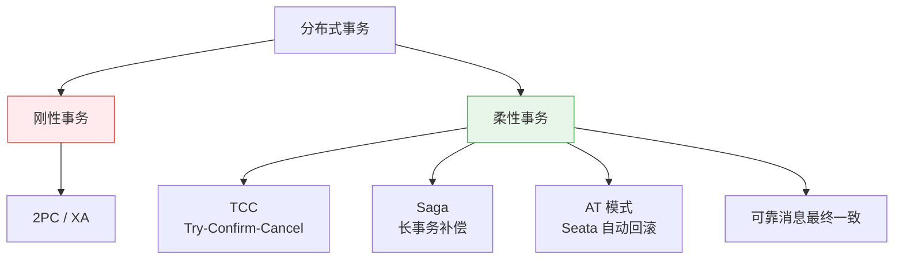
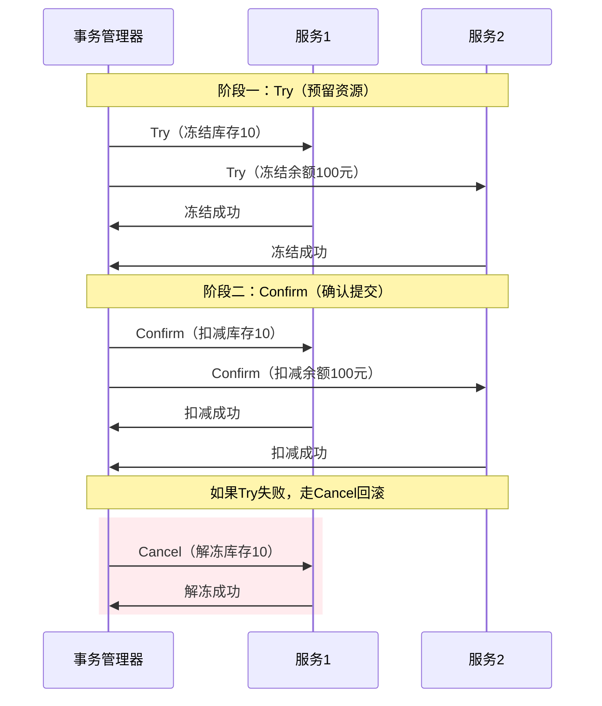
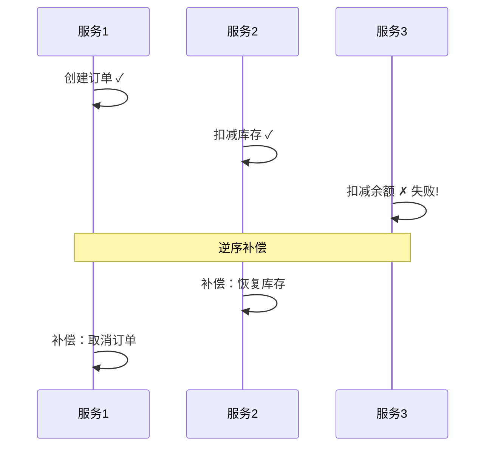
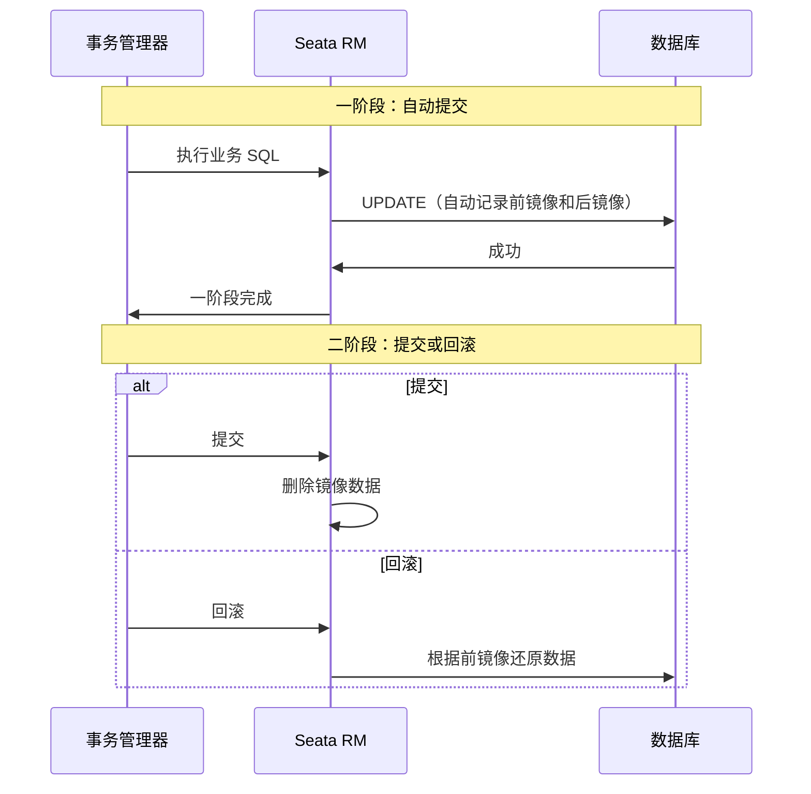
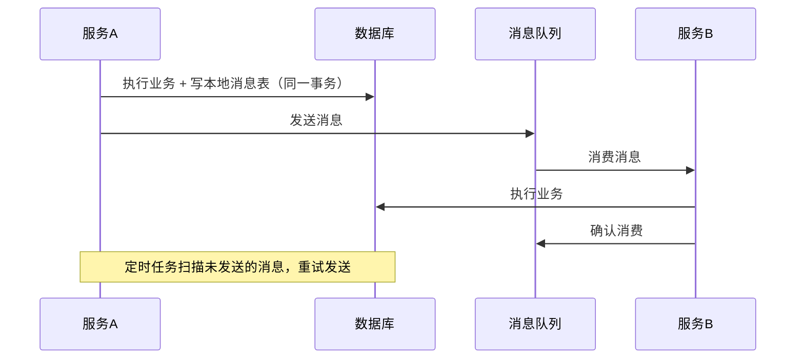

# 分布式事务：TCC / Saga / AT 模式

创建日期：2026-06-06

## 问题背景

单体应用中，数据库事务保证 ACID。微服务架构下，一个业务操作横跨多个服务、多个数据库。如何保证跨服务的数据一致性？这就是分布式事务要解决的问题。

::: tip 核心挑战
分布式事务不能简单使用数据库事务——ACID 只在单库内有效。跨服务、跨数据库时，必须在**一致性**和**可用性**之间权衡。
:::

## 分布式事务方案全景

## 刚性事务：2PC / XA

### 原理

2PC（两阶段提交）是 XA 规范的核心。协调者先向所有参与者发送 Prepare，都回复 Yes 后，再发送 Commit。

### 优缺点

- ✅ 强一致，要么全成功，要么全失败。
- ❌ 同步阻塞，资源锁定时间长。
- ❌ 协调者单点故障，整个事务阻塞。
- ❌ 性能差，不适合高并发场景。

### 适用场景

对一致性要求极高、并发量低的场景，如金融核心系统内部转账。

## TCC（Try-Confirm-Cancel）

### 三阶段详解

### 核心要点

| 阶段 | 含义 | 必须保证 |
|------|------|---------|
| **Try** | 预留资源，检查可行性 | 幂等 |
| **Confirm** | 确认提交，真正执行 | 幂等 |
| **Cancel** | 回滚，释放预留资源 | 幂等 |

### TCC 的两大难题

#### 空回滚（Empty Rollback）

**问题：** Try 阶段网络超时，事务管理器认为失败，发起 Cancel。但 Try 实际已执行，Cancel 时资源已被预留。Cancel 需要对未执行的 Try 也能正确处理。

**解决：** Cancel 时判断 Try 是否执行过，未执行则直接返回成功（空回滚）。

#### 悬挂（Suspension）

**问题：** Cancel 先于 Try 到达。Cancel 执行空回滚，随后 Try 到达并预留资源，但事务已回滚，资源永远无法释放。

**解决：** Try 执行前检查是否已有 Cancel 记录，有则拒绝执行。

### 适用场景

- 资金转账、库存扣减等对一致性要求高的核心业务。
- 需要精确控制回滚逻辑的场景。

## Saga 模式

### 原理

将长事务拆分为多个本地事务，每个本地事务有对应的补偿操作。如果某个步骤失败，逆序执行补偿操作。

### 两种实现方式

| 方式 | 原理 | 优缺点 |
|------|------|--------|
| **编排式（Orchestration）** | 一个协调器串行调用各服务 | 逻辑集中，易维护，但协调器是单点 |
| **协同式（Choreography）** | 各服务通过事件驱动，各自决定下一步 | 松耦合，但逻辑分散，难追踪 |

### 适用场景

- 长事务（多个服务、耗时长）。
- 无法使用 TCC（老系统不支持改造）。
- 事务步骤多，补偿逻辑相对简单。

## AT 模式（Seata）

### 原理

AT 模式是 Seata 提供的**自动回滚**方案，不需要业务手动编写补偿逻辑。

### 核心机制

- **一阶段**：执行业务 SQL，同时记录**前镜像**（修改前数据）和**后镜像**（修改后数据）。
- **二阶段提交**：删除镜像数据，完成。
- **二阶段回滚**：根据前镜像生成反向 UPDATE，还原数据。

### AT vs TCC 对比

| 对比维度 | AT 模式 | TCC 模式 |
|----------|---------|---------|
| 侵入性 | 低，无需改造业务代码 | 高，需要实现 Try/Confirm/Cancel |
| 性能 | 好（一阶段直接提交） | 好（资源预留，不锁定） |
| 回滚方式 | 自动（前镜像还原） | 手动（Cancel 逻辑） |
| 适用场景 | 通用业务 | 核心业务、需要精确控制回滚 |

## 可靠消息最终一致性

### 原理

通过**本地消息表**保证业务操作和消息发送的原子性。

### 核心要点

- **本地事务**：业务操作和消息记录在同一数据库事务中，保证原子性。
- **定时补偿**：定时扫描未成功发送的消息，重试发送。
- **消费幂等**：消费者必须保证幂等，防止重复消费。

## 方案选型对比

| 方案 | 一致性 | 性能 | 侵入性 | 适用场景 |
|------|--------|------|--------|---------|
| **2PC/XA** | 强一致 | 差 | 低 | 单应用内多库、低并发 |
| **TCC** | 强一致 | 好 | 高 | 核心业务、资金交易 |
| **Saga** | 最终一致 | 好 | 中 | 长事务、老系统 |
| **AT 模式** | 最终一致 | 好 | 低 | 通用业务（推荐） |
| **可靠消息** | 最终一致 | 好 | 中 | 异步解耦场景 |

---

## 经典高频面试题

### Q1：TCC 的空回滚和悬挂问题是什么？怎么解决？

**参考答案：**

- **空回滚**：Try 超时但实际已执行，事务管理器发起 Cancel。Cancel 需要对未执行的 Try 也能正确处理。**解决**：Cancel 时判断 Try 是否执行过，未执行则直接返回成功。
- **悬挂**：Cancel 先于 Try 到达，Cancel 空回滚后 Try 到达并预留资源，资源永远无法释放。**解决**：Try 执行前检查是否已有 Cancel 记录，有则拒绝执行。

### Q2：Saga 模式的补偿和 TCC 的 Cancel 有什么区别？

**参考答案：**

- **TCC Cancel**：释放在 Try 阶段预留的资源，是"恢复原状"。因为 Try 预留了资源，Cancel 只是释放。
- **Saga 补偿**：执行一个逆操作来抵消已完成的操作，是"反向操作"。因为没有预留阶段，已经实际执行了，需要做反向操作来补偿。

Saga 补偿比 TCC Cancel 更难设计——已创建的订单无法"删除"，只能"取消"。

### Q3：AT 模式（Seata）和 TCC 有什么区别？怎么选？

**参考答案：**

- **AT 模式**：自动记录前镜像，二阶段回滚时自动还原。对业务代码无侵入，适合通用 CRUD 场景。
- **TCC 模式**：需要业务手动实现 Try/Confirm/Cancel。侵入性高，但能精确控制回滚逻辑，适合核心业务（资金、库存）。

选型：通用业务用 AT（省心），核心业务用 TCC（精确控制）。

### Q4：Seata AT 模式的一阶段回滚（前镜像还原）是怎么做到的？

**参考答案：**

一阶段执行 SQL 时，Seata 通过代理数据源，自动解析 SQL，获取修改前的数据（前镜像）和修改后的数据（后镜像）。二阶段回滚时，根据前镜像生成反向 UPDATE 语句："UPDATE table SET col = 前镜像值 WHERE id = ?"。如果数据已被其他事务修改（脏写），回滚会失败，需要人工介入。

### Q5：可靠消息最终一致性怎么保证消息不丢？

**参考答案：**

1. 业务操作和消息记录在同一数据库事务中（本地消息表）。
2. 定时任务扫描未成功发送的消息，重试发送。
3. 消费者处理成功后才确认消息，失败则重试。
4. 消费者必须幂等——按消息 ID 去重。

### Q6：分布式事务这么多方案，怎么选型？

**参考答案：**

- **一致性要求高 + 并发低** → 2PC/XA。
- **一致性要求高 + 核心业务** → TCC。
- **长事务 + 老系统** → Saga。
- **通用业务 + 低侵入** → AT 模式（Seata）。
- **异步解耦场景** → 可靠消息最终一致性。

大多数业务场景，推荐 AT 模式或可靠消息，性价比最高。