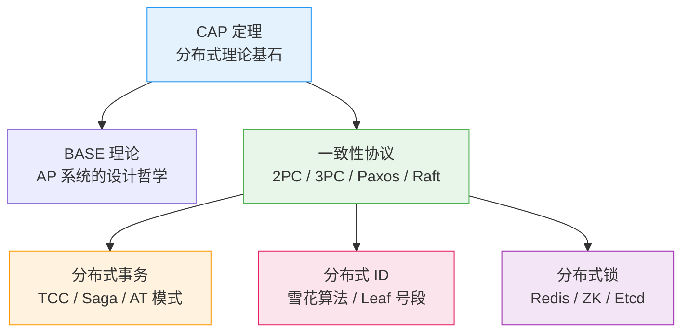
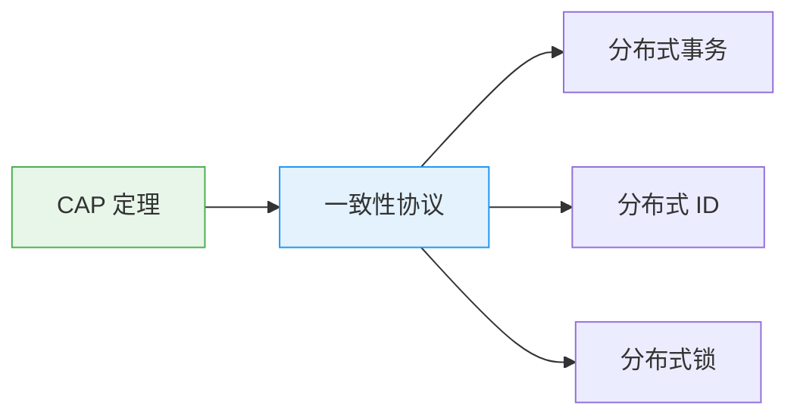

# 分布式理论总览

创建日期：2026-06-06

## 模块概述

分布式理论是理解高并发架构的**底层基石**。没有扎实的分布式理论基础，设计出来的高并发系统就是空中楼阁。本模块从 CAP 定理出发，逐步深入到一致性协议、分布式事务、分布式 ID 和分布式锁，构建完整的分布式知识体系。

::: tip 为什么分布式理论对高并发如此重要？
高并发系统天然是分布式的——多实例、多机房、多数据中心。分布式环境下，网络分区、节点故障、时钟不同步是常态。不理解 CAP、一致性协议、分布式事务，你就无法在面试中回答"这个设计为什么这么选"。
:::

## 知识全景图

## 各模块核心问题

| 模块 | 解决什么问题 | 为什么必考 | 面试深度 |
|------|-------------|-----------|---------|
| **CAP/BASE** | 分布式系统不可能同时满足 C、A、P，如何取舍？ | 分布式设计第一问，决定架构方向 | 能讲清楚 PACELC 才算过关 |
| **一致性协议** | 多个节点如何就某个值达成一致？ | 理解 ZK/Raft/Etcd 的底层原理 | 能画出 Raft 选举流程 |
| **分布式事务** | 跨多个服务/数据库的事务如何保证一致性？ | 微服务架构的核心难题 | 能对比 TCC/Saga/AT 选型 |
| **分布式 ID** | 分布式环境下如何生成全局唯一 ID？ | 几乎每个系统都要用 | 能讲清楚雪花算法 64bit 拆解 |
| **分布式锁** | 多个进程/线程如何安全地竞争共享资源？ | 秒杀/库存扣减等场景必用 | 能从 SETNX 演进到 RedLock |

## 学习路径建议

1. **先理解 CAP**：这是所有分布式理论的基石，理解为什么 CAP 不能同时满足。
2. **再学一致性协议**：理解了 2PC/3PC/Paxos/Raft，就理解了达成一致的底层机制。
3. **然后分三路**：分布式事务（一致性协议的应用）、分布式 ID（全局唯一性）、分布式锁（互斥性）。
4. **画图总结**：每个协议的状态流转画出来，面试时才能清晰表达。

## 面试考察重点

::: warning 高频考点
1. **CAP 为什么不能同时满足？** 画出网络分区场景下的取舍逻辑。
2. **Raft 选举过程**：Term、RequestVote、心跳机制，能画序列图。
3. **TCC 空回滚和悬挂**：这两个问题怎么产生的？怎么解决？
4. **雪花算法 64bit 拆解**：41 位时间戳 + 10 位机器 ID + 12 位序列号，时钟回拨怎么办？
5. **RedLock 争议**：Martin Kleppmann 的核心论点是什么？实际项目中怎么用？
:::

::: danger 容易翻车的点
- 混淆 CAP 和 ACID，CAP 是分布式系统的，ACID 是单机数据库的。
- 把 Paxos 和 Raft 当成一回事，说不清区别。
- 只知道 TCC 三个字母，讲不清楚 Try/Confirm/Cancel 具体做了什么。
- 分布式锁只说 SETNX，不知道看门狗、RedLock。
- 雪花算法说不清 64 位怎么分配的，时钟回拨没方案。
:::

## 参考资料

- 《Designing Data-Intensive Applications》（DDIA）—— Martin Kleppmann
- 《Paxos Made Simple》—— Leslie Lamport
- [Raft 可视化动画](https://raft.github.io/)
- [Seata 官方文档](https://seata.io/)
- [Redisson 分布式锁文档](https://github.com/redisson/redisson/wiki)

---

## 经典高频面试题

### Q1：CAP 为什么不能同时满足？画图说明。

**面试回答策略：** 先亮出核心结论（P 发生时 C 和 A 只能二选一），然后画一个网络分区的图（两个机房之间画一个 X 表示断连），用你自己的真实项目举例说明 "我们当时在什么时候遇到了这个取舍"。最后给出你们的选择和理由。面试官不看图多漂亮，看的是你在真实压力下怎么做决策。

**我们当时的跨机房积分系统**就是最好的回答素材。把代码拿到面试官面前："我们北京和上海两个机房的积分 Redis，专线被挖断了（P 发生）。北京的用户消费积分减了、上海的用户查积分还是老的——超用了 327 个用户 1.2 万积分。这就是选了 A 的代价。但我们没有选 C——因为如果选 C 意味着网络分区时所有读请求返回错误，用户直接不能下单，影响是数万元的 GMV 损失。这个权衡是经过业务方确认的。"

**关键表达：**
- 不要说 "CAP 理论说不能同时满足"——面试官知道你背了书。
- 要说 "我们当时在 XX 场景遇到了网络分区，我们的选择是 YY，因为 ZZ。结果是 AA，教训是 BB。"
- 用量化数字：超用 327 人 / 1200 元 vs 选 C 的 GMV 损失数万元。
- 用决策理由：为什么这个业务选 AP 而不是 CP。

**常见追问准备：**
- **追问 1：** "如果让你们重来一次，还会选 AP 吗？" → 答：会。但会加上"分区期间冻结跨机房操作"的前置判断逻辑。被动恢复不如主动预防。
- **追问 2：** "那是什么场景下你会选 CP？" → 答：涉及资金的支付系统。宁可 5 秒不可用，不能一笔钱被转两次。
- **追问 3：** "这和你用的框架（Redis/ZK/Nacos）的选型有什么关系？" → 答：直接关系。积分系统用了 Redis Cluster（AP 系统），因为积分的 CAP 选择是 AP。支付系统用了 ZK（CP 系统），因为支付的 CAP 选择是 CP。CAP 不是抽象概念——它直接决定了你的技术选型。

### Q2：BASE 理论的核心思想是什么？和 ACID 有什么区别？

**面试回答策略：** 不说废话，举真实的例子。我们电商系统中：BASE 和 ACID 在同一个订单流程里同时存在，BASE 在最终端，ACID 在核心点。

举我们的流程：用户下单 → 本地 ACID 写订单（强一致）→ 通过 RocketMQ 异步通知履约系统（BASE，最终一致）→ 履约系统拣货 → 最终一致。

为什么这么设计：

- 下单是核心操作，必须 ACID 强一致——订单不存在就不能往下走。
- 通知履约系统不需要强一致——用户下单后 1 分钟内拣货都算正常，最终能通知到就行，允许延迟。所以用 BASE。

**关键区别总结：**

| 对比维度 | ACID | BASE |
|---------|------|------|
| 范围 | 单机数据库事务 | 分布式系统 |
| 一致性 | 强一致 | 最终一致 |
| 可用性 | 差（有锁） | 高（异步） |
| 适用场景 | 核心操作（写订单、扣余额） | 非核心、异步操作（通知、同步） |

**真实案例：我们日订单 12 万单，通知履约系统的延迟要求是 99.9% 在 30 秒内完成，我们用 BASE（本地消息表 + RocketMQ）刚好满足这个要求，同时让下单接口的 RT 从 200ms 降到了 80ms——这就是 BASE 换性能的价值。**

**常见追问准备：**
- **追问 1：** "BASE 不要求强一致，那什么时候会最终一致？" → 答：我们的 SLA 是 5 分钟内 99.99% 一致。5 分钟超过就是故障触发报警。不能把"最终"理解为"不管什么时候都行"——必须有量化的最终一致性 SLA。
- **追问 2：** "ACID 和 BASE 一定是二选一吗？" → 答：不是。同一个流程里可以同时存在——我刚才举的下单 + 通知就是 ACID 在本地、BASE 在跨服务之间。分布式系统中绝对的 ACID 不可能，全链路 BASE 风险又太高，所以组合使用是最常见的。
- **追问 3：** "怎么评估一个业务场景适合 BASE 还是 ACID？" → 答：看用户体验和资损风险：用户感知不到延迟 + 资损可以补偿 → 用 BASE。用户感知得到 + 资损不可接受 → 用 ACID。

### Q3：强一致性和最终一致性分别用在什么场景？

**面试回答策略：** 给出你的"一致性分级"——不是二选一，而是根据一致性的严格度把它分成三个等级。用你自己的项目案例把每一级说明。

1. **强一致（ACID / 2PC / TCC）**：资金转账、支付扣费、余额变更。一致性窗口 = 0（实时）。我们支付系统用 TCC 模式，日均 1.5 万笔支付，失败率 0.3%。代价是 TCC 的开发和维护成本高。
2. **准实时一致（读己之写 / 本地消息表 5 秒内）**：订单详情、购物车。一致性窗口 < 5 秒。我们下单→订单详情使用了"支付成功 30 秒内走主库"，剩余走从库。代价是主库增加了 15% 的读负载。
3. **最终一致（异步 MQ / 补偿扫描 1-5 分钟）**：通知履约、发优惠券、推送消息、点赞数。我们订单履约的最终一致性 SLA 是 5 分钟 99.99%。代价是消息延迟从 50ms 涨到 1-2 秒，但履约时效要求是 30 分钟内，无影响。

**量化对比：**

| 一致性等级 | 窗口 | 实现方式 | 性能代价 | 我们的场景 |
|------------|------|---------|---------|----------|
| 强一致 | 0 | TCC / AT | RT +20-50ms | 支付、余额、库存 |
| 准实时 | < 5s | 走主库 / 本地消息表 | DB 负载 +15% | 订单详情 |
| 最终一致 | 1-5 min | RocketMQ / 补偿 | 消息延迟 1-2s | 履约通知、推送 |

**常见追问准备：**
- **追问 1：** "你刚说准实时一致 5 秒内，为什么是 5 秒不是 1 秒？" → 答：根据主从同步的 P99 延迟来定的。我们 MySQL 主从延迟 P99 约 120ms，但极端大事务场景会到 800ms。取 5 秒是 800ms × 6 倍的保守缓冲，确保 99.99% 的请求都能读到最新数据。
- **追问 2：** "最终一致性一定会最终一致吗？如果补偿一直失败怎么办？" → 答：三级兜底：自动重试 3 次（间隔递增）→ 创建工单人工处理 → 财务对账脚本做增量对账（天级）。最后的对账是最终的防线，保证即使补偿逻辑出错，对账也一定能发现并修复差异。

### Q4：分布式理论的学习路径是什么？

**面试回答策略：** 这个问题在考察你是否具备系统学习的方法论。不要只说"先学 CAP 再学 Raft"——面试官要听的是你具体怎么学的、踩了哪些坑、从哪里找到的答案。

**我的学习路径分三个阶段：**

**第一轮：概念理解（2 周）。** 目标：能用自己的话向其他工程师解释这些概念，不用背定义。方法：读 DDIA 第 1-2、5-9 章 + 画思维导图。同时做一个练习——给你一个场景（比如"订单系统如何 CAP 选型"），在 10 分钟内用概念框架做出选择并写出理由。

**第二轮：动手验证（1 个月）。** 这是最关键也是最容易被跳过的一步。我在 Docker 中搭了 Etcd 3 节点集群，手工触发 leader election 然后观察日志。在本地用 Docker Compose 搭了 Seata 环境，写了 TCC 的 Try/Confirm/Cancel 代码，手工模拟空回滚和悬挂场景。这些动手经历让我在面试中能区分"书上的答案"和"实际发生了什么"。

**第三轮：反思重构（持续进行）。** 目标：把零散的坑和经验串成框架。我做的事是把公司过去 2 年的线上故障（CAP 相关 3 次、分布式事务 2 次、分布式锁 4 次）全部归类总结，每一个故障对应分布式理论中的一个概念。这样面试时每个理论点都有实战案例支撑。

**最终形成的面试框架：**
- CAP：积分系统跨机房分区 → 部分订单超用（AP 的代价）
- Raft：Etcd 选举超时误判 → 调优到 1500-2000ms
- TCC：第三方 WMS 的空回滚 → tcc_transaction_log 解决
- 雪花算法：NTP 闰秒回拨 1 秒 → 5ms 等待 + Redis 兜底
- Redis 锁：SETNX 原子性 → 改为 SET NX PX

**常见追问准备：**
- **追问 1：** "DDIA 你全部读完了吗？" → 答：重点读了第 1-2 章（可靠性、数据模型）、第 5-9 章（复制、分区、事务、一致性与共识）、第 12 章（数据系统的未来）。DDIA 是分布式系统的圣经，用来建立框架非常好，但具体实现细节需要结合官方文档和源码看。
- **追问 2：** "你说的动手验证部分，你有什么印象深刻的学习产出吗？" → 答：Etcd 的选举调优。我在 Docker 里用 tc 命令模拟网络延迟（`tc qdisc add dev eth0 root netem delay 100ms`），测试了不同 heartbeat interval 和 election timeout 下的选举行为。做完后发现一个之前不理解的点：为什么 Raft 选举超时必须随机化——如果不随机，三个节点同时超时、同时发起选举，票数被分散导致无限循环。

### Q5：ZooKeeper、Etcd、Nacos 分别是什么 CAP 类型？

**面试回答策略：** 不要只回答类别，要给出"这个系统在实际中出过什么问题让你深刻理解了它的 CAP 属性"。面试官想确认你真的用过这些系统，而不是背了文档。

**我们公司的真实经历：**

1. **ZooKeeper（CP）**——我们的 ZK 集群（3 节点）经历过一次 Leader 节点 Full GC 暂停 15 秒 → ZK Session 超时 → Leader 选举 8 秒 → 数据同步 20 秒 → 总计 43 秒完全不可写。这就是 CP 的代价——Leader 选举时宁可不可用，也绝不丢失一致性。配置中心的所有改操作（服务上下线）在这 43 秒内全部被拒绝。如果是 AP 系统，这期间还能写但可能数据不一致。这就是 CP vs AP 的最直接对比。

2. **Etcd（CP）**——K8s 的 Etcd 集群（3 节点），Pod 滚动更新时读请求暴增（QPS 2000→8000），一个 Follower 误判 Leader 挂了触发选举，导致 8 秒不可用。Etcd 的 Raft 选举比 ZK（ZAB）更快（平均 2-5 秒 vs 8-15 秒），越快的选举是因为 Raft 把 Leader 切换设计得更干净。这是 Raft "可理解性"优势的体现。

3. **Nacos（AP + CP 可切换）**——服务器交换机重启导致 Nacos 3 节点网络分区 3 分钟。临时实例（服务发现）AP 模式正常工作（成功率从 99.7% 降到 98.2%），持久实例（配置中心）CP 模式正常工作（Leader 在多数派分区中）。这是"分而治之"的体现——Nacos 没有绕过 CAP，它是把不同数据分类做了不同选择。

**量化对比：**

| 系统 | CAP | 选举时间 | 我们遇到的故障 | 教训 |
|-----|-----|---------|-------------|------|
| ZK | CP | 8-15s | Full GC 引发 43s 不可用 | ZK 不适合 Java GC 敏感的链路 |
| Etcd | CP | 2-5s | 过高 QPS 引发误选举 8s | 需为 Etcd 配置独立 SSD |
| Nacos | AP/CP | - | 网络分区 3 分钟，成功率仍 98.2% | AP/CP 切换是真实可用的 |
| Eureka | AP | - | 3% 丢包下自我保护防止大量误踢 | AP 在服务发现中才是正确选择 |

**常见追问准备：**
- **追问 1：** "Nacos 的 AP/CP 可以随时切换吗？" → 答：不是随时切换，是同一套集群里数据分类区分。临时实例（服务发现）就是 AP，持久实例（配置中心）就是 CP——这个选择是注册服务实例时指定的（`ephemeral=true/false`），不是运行中切换。运行中是固定的。
- **追问 2：** "如果一个公司同时用多个 CAP 类型的注册中心（ZK、Nacos、Eureka），你怎么统一管理？" → 答：我们公司确实同时用过 Eureka（历史遗留）→ Nacos（新项目）→ ZK（配置中心保留）。管理策略是各管各的，但监控统一——通过统一的注册中心健康检查脚本，轮询所有注册中心的健康状态，异常统一告警。运维成本确实高，所以我们在推动 Eureka 完全下线，统一到 Nacos。