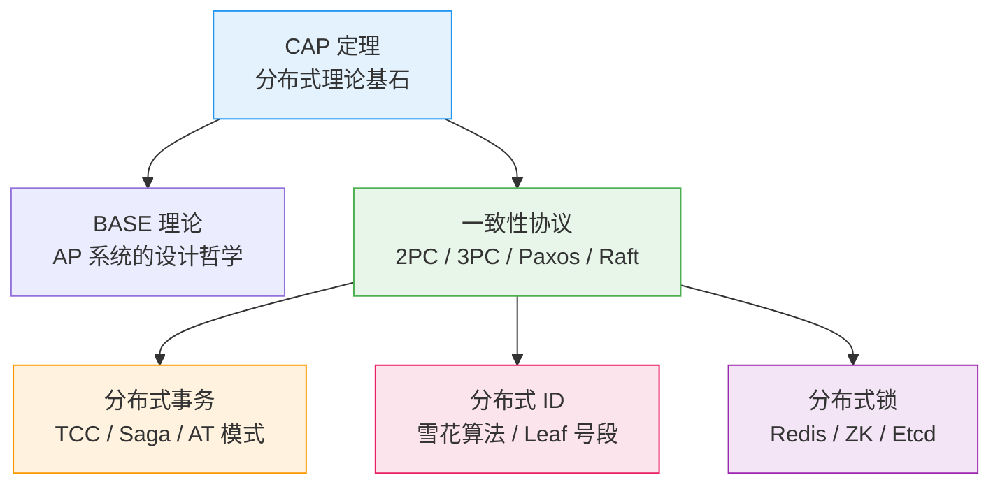
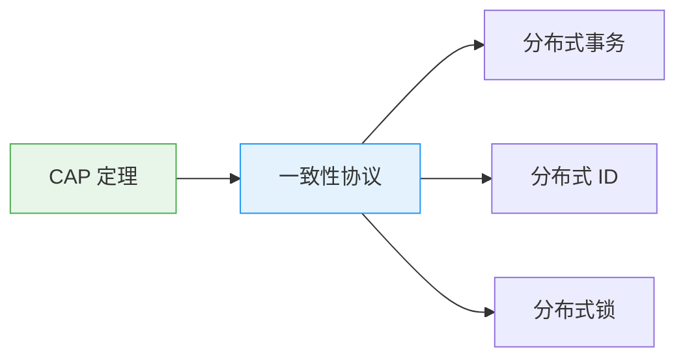

# 分布式理论总览

创建日期：2026-06-06

## 模块概述

分布式理论是理解高并发架构的**底层基石**。没有扎实的分布式理论基础，设计出来的高并发系统就是空中楼阁。本模块从 CAP 定理出发，逐步深入到一致性协议、分布式事务、分布式 ID 和分布式锁，构建完整的分布式知识体系。

::: tip 为什么分布式理论对高并发如此重要？
高并发系统天然是分布式的——多实例、多机房、多数据中心。分布式环境下，网络分区、节点故障、时钟不同步是常态。不理解 CAP、一致性协议、分布式事务，你就无法在面试中回答"这个设计为什么这么选"。
:::

## 知识全景图

## 各模块核心问题

| 模块 | 解决什么问题 | 为什么必考 | 面试深度 |
|------|-------------|-----------|---------|
| **CAP/BASE** | 分布式系统不可能同时满足 C、A、P，如何取舍？ | 分布式设计第一问，决定架构方向 | 能讲清楚 PACELC 才算过关 |
| **一致性协议** | 多个节点如何就某个值达成一致？ | 理解 ZK/Raft/Etcd 的底层原理 | 能画出 Raft 选举流程 |
| **分布式事务** | 跨多个服务/数据库的事务如何保证一致性？ | 微服务架构的核心难题 | 能对比 TCC/Saga/AT 选型 |
| **分布式 ID** | 分布式环境下如何生成全局唯一 ID？ | 几乎每个系统都要用 | 能讲清楚雪花算法 64bit 拆解 |
| **分布式锁** | 多个进程/线程如何安全地竞争共享资源？ | 秒杀/库存扣减等场景必用 | 能从 SETNX 演进到 RedLock |

## 学习路径建议

1. **先理解 CAP**：这是所有分布式理论的基石，理解为什么 CAP 不能同时满足。
2. **再学一致性协议**：理解了 2PC/3PC/Paxos/Raft，就理解了达成一致的底层机制。
3. **然后分三路**：分布式事务（一致性协议的应用）、分布式 ID（全局唯一性）、分布式锁（互斥性）。
4. **画图总结**：每个协议的状态流转画出来，面试时才能清晰表达。

## 面试考察重点

::: warning 高频考点
1. **CAP 为什么不能同时满足？** 画出网络分区场景下的取舍逻辑。
2. **Raft 选举过程**：Term、RequestVote、心跳机制，能画序列图。
3. **TCC 空回滚和悬挂**：这两个问题怎么产生的？怎么解决？
4. **雪花算法 64bit 拆解**：41 位时间戳 + 10 位机器 ID + 12 位序列号，时钟回拨怎么办？
5. **RedLock 争议**：Martin Kleppmann 的核心论点是什么？实际项目中怎么用？
:::

::: danger 容易翻车的点
- 混淆 CAP 和 ACID，CAP 是分布式系统的，ACID 是单机数据库的。
- 把 Paxos 和 Raft 当成一回事，说不清区别。
- 只知道 TCC 三个字母，讲不清楚 Try/Confirm/Cancel 具体做了什么。
- 分布式锁只说 SETNX，不知道看门狗、RedLock。
- 雪花算法说不清 64 位怎么分配的，时钟回拨没方案。
:::

## 参考资料

- 《Designing Data-Intensive Applications》（DDIA）—— Martin Kleppmann
- 《Paxos Made Simple》—— Leslie Lamport
- [Raft 可视化动画](https://raft.github.io/)
- [Seata 官方文档](https://seata.io/)
- [Redisson 分布式锁文档](https://github.com/redisson/redisson/wiki)

---

## 经典高频面试题

### Q1：CAP 为什么不能同时满足？画图说明。

**参考答案：**

在分布式系统中，网络分区（P）是不可避免的。当网络分区发生时，必须在 C（一致性）和 A（可用性）之间二选一：

- 选 C：拒绝写入，保证数据一致，但系统不可用。
- 选 A：允许写入，但两个分区的数据可能不一致。

CAP 不是"三个只能选两个"，而是"当 P 发生时，C 和 A 只能选一个"。没有网络分区时，C 和 A 可以同时满足。

### Q2：BASE 理论的核心思想是什么？和 ACID 有什么区别？

**参考答案：**

BASE 是 AP 系统的设计哲学：
- **BA（Basically Available）**：基本可用，允许部分功能降级。
- **S（Soft State）**：软状态，允许系统存在中间状态。
- **E（Eventually Consistent）**：最终一致性，不要求实时一致。

ACID 是单机数据库的事务特性（原子性、一致性、隔离性、持久性），追求强一致。BASE 是分布式系统的设计哲学，追求最终一致。两者不是对立，而是不同场景的选择。

### Q3：强一致性和最终一致性分别用在什么场景？

**参考答案：**

- **强一致性**：金融转账、库存扣减、支付——数据不一致会导致业务错误，必须强一致。
- **最终一致性**：社交动态、点赞数、浏览量——短暂不一致不影响用户体验，可以接受最终一致。
- 选型标准：涉及金钱和库存的选强一致，用户体验类的选最终一致。

### Q4：分布式理论的学习路径是什么？

**参考答案：**

CAP 定理 → BASE 理论 → 一致性协议（2PC/3PC → Paxos → Raft）→ 分布式事务（TCC/Saga/AT）→ 分布式 ID → 分布式锁。先理解"为什么"，再学"怎么做"，最后对比"选哪个"。

### Q5：ZooKeeper、Etcd、Nacos 分别是什么 CAP 类型？

**参考答案：**

- **ZooKeeper**：CP 系统。Leader 选举期间集群不可用，保证一致性。
- **Etcd**：CP 系统。基于 Raft，强一致，Kubernetes 的核心存储。
- **Nacos**：可切换 AP 和 CP。临时实例走 AP，持久实例走 CP。
- **Eureka**：AP 系统。优先保证可用性，自我保护机制宁可保留错误节点也不剔除。