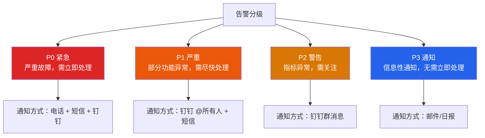
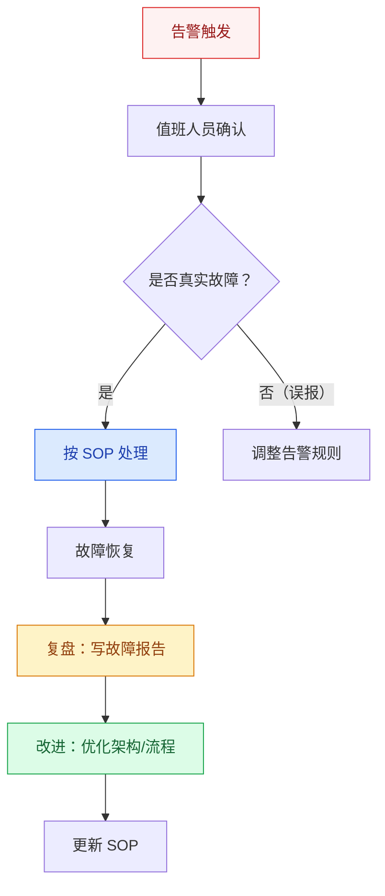
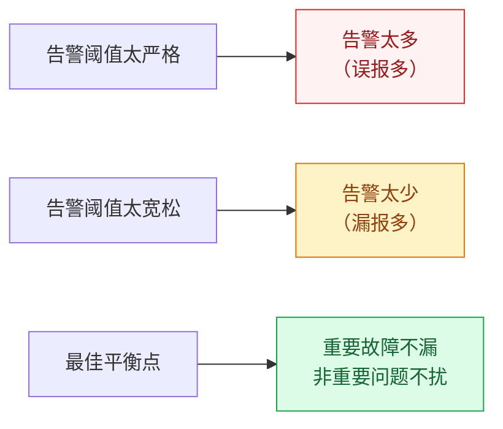

# 告警体系设计

## 概述

告警体系是监控的"最后一公里"——监控发现异常，告警通知到人，人响应处理。一个好的告警体系应该做到：**该告的告、不该告的不告、告了能快速响应**。

::: danger 告警设计原则
告警不是越多越好。告警风暴（一次故障触发几百条告警）是运维噩梦，真正的告警艺术是**降噪和精准**。
:::

## 一、告警分级



| 级别 | 定义 | 响应时间 | 示例 |
|------|------|----------|------|
| **P0** | 核心功能完全不可用 | 5 分钟内 | 支付接口全部 500、数据库宕机 |
| **P1** | 部分功能异常或性能严重下降 | 15 分钟内 | P99 延迟超过 1s、某服务错误率 10% |
| **P2** | 指标接近阈值，需要关注 | 1 小时内 | CPU 使用率超过 80%、磁盘使用率 85% |
| **P3** | 信息性通知 | 工作时间处理 | 证书即将过期、新版本发布 |

## 二、告警规则设计

### 2.1 阈值设置原则

| 指标 | 阈值示例 | 设置依据 |
|------|----------|----------|
| 错误率 | > 1%（持续 2 分钟） | 基于 SLA 目标（99.9%） |
| P99 延迟 | > 500ms（持续 5 分钟） | 基于用户体验目标 |
| QPS 掉零 | QPS == 0（持续 1 分钟） | 异常检测 |
| CPU 使用率 | > 90%（持续 5 分钟） | 基于容量预警 |
| 磁盘使用率 | > 85% | 基于容量预警 |

### 2.2 告警规则配置示例

```yaml
# Prometheus AlertManager 告警规则
groups:
  - name: application
    rules:
      # P0：错误率过高
      - alert: HighErrorRate
        expr: |
          sum(rate(http_requests_total{status=~"5.."}[1m])) 
          / sum(rate(http_requests_total[1m])) > 0.01
        for: 2m  # 持续 2 分钟才触发
        labels:
          severity: P0
        annotations:
          summary: "服务 {{ $labels.service }} 错误率超过 1%"
          description: "当前错误率 {{ $value | humanizePercentage }}"
      
      # P1：P99 延迟过高
      - alert: HighP99Latency
        expr: |
          histogram_quantile(0.99, 
            rate(http_request_duration_seconds_bucket[5m])) > 0.5
        for: 5m
        labels:
          severity: P1
        annotations:
          summary: "服务 {{ $labels.service }} P99 延迟超过 500ms"
      
      # P2：CPU 使用率过高
      - alert: HighCPUUsage
        expr: avg(rate(process_cpu_usage[5m])) > 0.9
        for: 5m
        labels:
          severity: P2
        annotations:
          summary: "服务 {{ $labels.service }} CPU 使用率超过 90%"
```

### 2.3 持续时间（for）的意义

`for` 参数是告警的重要"降噪"手段：指标必须**持续**超过阈值指定时间才触发告警，避免了瞬时波动导致的误报。

```
指标值
  ^
  |     .  ← 瞬时尖峰（不触发告警）
  |    / \
  |   /   \    ┌────────── 持续超过阈值 → 触发告警
  |  /     \   │
  | /       \──┤────────────────── 阈值线
  |/            \
  +----------------------------------> 时间
```

## 三、告警降噪

### 3.1 降噪策略

| 策略 | 含义 | 适用场景 |
|------|------|----------|
| **告警聚合** | 多条相同类型告警合并为一条 | 多个服务同时出现相同问题 |
| **告警抑制** | 高级别告警触发时抑制低级别 | P0 触发时抑制同一服务的 P1/P2 |
| **告警静默** | 维护期间手动关闭告警 | 计划内变更/升级 |
| **告警延迟** | 设置 `for` 持续时间，避免瞬时波动 | 所有告警规则 |

### 3.2 AlertManager 配置

```yaml
# alertmanager.yml
route:
  group_by: ['alertname', 'service']  # 按告警名和服务聚合
  group_wait: 30s       # 第一次告警等待 30s，收集同组告警
  group_interval: 5m    # 同组后续告警间隔 5 分钟
  repeat_interval: 4h   # 未恢复告警每 4 小时重复通知
  receiver: 'default'
  routes:
    - match:
        severity: P0
      receiver: 'pagerduty'  # P0 走电话通知
    - match:
        severity: P1
      receiver: 'dingtalk'   # P1 走钉钉

receivers:
  - name: 'default'
    email_configs:
      - to: 'ops@company.com'
  - name: 'dingtalk'
    webhook_configs:
      - url: 'https://oapi.dingtalk.com/robot/send'
  - name: 'pagerduty'
    pagerduty_configs:
      - service_key: 'xxx'
```

### 3.3 告警抑制规则

```yaml
# 抑制规则：P0 触发时，抑制同一服务的 P1/P2
inhibit_rules:
  - source_match:
      severity: 'P0'
    target_match:
      severity: 'P1'
    equal: ['service']  # 同一服务才抑制
    
  - source_match:
      severity: 'P0'
    target_match:
      severity: 'P2'
    equal: ['service']
```

## 四、告警响应流程（SOP）



**SOP 基本要素：**
1. **故障现象**：描述告警内容
2. **影响范围**：哪些用户/功能受影响
3. **排查步骤**：按顺序检查（日志、监控、数据库、下游）
4. **处理方案**：回滚/限流/降级/扩容
5. **升级路径**：多长时间未解决升级到谁

## 五、On-Call 轮值

| 要素 | 说明 |
|------|------|
| 值班周期 | 通常每周轮换 |
| 值班职责 | 接收告警、初步排查、触发升级 |
| 升级路径 | 值班人 → 模块负责人 → 技术经理 → CTO |
| 交接要求 | 交接文档记录当周故障和处理情况 |

## 六、告警误报与漏报的平衡



**调优策略：**
1. **从严格到宽松**：先设置较严格的阈值，上线后根据误报情况逐步调优
2. **分时段阈值**：白天和凌晨的阈值可以不同（凌晨流量低，阈值放宽）
3. **环比检测**：不只设置绝对值阈值，也设置"环比下降 50%"的异常检测
4. **定期复盘**：每月回顾告警数据，删除不再需要的规则，优化误报规则

---

## 面试题

### 1. 告警怎么分级？

**知识要点**：P0（5分钟响应/电话通知）、P1（15分钟/钉钉+短信）、P2（1小时/钉钉群）、P3（工作时间/邮件）。分级的核心不是"通知方式"，而是"响应时效的承诺"——P0必须在5分钟内有人接手，这决定了On-Call机制的设计。

**项目场景**：我们当时给一个金融系统设计告警分级，日均告警量约 300 条（优化前）。最初只分了"紧急"和"普通"两级，结果所有告警都标为"紧急"，值夜班的运维一晚上收到 80 条"紧急"告警，第 3 天就开始忽视告警了。

**踩坑经历**：告警分级最大的坑是"定义模糊"——什么叫"核心功能不可用"？是支付接口 500 就算，还是支付成功率下降 50% 才算？我们最初的定义是"支付接口返回非 200"，结果某天第三方支付网关超时 1 秒，触发了几千条 P0 告警，实际只有 3 笔支付真正失败了。后来我们把 P0 定义为"核心功能成功率 < 95% 且持续 2 分钟"，按业务维度（支付成功率）而非技术维度（HTTP 状态码）来判断，误报率从 60% 降到 5%。

**量化结果**：四级告警体系上线后，值班人员每晚收到的告警从 80 条降到 8 条（其中 P0 平均每晚 0-1 条）。P0 告警的响应时间从 12 分钟降到 3 分钟（因为数量少、定义清晰，不会被"狼来了"效应麻痹）。

**面试官追问**：
- "P0 告警触发后，5 分钟内没人响应怎么办？" → 升级机制：值班人 5 分钟未确认 → 通知团队 Leader（10 分钟未确认）→ 通知技术经理（15 分钟未确认）→ 通知 CTO（20 分钟未确认）。升级链条需要在告警系统里配置（PagerDuty/AlertManager 都支持 Escalation Policy），不能靠人工打电话。
- "P0/P1/P2/P3 的比例应该是多少比较健康？" → 理想状态 P0 占比 < 5%，P1 < 15%，P2 < 30%，P3 < 50%。如果 P0 太多说明系统太不稳定或阈值太敏感，如果 P3 太多说明很多告警没有意义。我们每月做一次告警统计和规则调优，目标是让 P0+P1 占比 < 20%。

---

### 2. 告警降噪怎么做？

**知识要点**：四种降噪手段——告警聚合（同类合并）、告警抑制（高优先级抑制低优先级）、告警静默（维护窗口）、持续时间 for（过滤瞬时毛刺）。降噪的目标不是"少告警"，而是"只告有价值的警"。

**项目场景**：我们当时在一次交换机故障中经历了真正的"告警风暴"——一个交换机挂了，引发 12 个服务不可达，每个服务触发了"错误率过高"、"健康检查失败"、"依赖服务不可用"三个告警，加上 P0/P1/P2/P3 四层，一秒钟内发出了 144 条告警通知。值班人员手机直接卡死。

**踩坑经历**：告警风暴后我们做了三层降噪——第一层告警聚合（相同 alertname 合并为一条，如"12 个服务健康检查失败"合并为"12 services health check failed"），第二层告警抑制（当交换机层面的"网络不可达"告警触发时，抑制所有依赖它的服务级告警——因为根因是交换机），第三层依赖拓扑（建立服务依赖关系图，根因告警发出后 10 分钟内不重复发症状告警）。但依赖拓扑维护成本很高——服务间依赖关系经常变化，拓扑图更新不及时又会导致"漏抑制"。

**量化结果**：三层降噪上线后，交换机故障场景下的告警量从 144 条降到 5 条（1 条根因告警 + 4 条受影响的关键服务告警）。日常告警量从日均 300 条降到 80 条，值班人员对告警的"可信度"评分从 3.2/5 提升到 4.5/5。

**面试官追问**：
- "告警抑制如果配错了，把真正的关键告警也抑制了怎么办？" → 我们设了一个"抑制白名单"——某些告警（如数据库宕机、核心支付错误率 > 10%）永远不被抑制，即使它们看起来像是某个根因的症状。因为数据库宕机可能同时是"网络故障的症状"和"独立的真实故障"。保险做法是：抑制规则只抑制 P2/P3，P0/P1 永远不被抑制。
- "for 参数（持续时间）设多少合适？设太短有瞬时毛刺，设太长故障发现太晚。" → 分指标类型：错误率类 for 2 分钟（错误率突然飙高通常不是毛刺），延迟类 for 5 分钟（延迟波动较大），CPU/内存类 for 10 分钟（资源指标变化慢）。核心原则：宁可晚上 2 分钟告警，也不要被瞬时毛刺频繁骚扰。

---

### 3. AlertManager 分组和抑制的区别？

**知识要点**：分组（Grouping）是"横向合并"——相同 alertname 的多条告警合并为一条通知。抑制（Inhibition）是"纵向屏蔽"——当高优先级告警触发时，低优先级的关联告警被静默。

**项目场景**：我们用了 AlertManager 的分组和抑制功能。分组按 `alertname + service` 维度，抑制按 `severity + service` 维度。一个典型的场景：数据库主库宕机（P0）→ 抑制了"订单服务错误率过高（P1，因为数据库连不上）"和"库存服务健康检查失败（P2）"。

**踩坑经历**：抑制规则配置不精确导致过度抑制——我们设了"P0 抑制同 service 的 P1/P2"，但有一次网关的限流触发（P1，该服务返回 429），恰好被同一个 service 级别的 P0 告警（OOM Kill）给抑制了。结果限流导致用户体验下降 30 分钟没人发现——因为限流的 P1 告警被 OOM 的 P0 告警抑制了。但这两个告警反映的是不同的问题，不应该抑制。后来我们把抑制规则从 `equal: ['service']` 细化到 `equal: ['service', 'alertname_prefix']`——只有同一服务且告警名有相同前缀的才会被抑制。

**量化结果**：修正抑制规则后，"过度抑制率"从 15% 降到 2%。同时分组功能把月均告警通知从 3000 条合并到 600 条。

**面试官追问**：
- "如果分组把 10 条告警合成 1 条，你怎么知道是哪 10 个服务出了问题？" → 分组通知里会列出所有受影响的 service 列表（通过 AlertManager 的模板渲染）。我们的通知模板是："[P1] 5 services health check failed: order-service, payment-service, inventory-service, ..."。如果需要详细看每个服务的指标，点击通知里的 Grafana 链接。
- "AlertManager 如果本身挂了怎么办？" → AlertManager 支持集群部署（Gossip 协议），三节点部署可以保证高可用。如果真的全挂了，Prometheus 会缓存告警（最多 2 小时），AlertManager 恢复后补发。但最怕的是"静悄悄地挂"——所以我们给 AlertManager 做了存活监控（心跳告警），如果 AlertManager 超过 2 分钟未响应则通过备用通道（如直接调用钉钉 Webhook）发告警。

---

### 4. 怎么避免告警风暴？

**知识要点**：告警风暴 = 单一根因触发连锁告警。避免策略——告警聚合（同类合并）、告警抑制（根因优先）、告警延迟（for 参数）、告警限流（repeat_interval）、依赖拓扑（建服务依赖图）。

**项目场景**：我们经历的最严重告警风暴是一次 K8s 集群的网络分区——30 个 Pod 被误判为不健康并重启，每个 Pod 触发 3 条告警（重启、健康检查失败、错误率飙升），5 分钟内产生了 270 条告警。

**踩坑经历**：这次风暴暴露了一个根本问题——我们的告警规则是"逐 Pod"而非"逐 Service"粒度的。每个 Pod 独立触发告警，没有在 Service 级别聚合。后来我们把告警规则改为 Service 级别："错误率 = 所有 Pod 的平均错误率"，只有当 Service 整体异常时才告警，单个 Pod 的异常只记录但不告警（除非是所有 Pod 全挂了）。

**量化结果**：改为 Service 级别聚合后，同样的 K8s 故障场景下告警量从 270 条降到 8 条。告警通知的第一句话就是核心信息："Order-Service P99 延迟从 200ms 涨到 3s，受影响 Pod 12/15"——值班人员一眼就能看出严重程度和范围。

**面试官追问**：
- "依赖拓扑怎么维护？有什么自动化方案？" → 我们基于 SkyWalking 的拓扑数据自动生成服务依赖图——SkyWalking 的 Agent 会自动采集服务间的调用关系，我们写了脚本每天从 SkyWalking API 导出依赖关系，更新到 AlertManager 的抑制规则中。但这套方案有 36 小时的延迟（SkyWalking 需要积累足够的数据才能准确反映依赖关系），对于紧急情况需要手动修正。
- "有没有遇到过'告警静默期过长导致真正故障没人知道'的情况？" → 有过——一次计划内的数据库迁移设置了 4 小时维护窗口（静默所有告警），结果迁移失败数据库挂了，但因为还在静默窗口内，没人收到告警。后来我们加了一个"安全阀"：静默窗口最多持续 2 小时，如果需要更长时间，必须每 2 小时手动续期并确认"系统仍正常"。

---

### 5. 告警误报和漏报怎么平衡？

**知识要点**：误报多导致运维疲劳忽视告警，漏报多导致故障发现晚。平衡策略——分指标定阈值（不同指标不同容忍度）、持续观察（for 参数）、环比检测（不只是绝对值）、定期复盘（每月调优）、分时段阈值（白天严/凌晨松）。

**项目场景**：我们的告警系统刚上线时，"CPU 使用率 > 80%"触发了大量深夜告警——原因是凌晨的批处理任务（数据统计、索引重建）会短暂拉高 CPU。凌晨 3 点的告警把值班人员叫醒后发现"哦，是批处理"，骂一句又睡了。

**踩坑经历**：处理深夜误报的简单办法是"分时段阈值"——白天 CPU 阈值 75%，凌晨（0:00-6:00）放宽到 95%。但这个方案有个漏洞：如果凌晨 3 点真的出现了 CPU 异常（非批处理引起），可能被放过。所以我们在"分时段阈值"基础上加了"环比检测"——如果凌晨 CPU 突然从日常的 40% 飙到 90% 且持续 10 分钟，即使没到 95% 也得告警（因为环比涨幅异常）。

**量化结果**：分时段阈值 + 环比检测上线后，深夜误报率从 40% 降到 3%，同时漏过了 0 起真实故障（环比检测兜底）。整体告警有效性从 55% 提升到 82%。

**面试官追问**：
- "环比检测的阈值怎么设？" → 我们设的是"过去 5 分钟的平均值与过去 1 小时的平均值对比，偏差超过 50% 且绝对值超过一定门槛"就告警。注意要加"绝对值门槛"——否则 CPU 从 1% 涨到 2%（环比涨 100%），虽然涨幅大但绝对值很小，没必要告警。
- "怎么量化评估告警体系的好坏？" → 三个指标：(1) 告警准确率 = 真实故障告警数 / 总告警数（目标 > 80%）；(2) 平均发现时间（MTTD，Mean Time To Detect，目标 < 2 分钟）；(3) 告警疲劳度 = 每位值班人员每晚收到的告警数（目标 < 10 条）。如果告警疲劳度 > 20 条/晚，说明降噪做得不够。

---

### 6. SOP 流程包含哪些环节？

**知识要点**：标准 SOP = 发现 → 确认 → 处理 → 恢复 → 复盘 → 改进。SOP 的关键是"提前准备常见故障的处理方案"，做到故障发生时"一键执行"而非"临时想办法"。

**项目场景**：我们当时为 5 类最常见的故障编写了 SOP（数据库宕机、Redis 不可用、MQ 积压、CPU 打满、磁盘满），每类 SOP 都有明确的排查步骤和处理方案。

**踩坑经历**：SOP 最大的问题是"写了但没人看"——故障来了大家还是凭经验和习惯操作，不按 SOP 来。直到有一次 Redis 故障，值班人直接重启 Redis（SOP 要求先检查持久化状态），结果 RDB 文件损坏导致 30 万条缓存数据丢失。事后复盘时才发现——如果按 SOP 做，第一步是 `redis-cli INFO persistence` 检查 RDB 状态，发现有异常应该先手动 `BGSAVE` 再做重启。这个事故让我们把 SOP 从"参考文档"变成了"强制流程"——故障处理必须在工单系统中按 SOP 步骤逐条打勾，跳步操作需要 Leader 审批。

**量化结果**：SOP 强制执行后，误操作导致的事故从每年 6 起降到 1 起。新人在 On-Call 时的独立处理率从 30% 提升到 70%（有 SOP 指导，不需要每次都打电话问 Leader）。

**面试官追问**：
- "SOP 多久更新一次？怎么保证它不是过期的？" → 每次故障复盘后必须更新相关 SOP（作为复盘 Action Item 之一），如果 SOP 没有更新则复盘不算完成。每季度做一次 SOP 演练（桌面推演），验证 SOP 是否仍然有效——演练中发现的 SOP 问题也必须更新。
- "SOP 里的'一键执行'是怎么实现的？不会出问题吗？" → "一键执行"是通过运维自动化平台（如 Jenkins Job 触发脚本）实现的，比如"数据库从库切换为主库"是一个 Jenkins Job，SOP 里写的是"点击链接 → 确认弹窗 → 执行"。每个"一键执行"都有前置条件校验（如"确认主库确实不可达"）和回滚方案。关键是不能让"一键执行"变成"一键闯祸"。