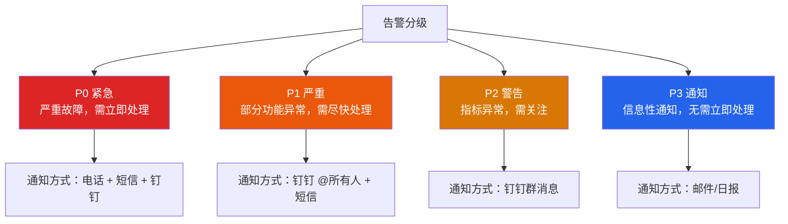
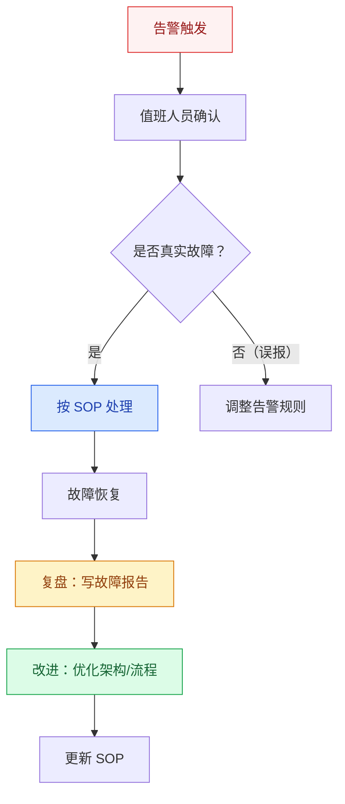
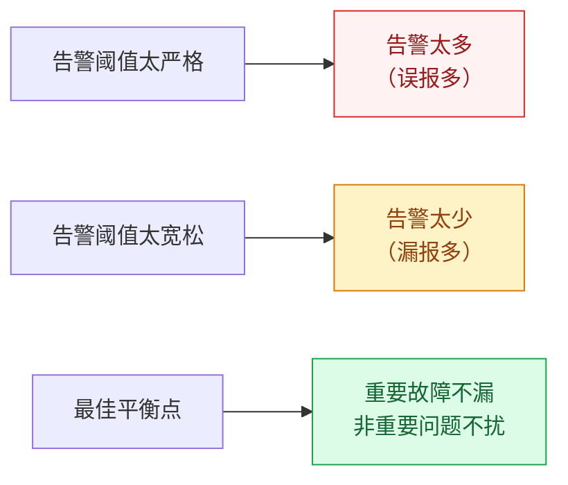

# 告警体系设计

## 概述

告警体系是监控的"最后一公里"——监控发现异常，告警通知到人，人响应处理。一个好的告警体系应该做到：**该告的告、不该告的不告、告了能快速响应**。

::: danger 告警设计原则
告警不是越多越好。告警风暴（一次故障触发几百条告警）是运维噩梦，真正的告警艺术是**降噪和精准**。
:::

## 一、告警分级



| 级别 | 定义 | 响应时间 | 示例 |
|------|------|----------|------|
| **P0** | 核心功能完全不可用 | 5 分钟内 | 支付接口全部 500、数据库宕机 |
| **P1** | 部分功能异常或性能严重下降 | 15 分钟内 | P99 延迟超过 1s、某服务错误率 10% |
| **P2** | 指标接近阈值，需要关注 | 1 小时内 | CPU 使用率超过 80%、磁盘使用率 85% |
| **P3** | 信息性通知 | 工作时间处理 | 证书即将过期、新版本发布 |

## 二、告警规则设计

### 2.1 阈值设置原则

| 指标 | 阈值示例 | 设置依据 |
|------|----------|----------|
| 错误率 | > 1%（持续 2 分钟） | 基于 SLA 目标（99.9%） |
| P99 延迟 | > 500ms（持续 5 分钟） | 基于用户体验目标 |
| QPS 掉零 | QPS == 0（持续 1 分钟） | 异常检测 |
| CPU 使用率 | > 90%（持续 5 分钟） | 基于容量预警 |
| 磁盘使用率 | > 85% | 基于容量预警 |

### 2.2 告警规则配置示例

```yaml
# Prometheus AlertManager 告警规则
groups:
  - name: application
    rules:
      # P0：错误率过高
      - alert: HighErrorRate
        expr: |
          sum(rate(http_requests_total{status=~"5.."}[1m])) 
          / sum(rate(http_requests_total[1m])) > 0.01
        for: 2m  # 持续 2 分钟才触发
        labels:
          severity: P0
        annotations:
          summary: "服务 {{ $labels.service }} 错误率超过 1%"
          description: "当前错误率 {{ $value | humanizePercentage }}"
      
      # P1：P99 延迟过高
      - alert: HighP99Latency
        expr: |
          histogram_quantile(0.99, 
            rate(http_request_duration_seconds_bucket[5m])) > 0.5
        for: 5m
        labels:
          severity: P1
        annotations:
          summary: "服务 {{ $labels.service }} P99 延迟超过 500ms"
      
      # P2：CPU 使用率过高
      - alert: HighCPUUsage
        expr: avg(rate(process_cpu_usage[5m])) > 0.9
        for: 5m
        labels:
          severity: P2
        annotations:
          summary: "服务 {{ $labels.service }} CPU 使用率超过 90%"
```

### 2.3 持续时间（for）的意义

`for` 参数是告警的重要"降噪"手段：指标必须**持续**超过阈值指定时间才触发告警，避免了瞬时波动导致的误报。

```
指标值
  ^
  |     .  ← 瞬时尖峰（不触发告警）
  |    / \
  |   /   \    ┌────────── 持续超过阈值 → 触发告警
  |  /     \   │
  | /       \──┤────────────────── 阈值线
  |/            \
  +----------------------------------> 时间
```

## 三、告警降噪

### 3.1 降噪策略

| 策略 | 含义 | 适用场景 |
|------|------|----------|
| **告警聚合** | 多条相同类型告警合并为一条 | 多个服务同时出现相同问题 |
| **告警抑制** | 高级别告警触发时抑制低级别 | P0 触发时抑制同一服务的 P1/P2 |
| **告警静默** | 维护期间手动关闭告警 | 计划内变更/升级 |
| **告警延迟** | 设置 `for` 持续时间，避免瞬时波动 | 所有告警规则 |

### 3.2 AlertManager 配置

```yaml
# alertmanager.yml
route:
  group_by: ['alertname', 'service']  # 按告警名和服务聚合
  group_wait: 30s       # 第一次告警等待 30s，收集同组告警
  group_interval: 5m    # 同组后续告警间隔 5 分钟
  repeat_interval: 4h   # 未恢复告警每 4 小时重复通知
  receiver: 'default'
  routes:
    - match:
        severity: P0
      receiver: 'pagerduty'  # P0 走电话通知
    - match:
        severity: P1
      receiver: 'dingtalk'   # P1 走钉钉

receivers:
  - name: 'default'
    email_configs:
      - to: 'ops@company.com'
  - name: 'dingtalk'
    webhook_configs:
      - url: 'https://oapi.dingtalk.com/robot/send'
  - name: 'pagerduty'
    pagerduty_configs:
      - service_key: 'xxx'
```

### 3.3 告警抑制规则

```yaml
# 抑制规则：P0 触发时，抑制同一服务的 P1/P2
inhibit_rules:
  - source_match:
      severity: 'P0'
    target_match:
      severity: 'P1'
    equal: ['service']  # 同一服务才抑制
    
  - source_match:
      severity: 'P0'
    target_match:
      severity: 'P2'
    equal: ['service']
```

## 四、告警响应流程（SOP）



**SOP 基本要素：**
1. **故障现象**：描述告警内容
2. **影响范围**：哪些用户/功能受影响
3. **排查步骤**：按顺序检查（日志、监控、数据库、下游）
4. **处理方案**：回滚/限流/降级/扩容
5. **升级路径**：多长时间未解决升级到谁

## 五、On-Call 轮值

| 要素 | 说明 |
|------|------|
| 值班周期 | 通常每周轮换 |
| 值班职责 | 接收告警、初步排查、触发升级 |
| 升级路径 | 值班人 → 模块负责人 → 技术经理 → CTO |
| 交接要求 | 交接文档记录当周故障和处理情况 |

## 六、告警误报与漏报的平衡



**调优策略：**
1. **从严格到宽松**：先设置较严格的阈值，上线后根据误报情况逐步调优
2. **分时段阈值**：白天和凌晨的阈值可以不同（凌晨流量低，阈值放宽）
3. **环比检测**：不只设置绝对值阈值，也设置"环比下降 50%"的异常检测
4. **定期复盘**：每月回顾告警数据，删除不再需要的规则，优化误报规则

---

## 面试题

### 1. 告警怎么分级？

**P0-P3 四级模型：**
- **P0 紧急**：核心功能不可用（支付失败、首页打不开），5 分钟内响应，电话通知
- **P1 严重**：部分功能异常（某接口失败率 10%），15 分钟内响应，钉钉+短信
- **P2 警告**：指标接近阈值（CPU 90%），1 小时内响应，钉钉群消息
- **P3 通知**：信息性通知（证书过期预警），工作时间处理，邮件

### 2. 告警降噪怎么做？

**四种降噪手段：**
1. **告警聚合**：相同告警名的多条告警合并为一条，避免告警风暴
2. **告警抑制**：P0 触发时抑制同服务的 P1/P2，避免重复告警
3. **告警静默**：维护窗口期间手动关闭告警
4. **持续时间（for）**：设置 `for: 5m`，瞬时波动不触发告警

### 3. AlertManager 分组和抑制的区别？

| 机制 | 作用 | 场景 |
|------|------|------|
| **分组（Grouping）** | 多条相同类型告警合并为一条通知 | 5 个服务同时报 CPU 高 → 1 条通知 |
| **抑制（Inhibition）** | 高级别告警抑制低级别告警 | 数据库宕机（P0）→ 抑制依赖它的服务报错（P1） |

**关键区别**：分组是横向合并（同类型多条→一条），抑制是纵向屏蔽（高级别→屏蔽低级别）。

### 4. 怎么避免告警风暴？

**告警风暴**：一次故障导致短时间内触发大量告警通知。

**避免策略：**
1. **告警聚合**：同类型告警合并为一条
2. **告警抑制**：根因告警抑制症状告警（如数据库宕机抑制服务报错）
3. **告警延迟**：设置 `for` 持续时间，过滤瞬时波动
4. **告警限流**：同一告警最短重复间隔（如 4 小时）
5. **依赖拓扑**：建立服务依赖关系，只告警根因

### 5. 告警误报和漏报怎么平衡？

**这是告警体系的核心矛盾：**
- **阈值太严** → 误报多 → 运维疲劳 → 忽视告警
- **阈值太松** → 漏报多 → 故障发现晚

**平衡策略：**
1. **分指标定阈值**：不同指标有不同的容忍度（错误率 1% vs CPU 80%）
2. **持续观察**：不只看瞬时值，看持续超过阈值（`for: 5m`）
3. **环比检测**：不只绝对值，也看环比变化（如"QPS 突然下降 50%"）
4. **定期复盘**：每月回顾告警数据，调整规则
5. **分时段阈值**：白天严格，凌晨宽松

### 6. SOP 流程包含哪些环节？

**标准 SOP 流程：**
1. **发现**：收到告警通知
2. **确认**：判断是否为真实故障（查看监控大盘、日志）
3. **处理**：按预定义方案执行（回滚/扩容/降级/限流）
4. **恢复**：确认故障恢复，观察一段时间
5. **复盘**：写故障报告（时间线、根因、影响、改进措施）
6. **改进**：根据复盘结果优化架构/流程/监控

**SOP 的关键**：不是"出了事再想怎么办"，而是**提前准备好常见故障的处理方案**，真正做到"一键执行"。