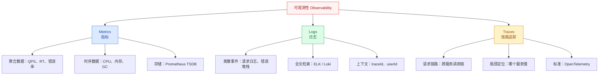
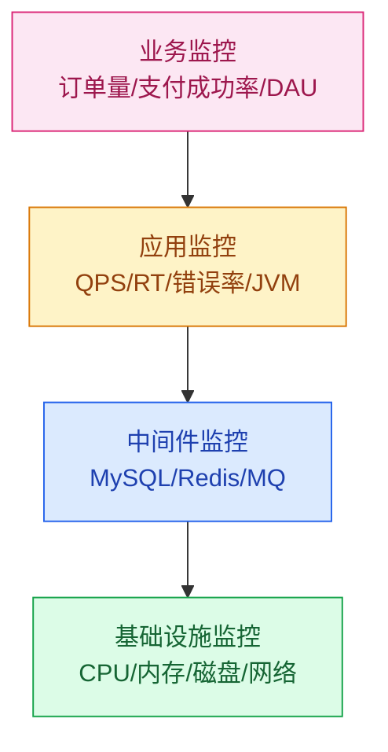

# 监控告警体系

## 模块概述

监控告警是高并发系统的"眼睛"和"耳朵"——没有监控，系统就是黑盒运行；没有告警，故障发生了都不知道。本模块覆盖从指标体系设计到告警规则配置的完整方法论。

::: tip 核心思路
监控不是"装个 Prometheus + Grafana 就完事了"，而是**指标定义 → 采集 → 存储 → 可视化 → 告警 → 响应**的完整工程体系。
:::

::: warning 面试重点
高级工程师面试中，监控相关的问题往往考察"你如何发现和定位线上问题"，而非"你用过什么监控工具"。
:::

## 可观测性三大支柱



| 支柱 | 解决的问题 | 典型工具 | 数据特点 |
|------|-----------|----------|----------|
| **Metrics** | 系统现在健康吗？ | Prometheus + Grafana | 聚合时序数据，低存储成本 |
| **Logs** | 发生了什么？ | ELK / Loki | 离散事件，全量上下文 |
| **Traces** | 请求经过了哪些服务？ | Jaeger / SkyWalking | 链路调用关系 |

## 监控体系分层



## 黄金监控指标

### 四大黄金指标（Google SRE）

| 指标 | 含义 | 高并发场景关注点 |
|------|------|-----------------|
| **延迟 Latency** | 请求处理时间 | P99/P999 长尾延迟 |
| **流量 Traffic** | 系统负载量 | QPS/TPS、并发连接数 |
| **错误 Errors** | 失败请求比例 | 错误率、错误码分布 |
| **饱和度 Saturation** | 资源使用程度 | 连接池、线程池、队列长度 |

### RED 方法论（适用于微服务）

- **Rate**：每秒请求数
- **Errors**：错误请求比例
- **Duration**：请求耗时分布

### USE 方法论（适用于资源）

- **Utilization**：资源利用率（如 CPU 使用率）
- **Saturation**：资源饱和度（如队列长度）
- **Errors**：资源错误数（如磁盘 IO 错误）

## 监控数据流

```
应用(Micrometer) → Prometheus(Pull) → TSDB 存储 → Grafana 可视化
                                              ↓
                                     AlertManager → 告警通知
```

## 学习路径

1. **指标采集与 Prometheus**：理解 Prometheus Pull 模型、Metrics 类型、PromQL 查询
2. **告警体系设计**：掌握告警分级、降噪、路由、响应流程

---

## 面试题

### 1. 可观测性三大支柱的关系是什么？

**知识要点**：Metrics、Logs、Traces 三者互补，通过 traceId 串联形成完整的故障排查链路。Metrics 告诉你"有异常"（如 QPS 突然下降 50%），Traces 定位"哪个环节异常"（如支付服务的调用在 200ms 超时），Logs 提供"原因是什么"（如 NullPointerException 堆栈）。

**项目场景**：我们当时的监控体系用了 Prometheus（Metrics）+ ELK（Logs）+ SkyWalking（Traces）三件套。线上 300 个微服务节点，日均产生 20TB 日志。没有这三个支柱的联动之前，每次故障排查平均耗时 45 分钟——先看 Grafana 大盘找异常服务，再登录服务器 grep 日志，最后靠经验猜测调用链。

**踩坑经历**：三大支柱联动的关键是 traceId 的生成和透传。我们第一次上线时，网关生成 traceId 并放到 HTTP Response Header 返回给前端，但前端没有把 traceId 带到下一次请求中——导致用户报错时我们拿不到 traceId，只能根据"用户 ID + 时间戳"在 ELK 里大海捞针。后来改为：前端每次请求把上一次 Response 中的 traceId 放到 Request Header `X-Trace-Id`，网关如果收到就沿用，没收到则新建。第二个坑：SkyWalking 的 Trace 上报是异步批量发送的，高峰期有 30 秒延迟——故障刚发生时 Trace 还没到 SkyWalking，只能先看 Metrics 和 Logs。

**量化结果**：三支柱联动完善后，故障平均定位时间从 45 分钟降到 8 分钟。监控覆盖率从 60%（只覆盖了应用层）提升到 95%（覆盖到中间件和基础设施层）。

**面试官追问**：
- "如果 Metrics 告警了但 Traces 里没看到异常，可能是什么原因？" → 三种可能：(1) Metrics 阈值设太敏感（瞬时波动触发告警但实际没问题）；(2) Traces 采样率太低（如采样 10%，异常请求刚好没被采到）；(3) 基础设施层的问题（如磁盘 IO 慢、网络丢包）不会体现在 Traces 的 Span 里，但 Metrics 的 CPU/Disk 指标会暴露。所以 Metrics 和 Traces 不是一一对应的。
- "小公司资源有限，三大支柱怎么取舍？" → 优先级：Metrics > Logs > Traces。先上 Prometheus + Grafana（最便宜，300 元/月的云服务器就能跑），再上 ELK（日志集中存储，成本中等），最后有钱了上 SkyWalking/Jaeger（链路追踪，存储成本最高）。如果只能选一个，选 Metrics——至少系统挂了你能知道。

---

### 2. 四大黄金指标分别关注什么？

**知识要点**：Google SRE 的四大黄金指标——延迟（Latency）、流量（Traffic）、错误（Errors）、饱和度（Saturation）。延迟关注 P99/P999 长尾，流量关注 QPS/TPS 趋势，错误关注错误率（显式+隐式），饱和度关注资源瓶颈（CPU/内存/连接池/队列）。

**项目场景**：我们当时为微服务集群建立标准化监控大盘，每个服务一个 Grafana Dashboard，统一展示四大黄金指标。但是 Dashboard 刚上线时，大家反映"信息太多看不完"。

**踩坑经历**：四大黄金指标的关键不是"四个都看"，而是"先看饱和度，再看错误率"。我们最初把四个指标平铺展示，运维看了一眼觉得"都挺正常的"就跳过了——结果一个服务的线程池队列积压了 2000 个请求（饱和度异常），但 QPS 和 RT 还没暴露问题（因为请求还在排队，没到超时）。到超时那一瞬间错误率从 0% 跳到 30%，已经晚了。后来调整了 Dashboard 布局：饱和度（连接池/线程池/队列）放在最上面，下面才是 RT 和错误率。

**量化结果**：Dashboard 布局调整后，故障的"预警发现率"从 20%（都是错误率飙升后才报警）提升到 65%（饱和度异常时就被发现并处理）。平均故障恢复时间（MTTR）从 25 分钟降到 12 分钟。

**面试官追问**：
- "隐式错误是什么？举个例子。" → 隐式错误是返回了 HTTP 200 但内容不对——比如商品详情页返回了"库存为空"（HTTP 200），但实际上接口超时降级返回了默认空数据。如果只看 HTTP 状态码，错误率是 0%，但用户看到空白页。我们的做法是在业务代码中埋点"降级次数"、"空数据返回次数"作为隐式错误指标，这些也被计入四大黄金指标的 Errors。
- "饱和度的告警阈值怎么设？" → 不是"80% 就告警"，要分资源类型——CPU 用 70%（留 30% 应对突发），内存用 85%（GC 需要空间），线程池队列用 50%（排队超过一半就说明处理能力不够了），数据库连接池用 70%。阈值定好之后还要观察 2 周看误报率，再微调。

---

### 3. RED 和 USE 分别适用什么场景？

**知识要点**：RED（Rate/Errors/Duration）适用于请求驱动型服务（如 HTTP API），关注每个 endpoint 的流量、错误率和延迟。USE（Utilization/Saturation/Errors）适用于资源型组件（如数据库、缓存、消息队列），关注资源利用率、饱和度、错误。

**项目场景**：我们当时做监控标准化，要求所有 HTTP 服务使用 RED 指标（在 Spring Boot Actuator 中暴露 `/actuator/prometheus`），所有中间件使用 USE 指标（通过专用 Exporter 采集）。

**踩坑经历**：我们尝试给 Redis 套用 RED 指标——统计 Redis 的 QPS、RT、错误率。结果 Redis 的 RT 非常稳定（0.5ms），即使内存使用率到 95% 时 RT 也没有明显变化——因为 Redis 的单线程模型在内存满之前性能不会下降，只是触发 maxmemory 淘汰策略。真正的瓶颈是"内存使用率"和"连接数"（USE 指标），但 RED 指标完全没反映出来。这个教训说明——选错方法论比没有方法论更危险。

**量化结果**：中间件统一采用 USE 指标后，Redis 的内存使用率告警从"无"变为"提前 30 分钟预警"，避免了 3 次 Redis 内存打满导致的服务不可用。

**面试官追问**：
- "一个服务既是请求驱动型（对外提供 HTTP API），内部又依赖资源型组件（MySQL），怎么选方法论？" → 双重覆盖——对外用 RED（关注 QPS/RT/错误率，面向业务），对内用 USE（关注连接池/内存/CPU，面向运维）。实际上大部分服务都需要同时看 RED 和 USE。
- "有没有比 RED/USE 更简单实用的方法？" → 有——"最重要三指标"法：对于任何服务，只需回答三个问题——"有没有在处理请求？"（QPS）、"处理得快不快？"（P99 RT）、"有没有出错？"（错误率）。这三个指标覆盖了 80% 的监控需求，剩下的 20% 才需要更细粒度的 USE/RED。

---

### 4. 监控体系分层怎么设计？

**知识要点**：四层监控——基础设施层（CPU/内存/磁盘/网络）、中间件层（MySQL/Redis/MQ）、应用层（QPS/RT/错误率/JVM）、业务层（订单量/支付成功率/DAU）。四层之间通过 traceId 和 hostname 关联，从业务异常可以一直钻取到基础设施指标。

**项目场景**：我们当时给一个电商系统搭建统一的监控平台，四层用了不同的工具——基础设施用 Node Exporter + Prometheus，中间件用各官方 Exporter（Redis Exporter/MySQL Exporter），应用层用 Micrometer + Actuator，业务层用自定义埋点 + InfluxDB。

**踩坑经历**：四层监控最大的坑是"信息孤岛"——业务监控显示"支付成功率下降 5%"，但我无法从 Grafana 面板直接钻取到"是哪个服务、哪台机器、哪个数据库出了问题"。因为每一层监控用不同的工具和数据源，数据没有打通。后来我们强制规范化了所有监控数据的 Label（`service_name`、`hostname`、`datacenter`），在 Grafana 里做了联动跳转链接——点击业务层的异常统计数据，可以一键跳转到对应服务的应用层面板，再到中间件面板。

**量化结果**：四层监控面板联动后，从"发现业务异常"到"定位技术根因"的时间从 20 分钟降到 5 分钟。监控告警的误报率从 35% 降到 12%（因为通过多层关联可以做告警降噪——"业务层下降 + 应用层正常 = 可能是业务活动波动，不告警"）。

**面试官追问**：
- "告警应该基于哪一层的指标？业务层异常才告警还是应用层异常就告警？" → 告警优先级：业务层 > 应用层 > 中间件层 > 基础设施层。业务层的"支付成功率下降"一定告警（P0），而"某台机器 CPU 80%"可能只是 P2（因为还有负载均衡分摊）。但要注意——如果应用层的"错误率超过 5%"但业务层还没反映出来（业务有降级兜底），也应该告警（P1），因为这说明降级正在生效，核心链路某个环节已经出了问题。
- "日志怎么和 Metrics 联动？" → 在 Metrics 告警的通知中附带"一键跳转 ELK"的链接——链接中包含 service_name、时间范围、traceId（如果有）作为查询参数，点开就是过滤好的日志。这个体验优化把"收到告警 → 看到日志"的时间从 2 分钟（手动输入查询条件）降到 5 秒。

---

### 5. Metrics / Logs / Traces 什么时候用哪个？

**知识要点**：日常巡检用 Metrics（聚合查询快），故障告警用 Metrics（可设阈值），故障定位用 Traces（看调用链），根因分析用 Logs（最详细上下文）。

**项目场景**：我们当时的故障处理 SOP 规定了"三阶段排查"——第一阶段 3 分钟（看 Metrics 大盘和告警，确认故障范围和严重程度），第二阶段 5 分钟（看 Traces 调用链，定位到具体服务和接口），第三阶段不限（看 Logs，深入代码级别根因）。

**踩坑经历**：有一次 Metrics 和 Traces 都显示"库存服务正常"，但 Logs 里有大量 `Duplicate entry for key 'PRIMARY'` 错误——原因是业务方传了重复的订单 ID，库存服务拒绝处理（返回了错误码，但业务方没有重试，所以 Metrics 的错误率只有 0.1%，被忽略了）。最后是客服收到用户投诉才发现的——如果只看 Metrics 和 Traces，这个故障就被漏掉了。

**量化结果**：三阶段排查 SOP 固化后，每次故障都能在规定时间内完成定位。SOP 配合自动化 runbook（预定义的排查命令），P1 故障的平均处理时间从 35 分钟降到 15 分钟。

**面试官追问**：
- "ELK 日志量太大，搜索很慢，有什么优化技巧？" → (1) 日志分级——ERROR/WARN 单独索引（优先级高，保留 30 天），INFO/DEBUG 合并索引（优先级低，保留 7 天）；(2) 按服务名建索引（`logs-order-service-2026.06`），不要全量打到一个索引里；(3) 搜索时优先用"短语匹配"而非"模糊搜索"。我们优化后 ELK 搜索 RT 从 12 秒降到 1.5 秒。
- "Traces 的采样率应该设多少？" → 正常流量采样 10%（够用了，成本可控），错误流量 100% 采样（关键故障不能漏），压测流量 100% 采样（排查瓶颈需要）。SkyWalking 和 Jaeger 都支持动态采样策略。 |