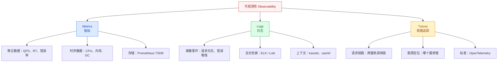
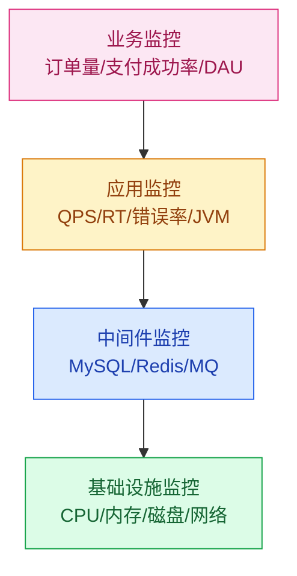

# 监控告警体系

## 模块概述

监控告警是高并发系统的"眼睛"和"耳朵"——没有监控，系统就是黑盒运行；没有告警，故障发生了都不知道。本模块覆盖从指标体系设计到告警规则配置的完整方法论。

::: tip 核心思路
监控不是"装个 Prometheus + Grafana 就完事了"，而是**指标定义 → 采集 → 存储 → 可视化 → 告警 → 响应**的完整工程体系。
:::

::: warning 面试重点
高级工程师面试中，监控相关的问题往往考察"你如何发现和定位线上问题"，而非"你用过什么监控工具"。
:::

## 可观测性三大支柱



| 支柱 | 解决的问题 | 典型工具 | 数据特点 |
|------|-----------|----------|----------|
| **Metrics** | 系统现在健康吗？ | Prometheus + Grafana | 聚合时序数据，低存储成本 |
| **Logs** | 发生了什么？ | ELK / Loki | 离散事件，全量上下文 |
| **Traces** | 请求经过了哪些服务？ | Jaeger / SkyWalking | 链路调用关系 |

## 监控体系分层



## 黄金监控指标

### 四大黄金指标（Google SRE）

| 指标 | 含义 | 高并发场景关注点 |
|------|------|-----------------|
| **延迟 Latency** | 请求处理时间 | P99/P999 长尾延迟 |
| **流量 Traffic** | 系统负载量 | QPS/TPS、并发连接数 |
| **错误 Errors** | 失败请求比例 | 错误率、错误码分布 |
| **饱和度 Saturation** | 资源使用程度 | 连接池、线程池、队列长度 |

### RED 方法论（适用于微服务）

- **Rate**：每秒请求数
- **Errors**：错误请求比例
- **Duration**：请求耗时分布

### USE 方法论（适用于资源）

- **Utilization**：资源利用率（如 CPU 使用率）
- **Saturation**：资源饱和度（如队列长度）
- **Errors**：资源错误数（如磁盘 IO 错误）

## 监控数据流

```
应用(Micrometer) → Prometheus(Pull) → TSDB 存储 → Grafana 可视化
                                              ↓
                                     AlertManager → 告警通知
```

## 学习路径

1. **指标采集与 Prometheus**：理解 Prometheus Pull 模型、Metrics 类型、PromQL 查询
2. **告警体系设计**：掌握告警分级、降噪、路由、响应流程

---

## 面试题

### 1. 可观测性三大支柱的关系是什么？

Metrics、Logs、Traces 三者互补：
- **Metrics** 告诉你系统"有问题"（如 QPS 突然下降）
- **Traces** 帮你定位"哪个环节有问题"（如某服务调用超时）
- **Logs** 提供"为什么有问题"的详细信息（如具体错误堆栈）

三者通过 **traceId** 关联：从 Metrics 发现异常 → 通过 Traces 找到慢链路 → 通过 TraceId 关联 Logs 查看详细错误。

### 2. 四大黄金指标分别关注什么？

Google SRE 定义的四类关键指标：
- **延迟**：服务处理请求的时间，重点关注 P99/P999
- **流量**：系统承受的负载，如 QPS
- **错误**：失败请求的比例，分显式错误（HTTP 500）和隐式错误（HTTP 200 但内容错误）
- **饱和度**：资源瓶颈指标，如 CPU 使用率、内存使用率、连接池活跃数

### 3. RED 和 USE 分别适用什么场景？

- **RED（Rate/Errors/Duration）**：适用于**请求驱动型服务**（如 HTTP 服务），关注每个端点的请求量、错误率和延迟
- **USE（Utilization/Saturation/Errors）**：适用于**资源型组件**（如数据库、缓存、消息队列），关注资源利用率、饱和度和错误

### 4. 监控体系分层怎么设计？

**四层监控模型：**
1. **基础设施层**：CPU、内存、磁盘、网络 → Node Exporter
2. **中间件层**：MySQL 慢查询、Redis 命中率、MQ 堆积 → 专用 Exporter
3. **应用层**：QPS、RT、错误率、JVM 指标 → Micrometer + Actuator
4. **业务层**：订单量、支付成功率、用户活跃度 → 自定义埋点

### 5. Metrics / Logs / Traces 什么时候用哪个？

| 场景 | 首选 | 原因 |
|------|------|------|
| 实时监控大盘 | Metrics | 聚合数据，查询快 |
| 故障告警 | Metrics | 可设置阈值自动告警 |
| 故障定位 | Traces | 能看到完整调用链 |
| 故障根因分析 | Logs | 最详细的上下文信息 |
| 性能分析 | Traces + Metrics | 结合链路和聚合数据 |