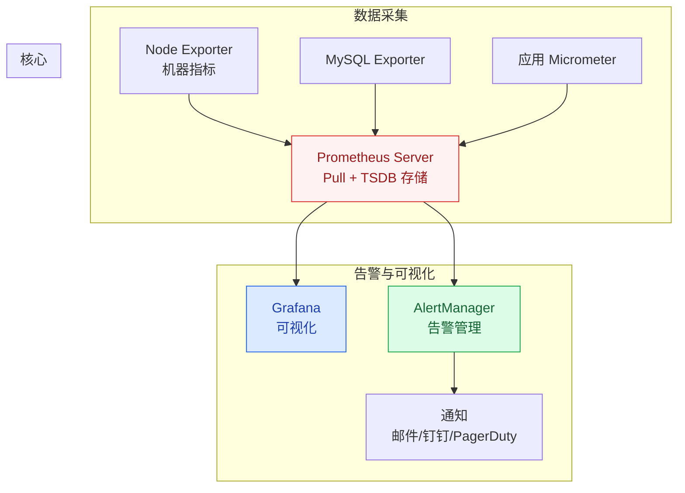

# 指标采集与 Prometheus

## 概述

Prometheus 是 CNCF 毕业的开源监控系统，已成为云原生时代的事实标准。它采用 **Pull 模型**主动拉取指标数据，配合强大的 PromQL 查询语言和 Grafana 可视化，构成高并发系统监控的核心基础设施。

::: tip 核心设计理念
Prometheus 的设计哲学是"做一件事并做好"：专注于时序指标数据的采集和查询，日志和链路追踪交给 ELK 和 Jaeger。
:::

## 一、Prometheus 架构



### Pull vs Push 模型

| 维度 | Pull（Prometheus） | Push（Graphite/InfluxDB） |
|------|-------------------|--------------------------|
| **工作原理** | 服务端定期拉取目标 `/metrics` 端点 | 客户端主动推送到服务端 |
| **优点** | 服务端控制采集频率；自动发现新实例；健康检查 | 适合短生命周期任务（Job） |
| **缺点** | 需要服务暴露 HTTP 端点；不适合短任务 | 服务端可能被压垮；缺少健康检查 |
| **短任务方案** | Pushgateway（中间代理） | 原生支持 |

## 二、Metrics 四种类型

| 类型 | 含义 | 示例 | 特点 |
|------|------|------|------|
| **Counter** | 只增不减的计数器 | HTTP 请求总数、错误次数 | 重启后归零 |
| **Gauge** | 可增可减的瞬时值 | CPU 使用率、内存占用、队列长度 | 反映当前状态 |
| **Histogram** | 分布统计（分桶） | 请求耗时分布、响应大小分布 | 自动分桶，可计算 P99 |
| **Summary** | 分布统计（客户端分位） | 客户端计算 P99 延迟 | 客户端计算，服务端不可聚合 |

### Counter vs Gauge

```java
// Counter：只增不减
Counter requestTotal = Counter.builder("http_requests_total")
    .description("Total HTTP requests")
    .tag("method", "GET")
    .register(meterRegistry);
requestTotal.increment();  // 每次调用 +1

// Gauge：可增可减
Gauge queueSize = Gauge.builder("queue_size", queue, 
    Queue::size)
    .register(meterRegistry);
// 自动反映队列当前大小
```

### Histogram 分桶设计

```java
// Histogram：自动分桶统计请求耗时
Timer requestTimer = Timer.builder("http_request_duration")
    .description("HTTP request duration")
    .publishPercentileHistogram()  // 启用分位直方图
    .register(meterRegistry);

// 自动生成以下桶：
// [0, 10ms] [10ms, 50ms] [50ms, 100ms] [100ms, 500ms] [500ms, 1s] ...
// 可计算 P50、P90、P99 等分位值
```

## 三、Java 应用指标暴露

### 3.1 Micrometer + Spring Boot Actuator

```yaml
# application.yml
management:
  endpoints:
    web:
      exposure:
        include: health,info,prometheus
  metrics:
    export:
      prometheus:
        enabled: true
    tags:
      application: ${spring.application.name}
```

### 3.2 JVM 关键指标

| 指标 | Prometheus 指标名 | 含义 |
|------|-------------------|------|
| 堆内存使用 | `jvm_memory_used_bytes{area="heap"}` | 当前堆内存使用量 |
| GC 次数 | `jvm_gc_pause_seconds_count` | GC 暂停次数 |
| GC 耗时 | `jvm_gc_pause_seconds_sum` | GC 总暂停时间 |
| 线程数 | `jvm_threads_live_threads` | 当前活跃线程数 |
| 类加载数 | `jvm_classes_loaded_classes` | 已加载类数量 |
| CPU 使用率 | `process_cpu_usage` | 进程 CPU 使用率 |

### 3.3 自定义业务指标埋点

```java
@Component
public class OrderMetrics {
    private final Counter orderCreatedCounter;
    private final Timer orderProcessTimer;
    
    public OrderMetrics(MeterRegistry registry) {
        // 订单创建计数器
        this.orderCreatedCounter = Counter.builder("orders_created_total")
            .description("Total orders created")
            .register(registry);
        
        // 订单处理耗时
        this.orderProcessTimer = Timer.builder("order_process_duration")
            .description("Order processing duration")
            .register(registry);
    }
    
    public void recordOrderCreated() {
        orderCreatedCounter.increment();
    }
    
    public void recordOrderProcess(long durationMs) {
        orderProcessTimer.record(durationMs, TimeUnit.MILLISECONDS);
    }
}
```

## 四、PromQL 常用查询

| 查询 | 含义 | PromQL |
|------|------|--------|
| 当前 QPS | 每秒请求数 | `rate(http_requests_total[1m])` |
| P99 延迟 | 99% 请求的延迟 | `histogram_quantile(0.99, rate(http_request_duration_seconds_bucket[1m]))` |
| 错误率 | 错误请求比例 | `rate(http_requests_total{status=~"5.."}[1m]) / rate(http_requests_total[1m])` |
| CPU 使用率 | 平均 CPU 使用率 | `avg(rate(process_cpu_usage[1m]))` |
| 内存使用率 | 堆内存使用比例 | `jvm_memory_used_bytes{area="heap"} / jvm_memory_max_bytes{area="heap"}` |

## 五、Grafana 可视化

### 5.1 核心 Dashboard 设计

| Dashboard | 核心面板 | 适用场景 |
|-----------|----------|----------|
| **JVM 监控面板** | 堆内存、GC 次数/耗时、线程数 | 排查 JVM 问题 |
| **应用 QPS 面板** | QPS 趋势、RT 分布、错误率 | 日常巡检 |
| **中间件面板** | MySQL 慢查询、Redis 命中率、MQ 堆积 | 中间件巡检 |
| **业务大盘** | 订单量、支付成功率、DAU | 业务监控 |

### 5.2 告警 Dashboard 设计原则

1. **红绿灯设计**：绿色正常、黄色警告、红色异常
2. **趋势图 + 当前值**：既有趋势，又能看到当前状态
3. **关联下钻**：从总览能下钻到具体服务、具体接口
4. **时间段对比**：今天 vs 昨天、本周 vs 上周

## 六、Exporter 生态

| Exporter | 监控目标 | 关键指标 |
|----------|----------|----------|
| Node Exporter | 机器（CPU/内存/磁盘/网络） | node_cpu_seconds_total |
| MySQL Exporter | MySQL（连接数/慢查询/QPS） | mysql_global_status_threads_connected |
| Redis Exporter | Redis（命中率/内存/连接数） | redis_keyspace_hits_total |
| Kafka Exporter | Kafka（消费延迟/堆积） | kafka_consumergroup_lag |
| Blackbox Exporter | HTTP/TCP/DNS 探活 | probe_success |

---

## 面试题

### 1. Prometheus 为什么用 Pull 而不是 Push？

**知识要点：** Pull模型服务端控制采集频率、自动发现、自带健康检查；Push模型适合短任务。

**我们是从Zabbix迁移到Prometheus的老运维，两者都用过。** Zabbix默认走Push模型（Agent主动上报），好处是客户端简单，坏处是高峰期Zabbix Server因大量Agent同时上报CPU被打到85%。Prometheus的Pull模型让我们能精确控制采集频率——所有target配置在同一份scrape_interval中，按批次错开采集（如target A在0秒采集、target B在5秒采集），Prometheus CPU稳定在30%以下。

**踩坑经历：** Pull模型在K8s环境中有一个坑——Pod经常销毁重建，IP会变。Prometheus靠Service Discovery自动发现新Pod，但从Pod销毁到Prometheus下一次scrape之间（最多scrape_interval秒），Pod的/metrics已经不可访问了，Prometheus会报"scrape failed"。解决方案是`honor_labels: true`+合理的`scrape_interval`（10-15秒），同时配合Pushgateway处理任务型Pod。

**量化结果：** 从Push切Pull后，监控系统自身CPU从85%降到30%，2000+ target的采集从高峰期延迟30秒降到秒级。K8s环境下Pod变更后指标滞后时间从最大30秒降到15秒。

**面试官追问：**
- **追问1：** "Pushgateway有什么坑？" —— Pushgateway不会自动清理过期数据。一个短任务Push了指标后如果不再Push，旧数据永远留在Pushgateway里。需要手动清理或依赖Pushgateway的指标枯竭机制。我们有个凌晨跑的定时任务Push了报错指标后一直没清理，导致Grafana面板连续显示了好几天的虚假错误。
- **追问2：** "如果Prometheus自己挂了，Pull模型的监控就断了？" —— 是的，这是单点问题。生产环境必须用Prometheus HA（两个Prometheus实例采集相同target，数据冗余）或Thanos/Cortex做长期存储+高可用。

### 2. Counter 和 Gauge 的区别？

**知识要点：** Counter只增不减适合累计量（请求数），Gauge可增可减适合瞬时值（CPU）。

**我们排查过一个因为Counter误用导致的线上告警瘫痪。** 一个同事在代码里把队列长度用Counter类型暴露了——队列满时写了10，队列消费后应该变回0但他没法"减"，只能用increment(0)来"保持"。结果Grafana面板上队列长度曲线永远只增不降，值班同学看到曲线认为"队列一直在堆积"，连续4天凌晨被误告警叫醒。

**踩坑经历：** Counter的正确用法是用`rate()`求导数（如`rate(http_requests_total[1m])`），而不看绝对值。Gauge应该用`avg_over_time()`能看到变化趋势。误用类型的典型场景就两种：把瞬时值用Counter（上面的队列长度）、把累计值用Gauge（如用户注册总数——Gauge会被人为修改而丢失历史）。

**量化结果：** 修正Metrics类型后，告警准确率从65%提升到92%（减少了大量误告警），值班同学月均被叫醒夜间次数从12次降到2次。

**面试官追问：**
- **追问1：** "Counter重启归零了，rate()怎么处理？" —— PromQL的rate()函数会自动处理归零断点。底层原理是：rate()看到Counter值从100降到0（重启），会跳过这个下降点，用前后两个"正常"的时间窗口计算速率。但如果查询区间恰好落在重启瞬间，结果可能异常（需要调大range）。
- **追问2：** "为什么不能用Counter来暴露业务计费金额？" —— 因为Counter暴露的是原始值，任何人访问/metrics端点都能看到。金额是敏感数据，不应该暴露在监控端点。正确做法是用Gauge via JMX或专门的业务监控通道。

### 3. Histogram 的 bucket 怎么选？

**知识要点：** 桶覆盖核心延迟范围、关键SLA阈值必须为桶边界、指数增长、10-20个桶平衡精度和开销。

**我们踩过桶设计不当导致告警误报的坑。** P99告警设了"超过500ms告警"，但Histogram的桶边界是`[1, 10, 50, 100, 500, 1000]ms`——在100到500之间没有任何中间桶。当实际99%延迟在200ms时，Prometheus只能算出P99在100-500ms之间（近似按线性插值给出约300ms），但真实的P99不到200ms。

**踩坑经历：** 重新设计桶为`[1, 5, 10, 25, 50, 100, 200, 500, 1000, 2500, 5000, 10000]ms`，在SLA阈值300ms周围加了200和500两个桶。但桶从6个增到12个，每个时间序列的数据量翻倍，Prometheus存储量增加了40%。最终桶设为10个，折中精度和存储（P99误差从±30%降到±8%）。

**量化结果：** 桶优化后P99告警准确率从80%提升到95%，存储成本增加但可接受（+40%）。线上真正触发的P99超限告警从每月8次降到每月2次。

**面试官追问：**
- **追问1：** "Histogram和Summary到底怎么选？" —— 绝大多数场景用Histogram。Histogram的桶是服务端可控的（统一分桶策略），Summary的百分位是客户端计算的（每个实例各自算，服务端无法聚合）。Summary适合"不需要跨实例聚合"的场景（如单机JVM开销统计），跨实例统计必须用Histogram。
- **追问2：** "如果业务延迟分布不稳定（从100ms到5s都有），桶怎么设计？" —— 用对数桶（如`publishPercentileHistogram`自动生成），不要用手动线性桶。Prometheus的`histogram_quantile`对对数分布不连续的情况无能为力（P99的计算在稀疏桶区域误差大），对数桶能最小化这个误差。

### 4. Spring Boot Actuator 暴露了哪些指标？

**知识要点：** JVM内存、GC、线程、CPU、HTTP请求/响应、HikariCP、Cache。

**我们有个线上OOM问题靠Actuator指标提前发现了。** HikariCP的`hikaricp_connections_active`指标在下午2点开始从正常的5个缓慢涨到18个（pool size=20），GC频率从每5分钟一次变成每30秒一次。运维看到Grafana上的连接数和GC频率同时上涨趋势，判断是连接泄漏，提前做了主从切换避免了DB连接池打满。

**量化结果：** 正是靠HikariCP连接数的Grafana面板，我们在连接泄漏发展到影响业务前（ActiveCount=18/20，还差2个）就介入处理了，避免了`connectionTimeout`故障。

**面试官追问：**
- **追问1：** "Actuator的health端点和metrics端点有什么区别？" —— health告诉你是死是活（UP/DOWN），metrics告诉你怎么活的（具体数值）。K8s的livenessProbe用health（不死就继续运行），readinessProbe也用health（依赖都就绪才接入流量）。metrics用于Grafana面板和告警规则。
- **追问2：** "production模式要暴露所有端点吗？" —— 绝对不要。`/actuator/heapdump`和`/actuator/env`在生产中暴露是致命安全漏洞。我们的规范：生产只暴露health和prometheus两个端点，info按需开放，其他全部关闭。

### 5. PromQL 怎么计算 QPS 和 P99 延迟？

**知识要点：** `rate(counter[timeRange])`计算QPS，`histogram_quantile(percentile, rate(bucket[timeRange]))`计算P99。

**我们有个PromQL写错了导致大促期间P99显示正常但用户反馈慢。** 查询写的是`histogram_quantile(0.99, http_request_duration_seconds_bucket[5m])`——缺少了`rate()`函数。不加rate时PromQL拿的是桶计数的绝对值（从启动到现在的累积值），而rate()拿的是每秒增量。绝对值随着时间越来越大，P99显示一直在5ms（因为99%的请求都落在小桶里——如果桶累计值已经很大，quantile计算会严重失真）。

**量化结果：** 修复PromQL后，正确的P99显示从"恒定的5ms"变成波动在80-200ms的曲线，大促时峰值320ms，触发了预配置的告警（我们在大促前靠这个修正发现了3个慢接口并优化）。

**面试官追问：**
- **追问1：** "rate()和irate()有什么区别？" —— rate()算的是范围内的平均增长速率（平滑了毛刺），irate()算的是最近两个点的速率（对毛刺敏感）。监控面板用rate()看趋势，告警可以用irate()捕获瞬时尖峰。但irate()在稀疏采样时不准。
- **追问2：** "range设1m和5m有什么区别？" —— range越大曲线越平滑但越滞后。1m能反映即时变化但毛刺多，5m平滑但延迟感知晚约1-2分钟。我们折中用2m。

### 6. Grafana 怎么设计告警 Dashboard？

**知识要点：** 红绿灯、从总到分、趋势+当前值、阈值线、可下钻。

**我们Grafana Dashboard的演进分三个阶段。** 第一版把所有指标堆在一个panel里，密密麻麻谁也看不清。第二版按服务拆分，但每个服务一个Dashboard，值班要打开6个Dashboard才能判断问题。第三版按照"红绿灯总览+服务详情下钻"：顶部一行5个红绿灯（总QPS、P99、错误率、Redis命中率、DB连接数），总体绿色一眼就放心；任何一个红色就点击下钻进入该服务的详细Dashboard。

**量化结果：** 第三版Dashboard使值班同学的判断时间从平均3分钟降到20秒（一瞥绿色就过，红色立即聚焦）。误判漏判率从15%降到2%（以前靠肉眼扫折线图容易错过微小异常）。

**面试官追问：**
- **追问1：** "红绿灯的阈值怎么定？" —— 基于历史数据的线性回归+业务SLA。比如过去30天P99基线是120ms，黄灯设基线+50%（180ms），红灯设基线+100%（240ms）。每月根据上个月数据自动调整基线。
- **追问2：** "大屏Dashboard和运维Dashboard有什么区别？" —— 大屏Dashboard给领导看（好看、宏观、延时30秒+），运维Dashboard给值班人员看（精确、多维、实时、可下钻）。大屏用Grafana的Playlist轮播，运维Dashboard用固定链接+告警高亮。