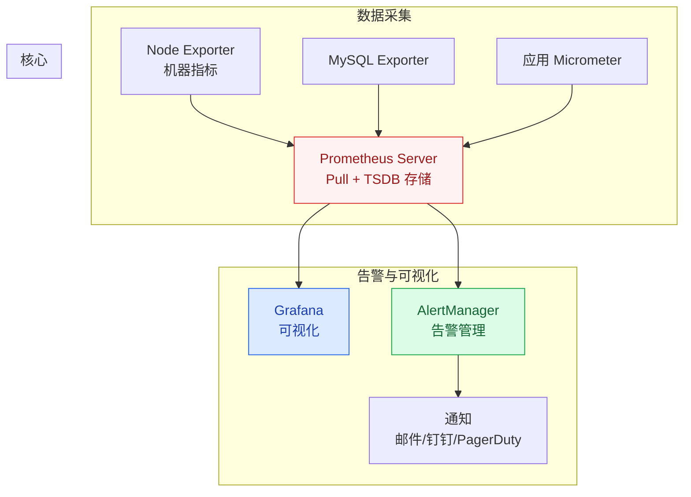

# 指标采集与 Prometheus

## 概述

Prometheus 是 CNCF 毕业的开源监控系统，已成为云原生时代的事实标准。它采用 **Pull 模型**主动拉取指标数据，配合强大的 PromQL 查询语言和 Grafana 可视化，构成高并发系统监控的核心基础设施。

::: tip 核心设计理念
Prometheus 的设计哲学是"做一件事并做好"：专注于时序指标数据的采集和查询，日志和链路追踪交给 ELK 和 Jaeger。
:::

## 一、Prometheus 架构



### Pull vs Push 模型

| 维度 | Pull（Prometheus） | Push（Graphite/InfluxDB） |
|------|-------------------|--------------------------|
| **工作原理** | 服务端定期拉取目标 `/metrics` 端点 | 客户端主动推送到服务端 |
| **优点** | 服务端控制采集频率；自动发现新实例；健康检查 | 适合短生命周期任务（Job） |
| **缺点** | 需要服务暴露 HTTP 端点；不适合短任务 | 服务端可能被压垮；缺少健康检查 |
| **短任务方案** | Pushgateway（中间代理） | 原生支持 |

## 二、Metrics 四种类型

| 类型 | 含义 | 示例 | 特点 |
|------|------|------|------|
| **Counter** | 只增不减的计数器 | HTTP 请求总数、错误次数 | 重启后归零 |
| **Gauge** | 可增可减的瞬时值 | CPU 使用率、内存占用、队列长度 | 反映当前状态 |
| **Histogram** | 分布统计（分桶） | 请求耗时分布、响应大小分布 | 自动分桶，可计算 P99 |
| **Summary** | 分布统计（客户端分位） | 客户端计算 P99 延迟 | 客户端计算，服务端不可聚合 |

### Counter vs Gauge

```java
// Counter：只增不减
Counter requestTotal = Counter.builder("http_requests_total")
    .description("Total HTTP requests")
    .tag("method", "GET")
    .register(meterRegistry);
requestTotal.increment();  // 每次调用 +1

// Gauge：可增可减
Gauge queueSize = Gauge.builder("queue_size", queue, 
    Queue::size)
    .register(meterRegistry);
// 自动反映队列当前大小
```

### Histogram 分桶设计

```java
// Histogram：自动分桶统计请求耗时
Timer requestTimer = Timer.builder("http_request_duration")
    .description("HTTP request duration")
    .publishPercentileHistogram()  // 启用分位直方图
    .register(meterRegistry);

// 自动生成以下桶：
// [0, 10ms] [10ms, 50ms] [50ms, 100ms] [100ms, 500ms] [500ms, 1s] ...
// 可计算 P50、P90、P99 等分位值
```

## 三、Java 应用指标暴露

### 3.1 Micrometer + Spring Boot Actuator

```yaml
# application.yml
management:
  endpoints:
    web:
      exposure:
        include: health,info,prometheus
  metrics:
    export:
      prometheus:
        enabled: true
    tags:
      application: ${spring.application.name}
```

### 3.2 JVM 关键指标

| 指标 | Prometheus 指标名 | 含义 |
|------|-------------------|------|
| 堆内存使用 | `jvm_memory_used_bytes{area="heap"}` | 当前堆内存使用量 |
| GC 次数 | `jvm_gc_pause_seconds_count` | GC 暂停次数 |
| GC 耗时 | `jvm_gc_pause_seconds_sum` | GC 总暂停时间 |
| 线程数 | `jvm_threads_live_threads` | 当前活跃线程数 |
| 类加载数 | `jvm_classes_loaded_classes` | 已加载类数量 |
| CPU 使用率 | `process_cpu_usage` | 进程 CPU 使用率 |

### 3.3 自定义业务指标埋点

```java
@Component
public class OrderMetrics {
    private final Counter orderCreatedCounter;
    private final Timer orderProcessTimer;
    
    public OrderMetrics(MeterRegistry registry) {
        // 订单创建计数器
        this.orderCreatedCounter = Counter.builder("orders_created_total")
            .description("Total orders created")
            .register(registry);
        
        // 订单处理耗时
        this.orderProcessTimer = Timer.builder("order_process_duration")
            .description("Order processing duration")
            .register(registry);
    }
    
    public void recordOrderCreated() {
        orderCreatedCounter.increment();
    }
    
    public void recordOrderProcess(long durationMs) {
        orderProcessTimer.record(durationMs, TimeUnit.MILLISECONDS);
    }
}
```

## 四、PromQL 常用查询

| 查询 | 含义 | PromQL |
|------|------|--------|
| 当前 QPS | 每秒请求数 | `rate(http_requests_total[1m])` |
| P99 延迟 | 99% 请求的延迟 | `histogram_quantile(0.99, rate(http_request_duration_seconds_bucket[1m]))` |
| 错误率 | 错误请求比例 | `rate(http_requests_total{status=~"5.."}[1m]) / rate(http_requests_total[1m])` |
| CPU 使用率 | 平均 CPU 使用率 | `avg(rate(process_cpu_usage[1m]))` |
| 内存使用率 | 堆内存使用比例 | `jvm_memory_used_bytes{area="heap"} / jvm_memory_max_bytes{area="heap"}` |

## 五、Grafana 可视化

### 5.1 核心 Dashboard 设计

| Dashboard | 核心面板 | 适用场景 |
|-----------|----------|----------|
| **JVM 监控面板** | 堆内存、GC 次数/耗时、线程数 | 排查 JVM 问题 |
| **应用 QPS 面板** | QPS 趋势、RT 分布、错误率 | 日常巡检 |
| **中间件面板** | MySQL 慢查询、Redis 命中率、MQ 堆积 | 中间件巡检 |
| **业务大盘** | 订单量、支付成功率、DAU | 业务监控 |

### 5.2 告警 Dashboard 设计原则

1. **红绿灯设计**：绿色正常、黄色警告、红色异常
2. **趋势图 + 当前值**：既有趋势，又能看到当前状态
3. **关联下钻**：从总览能下钻到具体服务、具体接口
4. **时间段对比**：今天 vs 昨天、本周 vs 上周

## 六、Exporter 生态

| Exporter | 监控目标 | 关键指标 |
|----------|----------|----------|
| Node Exporter | 机器（CPU/内存/磁盘/网络） | node_cpu_seconds_total |
| MySQL Exporter | MySQL（连接数/慢查询/QPS） | mysql_global_status_threads_connected |
| Redis Exporter | Redis（命中率/内存/连接数） | redis_keyspace_hits_total |
| Kafka Exporter | Kafka（消费延迟/堆积） | kafka_consumergroup_lag |
| Blackbox Exporter | HTTP/TCP/DNS 探活 | probe_success |

---

## 面试题

### 1. Prometheus 为什么用 Pull 而不是 Push？

**Pull 模型的优势：**
1. **服务端控制采集频率**：避免客户端推送过频导致服务端过载
2. **自动发现**：配合 Kubernetes SD 自动发现新 Pod，无需手动配置
3. **健康检查**：拉取失败本身就说明服务有问题
4. **简单可靠**：客户端只需暴露 HTTP 端点，无需关心服务端地址

**Pull 的缺点**：短生命周期任务（如 Job）可能来不及被 Pull，需通过 Pushgateway 中转。

### 2. Counter 和 Gauge 的区别？

| 维度 | Counter | Gauge |
|------|---------|-------|
| 变化方向 | 只增不减（重启归零） | 可增可减 |
| 典型用途 | 请求总数、错误次数、处理字节数 | CPU 使用率、内存、队列长度 |
| 计算方法 | `rate()` 计算速率 | 直接读取当前值 |
| 重启影响 | 归零，`rate()` 自动处理 | 直接归零 |

### 3. Histogram 的 bucket 怎么选？

**分桶原则：**
1. **覆盖核心范围**：确保大部分请求落在桶内（如 1ms~10s）
2. **关键阈值要有桶**：SLA 阈值（如 100ms、500ms、1s）必须作为桶边界
3. **桶数量适中**：10~20 个桶，太多影响性能，太少精度不够
4. **指数分布**：桶边界按指数增长，如 `[1, 5, 10, 25, 50, 100, 250, 500, 1000, 2500, 5000, 10000]ms`

**注意**：Histogram 的 P99 精度受桶边界影响，如果 99% 的请求落在 [100ms, 500ms] 桶内，P99 只能算出是 100~500ms 之间的某个值。

### 4. Spring Boot Actuator 暴露了哪些指标？

**核心指标分类：**
- **JVM**：内存（堆/非堆）、GC（次数/耗时）、线程、类加载
- **系统**：CPU 使用率、文件描述符
- **HTTP**：请求总数、请求耗时分布、状态码分布
- **数据库**：HikariCP 连接池（活跃/空闲/等待）、SQL 执行耗时
- **缓存**：Cache 命中率、缓存大小
- **日志**：Logback 日志事件计数

### 5. PromQL 怎么计算 QPS 和 P99 延迟？

```promql
# QPS：过去 1 分钟的每秒请求数
rate(http_requests_total[1m])

# P99 延迟：过去 1 分钟内 99% 请求的延迟
histogram_quantile(0.99, 
    rate(http_request_duration_seconds_bucket[1m]))

# 错误率：5xx 占比
sum(rate(http_requests_total{status=~"5.."}[1m])) 
/ 
sum(rate(http_requests_total[1m]))
```

### 6. Grafana 怎么设计告警 Dashboard？

**设计原则：**
1. **红绿灯颜色**：绿色（正常）、黄色（接近阈值）、红色（超阈值）
2. **从总到分**：顶部是总览（总 QPS/总错误率），下面是各服务/接口拆分
3. **趋势 + 当前**：折线图看趋势，SingleStat 看当前值
4. **阈值线**：在折线图上标出告警阈值，直观看到是否接近危险区域
5. **可下钻**：点击某个服务可以跳转到该服务的详细面板