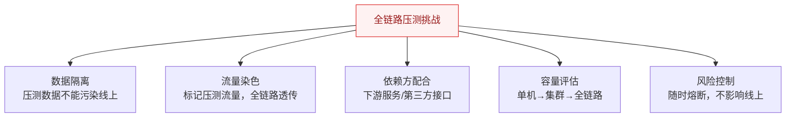
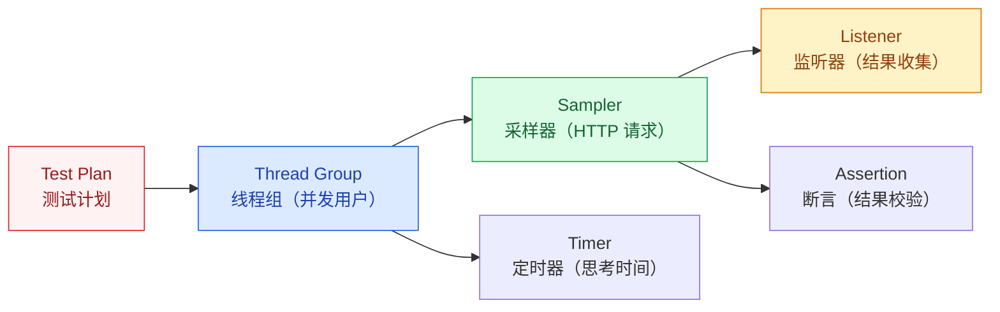
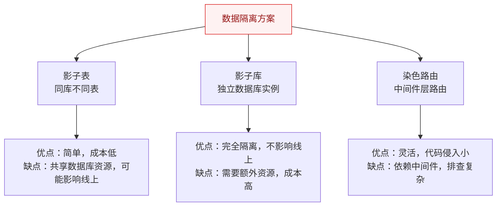
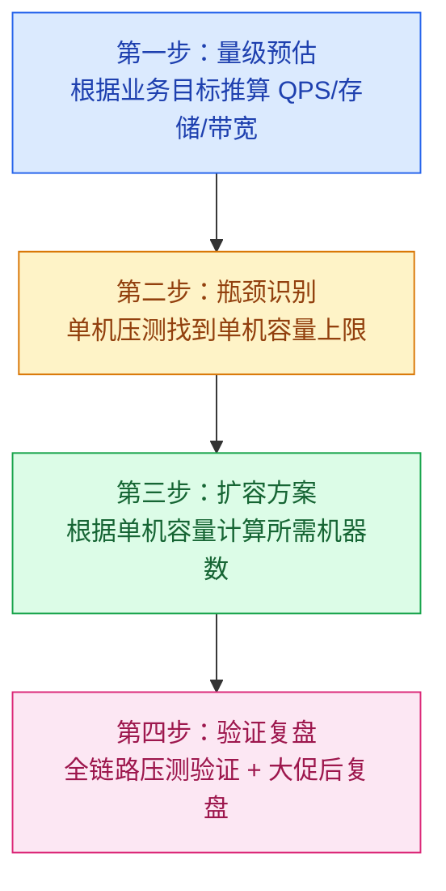

# 全链路压测与容量规划

## 概述

全链路压测是模拟真实生产流量，对整个系统链路进行压力测试，验证系统容量和发现瓶颈。与单接口压测不同，全链路压测关注的是**整个系统的协同能力**，而非单个服务的性能。

::: danger 核心挑战
全链路压测最大的难点是**如何在不对线上业务产生影响的条件下，真实模拟生产流量**。这涉及数据隔离、流量染色、依赖方配合等工程难题。
:::

## 一、全链路压测的核心挑战



| 挑战 | 说明 | 解决方案 |
|------|------|----------|
| 数据隔离 | 压测产生的数据不能混入线上 | 影子表/影子库 |
| 流量染色 | 如何标记压测请求并在全链路透传 | HTTP Header + ThreadLocal + RPC 透传 |
| 依赖方配合 | 下游服务/第三方接口能否承受压测 | 提前通知 + Mock 外部依赖 |
| 容量评估 | 从单机到集群到全链路的容量推算 | 递进式压测 |
| 风险控制 | 压测过程中如何保护线上 | 随时熔断 + 阈值告警 |

## 二、JMeter 基础使用

### 2.1 核心组件



### 2.2 关键配置

| 配置项 | 说明 | 建议值 |
|--------|------|--------|
| Number of Threads | 并发线程数 | 逐步递增：100→500→1000 |
| Ramp-Up Period | 线程启动时间（秒） | 10-30s，避免瞬间冲击 |
| Loop Count | 循环次数 | Infinite + Duration 控制 |
| Duration | 持续时间（秒） | 300s（5 分钟）以上 |

### 2.3 压测方案设计

**递进式压测：**
```
单接口基准 → 混合场景 → 全链路 → 脉冲场景 → 长稳测试
  100 QPS     500 QPS    1000 QPS    突发 2000   8h 持续
```

## 三、流量回放

### 3.1 流量录制方式

| 方案 | 原理 | 优缺点 |
|------|------|--------|
| **TCPCopy** | 在网络层复制 TCP 包，转发到测试环境 | 真实流量，但部署复杂 |
| **Nginx 流量录制** | 通过 `mirror` 指令复制请求到测试集群 | 简单，但只支持 HTTP |
| **日志回放** | 从 Access Log 提取请求，重新发送 | 灵活，但丢失了并发时序 |
| **Agent 录制** | 在应用层挂载 Agent 录制请求 | 精确，但侵入性强 |

### 3.2 流量回放注意事项

1. **时序问题**：录制的流量顺序可能与真实场景不同
2. **状态依赖**：有些请求依赖前置状态（如登录、下单），需要处理
3. **时间敏感**：token、时间戳等时效性参数需要处理
4. **幂等性**：回放可能重复执行，需要保证幂等

## 四、影子表 / 影子库

### 4.1 什么是影子表？

影子表是在**同一个数据库实例**中创建结构相同的表（如 `orders` → `orders_shadow`），压测流量写入影子表，线上流量写入正常表。

```sql
-- 线上表
CREATE TABLE orders (
    id BIGINT PRIMARY KEY,
    user_id BIGINT,
    amount DECIMAL(10,2)
);

-- 影子表（结构相同）
CREATE TABLE orders_shadow (
    id BIGINT PRIMARY KEY,
    user_id BIGINT,
    amount DECIMAL(10,2)
);
```

### 4.2 三种数据隔离方案



### 4.3 流量染色实现

```java
// 1. 压测请求携带特殊 Header
// X-Stress-Test: true

// 2. 网关层识别并放入 ThreadLocal
public class StressTestContext {
    private static final ThreadLocal<Boolean> STRESS_FLAG = 
        ThreadLocal.withInitial(() -> false);
    
    public static void setStressTest(boolean isStress) {
        STRESS_FLAG.set(isStress);
    }
    
    public static boolean isStressTest() {
        return STRESS_FLAG.get();
    }
}

// 3. 数据访问层根据标记选择表
public String getTableName() {
    return StressTestContext.isStressTest() 
        ? "orders_shadow" : "orders";
}

// 4. RPC 调用时透传标记
// 从 ThreadLocal 取出标记，放入 RPC Context 传递给下游
```

## 五、容量规划四步法



### 5.1 量级预估公式

| 指标 | 公式 | 示例 |
|------|------|------|
| QPS | 日活 × 人均请求 / 86400 × 峰值系数 | 100万 × 20 / 86400 × 5 = 1157 QPS |
| 存储 | 日活 × 人均数据量 × 保留天数 | 100万 × 1KB × 365 = 365GB |
| 带宽 | QPS × 平均响应大小 × 8 | 1157 × 50KB × 8 = 462 Mbps |
| 机器数 | 峰值 QPS / 单机 QPS × 冗余系数 | 1157 / 500 × 1.5 = 4 台 |

### 5.2 性能拐点分析

```
  RT(ms)
   ^
   |                    .
   |                  .
   |               .
   |            .
   |         .
   |      .  ← 性能拐点：QPS 继续增加，RT 急剧上升
   |   .
   +---------------------------> QPS
```

**拐点判断**：当 QPS 增加 10%，RT 增加超过 30% 时，说明已经到了性能拐点。

## 六、压测隔离策略

| 隔离级别 | 方案 | 风险 |
|----------|------|------|
| **逻辑隔离** | 同一套环境，通过 Header 标记区分 | 最高，压测可能影响线上 |
| **物理隔离** | 独立的压测环境（独立集群） | 最低，但成本高且环境差异大 |
| **染色路由** | 共享基础设施，但数据库/缓存独立 | 中等，需要基础设施改造 |

> **大厂实践**：大促压测通常采用"染色路由"方案——共享计算资源，但数据存储隔离。

---

## 面试题

### 1. 全链路压测的核心挑战是什么？

**知识要点**：五大挑战——数据隔离（压测数据不污染线上）、流量染色（压测标记全链路透传）、依赖方配合（下游和第三方扛不住）、容量评估（单机→集群→全链路非线性）、风险控制（随时熔断不影响线上）。

**项目场景**：我们当时为年终大促做全链路压测，目标是在生产环境模拟 3 倍日常峰值的流量（约 5000 QPS）。电商系统涉及 40+ 微服务，依赖 8 个第三方（支付、物流、短信），数据库 12 个实例。

**踩坑经历**：第一次全链路压测险些搞成 P0 事故——我们低估了"依赖方配合"的难度。压测流量打到支付接口后，支付宝的风控系统检测到异常（同一秒内 500 笔 0.01 元的测试支付），直接把我们的商户号给冻结了。线上真实用户的支付全部失败，持续了 15 分钟才解冻。第二次压测时我们提前和支付宝报备了压测时间窗口和白名单金额（固定 0.01 元且加特殊标记），解决了这个问题。但紧接着又踩了另一个坑——短信服务商没做限流保护，压测的 3000 条验证码短信全发出去了，产生了真实的短信费用且部分用户收到了垃圾验证码。

**量化结果**：经历两次事故后，我们建立了"全链路压测 checklist"——压测前必须通知所有依赖方（第三方 + 内部下游团队），Mock 所有外部计费接口（短信、支付、物流），配置影子表和流量染色。第三次压测零事故，成功验证了系统在 5000 QPS 下的容量。

**面试官追问**：
- "如果下游服务是别的团队的，他们不愿意配合压测怎么办？" → 两种办法：(1) Mock 下游——用 WireMock 或自建 Mock Server 模拟下游响应（RT、错误率可按需配置）；(2) 提前同步压测计划给下游团队，说明"现在不测，大促当天他们挂了你也要被牵连"。通常高压沟通后下游都会配合——因为大促故障是所有团队一起背锅。
- "生产环境压测最大的风险是什么？如何控制？" → 最大风险是"压测流量打挂了线上服务，影响真实用户"。我们的控制措施：分步加压（每次只加 20% 目标流量，观察 5 分钟）、自动熔断（错误率 > 5% 或 RT 翻倍自动停止压测）、一键关停（物理开关，不依赖网络调用）、选择低峰时段（凌晨 2-4 点）。

---

### 2. 影子表怎么设计？

**知识要点**：影子表 = 同库不同表 + 结构完全一致 + 路由动态切换 + 数据定期清理 + 索引同步。这是全链路压测最核心的数据隔离手段。

**项目场景**：我们当时为电商订单系统设计影子表方案，涉及 8 张核心表（orders、order_items、payments、inventory 等），日均线上订单量 300 万。

**踩坑经历**：第一次上线影子表时，只复制了表结构忘了复制索引——压测时 `orders_shadow` 表没有索引，全表扫描导致数据库 CPU 从 30% 飙升到 95%，影响了同库的线上表。第二次，影子表和线上表的 `AUTO_INCREMENT` 起始值设成一样的 1，结果压测产生的数据 ID 和线上数据 ID 重叠了——虽然没有跨表污染，但导出数据做分析时发现 ID 混淆。后来影子表的自增起点从 1 亿开始（线上表当前最大 ID 约 6000 万），彻底避免了 ID 重叠。

**量化结果**：影子表方案上线后，压测数据的隔离性从"手动清理"升级为"自动生命周期管理"——压测完成后 1 小时自动 TRUNCATE 影子表。索引同步问题修复后，压测数据写入性能与线上表差距从 80%（无索引时的扫描开销）缩小到 5%（仅影子表的数据量更小带来的微弱优势）。

**面试官追问**：
- "影子表和线上表在同一个数据库实例，压测把数据库 IO 打满了怎么办？" → 这是我们选择同库方案时最大的风险。缓解措施：(1) 压测时限制影子表的写入速率（不超过线上写入峰值的 50%）；(2) 数据库读写分离——线上表走主库，影子表也走主库但压测的读操作强制走从库；(3) 如果数据库 IO 使用率超过 80% 立即熔断。如果业务量足够大，最终应该走向"影子库"——独立数据库实例，彻底物理隔离。
- "怎么保证影子表的 DDL 和线上表一致？不然压测结果不准。" → 我们写了自动化脚本——每周从线上库导出表结构（`SHOW CREATE TABLE`），与影子库/影子表对比（`diff`），发现不一致（如线上加了新字段但影子表没同步）自动告警并执行 ALTER。脚本集成在 CI/CD 流程中，DDL 变更审批时必须同时确认影子表已同步。

---

### 3. 流量染色怎么实现？

**知识要点**：染色 = 标记 + 透传。压测请求在入口处打上标记（HTTP Header `X-Stress-Test: true`），然后在全链路（HTTP → RPC → MQ → DB）透传这个标记。最终在数据访问层根据标记选择影子表还是线上表。

**项目场景**：我们当时的微服务架构是 Spring Cloud + Dubbo RPC + RocketMQ，涉及 40+ 服务。需要在网关层识别压测流量，在 Dubbo filter 中透传标记，在 RocketMQ 消息头中携带标记，在 MyBatis 拦截器中切换表名。

**踩坑经历**：染色标记在异步线程中丢失——压测请求进入网关后，网关用 CompletableFuture 异步调用多个下游，结果新开的线程没有从 ThreadLocal 中继承染色标记（因为 ThreadLocal 默认不跨线程传递）。异步线程里的所有 DB 操作写了线上表而非影子表，造成了数据污染。好在我们的"影子表没有索引"问题反而让这些异步写入很慢，运维在监控中发现了异常 QPS 才紧急停止压测。后来用阿里开源的 `TransmittableThreadLocal`（TTL）替代原生 ThreadLocal，解决跨线程传递问题。

**量化结果**：染色方案经历了三次迭代——v1（HTTP Header + ThreadLocal，丢失率 12%）→ v2（+ TTL 支持异步，丢失率 0.5%）→ v3（+ 中间件全链路埋点校验，丢失率 0%）。v3 在每个环节（网关→Dubbo→MQ→MyBatis）都校验标记是否存在，任一环节丢失都会告警并拒绝请求。

**面试官追问**：
- "如果下游服务不在我们的控制范围内（如第三方的 HTTP API），染色标记怎么透传？" → 第三方的 API 我们无法要求他们透传染色标记。做法是：(1) 压测时直接 Mock 第三方接口（WireMock），不调用真实第三方；(2) 如果必须调用真实接口，在 HTTP Header 中携带染色标记（第三方通常忽略不认识的 Header，不会报错），但第三方写入的数据我们无法隔离——这类场景只能靠"和第三方提前报备 + 限制压测写入量"来控制风险。
- "MQ 消息的染色标记怎么带？消费者怎么处理？" → RocketMQ 的 `Message` 对象有 `properties`（Map<String, String>），我们在 `properties` 里塞 `stress-test: true`。消费者从 `MessageExt.getProperties()` 中读取，放入 TTL。关键点：压测消息和线上消息必须用不同的 Topic（如 `order-topic` vs `order-topic-stress`），这样线上消费者不会消费到压测消息，避免染色标记丢失时写脏线上数据。

---

### 4. 压测数据怎么隔离才能不影响线上？

**知识要点**：三层隔离——存储隔离（影子表/影子库）、缓存隔离（独立 Redis 或 Key 前缀）、MQ 隔离（独立 Topic）。核心理念："共享计算资源，隔离数据存储"。

**项目场景**：我们当时的压测方案是三层隔离全开——MySQL 用影子表（同库不同表）、Redis 用 Key 前缀 `stress:`、MQ 用独立 Topic `*-stress`。

**踩坑经历**：缓存隔离踩了坑——我们最初想让压测流量也打线上 Redis（因为 Redis 本身内存大，不想再多开一个实例），只是给 Key 加 `stress:` 前缀。结果压测的 2000 万条缓存数据把 Redis 内存从 60% 打到了 95%，触发了 Redis 的 maxmemory 淘汰策略，线上缓存被大量淘汰（LFU 算法），导致线上请求大量穿透到数据库。这算是"半隔离"的代价——Key 前缀隔离了数据内容，但没隔离内存资源。后来我们给压测 Redis 单独开了一个小规格实例（内存为线上的 20%），物理隔离。

**量化结果**：三层物理隔离后，压测期间线上缓存命中率维持在 98%（压测前为 96%），数据库 CPU 稳定在 35%。压测结束后清理脚本 30 秒内完成影子表 TRUNCATE + 影子 Redis FLUSHALL + 影子 MQ Topic 删除重建。

**面试官追问**：
- "压测用了多少额外资源？中小公司觉得成本太高怎么办？" → 我们的影子环境占线上资源的 15-20%（额外加了几台低配机器 + 一个小 Redis 实例）。对于预算紧张的公司，可以用"Key 前缀隔离 + 严格的内存限制"的半隔离方案：Redis 的 `stress:` key 设 TTL 5 分钟（自动过期不占内存），影子表在压测后 30 分钟内 TRUNCATE。成本几乎为零，只是多了一点运维操作。
- "如果压测把 Redis 或 MQ 打满了怎么办？" → 这正是你想测的——Redis/MQ 的容量瓶颈。压测中如果 Redis 内存到 90% 或 MQ 积压超过 10 万条，说明需要扩容了。但要注意：压测中的"打满"不能影响线上，所以压测和线上的 Redis/MQ 必须物理隔离。

---

### 5. 怎么判断系统瓶颈在哪里？

**知识要点**：瓶颈不是"猜"出来的，是"递进式定位"出来的——先找到瓶颈服务（哪个服务 CPU/RT 先异常），再找到瓶颈接口（哪个接口 RT 占比最高），再找到瓶颈代码/配置（线程 dump + 慢查询 + GC 日志）。

**项目场景**：我们全链路压测时，随着 QPS 从 1000 涨到 3000，整体 RT 从 200ms 涨到 1.2 秒。需要在 40 个微服务中快速定位瓶颈。

**踩坑经历**：我们用 SkyWalking 的拓扑图看 RT 分布，发现"订单服务 → 库存服务"这条链路的 RT 占比从 30% 涨到了 70%。进一步看库存服务的线程 dump，发现 80% 的线程在等待数据库连接——Druid 连接池的 `max-active` 设了 20，但压测时 20 个连接全被占满，排队队列积压了 500 个请求。把 `max-active` 调到 100 后 RT 降到 400ms，但数据库 CPU 又涨到了 90%——数据库成了新的瓶颈。最终瓶颈链是：连接池不够 → 扩连接池 → 数据库 CPU 满 → 加只读从库 + 缓存 Redis → 最终 RT 降到 300ms。

**量化结果**：通过递进式定位，我们从发现瓶颈到修复用了 2 小时。最终系统在 5000 QPS 下 RT 稳定在 350ms。建立了"瓶颈定位 SOP"——第 1 步看监控大盘找异常服务，第 2 步看调用链找慢接口，第 3 步看线程 dump/慢查询找根因。

**面试官追问**：
- "如果是偶发性瓶颈（压测时有时无），怎么定位？" → 偶发性瓶颈通常是"周期性资源争抢"（GC、定时任务、缓存刷新）。我们的方法是：在压测过程中持续采集线程 dump（每 5 秒一次，共采集 100 组），压测结束后用工具（如 fastThread）批量分析，找到"线程在哪一个状态/哪一行代码出现的频率最高"。曾经用这个方法找到了一个定时任务每 30 秒全量刷新本地缓存的瓶颈——改成增量刷新后问题消失。
- "瓶颈定位的黄金指标是什么？" → 三个指标串起来看：RT 的 P99/P999（告诉你"有问题"）、调用链 Trace（告诉你"哪个环节有问题"）、线程 dump（告诉你"为什么有问题"）。单独看任何一个都可能误判——比如 P99 很高但 Trace 显示都卡在"网络等待"，那瓶颈可能不在你的系统而是在网络设备上。

---

### 6. 容量规划四步法分别做什么？

**知识要点**：量级预估（业务目标→技术指标）、瓶颈识别（单机压测找上限）、扩容方案（机器数 = 峰值 QPS / 单机 QPS × 冗余系数）、验证复盘（全链路压测验证 + 大促后复盘）。

**项目场景**：我们当时为年终大促做容量规划，业务目标 GMV 10 亿，预估峰值 QPS 5000（是日常的 5 倍）。

**踩坑经历**：量级预估阶段踩了坑——业务给的预估是"峰值订单 5 万单/分钟"，但没告诉我支付环节还有"支付回调"和"优惠券核销"两个异步步骤。实际系统的 QPS 不是 5 万/60 ≈ 833，而是（下单 + 支付回调 + 核销优惠券 + 发消息）× 峰值系数 ≈ 5000。这个遗漏差点导致容量预估少了 6 倍。复盘时我们在"量级预估"环节加了"全链路步骤拆解"——每个业务操作必须拆解到技术层面的每个 API 调用。

**量化结果**：经过四步容量规划，大促当天实际峰值 QPS 4800（预估 5000 的 96%），CPU 峰值 68%，内存 55%，数据库连接池使用率 72%。无任何扩容或限流触发。

**面试官追问**：
- "冗余系数为什么是 1.5-2 倍？不能更小吗？" → 因为两个因素：(1) 压测环境的"单机 QPS 上限"通常比线上高（压测环境数据量小、网络延迟低），线上实际单机 QPS 通常只有压测的 70-80%；(2) 大促峰值常常超出预估——我们经历过 3 次大促，每次实际峰值都比预估高 10-30%。所以冗余系数 1.5 是最低要求，预算够的话 2 倍更安全。
- "如果大促后复盘发现预估和实际差很多（如预估 5000 QPS 实际只有 800），算失败吗？" → 不算失败，但需要分析差异原因——是业务推广不足导致流量没起来（运营问题），还是大促前改了架构导致性能提升远超预期（技术问题）。关键是"不要因为一次压测预估偏高了，下次就故意压低预估"——宁可资源冗余 50%，也不能线上被打挂。