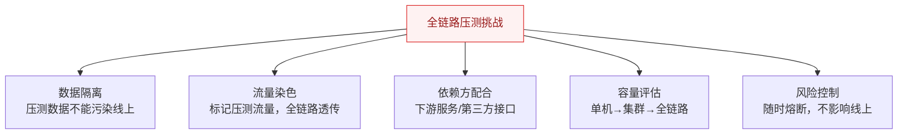
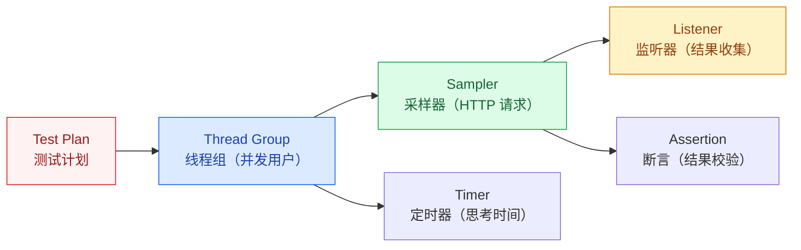
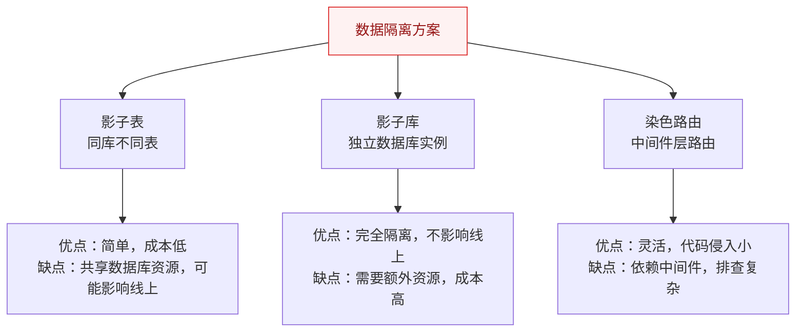
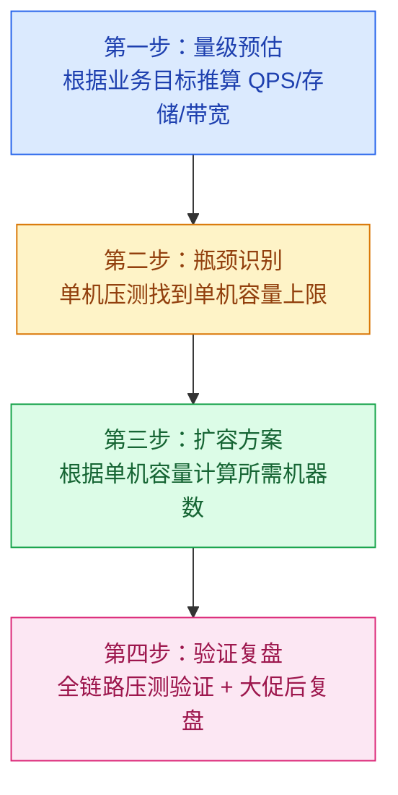

# 全链路压测与容量规划

## 概述

全链路压测是模拟真实生产流量，对整个系统链路进行压力测试，验证系统容量和发现瓶颈。与单接口压测不同，全链路压测关注的是**整个系统的协同能力**，而非单个服务的性能。

::: danger 核心挑战
全链路压测最大的难点是**如何在不对线上业务产生影响的条件下，真实模拟生产流量**。这涉及数据隔离、流量染色、依赖方配合等工程难题。
:::

## 一、全链路压测的核心挑战



| 挑战 | 说明 | 解决方案 |
|------|------|----------|
| 数据隔离 | 压测产生的数据不能混入线上 | 影子表/影子库 |
| 流量染色 | 如何标记压测请求并在全链路透传 | HTTP Header + ThreadLocal + RPC 透传 |
| 依赖方配合 | 下游服务/第三方接口能否承受压测 | 提前通知 + Mock 外部依赖 |
| 容量评估 | 从单机到集群到全链路的容量推算 | 递进式压测 |
| 风险控制 | 压测过程中如何保护线上 | 随时熔断 + 阈值告警 |

## 二、JMeter 基础使用

### 2.1 核心组件



### 2.2 关键配置

| 配置项 | 说明 | 建议值 |
|--------|------|--------|
| Number of Threads | 并发线程数 | 逐步递增：100→500→1000 |
| Ramp-Up Period | 线程启动时间（秒） | 10-30s，避免瞬间冲击 |
| Loop Count | 循环次数 | Infinite + Duration 控制 |
| Duration | 持续时间（秒） | 300s（5 分钟）以上 |

### 2.3 压测方案设计

**递进式压测：**
```
单接口基准 → 混合场景 → 全链路 → 脉冲场景 → 长稳测试
  100 QPS     500 QPS    1000 QPS    突发 2000   8h 持续
```

## 三、流量回放

### 3.1 流量录制方式

| 方案 | 原理 | 优缺点 |
|------|------|--------|
| **TCPCopy** | 在网络层复制 TCP 包，转发到测试环境 | 真实流量，但部署复杂 |
| **Nginx 流量录制** | 通过 `mirror` 指令复制请求到测试集群 | 简单，但只支持 HTTP |
| **日志回放** | 从 Access Log 提取请求，重新发送 | 灵活，但丢失了并发时序 |
| **Agent 录制** | 在应用层挂载 Agent 录制请求 | 精确，但侵入性强 |

### 3.2 流量回放注意事项

1. **时序问题**：录制的流量顺序可能与真实场景不同
2. **状态依赖**：有些请求依赖前置状态（如登录、下单），需要处理
3. **时间敏感**：token、时间戳等时效性参数需要处理
4. **幂等性**：回放可能重复执行，需要保证幂等

## 四、影子表 / 影子库

### 4.1 什么是影子表？

影子表是在**同一个数据库实例**中创建结构相同的表（如 `orders` → `orders_shadow`），压测流量写入影子表，线上流量写入正常表。

```sql
-- 线上表
CREATE TABLE orders (
    id BIGINT PRIMARY KEY,
    user_id BIGINT,
    amount DECIMAL(10,2)
);

-- 影子表（结构相同）
CREATE TABLE orders_shadow (
    id BIGINT PRIMARY KEY,
    user_id BIGINT,
    amount DECIMAL(10,2)
);
```

### 4.2 三种数据隔离方案



### 4.3 流量染色实现

```java
// 1. 压测请求携带特殊 Header
// X-Stress-Test: true

// 2. 网关层识别并放入 ThreadLocal
public class StressTestContext {
    private static final ThreadLocal<Boolean> STRESS_FLAG = 
        ThreadLocal.withInitial(() -> false);
    
    public static void setStressTest(boolean isStress) {
        STRESS_FLAG.set(isStress);
    }
    
    public static boolean isStressTest() {
        return STRESS_FLAG.get();
    }
}

// 3. 数据访问层根据标记选择表
public String getTableName() {
    return StressTestContext.isStressTest() 
        ? "orders_shadow" : "orders";
}

// 4. RPC 调用时透传标记
// 从 ThreadLocal 取出标记，放入 RPC Context 传递给下游
```

## 五、容量规划四步法



### 5.1 量级预估公式

| 指标 | 公式 | 示例 |
|------|------|------|
| QPS | 日活 × 人均请求 / 86400 × 峰值系数 | 100万 × 20 / 86400 × 5 = 1157 QPS |
| 存储 | 日活 × 人均数据量 × 保留天数 | 100万 × 1KB × 365 = 365GB |
| 带宽 | QPS × 平均响应大小 × 8 | 1157 × 50KB × 8 = 462 Mbps |
| 机器数 | 峰值 QPS / 单机 QPS × 冗余系数 | 1157 / 500 × 1.5 = 4 台 |

### 5.2 性能拐点分析

```
  RT(ms)
   ^
   |                    .
   |                  .
   |               .
   |            .
   |         .
   |      .  ← 性能拐点：QPS 继续增加，RT 急剧上升
   |   .
   +---------------------------> QPS
```

**拐点判断**：当 QPS 增加 10%，RT 增加超过 30% 时，说明已经到了性能拐点。

## 六、压测隔离策略

| 隔离级别 | 方案 | 风险 |
|----------|------|------|
| **逻辑隔离** | 同一套环境，通过 Header 标记区分 | 最高，压测可能影响线上 |
| **物理隔离** | 独立的压测环境（独立集群） | 最低，但成本高且环境差异大 |
| **染色路由** | 共享基础设施，但数据库/缓存独立 | 中等，需要基础设施改造 |

> **大厂实践**：大促压测通常采用"染色路由"方案——共享计算资源，但数据存储隔离。

---

## 面试题

### 1. 全链路压测的核心挑战是什么？

**五大挑战：**
1. **数据隔离**：压测数据不能污染线上业务数据（影子表/影子库）
2. **流量染色**：压测标记需要全链路透传（HTTP Header → ThreadLocal → RPC Context）
3. **依赖方配合**：下游服务、第三方接口可能被压测打垮，需要提前沟通或 Mock
4. **容量评估**：从单机到集群到全链路，容量不是线性叠加
5. **风险控制**：压测过程中需要随时熔断，避免影响线上服务

### 2. 影子表怎么设计？

**设计要点：**
1. **同库不同表**：在同一个数据库实例中创建 `_shadow` 后缀的表
2. **结构相同**：影子表与线上表结构完全一致，只是数据不同
3. **路由切换**：通过中间件（ShardingSphere）或代码层根据流量标记动态选择表名
4. **数据清理**：压测结束后自动清理影子表数据
5. **索引同步**：影子表需要同步线上表的索引，否则压测结果不准确

### 3. 流量染色怎么实现？

**全链路透传方案：**
1. **HTTP 层**：压测请求携带 `X-Stress-Test: true` Header
2. **网关层**：解析 Header，将标记放入 ThreadLocal
3. **业务层**：从 ThreadLocal 读取标记，决定调用影子表还是真实表
4. **RPC 层**：调用下游时，将标记放入 RPC Context（如 Dubbo Attachment、gRPC Metadata）
5. **MQ 层**：发送消息时，将标记放入消息 Header
6. **下游服务**：从 RPC Context 读取标记，继续透传

### 4. 压测数据怎么隔离才能不影响线上？

**三层隔离方案：**
1. **存储隔离**：影子表/影子库，压测数据写入独立的表或库
2. **缓存隔离**：压测流量使用独立的 Redis 实例或 Key 前缀（`stress:key:`）
3. **MQ 隔离**：压测消息使用独立的 Topic，避免被线上消费者处理

**关键点**：隔离不是"完全复制一套环境"，而是"共享计算资源，隔离数据存储"。

### 5. 怎么判断系统瓶颈在哪里？

**瓶颈定位方法论：**
1. **看 CPU**：哪个服务 CPU 先打满，瓶颈就在哪
2. **看 RT 分布**：哪个服务的 RT 占总 RT 比例最高
3. **看资源利用率**：连接池、线程池、队列长度是否达到上限
4. **看数据库**：慢查询、连接数、锁等待
5. **看下游**：下游服务 RT 是否异常增长

**递进式定位**：先找到瓶颈服务，再找到瓶颈接口，再找到瓶颈代码/配置。

### 6. 容量规划四步法分别做什么？

1. **量级预估**：根据业务目标（DAU、活动预算）推算峰值 QPS、存储量、带宽
2. **瓶颈识别**：单机压测找到单机 QPS 上限和性能拐点
3. **扩容方案**：机器数 = 峰值 QPS / 单机 QPS × 冗余系数（1.5~2）
4. **验证复盘**：全链路压测验证方案，大促后复盘实际数据与预估的差异，持续优化