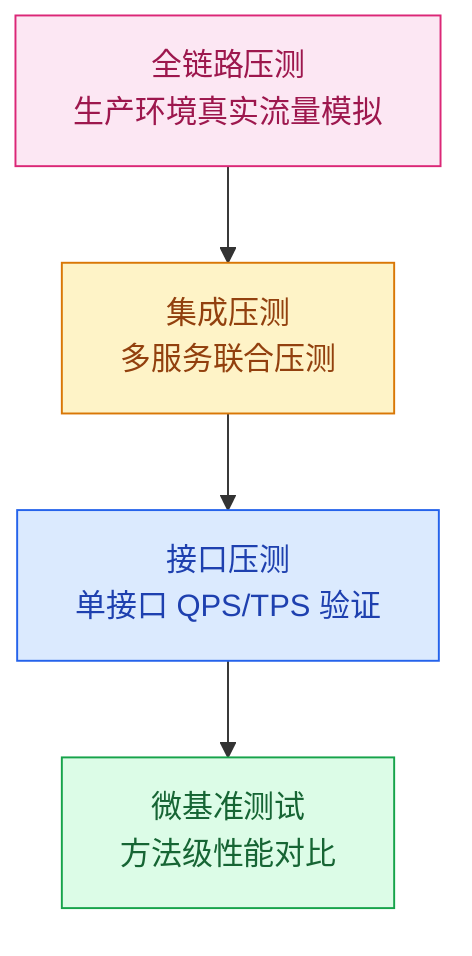
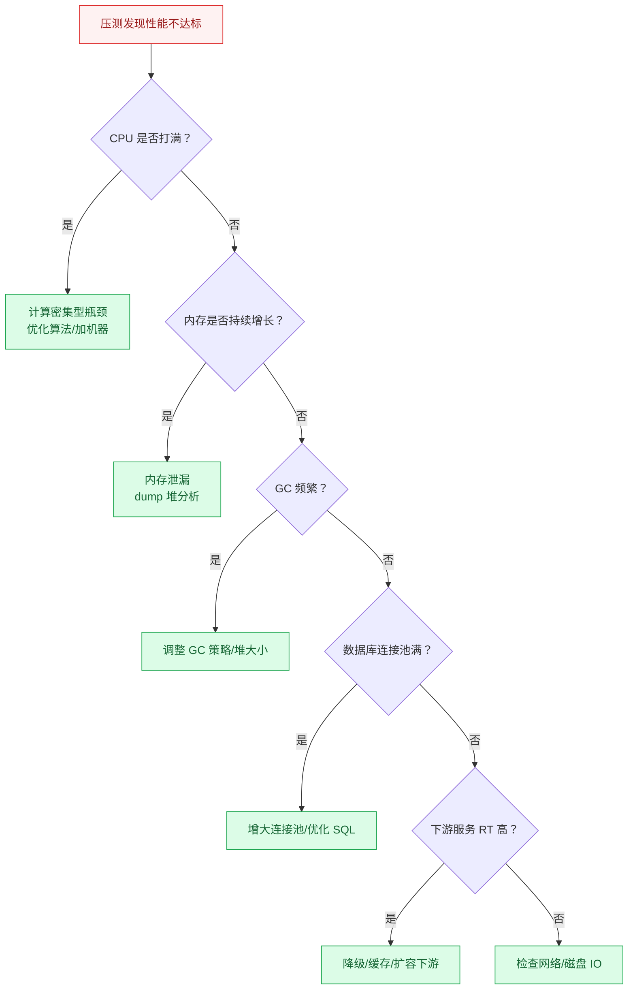

# 性能测试与容量规划

## 模块概述

性能测试与容量规划是高并发系统落地的"最后一公里"——方案设计得再好，没有经过实际压测验证，上线后可能随时崩溃。本模块覆盖从微基准测试到全链路压测的完整方法论，帮助你建立数据驱动的性能优化思维。

::: tip 核心思路
性能测试不是"跑一下看看能不能扛住"，而是**建立性能基线 → 发现瓶颈 → 优化 → 验证**的闭环过程。
:::

::: warning 面试重点
大厂面试中，系统设计题往往要求给出容量估算和压测方案。能讲清楚"怎么测"比"测什么"更重要。
:::

## 性能测试金字塔

| 层级 | 测试工具 | 关注指标 | 适用场景 |
|------|----------|----------|----------|
| 微基准测试 | JMH | 方法吞吐量、平均耗时 | 对比不同实现方案性能 |
| 接口压测 | JMeter/Wrk | QPS、P99 延迟、成功率 | 单接口容量评估 |
| 集成压测 | JMeter/Gatling | 全链路 QPS、各服务 RT | 多服务协同容量 |
| 全链路压测 | 自研平台/TCPCopy | 整体 QPS、资源利用率 | 大促前容量验证 |

## 核心指标体系

| 指标 | 含义 | 为什么重要 |
|------|------|------------|
| **QPS/TPS** | 每秒请求数/事务数 | 衡量系统吞吐能力 |
| **RT（响应时间）** | 请求从发出到收到响应的时间 | 衡量用户体验 |
| **P99/P999 延迟** | 99%/99.9% 请求的最大延迟 | 发现长尾问题 |
| **成功率** | 请求成功比例 | 衡量系统稳定性 |
| **CPU 利用率** | CPU 使用率 | 判断计算瓶颈 |
| **内存使用率** | 内存占用 | 发现内存泄漏 |
| **GC 停顿时间** | 垃圾回收暂停时间 | 影响 RT 稳定性 |

## 性能瓶颈定位方法论

## 学习路径

1. **JMH 微基准测试**：掌握 JVM 层面性能对比的方法论，了解 JIT 预热、死代码消除等陷阱
2. **全链路压测**：学习生产环境压测的挑战与解决方案（影子表、流量染色、数据隔离）

---

## 面试题

### 1. 性能测试金字塔各层关注什么？

**知识要点**：金字塔模型的核心是"越底层越频繁、越精确，越上层越接近真实但成本越高"。微基准测试验证代码级优化，接口压测验证单服务容量，集成压测验证服务间协同，全链路压测验证生产环境真实容量。

**项目场景**：我们当时做商城系统的大促备战，压测体系分了四层推进。第一层用 JMH 对比了"StringBuilder vs StringBuffer"在日志拼接上的性能差异；第二层用 JMeter 压单接口找到每个服务的单机 QPS 上限；第三层用 Gatling 压混合场景（浏览:下单:支付 = 8:1.5:0.5）；第四层在生产环境做全链路压测（影子表隔离）。

**踩坑经历**：最大的坑是"只做了接口压测就宣布容量 OK"。大促当天，下单接口压测能到 2000 QPS，但实际峰值 1500 QPS 时系统就崩了——因为集成压测没测到"下单→扣库存→发消息→减优惠券"这条链路中，优惠券服务被库存服务的重试风暴拖垮了。单接口压测每个服务都是独立施压，没法发现服务间的连锁反应。

**量化结果**：四层压测体系建立后，我们在大促前发现了 7 个单接口压测没发现的瓶颈（包括数据库连接池耗尽、Redis 热点 key、MQ 消费积压等）。大促当天实际 QPS 达到预估的 1.3 倍（超预期），但系统平稳度过，零故障。

**面试官追问**：
- "微基准测试 JMH 有什么常见的坑？" → JIT 编译器的优化会让微基准测试结果失准——JMH 需要做预热（@Warmup，至少 3 轮）和足够的迭代次数（@Measurement，至少 5 轮）。更隐蔽的坑是"死代码消除"——如果你测的方法返回值没有被使用，JIT 会直接优化掉整个方法调用，得到虚假的 0ns 耗时。必须用 `Blackhole.consume()` 消费返回值。
- "如何保证压测结果的可重复性？" → 核心原则是"控制变量法"——每次压测使用相同的数据集、相同的并发梯度（如 100→200→500→1000）、相同的压测时长（至少 5 分钟稳定期）。我们压测前会重启被测服务（清空 JIT 缓存和堆内存），压测环境独立于开发环境。结果可重复性 > 95% 才算一次有效压测。

---

### 2. 压测 QPS 是怎么定义的？

**知识要点**：QPS = 总请求数 / 总耗时（秒）。但面试时更重要的是区分"平均 QPS"和"峰值 QPS"——系统设计要按峰值 QPS × 1.5-2 倍冗余。

**项目场景**：我们当时为支付系统做容量规划，日均交易 500 万笔，平均 QPS 约 58。但支付的高峰在每天 12:00-13:00 和 18:00-20:00，这两个时段占全天交易的 60%，峰值 QPS 约 420。加上大促时峰值是日常的 5 倍，最终按 2100 QPS 设计容量。

**踩坑经历**：早期我只按"平均 QPS × 2"来规划，结果一个上午 10 点的秒杀活动直接把 QPS 打到了平均值的 8 倍（580 → 4640），所有节点全部过载。更坑的是，QPS 计算时我没区分"读 QPS"和"写 QPS"——读操作（查余额）占比 80%，写操作（扣款）占比 20%，但写操作对数据库的压力是读的 5 倍（锁竞争），所以即使总 QPS 在容量内，数据库写瓶颈先到了。

**量化结果**：修正后按"峰值写 QPS × 2"做容量规划，写节点从 4 个扩到 12 个，读节点维持 8 个。大促时系统稳定，写 QPS 峰值 1800 时数据库 CPU 65%。

**面试官追问**：
- "QPS 和 TPS 有什么区别？什么时候用哪个？" → QPS 是每秒请求数（适用于查询类接口），TPS 是每秒事务数（一个事务可能包含多个请求，适用于下单/支付等包含多步操作的场景）。实际工作中这两个词经常混用，但面试时最好区分清楚。
- "压测时 QPS 慢慢涨到 1000 不崩，和 QPS 瞬间跳到 1000 不崩，哪个更有参考价值？" → 瞬间跳变更真实——因为线上流量通常是瞬间飙升的（秒杀开始、推送触发等），不是慢慢爬坡。所以我们的压测包含了"脉冲场景"：从 200 QPS 瞬间跳到 2000 QPS，看系统能不能在 5 秒内消化。很多系统梯度爬坡没问题，瞬间脉冲就直接 OOM 或连接池爆了。

---

### 3. 怎么区分性能瓶颈在应用还是数据库？

**知识要点**：四步定位法——看 CPU（谁的 CPU 先满）、看 RT 分布（瓶颈环节 RT 占比最高）、看连接数（连接池满说明下游不够）、看慢查询（数据库慢日志）。

**项目场景**：我们当时一个商品详情页接口 P99 延迟从 200ms 涨到 3 秒，开发和 DBA 互推"是你们的问题"。我们用四步法 10 分钟定位到了真凶——Elasticsearch 的聚合查询没有加 filter 导致全量扫描。

**踩坑经历**：按照惯例我们上来就查数据库慢查询——结果 MySQL 慢查询日志里没有异常。然后又查了应用 CPU——CPU 使用率只有 30%。最后用 SkyWalking 看调用链，发现 80% 的 RT 消耗在一个"商品推荐"调用上——而这个推荐服务内部走的是 ES 的聚合查询，ES 的 CPU 打到了 95%，但 ES 的监控我们没有接到告警体系里。所以"数据库没问题 ≠ 存储层没问题"——ES、MongoDB、HBase 都可能是瓶颈。

**量化结果**：给 ES 查询加了 `filter` + 索引优化后，推荐服务 RT 从 2.4 秒降到 45ms，商品详情页整体 P99 恢复到 300ms。

**面试官追问**：
- "如果应用 CPU 高但数据库 CPU 也高，怎么判断谁是因谁是果？" → 这种情况很常见——可能是应用频繁查询导致数据库压力大，也可能是数据库慢导致应用线程堆积。我们通过"线程 dump"来判断：如果应用线程大量 WAITING（等待数据库返回），那是数据库瓶颈；如果线程是 RUNNABLE（在计算），那是应用瓶颈。
- "有没有遇到过什么奇怪的瓶颈？" → 遇到过——日志框架的锁竞争。应用 QPS 到 3000 后突然 RT 暴涨，CPU 40% 但线程大量 BLOCKED。排查发现 Logback 的同步写日志（`FileAppender`）在高并发下全局锁竞争，改成异步日志（`AsyncAppender`）后恢复正常。这种瓶颈很难通过常规监控发现。

---

### 4. 如何设计压测场景？

**知识要点**：压测场景不是"随便打流量"，而是要模拟真实用户行为。金字塔递进法——基准→混合→脉冲→长稳，每个阶段目标不同。

**项目场景**：我们当时为双十一做压测，设计了五轮压测。第一轮单接口基准（找各服务单机 QPS 上限），第二轮混合场景（按线上真实流量比例 8:1.5:0.5 混合浏览/下单/支付），第三轮脉冲场景（模拟秒杀瞬间从 500 QPS 跳到 5000），第四轮长稳测试（24 小时持续按 80% 容量压测），第五轮全链路（生产环境影子表压测）。

**踩坑经历**：第三轮脉冲测试踩了大坑——从 500 瞬间跳到 5000 QPS 时，Druid 数据库连接池的"初始化连接数"太小（10 个），连接池来不及扩容，前 3000 个请求全部因为"获取连接超时"失败。后来把 `initial-size` 调到 50（对齐 `max-active` 的一半），问题解决。但这事给了我教训：连接池参数必须压测验证，不能凭感觉设。

**量化结果**：五轮压测总计发现 12 个瓶颈点，大促前全部修复。线上实际峰值 QPS 为预估的 110%，系统稳定运行。长稳测试发现了 2 个慢内存泄漏（Netty 的 ByteBuf 未释放 + ThreadLocal 未清理），大促当天避免了 OOM。

**面试官追问**：
- "压测数据和线上数据怎么保持一致？线上有敏感数据不能拿来压测。" → 我们用"脱敏 + 流量回放"方案。从线上 Access Log 导出请求，用脚本对敏感字段（手机号、身份证、银行卡）做哈希脱敏，再通过 JMeter 回放。数据量和分布与线上一致，但敏感信息不可逆。
- "压测中发现了瓶颈，怎么判断是改代码还是加机器？" → 判断标准是"ROI（投入产出比）"——如果改一行 SQL 索引能让 QPS 翻倍（成本 1 人天），那就先改代码；如果需要重构整个模块（成本 1 人月），那就先加机器扛过这次大促，大促后再做重构。

---

### 5. 压测数据如何分析？

**知识要点**：压测数据不是看"QPS 是多少"就完了，核心分析维度有五个——RT 分布（长尾很重要）、QPS-RT 曲线（找性能拐点）、资源利用率（CPU/内存/IO/网络）、错误率（拐点处是否突变）、GC 日志（Full GC 频率和停顿）。

**项目场景**：我们压测时 QPS 能到 3000，P99 只有 200ms，看起来很完美。但仔细看 RT 分布时发现 P999（0.1% 的请求）延迟达到了 8 秒——这批长尾请求就是那些触发了 Full GC 期间的请求。

**踩坑经历**：长尾延迟的坑——压测仪表盘显示 P99 200ms，但业务监控显示有 0.5% 的用户投诉"页面转圈超过 5 秒"。排查发现压测只跑了 5 分钟，GC 的影响没完全暴露——Full GC 约 15 分钟触发一次（堆内存慢慢涨），5 分钟压测刚好跑在两次 Full GC 之间。后来把压测时长延长到 30 分钟，果然捕获到了 Full GC 导致的 P999 尖刺（10 秒）。堆 dump 分析发现是压测脚本的 HTTP 响应体没有及时释放。

**量化结果**：修复长尾问题后，P999 从 8 秒降到 800ms。建立了"至少压测 30 分钟才能下结论"的规则，因为很多问题（GC、内存泄漏、连接泄漏）需要足够长时间才暴露。

**面试官追问**：
- "压测报告里除了 QPS 和 RT，还有哪些容易被忽视的关键指标？" → 三个容易被忽视的：连接池等待队列长度（排队中的请求数）、GC 停顿频率（Young GC 和 Full GC 的次数/耗时）、TCP 重传率（网络丢包的间接指标，>1% 说明网络有问题）。
- "如果压测得到 P99=500ms，但线上实际 P99=2s，差异原因有哪些？" → 可能原因：(1) 压测数据量比线上小（线上千万级用户表 vs 压测百万级）导致索引性能差异；(2) 压测没模拟真实网络延迟（线上客户端有 RTT，压测通常内网压测）；(3) 压测流量模式比线上简单（缺少异常分支、超时重试等）。所以我们的经验是"压测结果 × 1.5-2 倍 ≈ 线上实际表现"。