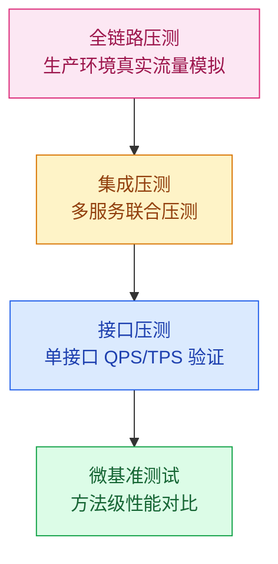
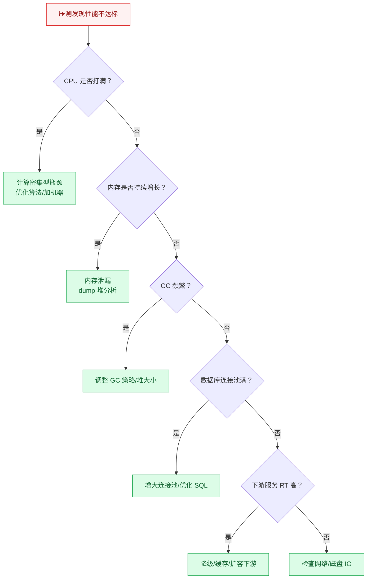

# 性能测试与容量规划

## 模块概述

性能测试与容量规划是高并发系统落地的"最后一公里"——方案设计得再好，没有经过实际压测验证，上线后可能随时崩溃。本模块覆盖从微基准测试到全链路压测的完整方法论，帮助你建立数据驱动的性能优化思维。

::: tip 核心思路
性能测试不是"跑一下看看能不能扛住"，而是**建立性能基线 → 发现瓶颈 → 优化 → 验证**的闭环过程。
:::

::: warning 面试重点
大厂面试中，系统设计题往往要求给出容量估算和压测方案。能讲清楚"怎么测"比"测什么"更重要。
:::

## 性能测试金字塔

| 层级 | 测试工具 | 关注指标 | 适用场景 |
|------|----------|----------|----------|
| 微基准测试 | JMH | 方法吞吐量、平均耗时 | 对比不同实现方案性能 |
| 接口压测 | JMeter/Wrk | QPS、P99 延迟、成功率 | 单接口容量评估 |
| 集成压测 | JMeter/Gatling | 全链路 QPS、各服务 RT | 多服务协同容量 |
| 全链路压测 | 自研平台/TCPCopy | 整体 QPS、资源利用率 | 大促前容量验证 |

## 核心指标体系

| 指标 | 含义 | 为什么重要 |
|------|------|------------|
| **QPS/TPS** | 每秒请求数/事务数 | 衡量系统吞吐能力 |
| **RT（响应时间）** | 请求从发出到收到响应的时间 | 衡量用户体验 |
| **P99/P999 延迟** | 99%/99.9% 请求的最大延迟 | 发现长尾问题 |
| **成功率** | 请求成功比例 | 衡量系统稳定性 |
| **CPU 利用率** | CPU 使用率 | 判断计算瓶颈 |
| **内存使用率** | 内存占用 | 发现内存泄漏 |
| **GC 停顿时间** | 垃圾回收暂停时间 | 影响 RT 稳定性 |

## 性能瓶颈定位方法论

## 学习路径

1. **JMH 微基准测试**：掌握 JVM 层面性能对比的方法论，了解 JIT 预热、死代码消除等陷阱
2. **全链路压测**：学习生产环境压测的挑战与解决方案（影子表、流量染色、数据隔离）

---

## 面试题

### 1. 性能测试金字塔各层关注什么？

| 层级 | 关注点 | 典型工具 |
|------|--------|----------|
| 微基准 | 方法级性能，排除 JVM 干扰 | JMH |
| 接口压测 | 单接口 QPS、RT、成功率 | JMeter、Wrk |
| 集成压测 | 多服务调用链的端到端 RT | JMeter、Gatling |
| 全链路 | 生产环境真实流量模拟 | TCPCopy、自研平台 |

### 2. 压测 QPS 是怎么定义的？

QPS（Queries Per Second）指系统每秒能处理的请求数。计算公式：QPS = 总请求数 / 总耗时（秒）。需要注意的是，QPS 要区分"峰值 QPS"和"平均 QPS"，系统设计时按峰值 QPS × 1.5~2 倍冗余来规划容量。

### 3. 怎么区分性能瓶颈在应用还是数据库？

**四步定位法：**
1. **看 CPU**：应用 CPU 高 → 应用瓶颈；数据库 CPU 高 → 数据库瓶颈
2. **看 RT 分布**：应用 RT 低但总 RT 高 → 数据库/下游慢
3. **看数据库连接数**：连接池满 → 数据库处理能力不足
4. **看慢 SQL**：开启慢查询日志，分析是否有未优化 SQL

### 4. 如何设计压测场景？

**金字塔递进法：**
1. **基准测试**：单接口，逐步增加并发，找到单机 QPS 上限
2. **混合场景**：按线上真实流量比例混合多个接口
3. **脉冲场景**：模拟突发流量（如秒杀开始的瞬间峰值）
4. **长稳测试**：长时间（8~24 小时）持续压测，发现内存泄漏

### 5. 压测数据如何分析？

**关键分析维度：**
1. **RT 分布**：P50/P99/P999，关注长尾延迟
2. **QPS-TPS 对应关系**：QPS 增长时 RT 是否线性增长
3. **资源利用率**：CPU/内存/网络/磁盘 IO 的瓶颈点
4. **错误率**：随 QPS 增长，成功率是否突然下降（性能拐点）
5. **GC 日志**：Full GC 频率和停顿时间是否异常