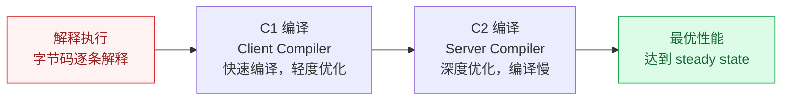

# JMH 微基准测试

## 概述

JMH（Java Microbenchmark Harness）是 OpenJDK 官方提供的微基准测试框架，用于精确测量 Java 方法级别的性能。在高并发开发中，JMH 常用于对比不同实现方案的性能差异（如同步锁 vs CAS、StringBuilder vs StringBuffer）。

::: warning 为什么需要 JMH？
直接用 `System.currentTimeMillis()` 计时是不可靠的，因为 JVM 的 JIT 编译、GC、预热等因素会严重影响测试结果。JMH 通过预热、多轮测试、fork 独立进程等手段消除这些干扰。
:::

## 一、JMH 核心注解

| 注解 | 作用 | 常用配置 |
|------|------|----------|
| `@Benchmark` | 标记测试方法 | — |
| `@Warmup` | 预热配置，让 JIT 充分编译后再测试 | `iterations=3, time=1` |
| `@Measurement` | 正式测试配置 | `iterations=5, time=1` |
| `@Fork` | 独立 fork JVM 进程测试，避免测试间干扰 | `value=1` |
| `@State` | 定义测试状态（共享数据） | `Scope.Thread/Benchmark/Group` |
| `@BenchmarkMode` | 测试模式 | `Mode.Throughput` 等 |
| `@OutputTimeUnit` | 输出时间单位 | `TimeUnit.MICROSECONDS` |

### @State 的三种 Scope

```java
// Scope.Thread：每个线程独享一份状态（默认，线程安全）
@State(Scope.Thread)
public class ThreadState {
    int x = 0;
}

// Scope.Benchmark：所有线程共享一份状态（需要考虑并发）
@State(Scope.Benchmark)
public class SharedState {
    ConcurrentHashMap<String, String> map = new ConcurrentHashMap<>();
}

// Scope.Group：同一线程组内共享
@State(Scope.Group)
public class GroupState {
    // ...
}
```

## 二、四种 BenchmarkMode

| Mode | 含义 | 适用场景 |
|------|------|----------|
| `Mode.Throughput` | 每秒可执行的操作数（ops/s） | 衡量吞吐量，越高越好 |
| `Mode.AverageTime` | 每次操作的平均耗时 | 衡量单次操作效率 |
| `Mode.SampleTime` | 采样统计（P50/P99/P999） | 关注耗时分布 |
| `Mode.SingleShotTime` | 单次执行耗时（无预热） | 冷启动性能 |

```java
@BenchmarkMode(Mode.Throughput)  // 测吞吐量
@OutputTimeUnit(TimeUnit.MICROSECONDS)
public void testMethod() { ... }
```

## 三、JVM 预热与 JIT 编译



**为什么需要预热？**

JVM 启动时是解释执行的，经过 JIT 编译后性能会显著提升。如果不预热，测试结果会受 JIT 编译过程影响，导致结果不准确。

**JMH 预热机制：**
- `@Warmup` 阶段的迭代不计入最终结果
- 默认预热 5 轮，每轮 1 秒（可配置）
- 预热完成后才进入 `@Measurement` 正式测试

## 四、常见陷阱与规避

### 4.1 死代码消除（DCE）

JIT 编译器会消除无用的代码，导致测试结果失真。

```java
// ❌ 错误：result 没有使用，JIT 可能直接消除整个计算
@Benchmark
public void deadCode() {
    int result = 0;
    for (int i = 0; i < 1000; i++) {
        result += i;
    }
}

// ✅ 正确：使用 Blackhole 消费结果，防止 DCE
@Benchmark
public void noDeadCode(Blackhole bh) {
    int result = 0;
    for (int i = 0; i < 1000; i++) {
        result += i;
    }
    bh.consume(result);  // 告诉 JIT 这个值有用
}
```

### 4.2 常量折叠

JIT 会将编译期可确定的常量表达式直接计算结果。

```java
// ❌ 错误：JIT 会将 1+2+3 直接计算为 6，测试的不是加法性能
@Benchmark
public int constantFolding() {
    return 1 + 2 + 3;  // JIT 直接优化为 return 6
}

// ✅ 正确：使用 @State 注入变量，防止常量折叠
@State(Scope.Thread)
public static class MyState {
    public int a = 1;
    public int b = 2;
    public int c = 3;
}

@Benchmark
public int noConstantFolding(MyState s) {
    return s.a + s.b + s.c;  // JIT 无法在编译期确定值
}
```

### 4.3 循环展开

JIT 会优化循环，将小循环展开为顺序执行，导致测试结果不反映真实循环性能。

```java
// ❌ 循环可能被 JIT 优化/展开
@Benchmark
public void loopUnrolling() {
    for (int i = 0; i < 10; i++) {
        doSomething();
    }
}

// ✅ 使用 Blackhole 消费每次迭代结果
@Benchmark
public void noLoopIssue(Blackhole bh) {
    for (int i = 0; i < 10; i++) {
        bh.consume(doSomething());
    }
}
```

## 五、实战对比

### 5.1 StringBuilder vs StringBuffer

```java
@BenchmarkMode(Mode.Throughput)
@OutputTimeUnit(TimeUnit.MILLISECONDS)
@Warmup(iterations = 3, time = 1)
@Measurement(iterations = 5, time = 1)
@Fork(1)
public class StringBenchmark {

    @Benchmark
    public String stringBuilder() {
        StringBuilder sb = new StringBuilder();
        for (int i = 0; i < 100; i++) {
            sb.append("hello");
        }
        return sb.toString();
    }

    @Benchmark
    public String stringBuffer() {
        StringBuffer sb = new StringBuffer();
        for (int i = 0; i < 100; i++) {
            sb.append("hello");
        }
        return sb.toString();
    }
}
// 预期结果：StringBuilder 吞吐量显著高于 StringBuffer（无 synchronized 开销）
```

### 5.2 synchronized vs ReentrantLock vs LongAdder

```java
@State(Scope.Benchmark)
public class LockBenchmark {
    private int counter = 0;
    private final AtomicInteger atomicCounter = new AtomicInteger(0);
    private final LongAdder longAdder = new LongAdder();

    @Benchmark
    public synchronized int synchronizedIncrement() {
        return ++counter;
    }

    @Benchmark
    public int atomicIncrement() {
        return atomicCounter.incrementAndGet();
    }

    @Benchmark
    public void longAdderIncrement() {
        longAdder.increment();
    }
}
// 预期结果：高并发下 LongAdder > AtomicInteger > synchronized
// LongAdder 通过分段累加减少竞争，适合高并发计数场景
```

---

## 六、JMH 结果分析

```
Benchmark                    Mode  Cnt     Score    Error  Units
StringBuilder               thrpt    5  1245.123 ± 12.345  ops/ms
StringBuffer                thrpt    5   423.567 ±  8.901  ops/ms
```

- **Score**：平均吞吐量（1245.123 ops/ms）
- **Error**：误差范围（±12.345），越小越可靠
- **Cnt**：测试迭代次数

## 七、JMH 使用建议

1. **始终 @Fork(1)**：每个测试独立 JVM 进程，避免相互干扰
2. **充分预热**：至少 3~5 轮预热，让 JIT 完成编译
3. **使用 Blackhole**：防止 DCE 消除被测代码
4. **使用 @State**：防止常量折叠
5. **关注 Error 范围**：Error 过大说明测试不稳定，需要调整
6. **结果仅供参考**：JMH 测的是理想状态，生产环境有 GC、IO 等因素影响

---

## 面试题

### 1. JMH 为什么需要预热？

JVM 启动时是解释执行，性能较低。经过 JIT 编译（C1→C2 分层编译）后，代码被编译为本地机器码，性能大幅提升。如果不预热，测试结果会包含解释执行和 JIT 编译阶段的低性能数据，导致结果不准确。JMH 的 `@Warmup` 阶段让 JIT 充分编译，确保 `@Measurement` 阶段测试的是稳定的最优性能。

### 2. @Fork 的作用是什么？

`@Fork` 让每个 Benchmark 在独立的 JVM 进程中运行。好处：
1. **避免测试间干扰**：前一个测试的 JIT 编译信息、GC 状态、静态变量等不会影响后续测试
2. **更接近真实环境**：每次都是从冷启动开始
3. **提高结果可重复性**

默认 `@Fork(1)`，测试环境建议 `@Fork(3)` 多轮取平均。

### 3. @State 的 Scope 有几种？

三种 Scope：
- **Scope.Thread**（默认）：每个线程独享状态，线程安全，无需同步
- **Scope.Benchmark**：所有线程共享同一份状态，需要处理并发问题（如使用 ConcurrentHashMap）
- **Scope.Group**：同一线程组内共享，用于 `@GroupThreads` 场景

选择原则：没有共享需求用 Thread，需要模拟竞争用 Benchmark。

### 4. DCE 是什么？怎么避免？

**DCE（Dead Code Elimination）**：JIT 编译器检测到计算结果没有被使用，直接消除整个计算过程，导致测试结果失实。

**避免方法：**
1. 使用 `Blackhole.consume()` 消费计算结果
2. 将计算结果返回（return），JMH 会隐式消费返回值
3. 不要 `System.out.println()` 来消费——println 本身有 IO 开销

### 5. JMH 的 Mode 有几种？各适合什么场景？

| Mode | 适合场景 |
|------|----------|
| Throughput | 衡量系统吞吐量，如"每秒能处理多少请求" |
| AverageTime | 衡量单次操作平均耗时，如"一次加锁操作平均多久" |
| SampleTime | 关注耗时分布，如"P99 延迟是多少" |
| SingleShotTime | 冷启动性能，如"第一次查询有多慢" |

### 6. 为什么生产环境不能直接用 JMH 结果？

1. **JMH 是理想环境**：无 GC 压力、无 IO 竞争、无其他应用干扰
2. **JMH 测的是微基准**：只测方法级性能，不包含网络、磁盘、数据库等外部因素
3. **JIT 编译差异**：生产环境的 JIT 编译策略、GC 策略可能不同
4. **并发模式差异**：生产环境多线程竞争模式与 JMH 测试不完全一致

JMH 的结果用于**方案对比和相对性能评估**，不能直接作为生产容量依据。生产容量需要通过**全链路压测**来确定。