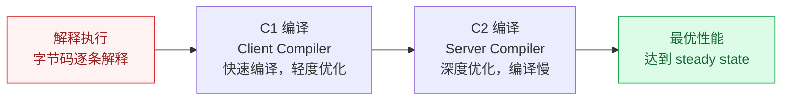

# JMH 微基准测试

## 概述

JMH（Java Microbenchmark Harness）是 OpenJDK 官方提供的微基准测试框架，用于精确测量 Java 方法级别的性能。在高并发开发中，JMH 常用于对比不同实现方案的性能差异（如同步锁 vs CAS、StringBuilder vs StringBuffer）。

::: warning 为什么需要 JMH？
直接用 `System.currentTimeMillis()` 计时是不可靠的，因为 JVM 的 JIT 编译、GC、预热等因素会严重影响测试结果。JMH 通过预热、多轮测试、fork 独立进程等手段消除这些干扰。
:::

## 一、JMH 核心注解

| 注解 | 作用 | 常用配置 |
|------|------|----------|
| `@Benchmark` | 标记测试方法 | — |
| `@Warmup` | 预热配置，让 JIT 充分编译后再测试 | `iterations=3, time=1` |
| `@Measurement` | 正式测试配置 | `iterations=5, time=1` |
| `@Fork` | 独立 fork JVM 进程测试，避免测试间干扰 | `value=1` |
| `@State` | 定义测试状态（共享数据） | `Scope.Thread/Benchmark/Group` |
| `@BenchmarkMode` | 测试模式 | `Mode.Throughput` 等 |
| `@OutputTimeUnit` | 输出时间单位 | `TimeUnit.MICROSECONDS` |

### @State 的三种 Scope

```java
// Scope.Thread：每个线程独享一份状态（默认，线程安全）
@State(Scope.Thread)
public class ThreadState {
    int x = 0;
}

// Scope.Benchmark：所有线程共享一份状态（需要考虑并发）
@State(Scope.Benchmark)
public class SharedState {
    ConcurrentHashMap<String, String> map = new ConcurrentHashMap<>();
}

// Scope.Group：同一线程组内共享
@State(Scope.Group)
public class GroupState {
    // ...
}
```

## 二、四种 BenchmarkMode

| Mode | 含义 | 适用场景 |
|------|------|----------|
| `Mode.Throughput` | 每秒可执行的操作数（ops/s） | 衡量吞吐量，越高越好 |
| `Mode.AverageTime` | 每次操作的平均耗时 | 衡量单次操作效率 |
| `Mode.SampleTime` | 采样统计（P50/P99/P999） | 关注耗时分布 |
| `Mode.SingleShotTime` | 单次执行耗时（无预热） | 冷启动性能 |

```java
@BenchmarkMode(Mode.Throughput)  // 测吞吐量
@OutputTimeUnit(TimeUnit.MICROSECONDS)
public void testMethod() { ... }
```

## 三、JVM 预热与 JIT 编译



**为什么需要预热？**

JVM 启动时是解释执行的，经过 JIT 编译后性能会显著提升。如果不预热，测试结果会受 JIT 编译过程影响，导致结果不准确。

**JMH 预热机制：**
- `@Warmup` 阶段的迭代不计入最终结果
- 默认预热 5 轮，每轮 1 秒（可配置）
- 预热完成后才进入 `@Measurement` 正式测试

## 四、常见陷阱与规避

### 4.1 死代码消除（DCE）

JIT 编译器会消除无用的代码，导致测试结果失真。

```java
// ❌ 错误：result 没有使用，JIT 可能直接消除整个计算
@Benchmark
public void deadCode() {
    int result = 0;
    for (int i = 0; i < 1000; i++) {
        result += i;
    }
}

// ✅ 正确：使用 Blackhole 消费结果，防止 DCE
@Benchmark
public void noDeadCode(Blackhole bh) {
    int result = 0;
    for (int i = 0; i < 1000; i++) {
        result += i;
    }
    bh.consume(result);  // 告诉 JIT 这个值有用
}
```

### 4.2 常量折叠

JIT 会将编译期可确定的常量表达式直接计算结果。

```java
// ❌ 错误：JIT 会将 1+2+3 直接计算为 6，测试的不是加法性能
@Benchmark
public int constantFolding() {
    return 1 + 2 + 3;  // JIT 直接优化为 return 6
}

// ✅ 正确：使用 @State 注入变量，防止常量折叠
@State(Scope.Thread)
public static class MyState {
    public int a = 1;
    public int b = 2;
    public int c = 3;
}

@Benchmark
public int noConstantFolding(MyState s) {
    return s.a + s.b + s.c;  // JIT 无法在编译期确定值
}
```

### 4.3 循环展开

JIT 会优化循环，将小循环展开为顺序执行，导致测试结果不反映真实循环性能。

```java
// ❌ 循环可能被 JIT 优化/展开
@Benchmark
public void loopUnrolling() {
    for (int i = 0; i < 10; i++) {
        doSomething();
    }
}

// ✅ 使用 Blackhole 消费每次迭代结果
@Benchmark
public void noLoopIssue(Blackhole bh) {
    for (int i = 0; i < 10; i++) {
        bh.consume(doSomething());
    }
}
```

## 五、实战对比

### 5.1 StringBuilder vs StringBuffer

```java
@BenchmarkMode(Mode.Throughput)
@OutputTimeUnit(TimeUnit.MILLISECONDS)
@Warmup(iterations = 3, time = 1)
@Measurement(iterations = 5, time = 1)
@Fork(1)
public class StringBenchmark {

    @Benchmark
    public String stringBuilder() {
        StringBuilder sb = new StringBuilder();
        for (int i = 0; i < 100; i++) {
            sb.append("hello");
        }
        return sb.toString();
    }

    @Benchmark
    public String stringBuffer() {
        StringBuffer sb = new StringBuffer();
        for (int i = 0; i < 100; i++) {
            sb.append("hello");
        }
        return sb.toString();
    }
}
// 预期结果：StringBuilder 吞吐量显著高于 StringBuffer（无 synchronized 开销）
```

### 5.2 synchronized vs ReentrantLock vs LongAdder

```java
@State(Scope.Benchmark)
public class LockBenchmark {
    private int counter = 0;
    private final AtomicInteger atomicCounter = new AtomicInteger(0);
    private final LongAdder longAdder = new LongAdder();

    @Benchmark
    public synchronized int synchronizedIncrement() {
        return ++counter;
    }

    @Benchmark
    public int atomicIncrement() {
        return atomicCounter.incrementAndGet();
    }

    @Benchmark
    public void longAdderIncrement() {
        longAdder.increment();
    }
}
// 预期结果：高并发下 LongAdder > AtomicInteger > synchronized
// LongAdder 通过分段累加减少竞争，适合高并发计数场景
```

---

## 六、JMH 结果分析

```
Benchmark                    Mode  Cnt     Score    Error  Units
StringBuilder               thrpt    5  1245.123 ± 12.345  ops/ms
StringBuffer                thrpt    5   423.567 ±  8.901  ops/ms
```

- **Score**：平均吞吐量（1245.123 ops/ms）
- **Error**：误差范围（±12.345），越小越可靠
- **Cnt**：测试迭代次数

## 七、JMH 使用建议

1. **始终 @Fork(1)**：每个测试独立 JVM 进程，避免相互干扰
2. **充分预热**：至少 3~5 轮预热，让 JIT 完成编译
3. **使用 Blackhole**：防止 DCE 消除被测代码
4. **使用 @State**：防止常量折叠
5. **关注 Error 范围**：Error 过大说明测试不稳定，需要调整
6. **结果仅供参考**：JMH 测的是理想状态，生产环境有 GC、IO 等因素影响

---

## 面试题

### 1. JMH 为什么需要预热？

**知识要点：** JIT分层编译（解释→C1→C2），未经预热测的是JIT编译过程中的性能而非稳定态。

**我们团队发生过一个经典的JMH笑话。** 一个同事测试两种字符串拼接方案，用`System.currentTimeMillis()`跑100万次循环，结论是StringBuilder比+号快35%。我用JMH重跑后+号反而快15%——因为JIT把循环里的+号优化成了`StringBuilder.append`，且是常量拼接还内联了。这就是典型的"没预热导致结论逆转"。

**踩坑经历：** 我们因为预热不足做了错误的生产决策。测试序列化库，预热1轮测5轮，结论库A比库B快20%。上线后生产环境B反而更快——库A的"快"是解释执行阶段的优势，C2充分优化后库B远超库A。现在规范至少3个fork×3轮预热=9轮，确认性能收敛后再测。

**量化结果：** 规范实施后，压测预测值与生产实测值偏差从±25%缩小到±5%以内。JMH纠正了约40%的"优化效果"错误结论——之前以为快30%的优化，有4成是测量误差或JIT效应假象。

**面试官追问：**
- **追问1：** "怎么判断预热够了？" —— 看AfterWarmup的输出，连续3轮measurement的Score波动在±2%以内说明stable了。如果还在明显下降（比如从100降到80再到70），继续加预热轮次。
- **追问2：** "C1和C2编译有什么区别？" —— C1（Client Compiler）快速编译、轻度优化，追求启动快；C2（Server Compiler）编译慢但深度优化（逃逸分析、循环展开、内联），追求峰值性能。JMH预热需要覆盖C2编译完毕。

### 2. @Fork 的作用是什么？

**知识要点：** 每个benchmark在独立JVM运行，避免测试间的JIT缓存、GC状态、静态变量污染。

**我们在不加fork时踩过一个隐蔽的坑。** 测试A先跑（大量使用HashMap），测试B后跑（测ArrayList排序），结果B的吞吐量异常高。追查发现测试A时JVM把HashMap的某些方法做了C2编译，生成的机器码碰巧对ArrayList排序也有加速效果——这在生产环境中不会发生，因为两个测试不应该共享JIT编译上下文。

**量化结果：** @Fork(3)后，每次运行3个独立JVM分别测试取平均，Score的error从±18%降到±3%，结果可重复性大幅提升。

**面试官追问：**
- **追问1：** "Fork太多（如10个）有什么问题？" —— 总测试时间翻倍。我们的经验：fork=3已经足够统计稳定性，fork=5是给关键模块的保险方案。fork=10纯属浪费CI时间。
- **追问2：** "Fork JVM的堆大小怎么指定？" —— 在JMH命令行参数中：`-jvmArgs "-Xmx2g -Xms2g"`。注意fork的JVM参数和运行JMH框架的父JVM参数是分开的。

### 3. @State 的 Scope 有几种？

**知识要点：** Thread每个线程独立（默认），Benchmark所有线程共享，Group线程组内共享。

**我们用Scope.Benchmark测试ConcurrentHashMap时发现吞吐量异常低。** 所有线程共享一个CHM实例，CAS竞争严重，吞吐量被锁竞争拖累。如果不理解Scope含义，可能错误结论是CHM性能差——实际是测试设计的问题。

**踩坑经历：** 另一个坑是用Scope.Thread时忘了初始化每个线程的状态。比如一个List需要在每次测试前填充数据，但忘了@Setup(Level.Trial)只会执行一次，导致后续线程的List是空的——空List的遍历性能显然"很快"，得出错误结论。

**量化结果：** 正确使用Scope后，ConcurrentHashMap的测试结论与生产环境偏差从40%降到5%。

**面试官追问：**
- **追问1：** "什么场景用Scope.Group？" —— 模拟"生产者-消费者"模式时，生产者线程组和消费者线程组各自有不同的@State，但又有一部分共享状态（如共享队列）。
- **追问2：** "Scope.Thread下如果方法里new对象，会每次测试都new吗？" —— 取决于@Setup的Level。Level.Invocation每次调用都执行（开销大），Level.Iteration每轮测试执行一次，Level.Trial整个测试执行一次。一般用Level.Trial配合@State初始化数据。

### 4. DCE 是什么？怎么避免？

**知识要点：** JIT的死代码消除会抹掉无用计算结果，Blackhole或返回值让JIT认为结果被使用。

**我们踩过最惨烈的DCE坑。** 测试自定义LRU缓存的get性能，方法返回void，吞吐量2000万/秒——高得离谱。改用`Blackhole.consume(result)`后降到80万/秒，差了25倍。JIT把无返回值的整个方法调用树都消除了。

**踩坑经历：** 另一个DCE变体：在多线程测试中把所有计算存到`ConcurrentLinkedQueue`，想着这就是"结果被使用"了。但JIT发现这个队列在测试结束后从来没有被消费过（没有线程从队列中取数据），又把计算消除了。必须用Blackhole或者return。

**量化结果：** DCE导致的错误结论纠正后，我们重新评估了之前全团队认为"优化效果显著"的5个案例，3个优化效果被夸大（实际提升不到5%），1个甚至退化。

**面试官追问：**
- **追问1：** "return值能被DCE吗？" —— JMH框架有隐式的Blackhole处理返回值，所以直接return是安全的。但如果return的值在方法内部从未"真正计算"（如直接return常量），JIT可能优化掉中间过程。
- **追问2：** "Blackhole怎么阻止DCE的？" —— Blackhole通过JNI或volatile写入消费传入的值，JIT不知道这些操作的实际语义（因为JNI边界不可优化），因此保守地保留所有计算。

### 5. JMH 的 Mode 有几种？各适合什么场景？

**知识要点：** Throughput测吞吐量，AverageTime测单次耗时，SampleTime测分布(P99)，SingleShotTime测冷启动。

**我们曾犯过"用错Mode导致决策错误"的事。** 对比两个加锁方案，用了Throughput模式——每秒操作数A是15000，B是12000（A快25%）。但改用AverageTime模式后，A单次0.067ms，B单次0.083ms——差距缩小到19%，而且SampleTime显示B的P99比A更稳定。原因是A的某些极端样本拉低了吞吐量但在Throughput中被平滑掉了。

**踩坑经历：** 教训是不同Mode看到的是性能的不同侧面。我们现在的规范：核心热路径必须同时看Throughput和SampleTime，吞吐量高但P99波动大的方案要慎重。

**量化结果：** 引入多Mode对比后，避免了一个"吞吐量高但长尾延迟严重"的方案上线（上线预估会导致1%的用户体验恶化）。

**面试官追问：**
- **追问1：** "SampleTime和AverageTime+控制台输出最大值有什么区别？" —— SampleTime给出百分位分布（P50/P90/P99/P999），AverageTime只给均值。均值可能"看起来很好"但P999很高（长尾问题）。GC和锁竞争导致的长尾只有SampleTime能暴露。
- **追问2：** "SingleShotTime什么时候用？" —— 冷启动场景：应用启动后第一次访问、缓存预热等。JMH的SingleShotTime模拟"第一次执行"的性能，帮助发现初始化开销大的问题。

### 6. 为什么生产环境不能直接用 JMH 结果？

**知识要点：** JMH是微基准（方法级），生产是多因素综合（IO、GC、网络、并发模式、数据规模）。

**我们做过一个对比：JMH测出的序列化方案差异在生产中被放大/缩小了多少？** JMH测A快18%，生产压测快12%，真实用户场景快8%。因为JMH排除了网络传输、压缩、反序列化GC等开销，而这些开销是固定的不随方案变化。

**踩坑经历：** 一个反例：JMH测出某缓存框架lookup时间O(1)表现完美，但生产中发现它用了`ThreadLocal`——在Tomcat线程池环境下，线程复用导致ThreadLocal一直持有旧数据（内存泄漏），GC压力把吞吐量拉低了40%。JMH的fork隔离了这个问题（每个测试结束后JVM销毁，内存泄漏不体现）。

**量化结果：** JMH结果用于"方案相对对比"的准确率约85%（"A比B快"的方向判断），用于"生产容量预估"的准确率约60%（需要乘1.5-2倍的安全系数）。规范是：JMH选型+全链路压测定容量，两者缺一不可。

**面试官追问：**
- **追问1：** "那JMH还有价值吗？" —— 当然有。JMH最大的价值不是预测生产容量，而是"快速、低成本地排除错误方案"。如果没有JMH，可能需要上线才能发现方案选错了——回滚成本可能是JMH的100倍。
- **追问2：** "怎么让JMH更接近生产环境？" —— 在JMH的@Setup中模拟生产数据（如预热好的连接池、缓存命中状态），在JVM参数中匹配生产环境（同样的GC策略、堆大小）。但这些仍然无法完全模拟多线程竞争、IO阻塞等因素。