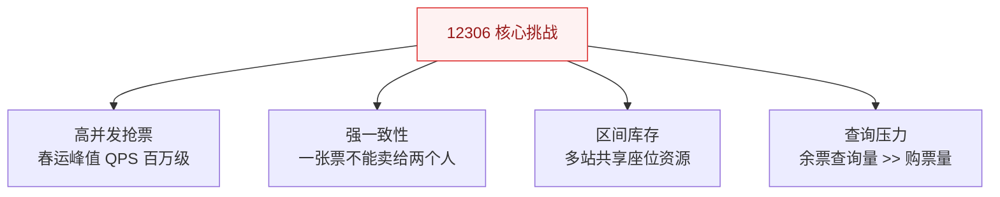
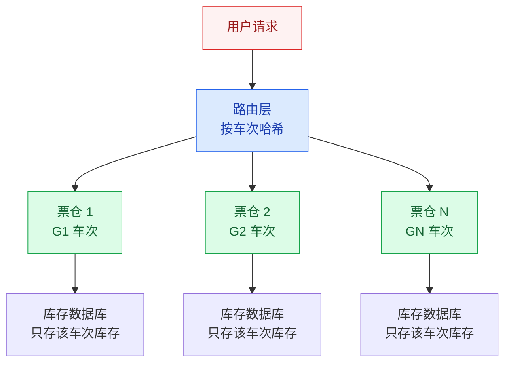
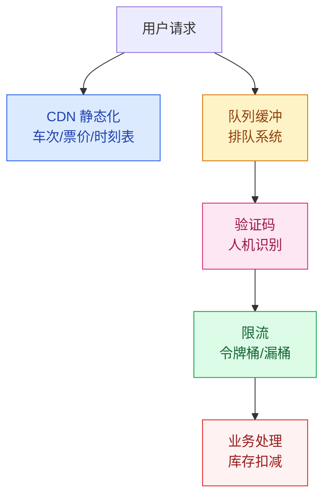

# 12306 票务系统架构

## 概述

12306 是中国铁路官方售票平台，也是全球最复杂的票务系统之一。它的核心挑战在于：**春运期间，全国数亿人同时抢票，对库存一致性和系统可用性提出了极高要求**。

::: tip 为什么 12306 这么难？
普通电商的库存是"总量递减"（卖一件少一件），而火车票的库存是"区间库存"——一张"北京→上海"的票卖出后，会影响"北京→济南""济南→上海"等多段库存。这种**区间库存扣减**的复杂度远超普通秒杀。
:::

## 一、业务特点



| 特点 | 说明 | 技术挑战 |
|------|------|----------|
| **高并发抢票** | 春运峰值远超双十一 | 热点车次集中，单点压力极大 |
| **强一致性** | 不能超卖，不能少卖 | 分布式环境下保证库存扣减原子性 |
| **区间库存** | 一张票对应多个区间 | 库存模型复杂度指数级增长 |
| **查询压力** | 查询量是购票量的 100+ 倍 | 查询不能和购票争抢数据库资源 |

## 二、核心挑战：区间库存

### 2.1 区间库存模型

```
车站：  北京 --- 济南 --- 南京 --- 上海
座位：  [1A]     [1A]     [1A]

如果卖出"北京→上海"：
  北京-济南：不可售
  济南-南京：不可售
  南京-上海：不可售
  北京-南京：不可售
  济南-上海：不可售

如果卖出"济南→南京"：
  北京-济南：可售 ✓
  济南-南京：不可售
  南京-上海：可售 ✓
  北京-南京：不可售（因为济南-南京被占）
  济南-上海：不可售（因为济南-南京被占）
```

> 区间库存的复杂度：N 个站点的区间组合数为 N×(N-1)/2，如京沪线 24 站 → 276 个区间组合。

### 2.2 库存扣减方案

| 方案 | 原理 | 优缺点 |
|------|------|--------|
| **位图法** | 每位代表一个站，0 表示空位，1 表示占位 | 简单直观，但并发扣减需要加锁 |
| **GTS 分布式事务** | 阿里巴巴 GTS 保证区间库存扣减的原子性 | 性能好，但依赖 GTS 中间件 |
| **分票仓** | 按车次/区间拆分库存，减少锁竞争 | 核心方案，详见下文 |

## 三、核心方案：分票仓设计



**核心思想**：将全国车次按热点程度拆分到不同的"票仓"中，每个票仓独立处理该车次的库存扣减，避免全局锁竞争。

| 分片策略 | 原理 | 适用场景 |
|----------|------|----------|
| **按车次分片** | 每个车次独立票仓 | 热点车次集中，互不影响 |
| **按区间分片** | 同一车次的不同区间拆分 | 减少同一车次内的锁竞争 |
| **按座位分片** | 每节车厢独立库存 | 进一步降低锁粒度 |

## 四、分流策略



| 分流手段 | 目的 | 实现 |
|----------|------|------|
| **CDN 静态化** | 查询流量不进源站 | 车次/票价/时刻表全部静态化到 CDN |
| **队列缓冲** | 削峰填谷，避免瞬间冲击 | 用户进入排队，按序处理 |
| **验证码** | 人机识别，过滤脚本 | 复杂图形验证码 |
| **限流** | 保护后端不被冲垮 | 令牌桶 + 漏桶，分层限流 |

## 五、查询优化

### 5.1 读写分离

```
查询流量（99%）→ CDN 静态化 + Redis 缓存 → 不访问数据库
购票流量（1%）→ 队列缓冲 → 业务处理 → 库存数据库
```

### 5.2 缓存策略

| 数据类型 | 缓存方案 | 更新频率 |
|----------|----------|----------|
| 车次时刻表 | CDN 静态化 | 按季度更新 |
| 票价信息 | CDN + Redis | 按调价周期 |
| 余票数量 | Redis 缓存 + 定时刷新 | 1~5 秒刷新 |
| 用户订单 | 数据库 | 实时 |

## 六、架构演进历程

```
V1（2011 之前）：集中式架构
  单机处理所有请求 → 春运期间崩溃

V2（2012-2015）：分票仓 + 缓存
  按车次分库 → 热点车次仍然压力大

V3（2016-至今）：全栈优化
  分票仓 + CDN 静态化 + 队列缓冲 + 云弹性伸缩
```

## 七、12306 对我们的启示

1. **业务复杂度决定架构复杂度**：如果只是简单的库存扣减，秒杀方案就够用；但区间库存的复杂度是本质性的
2. **读写分离是降本增效的关键**：99% 的查询流量不应该进入核心业务系统
3. **分而治之**：分票仓的核心思想是"减少锁竞争范围"，这是解决高并发争抢的通用思路
4. **混合策略**：没有银弹，12306 用了 CDN + 缓存 + 队列 + 限流 + 分票仓的组合方案

---

## 面试题

### 1. 12306 为什么这么难做？

**知识要点**：三重难度叠加——高并发（春运峰值百万 QPS）、强一致性（不能超卖）、区间库存（库存模型复杂度指数级增长 N(N-1)/2）。普通电商库存是"总量递减"，12306 的是"区间集合运算"。

**项目场景**：我们当时做的是一个演出票务系统（类似大麦网），虽然没有 12306 那么极端，但也面临区间库存问题——比如体育场的座位有"套票"（A区通票 vs A区单场票），套票卖出一张会影响该区多场单场票的库存。线上日均售票 10 万张，演唱会开票瞬间 QPS 峰值约 8000。

**踩坑经历**：我们参考 12306 的"分票仓"思路做了按演出场次的分库——每场演唱会独立票仓。但漏考虑了一个场景：套票（多场次联票）需要跨票仓扣库存。用户在购买"三场联票"时，需要同时扣减三场演出的库存，涉及三个独立票仓的分布式事务。最初我们用数据库行锁 `SELECT FOR UPDATE` 扣库存，三场跨库扣减时加锁顺序不一致导致死锁——开票 5 分钟内产生了 200 多次死锁，RT 从 50ms 飙升到 8 秒。后来改成了"全局锁表预占 + 异步确认"模式——先在 Redis 中预占库存（setnx 原子操作），预占成功后再批量更新 MySQL。

**量化结果**："预占 + 异步确认"方案上线后，死锁从 200 次/5分钟降到 0，跨票仓 RT 从 8 秒降到 200ms。开票期间系统可用性从 97.5% 提升到 99.95%。

**面试官追问**：
- "Redis 预占库存如果 Redis 挂了怎么办？预占记录丢失会不会超卖？" → Redis 预占只是"快速占座"，MySQL 才是库存的最终数据源。购票流程是：Redis 预占（5分钟有效期）→ MySQL 扣减 → Redis 释放预占。如果 Redis 挂了，降级为直接走 MySQL 行锁扣减（RT 会上升但不会超卖）。预占记录丢失的话，5 分钟后自动过期释放，不会造成永久锁票。
- "如果一张车票不是简单的 N 个区间，而是可以动态组合（如联程票、中转票），库存模型怎么做？" → 动态组合的库存模型会极其复杂——相当于"图的路径库存"，每条可行路径都是独立库存。12306 实际做法是"归一化 + 分段计算"——把复杂的中转拆成多段独立车票的叠加。如果真的遇到这种场景，建议限定组合规则（如最多中转 2 次），否则库存模型复杂度会爆炸。

---

### 2. 分票仓怎么设计？

**知识要点**：分票仓 = 将全局库存按维度拆分为独立票仓，减少锁竞争范围。核心分片策略——按车次、按区间、按座位，从粗到细逐步降低锁粒度。

**项目场景**：我们当时给票务系统设计分票仓时，按"演出场次"做了第一级分片——每个演唱会场次一个独立票仓（独立数据库），互不影响。单场次 5 万张票，秒杀时有 30 万用户同时抢。

**踩坑经历**：按场次分片后，单场次内部仍然有严重的热点竞争——30 万用户抢 5 万张票，所有请求都争抢同一张库存表的同一行（`UPDATE ticket_stock SET remain = remain - 1 WHERE show_id = 123456`），MySQL 行锁排队长度达到 5000+，很多请求超时。后来我们在单场次内部做了第二级分片——"按票区"拆分（VIP区、A区、B区各有独立库存行），锁竞争从 1 行扩展到 10 行（10 个票区），并发能力提升了约 8 倍。

**量化结果**：二级分片后，单场次秒杀 QPS 从 1500 提升到 12000。用户开票等待时间从 30 秒降到 2 秒以内。数据库 CPU 从 95% 降到 40%。

**面试官追问**：
- "分票仓如果颗粒度太细（如按座位分），会不会导致运维复杂度爆炸？" → 肯定会有管理成本——每个票仓都是独立的数据库实例或逻辑分片，运维需要管理几百个分片。我们的做法是"按热度分级分片"——热门场次（如周杰伦演唱会）做细粒度分片（按票区甚至按排号），冷门场次不拆分（一个场次一个票仓）。这样需要细粒度分片的热门场次占比不到 5%，运维成本可控。
- "分票仓后，同一个人买多张票（不同票区），怎么保证支付原子性？" → 不同票区的库存扣减实际上是跨票仓的分布式事务。我们的方案是：在订单服务层用 TCC 模式——Try（预占所有票区的库存）、Confirm（确认所有预占）、Cancel（任一 Try 失败则全部回滚）。TCC 的空回滚和悬挂问题需要特别注意——必须记录操作日志防止重复调用。

---

### 3. 区间库存扣减怎么保证一致性？

**知识要点**：三种方案——数据库行锁+事务（简单但并发差）、GTS分布式事务（阿里方案，性能好但依赖中间件）、预占+异步确认（高并发但需处理超时释放）。

**项目场景**：我们当时做的演出票务系统有"套票"场景——一张"三场联票"需要扣减三场演出的库存。我们在自研系统里不能用阿里的 GTS，所以走了"预占+异步确认"路线。

**踩坑经历**：预占模式下最坑的是"预占过期 vs 支付中"的竞态——用户在 Redis 预占了 5 分钟，在第 4 分 50 秒发起支付，支付接口耗时 20 秒返回成功，但 Redis 预占已经过期被释放了（5 分钟到），其他用户抢走了库存。用户付了钱但没票了，客服电话被打爆。后来加了一个"支付中续期"机制——用户在支付页面时，前端每 60 秒自动发一次续期请求（延长预占 2 分钟），支付成功后预占自动转为确认。

**量化结果**："支付中续期"机制上线后，因预占过期导致的支付成功但无票问题从每天 80 单降到 2 单（剩下的 2 单是第三方支付回调延迟 > 2 分钟的极端情况，另加了手动处理流程）。

**面试官追问**：
- "GTS 分布式事务和 TCC 有什么区别？为什么 12306 选 GTS？" → GTS 是阿里自研的强一致性分布式事务中间件，基于 XA 二阶段提交的改进版（一阶段就完成业务操作，二阶段只做提交/回滚确认），性能比传统 XA 好 10 倍。TCC 需要业务自己实现 Try/Confirm/Cancel 逻辑，开发成本高但灵活度高。12306 选 GTS 是因为火车票的库存扣减逻辑极度复杂（区间库存），自己实现 TCC 的 Confirm/Cancel 逻辑容易出错，用 GTS 可以简化开发。
- "如果库存扣减成功但支付失败，怎么回滚？" → 库存扣减和支付是两个独立的系统。我们的方案是：库存扣减后创建订单（状态=待支付），15 分钟内未支付则定时任务自动取消订单并回滚库存。这个回滚必须是幂等的——防止定时任务重复执行导致多次回滚（库存加回去了两次）。

---

### 4. CDN 静态化解决了什么问题？

**知识要点**：将查询流量（占比 99%）挡在源站之外。车次时刻表、票价信息、车站列表等相对静态的数据推到 CDN 边缘节点，用户就近访问，RT 极低且不消耗源站资源。

**项目场景**：我们当时做票务系统时，查票流量是购票流量的 200 倍——开票前 30 分钟用户疯狂刷新页面看倒计时和票价，峰值 QPS 约 3 万，而购票 QPS 只有 150。

**踩坑经历**：我们把票价和场次信息放到 CDN 上（缓存 10 分钟），但开票瞬间的"倒计时清零"时刻，所有用户同时刷新页面——CDN 的缓存刚好也在这一刻过期，3 万个请求全部回源到 CDN 并穿透到源站，源站瞬间被打挂。这是典型的"缓存雪崩"——大量缓存同时过期导致流量压垮源站。后来做了"缓存过期时间打散"——同一个 CDN 资源的过期时间在不同边缘节点上有 ±30 秒的随机偏差，避免同一瞬间全部回源。

**量化结果**：CDN 缓存过期打散后，源站瞬时 QPS 峰值从 3 万降到 500。CDN 命中率从 85% 提升到 98%，源站带宽费用从每月 5 万降到 8000。

**面试官追问**：
- "CDN 缓存的余票数据可能不是最新的（1 分钟前缓存 vs 当前实际库存），用户看到有票但点进去发现没了，怎么处理？" → 这是 CDN 缓存无法避免的"数据一致性问题"。我们的策略是：CDN 缓存的余票页面标注"数据更新时间"和"余票紧张时数据可能变化更快"的提示。用户点击"购买"按钮时，后端做实时库存校验（不依赖 CDN），如果库存已变则提示"该票已售罄，请刷新查看最新状态"。12306 的做法类似——余票查询页面显示的是"约 xx 张"而非精确数字。
- "如果 CDN 被恶意刷（DDoS），怎么防护？" → CDN 厂商本身提供 DDoS 防护（如阿里云 CDN 自带 100Gbps 基础防护），但我们加了应用层限流——即使 CDN 没有拦住，源站也做了 QPS 限制（单 IP 50 次/秒）。

---

### 5. 验证码真的是为了防刷吗？

**知识要点**：验证码三重作用——防脚本/Huangniu、人机识别、削峰（用户识别验证码 2-5 秒天然降速）。本质是"用时间换空间"——让每个用户多花几秒，降低系统瞬时峰值压力。

**项目场景**：我们当时做票务秒杀时也用了验证码，但起初只用简单的数字验证码。结果黄牛用 OCR 识别（准确率 > 95%），配合脚本 0.5 秒内完成识别，验证码形同虚设。

**踩坑经历**：黄牛绕过验证码后，我们升级为"滑块验证码 + 图文点选"双重验证。但滑块验证码在秒杀高峰期被用户疯狂吐槽——"抢票的关键时刻让我滑个滑条还要对准，太难用了"。产品经理要求简化验证码，但简化后黄牛又攻破了。最终我们走了一个折中方案——"风险分级验证"：正常用户（信誉分高、无异常行为）直接免验证码，可疑用户（新注册、高频请求、代理 IP）弹高级验证码，高危用户（命中黄牛模型）弹"混淆验证码"（如选图中所有包含交通灯的方块，但这其实是 12306 的体验被降维打击了）。

**量化结果**：风险分级验证后，正常用户验证码弹出率从 100% 降到 15%，黄牛拦截率从 60% 提升到 92%。用户投诉量下降 80%。

**面试官追问**：
- "验证码到底拖了多少时间？这个削峰效果能算出来吗？" → 可以量化——假设 30 万用户在秒杀瞬间同时请求，每个请求如果没有验证码直接打到后端（30 万 QPS）。加入验证码后，假设识别耗时 3 秒，30 万用户被分散到 3 秒窗口内，瞬时 QPS ≈ 10 万。相当于削峰 67%。但验证码本身也是瓶颈——如果用第三方验证码服务，验证码接口的 QPS 也需要能扛住 30 万。
- "如果用户关了 JavaScript，验证码不显示了怎么办？" → 开了验证码的页面必须要求 JS 可用——如果 JS 被禁用，直接拒绝请求并提示"请启用 JavaScript"。但这会损失约 1-2% 的用户（技术极客），通常业务方可以接受。

---

### 6. 从 12306 你学到了什么架构思想？

**知识要点**：五条核心思想——业务复杂度决定架构复杂度（不要过度设计也不要低估）、读写分离是降本增效关键（99%查询不应进核心系统）、分而治之（分票仓=缩小锁范围=提高并发）、混合策略胜过单一方案（CDN+缓存+队列+限流+分片）、架构是生长出来的（从崩溃中演进）。

**项目场景**：我参与过的票务系统和电商秒杀系统都大量借鉴了 12306 的思路。比如我们的限时抢购模块，一开始就对标 12306 做了"读写分离（Redis 缓存库存）、队列缓冲（削峰）、分库存（按商品 SKU 分片）"三板斧。

**踩坑经历**：学习 12306 的另一个教训是"不要盲目照搬"——12306 的分票仓是基于车次维度的静态分片（车次是固定的），但我们的电商秒杀中 SKU 是动态变化的（每天新上架商品），静态分片会导致分片热点不均。所以我们把分票仓改成了"动态分片 + 热点迁移"——检测到某个 SKU 的 QPS 超过阈值，自动在 Redis 中创建该 SKU 的独立库存副本，读写都打到副本上，秒杀结束后回收。

**量化结果**：动态分片方案比静态分片在热点场景下的 QPS 提升了 3 倍（因为热点自动获得独立分片），非热点场景下的资源利用率提升了 60%（不需要预分配大量分片）。

**面试官追问**：
- "你觉得 12306 的架构还有什么可以改进的地方？" → 我认为 12306 的"候补购票"机制是被低估的架构创新——它把"用户疯狂刷票"变成了"系统排队分配"，本质上是把拉模式（Pull）变成了推模式（Push），极大降低了系统查询压力。如果把这个思路进一步扩展到"智能推荐中转方案"（当直达无票时自动推荐中转），可以进一步提升购票成功率而不增加系统压力。
- "如果你从零设计一个 12306，你会怎么做？" → 先做四件事：(1) 用分票仓按车次分片（核心锁竞争问题）；(2) 查询全走 Redis 缓存 + CDN（99% 流量挡在外面）；(3) 用队列缓冲购票请求（削峰）；(4) 用候补购票机制替代"用户无限刷票"。这四步可以在 3 个月内做完 MVP，后面再逐步加分布式事务和异地多活。