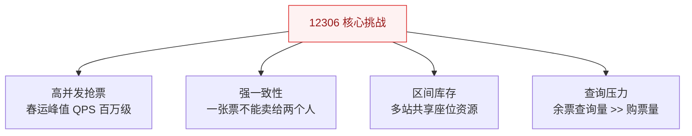
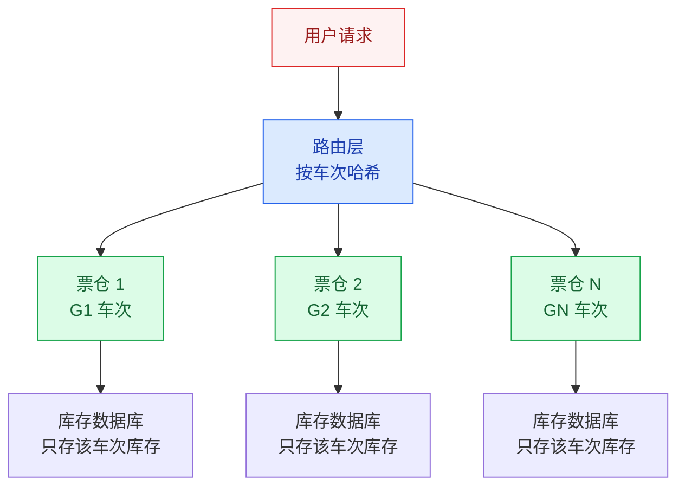
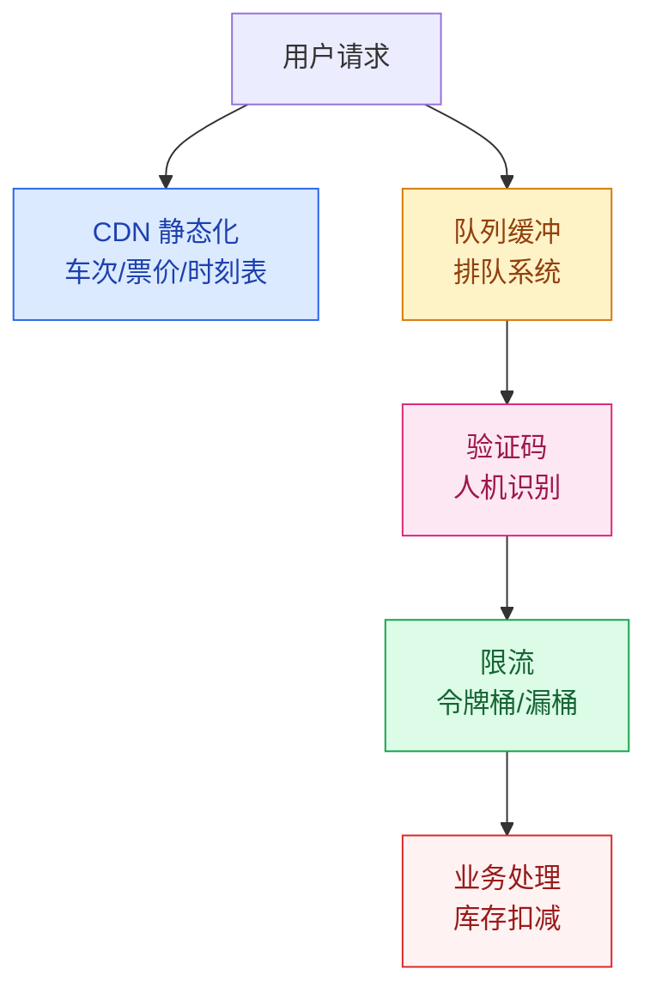

# 12306 票务系统架构

## 概述

12306 是中国铁路官方售票平台，也是全球最复杂的票务系统之一。它的核心挑战在于：**春运期间，全国数亿人同时抢票，对库存一致性和系统可用性提出了极高要求**。

::: tip 为什么 12306 这么难？
普通电商的库存是"总量递减"（卖一件少一件），而火车票的库存是"区间库存"——一张"北京→上海"的票卖出后，会影响"北京→济南""济南→上海"等多段库存。这种**区间库存扣减**的复杂度远超普通秒杀。
:::

## 一、业务特点



| 特点 | 说明 | 技术挑战 |
|------|------|----------|
| **高并发抢票** | 春运峰值远超双十一 | 热点车次集中，单点压力极大 |
| **强一致性** | 不能超卖，不能少卖 | 分布式环境下保证库存扣减原子性 |
| **区间库存** | 一张票对应多个区间 | 库存模型复杂度指数级增长 |
| **查询压力** | 查询量是购票量的 100+ 倍 | 查询不能和购票争抢数据库资源 |

## 二、核心挑战：区间库存

### 2.1 区间库存模型

```
车站：  北京 --- 济南 --- 南京 --- 上海
座位：  [1A]     [1A]     [1A]

如果卖出"北京→上海"：
  北京-济南：不可售
  济南-南京：不可售
  南京-上海：不可售
  北京-南京：不可售
  济南-上海：不可售

如果卖出"济南→南京"：
  北京-济南：可售 ✓
  济南-南京：不可售
  南京-上海：可售 ✓
  北京-南京：不可售（因为济南-南京被占）
  济南-上海：不可售（因为济南-南京被占）
```

> 区间库存的复杂度：N 个站点的区间组合数为 N×(N-1)/2，如京沪线 24 站 → 276 个区间组合。

### 2.2 库存扣减方案

| 方案 | 原理 | 优缺点 |
|------|------|--------|
| **位图法** | 每位代表一个站，0 表示空位，1 表示占位 | 简单直观，但并发扣减需要加锁 |
| **GTS 分布式事务** | 阿里巴巴 GTS 保证区间库存扣减的原子性 | 性能好，但依赖 GTS 中间件 |
| **分票仓** | 按车次/区间拆分库存，减少锁竞争 | 核心方案，详见下文 |

## 三、核心方案：分票仓设计



**核心思想**：将全国车次按热点程度拆分到不同的"票仓"中，每个票仓独立处理该车次的库存扣减，避免全局锁竞争。

| 分片策略 | 原理 | 适用场景 |
|----------|------|----------|
| **按车次分片** | 每个车次独立票仓 | 热点车次集中，互不影响 |
| **按区间分片** | 同一车次的不同区间拆分 | 减少同一车次内的锁竞争 |
| **按座位分片** | 每节车厢独立库存 | 进一步降低锁粒度 |

## 四、分流策略



| 分流手段 | 目的 | 实现 |
|----------|------|------|
| **CDN 静态化** | 查询流量不进源站 | 车次/票价/时刻表全部静态化到 CDN |
| **队列缓冲** | 削峰填谷，避免瞬间冲击 | 用户进入排队，按序处理 |
| **验证码** | 人机识别，过滤脚本 | 复杂图形验证码 |
| **限流** | 保护后端不被冲垮 | 令牌桶 + 漏桶，分层限流 |

## 五、查询优化

### 5.1 读写分离

```
查询流量（99%）→ CDN 静态化 + Redis 缓存 → 不访问数据库
购票流量（1%）→ 队列缓冲 → 业务处理 → 库存数据库
```

### 5.2 缓存策略

| 数据类型 | 缓存方案 | 更新频率 |
|----------|----------|----------|
| 车次时刻表 | CDN 静态化 | 按季度更新 |
| 票价信息 | CDN + Redis | 按调价周期 |
| 余票数量 | Redis 缓存 + 定时刷新 | 1~5 秒刷新 |
| 用户订单 | 数据库 | 实时 |

## 六、架构演进历程

```
V1（2011 之前）：集中式架构
  单机处理所有请求 → 春运期间崩溃

V2（2012-2015）：分票仓 + 缓存
  按车次分库 → 热点车次仍然压力大

V3（2016-至今）：全栈优化
  分票仓 + CDN 静态化 + 队列缓冲 + 云弹性伸缩
```

## 七、12306 对我们的启示

1. **业务复杂度决定架构复杂度**：如果只是简单的库存扣减，秒杀方案就够用；但区间库存的复杂度是本质性的
2. **读写分离是降本增效的关键**：99% 的查询流量不应该进入核心业务系统
3. **分而治之**：分票仓的核心思想是"减少锁竞争范围"，这是解决高并发争抢的通用思路
4. **混合策略**：没有银弹，12306 用了 CDN + 缓存 + 队列 + 限流 + 分票仓的组合方案

---

## 面试题

### 1. 12306 为什么这么难做？

**三重难度叠加：**
1. **高并发**：春运峰值 QPS 百万级，远超普通电商大促
2. **强一致性**：一张票不能超卖，这是硬约束
3. **区间库存**：货物是"一件"，但火车票的"一件"对应多个区间，库存模型复杂度指数级增长

普通电商：库存 = 商品总数 - 已售数（简单的减法）
12306：库存 = 所有可用区间的集合，每次购买影响多个区间（复杂的集合运算）

### 2. 分票仓怎么设计？

**核心思路**：将全国车次按维度拆分到独立的"票仓"中，每个票仓独立处理库存扣减。

**分片策略：**
1. **按车次**：每个车次（或车次组）分配一个票仓，热点车次（如京沪线）独立
2. **按区间**：同一车次按区间进一步拆分
3. **按座位**：每节车厢独立库存

**关键收益**：将全局锁竞争缩小为票仓内锁竞争，大幅提升并发能力。

### 3. 区间库存扣减怎么保证一致性？

**方案一：数据库行锁 + 事务**
```sql
BEGIN;
-- 锁定该车次所有相关区间的库存记录
SELECT * FROM seat_inventory 
WHERE train_id = 'G1' AND station BETWEEN '北京' AND '上海' 
FOR UPDATE;
-- 检查所有区间是否都有库存
-- 扣减所有相关区间库存
UPDATE seat_inventory SET available = available - 1 
WHERE ...;
COMMIT;
```
缺点：锁范围大，并发性能差。

**方案二：GTS 分布式事务**
使用阿里巴巴 GTS（全局事务服务），保证跨分片的区间库存扣减原子性。这是 12306 实际采用的方案。

### 4. CDN 静态化解决了什么问题？

**核心收益**：将 99% 的查询流量挡在源站之外。

- **车次时刻表**：一年变几次，完全可以 CDN 静态化
- **票价信息**：调价周期长，静态化
- **余票查询**：从 Redis 获取，不经过数据库

如果没有 CDN 静态化，亿万次查询直接打到数据库，系统根本扛不住。

### 5. 验证码真的是为了防刷吗？

**不止是防刷，更是削峰：**
1. **防脚本抢票**：阻挡自动化脚本和黄牛
2. **削峰**：用户识别验证码需要 2~5 秒，自然起到了"排队"和"降速"的效果
3. **人机识别**：区分真实用户和程序

> 验证码本质上是"用时间换空间"——让用户多花几秒，降低系统峰值压力。

### 6. 从 12306 你学到了什么架构思想？

1. **业务复杂度决定架构复杂度**：不要为简单业务做过度设计，也不要低估复杂业务的难度
2. **读写分离是降本增效的关键**：查询走缓存，写入走核心业务系统
3. **分而治之**：分票仓 = 缩小锁范围 = 提高并发，这是通用的高并发优化思路
4. **混合策略胜过单一方案**：CDN + 缓存 + 队列 + 限流 + 分票仓，多种手段组合
5. **架构是生长出来的**：12306 也是从"春运崩溃"一步步演进到今天