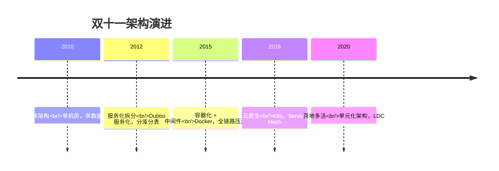
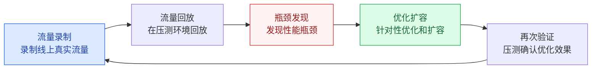
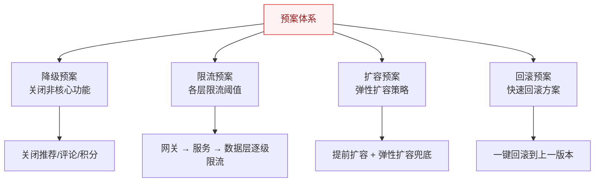
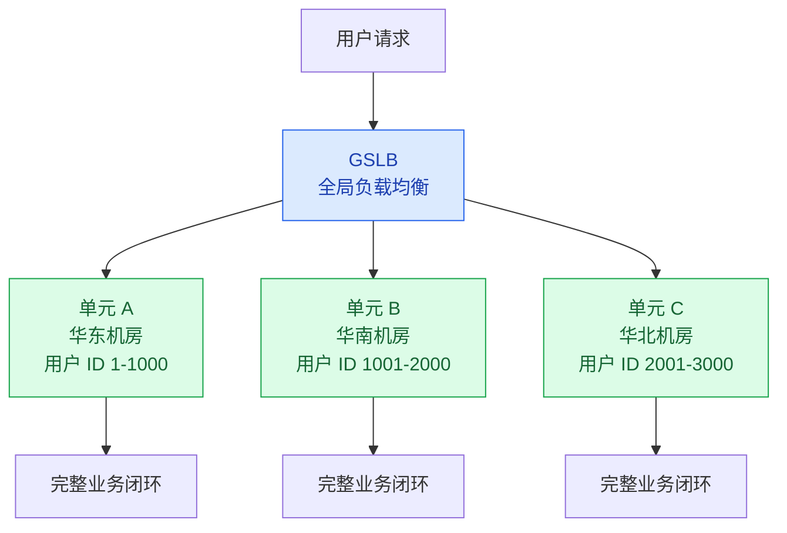

# 双十一架构演进

## 概述

阿里巴巴双十一是全球最大的购物狂欢节，也是技术领域的"超级工程"。从 2010 年的单体架构到 2020 年的异地多活，双十一的技术演进史就是一部高并发架构发展史。

::: tip 核心价值
学习双十一架构演进，不是为了记住"阿里用了什么技术"，而是理解**在业务规模爆发式增长的过程中，架构是如何一步步演进以应对挑战的**。
:::

## 一、架构演进历程



### 各阶段详解

| 阶段 | 年份 | 峰值 QPS | 核心架构变化 | 关键技术创新 |
|------|------|----------|-------------|-------------|
| **单体** | 2010 | 万级 | 单机房 + 单数据库 | 集中式架构 |
| **服务化** | 2012 | 十万级 | Dubbo 服务化拆分，分库分表 | TDDL 分库分表中间件 |
| **容器化** | 2015 | 百万级 | Docker 容器化，弹性伸缩 | 全链路压测平台 |
| **云原生** | 2018 | 千万级 | K8s 编排，Service Mesh，Serverless | 全面上云 |
| **多活** | 2020 | 亿级 | 异地多活，单元化架构 | LDC 逻辑数据中心 |

## 二、全链路压测体系

### 2.1 为什么需要全链路压测？

双十一的特殊性在于：**峰值流量是平时的数十倍甚至上百倍**。如果不提前验证，没人知道系统能不能扛住。



### 2.2 压测核心挑战与解决方案

| 挑战 | 解决方案 |
|------|----------|
| 数据隔离 | 影子表/影子库，压测数据不污染线上 |
| 流量染色 | HTTP Header 标记 + 全链路透传 |
| 环境差异 | 在生产环境压测（而非独立压测环境） |
| 风险控制 | 实时监控 + 一键熔断 + 分步加压 |

### 2.3 压测实施流程

```
第一轮：单接口基准 → 找到单机 QPS 上限
第二轮：混合场景 → 找到集群 QPS 上限
第三轮：全链路 → 找到全链路瓶颈
第四轮：脉冲测试 → 模拟瞬间峰值
第五轮：长稳测试 → 24h 持续压测，发现内存泄漏
```

## 三、大促保障体系

### 3.1 预案管理



### 3.2 降级开关设计

```java
// 基于配置中心的动态降级开关
@Component
public class DegradeSwitch {
    
    @Value("${degrade.recommend:false}")
    private boolean recommendDegrade;  // 推荐服务降级
    
    @Value("${degrade.comment:false}")
    private boolean commentDegrade;     // 评论服务降级
    
    @Value("${degrade.points:false}")
    private boolean pointsDegrade;      // 积分服务降级
    
    public List<Product> getProducts() {
        List<Product> products = productService.getList();
        if (!recommendDegrade) {
            // 非降级时才加载推荐
            products.forEach(p -> 
                p.setRecommendations(recommendService.getRecommendations(p.getId())));
        }
        return products;
    }
}
```

**降级开关设计要点：**
1. **配置中心存储**：开关值存储在 Nacos/Apollo，实时生效无需重启
2. **分级降级**：一级降级（关闭推荐）→ 二级降级（关闭评论）→ 三级降级（关闭搜索）
3. **自动降级**：结合监控指标，错误率超过阈值自动触发降级
4. **一键切换**：大促开始时一键进入降级模式，结束后一键恢复

### 3.3 大促时间线

```
大促前 1 个月：容量评估 + 压测 + 扩容
大促前 1 周  ：全链路压测 + 预案演练
大促前 1 天  ：降级开关预置 + 监控大盘配置
大促当天    ：
  00:00-00:30：峰值期（降级模式）
  00:30-02:00：逐步恢复非核心功能
  02:00+     ：正常模式
大促后 1 周  ：缩容 + 复盘 + 技术债务清理
```

## 四、单元化架构（LDC）

### 4.1 什么是单元化？



**单元化架构的核心思想**：将一个大型系统拆分为多个**自包含**的单元，每个单元拥有完整的业务能力和数据，用户被路由到固定的单元。单元之间数据不共享，需要跨单元访问时通过异步消息同步。

### 4.2 单元化 vs 微服务

| 维度 | 单元化 | 微服务 |
|------|--------|--------|
| 拆分维度 | 按用户（垂直切分） | 按业务功能（水平切分） |
| 数据归属 | 用户数据归属于特定单元 | 数据按业务域分布 |
| 跨单元访问 | 极少（异步消息同步） | 频繁（RPC 调用） |
| 扩展方式 | 增加单元（复制整套） | 增加服务实例 |
| 故障隔离 | 单元故障只影响该单元用户 | 服务故障影响所有用户 |

### 4.3 用户路由（GSLB）

```
用户 ID = 12345
→ hash(12345) % 100 = 45
→ 路由到单元 45

用户登录时：
1. 根据用户 ID 计算目标单元
2. DNS 返回目标单元的 IP
3. 后续请求都在该单元内完成
```

## 五、对中小公司的启示

| 大厂做法 | 中小公司替代方案 | 说明 |
|----------|-----------------|------|
| 自研全链路压测平台 | JMeter + 影子表 | 够用就行 |
| 异地多活 | 主备切换 + 同城双活 | 成本可控 |
| 单元化架构 | 微服务 + 分库分表 | 大部分场景够用 |
| 自研中间件 | 开源中间件 | 社区支持足够 |
| 百人 SRE 团队 | 1-2 个 DevOps + 云服务 | 利用云厂商能力 |

**核心原则：量力而行，渐进式演进。**

---

## 面试题

### 1. 双十一架构演进的几个关键阶段？

**五大阶段：**
1. **2010 单体架构**：单机房 + 单数据库，QPS 万级
2. **2012 服务化拆分**：Dubbo 服务化 + 分库分表，QPS 十万级
3. **2015 容器化**：Docker + 全链路压测 + 弹性伸缩，QPS 百万级
4. **2018 云原生**：K8s + Service Mesh + Serverless，QPS 千万级
5. **2020 异地多活**：单元化架构 + LDC，QPS 亿级

### 2. 全链路压测核心挑战和解决方案？

**四大挑战：**
1. **数据隔离** → 影子表/影子库
2. **流量染色** → HTTP Header + 全链路透传
3. **环境差异** → 在生产环境压测，而非独立环境
4. **风险控制** → 实时监控 + 一键熔断 + 分步加压

### 3. 单元化架构是什么？为什么需要？

**单元化架构**：将系统按用户维度拆分为多个自包含的单元，每个单元有完整的业务能力和数据。

**为什么需要：**
1. **故障隔离**：一个单元故障不影响其他单元的用户
2. **水平扩展**：增加用户量只需增加单元
3. **异地多活**：每个单元可以部署在不同城市
4. **降低耦合**：单元间极少直接调用，减少级联故障

### 4. 大促保障预案怎么设计？

**预案体系四要素：**
1. **降级预案**：关闭非核心功能（推荐/评论/积分），核心链路保留
2. **限流预案**：各层限流阈值配置（网关 → 服务 → 数据层）
3. **扩容预案**：提前扩容 + 弹性扩容兜底
4. **回滚预案**：每个变更都有回滚方案，一键执行

**关键**：预案不是"出了事再想怎么办"，而是**提前准备、提前演练**。

### 5. 大促降级开关怎么设计才能快速生效？

**设计要点：**
1. **配置中心存储**：开关值存储在 Nacos/Apollo，支持动态刷新（`@RefreshScope`）
2. **分级控制**：每个非核心功能独立开关，可单独降级
3. **自动降级**：结合 Sentinel 等框架，错误率超过阈值自动触发
4. **一键切换**：大促开始时一键进入降级模式，结束后一键恢复
5. **客户端缓存**：开关值在客户端缓存，配置中心故障时不影响

```java
// 配置中心 + 本地缓存，多级降级保障
@RefreshScope  // 配置变更自动刷新
@Service
public class DegradeService {
    @Value("${degrade.level:0}")  // 0=正常, 1=一级, 2=二级, 3=三级
    private int degradeLevel;
    
    public boolean isDegraded(String feature) {
        return degradeLevel >= featureDegradeMapping.get(feature);
    }
}
```

### 6. 双十一对中小公司有什么启示？

1. **量力而行**：不要为了"双十一级别的架构"而过度设计，10 万 QPS 的系统不需要单元化
2. **渐进式演进**：架构是生长出来的，先解决当前瓶颈，再考虑下一步
3. **善用云服务**：中小公司可以借助云厂商的弹性伸缩、CDN、高防等能力
4. **压测是必须的**：即使不做全链路，至少要做单接口压测
5. **预案比方案更重要**：出问题不可怕，可怕的是出问题不知道怎么处理