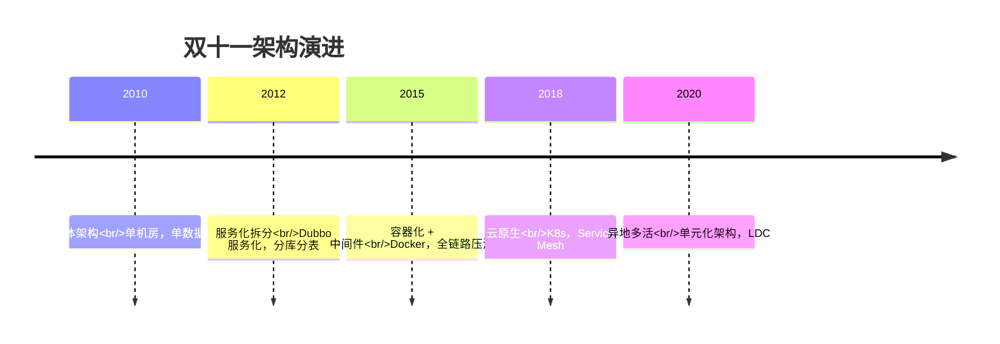
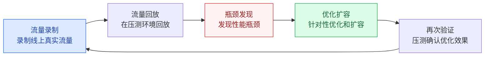
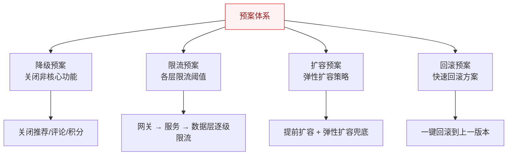
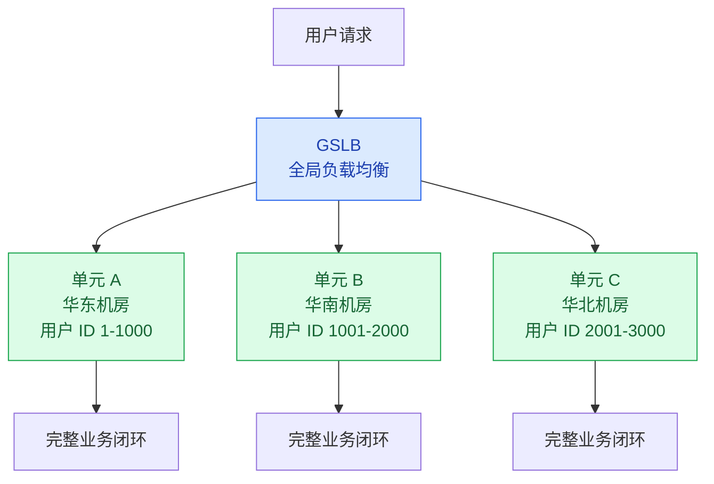

# 双十一架构演进

## 概述

阿里巴巴双十一是全球最大的购物狂欢节，也是技术领域的"超级工程"。从 2010 年的单体架构到 2020 年的异地多活，双十一的技术演进史就是一部高并发架构发展史。

::: tip 核心价值
学习双十一架构演进，不是为了记住"阿里用了什么技术"，而是理解**在业务规模爆发式增长的过程中，架构是如何一步步演进以应对挑战的**。
:::

## 一、架构演进历程



### 各阶段详解

| 阶段 | 年份 | 峰值 QPS | 核心架构变化 | 关键技术创新 |
|------|------|----------|-------------|-------------|
| **单体** | 2010 | 万级 | 单机房 + 单数据库 | 集中式架构 |
| **服务化** | 2012 | 十万级 | Dubbo 服务化拆分，分库分表 | TDDL 分库分表中间件 |
| **容器化** | 2015 | 百万级 | Docker 容器化，弹性伸缩 | 全链路压测平台 |
| **云原生** | 2018 | 千万级 | K8s 编排，Service Mesh，Serverless | 全面上云 |
| **多活** | 2020 | 亿级 | 异地多活，单元化架构 | LDC 逻辑数据中心 |

## 二、全链路压测体系

### 2.1 为什么需要全链路压测？

双十一的特殊性在于：**峰值流量是平时的数十倍甚至上百倍**。如果不提前验证，没人知道系统能不能扛住。



### 2.2 压测核心挑战与解决方案

| 挑战 | 解决方案 |
|------|----------|
| 数据隔离 | 影子表/影子库，压测数据不污染线上 |
| 流量染色 | HTTP Header 标记 + 全链路透传 |
| 环境差异 | 在生产环境压测（而非独立压测环境） |
| 风险控制 | 实时监控 + 一键熔断 + 分步加压 |

### 2.3 压测实施流程

```
第一轮：单接口基准 → 找到单机 QPS 上限
第二轮：混合场景 → 找到集群 QPS 上限
第三轮：全链路 → 找到全链路瓶颈
第四轮：脉冲测试 → 模拟瞬间峰值
第五轮：长稳测试 → 24h 持续压测，发现内存泄漏
```

## 三、大促保障体系

### 3.1 预案管理



### 3.2 降级开关设计

```java
// 基于配置中心的动态降级开关
@Component
public class DegradeSwitch {
    
    @Value("${degrade.recommend:false}")
    private boolean recommendDegrade;  // 推荐服务降级
    
    @Value("${degrade.comment:false}")
    private boolean commentDegrade;     // 评论服务降级
    
    @Value("${degrade.points:false}")
    private boolean pointsDegrade;      // 积分服务降级
    
    public List<Product> getProducts() {
        List<Product> products = productService.getList();
        if (!recommendDegrade) {
            // 非降级时才加载推荐
            products.forEach(p -> 
                p.setRecommendations(recommendService.getRecommendations(p.getId())));
        }
        return products;
    }
}
```

**降级开关设计要点：**
1. **配置中心存储**：开关值存储在 Nacos/Apollo，实时生效无需重启
2. **分级降级**：一级降级（关闭推荐）→ 二级降级（关闭评论）→ 三级降级（关闭搜索）
3. **自动降级**：结合监控指标，错误率超过阈值自动触发降级
4. **一键切换**：大促开始时一键进入降级模式，结束后一键恢复

### 3.3 大促时间线

```
大促前 1 个月：容量评估 + 压测 + 扩容
大促前 1 周  ：全链路压测 + 预案演练
大促前 1 天  ：降级开关预置 + 监控大盘配置
大促当天    ：
  00:00-00:30：峰值期（降级模式）
  00:30-02:00：逐步恢复非核心功能
  02:00+     ：正常模式
大促后 1 周  ：缩容 + 复盘 + 技术债务清理
```

## 四、单元化架构（LDC）

### 4.1 什么是单元化？



**单元化架构的核心思想**：将一个大型系统拆分为多个**自包含**的单元，每个单元拥有完整的业务能力和数据，用户被路由到固定的单元。单元之间数据不共享，需要跨单元访问时通过异步消息同步。

### 4.2 单元化 vs 微服务

| 维度 | 单元化 | 微服务 |
|------|--------|--------|
| 拆分维度 | 按用户（垂直切分） | 按业务功能（水平切分） |
| 数据归属 | 用户数据归属于特定单元 | 数据按业务域分布 |
| 跨单元访问 | 极少（异步消息同步） | 频繁（RPC 调用） |
| 扩展方式 | 增加单元（复制整套） | 增加服务实例 |
| 故障隔离 | 单元故障只影响该单元用户 | 服务故障影响所有用户 |

### 4.3 用户路由（GSLB）

```
用户 ID = 12345
→ hash(12345) % 100 = 45
→ 路由到单元 45

用户登录时：
1. 根据用户 ID 计算目标单元
2. DNS 返回目标单元的 IP
3. 后续请求都在该单元内完成
```

## 五、对中小公司的启示

| 大厂做法 | 中小公司替代方案 | 说明 |
|----------|-----------------|------|
| 自研全链路压测平台 | JMeter + 影子表 | 够用就行 |
| 异地多活 | 主备切换 + 同城双活 | 成本可控 |
| 单元化架构 | 微服务 + 分库分表 | 大部分场景够用 |
| 自研中间件 | 开源中间件 | 社区支持足够 |
| 百人 SRE 团队 | 1-2 个 DevOps + 云服务 | 利用云厂商能力 |

**核心原则：量力而行，渐进式演进。**

---

## 面试题

### 1. 双十一架构演进的几个关键阶段？

**知识要点**：五大阶段——单体（2010，QPS万级）→ 服务化（2012，Dubbo+分库分表，十万级）→ 容器化（2015，Docker+全链路压测，百万级）→ 云原生（2018，K8s+Service Mesh，千万级）→ 异地多活（2020，单元化+LDC，亿级）。每个阶段的架构升级都是由"业务量级增长"倒逼出来的。

**项目场景**：我们当时做一个电商平台的架构演进，日订单量从 1 万涨到 50 万，亲身经历了从"单体拆微服务"到"全链路压测"再到"考虑异地多活"的完整过程。

**踩坑经历**：从单体拆分微服务时，我们犯了和很多团队一样的错误——按"技术层"而非"业务域"拆分。把 Controller 层、Service 层、DAO 层各拆成一个微服务，结果一个下单请求要跨 3 个服务调用（Controller→Service→DAO），链路 RT 从 50ms 涨到 300ms。后来按业务域重新拆分（订单服务、商品服务、用户服务，每个服务内部有自己的 Controller-Service-DAO 完整闭环），RT 恢复到 80ms。这让我深刻理解了"按业务能力拆分"而非"按技术层拆分"的重要性。

**量化结果**：按业务域拆分后，各服务可独立部署和扩容。大促时下单服务扩到 20 个节点，商品服务只需 4 个节点（浏览为主）。资源利用率从 30% 提升到 65%。

**面试官追问**：
- "单体拆分微服务后，什么时候该拆、什么时候不该拆？" → 拆的条件：(1) 业务模块有独立的迭代周期（不同团队负责）；(2) 模块的流量特征差异大（如读多写少 vs 写多读少）；(3) 模块有独立的容量需求（需要独立扩容）。不拆的条件：业务逻辑高度耦合、数据一致性要求强（分布式事务成本高）、团队规模小（< 10 人，微服务运维成本大于收益）。我们当时的判断标准——10 人以下的团队用"模块化单体"（Modular Monolith），10-50 人开始考虑拆分。
- "K8s 和传统的虚拟机部署相比，真正的好处是什么？" → 最大的好处不是"容器化"本身，而是"声明式运维"——K8s 的 Deployment 定义了"我要 20 个 Pod 副本"，如果某个 Pod 挂了 K8s 自动补一个，不需要人工干预。在大促场景下，K8s 的 HPA（水平自动扩缩容）根据 CPU/内存自动加 Pod，比人工扩容快 10 倍。我们的经验：凌晨 0 点秒杀开始流量飙升，HPA 在 2 分钟内自动扩了 30 个 Pod，运维还在睡觉系统已经自愈了。

---

### 2. 全链路压测核心挑战和解决方案？

**知识要点**：四大挑战——数据隔离（影子表/影子库）、流量染色（Header + 全链路透传）、环境差异（直接在生产环境压测）、风险控制（分步加压 + 一键熔断）。

**项目场景**：我们当时为年终大促做全链路压测，目标模拟 3 倍日峰流量（约 5000 QPS），涉及 40+ 微服务和 8 个第三方。选择和双十一一样在生产环境压测。

**踩坑经历**：第一次压测惨烈——我们低估了"支付宝风控"的敏感度。压测流量包含 0.01 元的测试支付，支付宝风控检测到"短时间大量小额支付"→ 判定为套现 → 冻结商户号。线上真实用户支付全挂，15 分钟才解封。第二次压测做对了——提前向支付宝报备压测窗口，但忘了 Mock 短信接口。压测的 3000 条验证码短信全发出去了，部分用户投诉收到垃圾短信。第三次才完美——压测 checklist 包含：(1) 通知所有第三方和下游团队；(2) Mock 所有外部计费接口；(3) 影子表+流量染色 100% 覆盖；(4) 选择凌晨 2-4 点低峰时段；(5) 每轮只加 20% 目标流量。

**量化结果**：第三次压测成功验证了系统在 5000 QPS 下的稳定性。大促当天实际峰值 QPS 为预估的 110%，系统平稳度过，零 P0 故障。

**面试官追问**：
- "为什么阿里选择在生产环境压测而不是搭建独立的压测环境？" → 两个原因：(1) 独立环境无法 100% 复现生产环境——数据量、网络拓扑、硬件型号、第三方依赖都不一样，压测结果不可靠；(2) 双十一流量是平时的数十倍，搭建同等规模独立环境成本太高（几万台机器）。但生产压测的前提是"数据隔离做得好"——影子表/影子库必须完美工作，否则宁可不测。我们见过一个反面案例：某公司影子表没做好，压测订单写入了线上订单表，导致财务对账错误，花了 3 天修复。
- "如何向老板解释'在生产环境压测可能搞挂系统但我们必须做'？" → 用数据说话："去年大促没做全链路压测，系统挂了 40 分钟，预估 GMV 损失约 200 万。今年压测的风险窗口是凌晨 2-4 点（用户量最低，即使挂了影响也小），压测成本 10 万（额外机器+人力），即使压测挂了一次损失也不到 20 万。风险收益比 1:10。"

---

### 3. 单元化架构是什么？为什么需要？

**知识要点**：单元化 = 按用户维度垂直切分，每个单元自包含（完整业务能力 + 独立数据），单元间极少直接调用，通过异步消息同步。核心收益——故障隔离（一个单元挂不影响其他）、水平扩展（加用户只需加单元）、异地多活（单元可以部署在不同城市）。

**项目场景**：我们当时没有做完整单元化，但借鉴了单元化的"按用户分片"思路——在分库分表基础上，把用户按 userId 哈希分到 8 个数据库分片中，每个分片有独立的订单、商品、用户数据。虽然不是"全业务闭环"的单元，但实现了"用户维度的数据隔离"。

**踩坑经历**：按用户分片后，一个用户的所有操作都在同一个分片内——但业务场景中大量存在"跨用户"操作（如"好友可见的动态"需要查多个用户的动态数据）。这种跨分片查询只能走"应用层聚合"——从多个分片各取 TOP 10 动态，再在内存中合并排序取 TOP 10——性能很差且容易 OOM。后来我们做了"冗余写"——用户发动态时，除了写自己的分片，还异步写到所有好友的分片（"写扩散"）。这带来了数据一致性挑战——主分片和好友分片的数据可能有延迟。

**量化结果**：写扩散方案上线后，好友动态查询 RT 从 500ms 降到 50ms（全走单分片查询）。但存储量增长了约 5 倍（每个用户的数据被复制到几十到几百个好友分片中）。这是一笔"用存储换查询性能"的交易。

**面试官追问**：
- "单元化架构和微服务架构冲突吗？" → 不冲突，是两个维度的拆分。微服务按业务功能水平拆分（订单服务、商品服务），单元化按用户垂直拆分（用户A的所有数据在单元1）。一个单元内部仍然可以是微服务架构。可以理解为：单元化是"大号分库分表+业务闭环"，微服务是"单元内的架构模式"。
- "单元化按用户分片，如果一个大 V 用户（如微博头部用户）的数据量远超普通用户，导致其所在单元负载不均衡，怎么办？" → 这是单元化的经典难题——热点用户。解决方案是"热点用户独立单元"——把粉丝数 > 100 万的用户单独分到"大 V 单元"，这个单元配置更高规格的资源。微博实际就是这样做的一一普通用户走普通单元，大 V 用户走大 V 专属单元（Redis 缓存策略、数据库配置都不同）。

---

### 4. 大促保障预案怎么设计？

**知识要点**：预案四要素——降级（关非核心功能）、限流（四层逐级限流）、扩容（提前+弹性）、回滚（每个变更必须有回滚方案）。预案不是"出了事再想"，而是"提前准备+提前演练"。

**项目场景**：我们当时为大促准备了 30+ 条预案，按"影响范围×触发概率"排优先级。每个预案都在压测环境中演练过至少 3 次，确保能"一键执行"。

**踩坑经历**：预案演练中发现最大的问题是"降级开关和业务耦合太深"——关闭推荐服务导致商品详情页 NullPointerException（因为代码里没判断推荐 = null 的情况），关闭评论服务导致页面渲染白屏。后来强制要求所有降级开关对应的代码必须加 null-check 和默认兜底逻辑，并且每个降级开关都要在测试环境验证"开了不会导致更大的故障"。另一个坑是"降级后不知道怎么恢复"——有一次降级了推荐服务，结果活动结束后运维忘了恢复，推荐挂了整整 2 天直到运营反馈"推荐位空白"才发现。后来加了"定时恢复"机制——每个降级开关设 4 小时 max 时长，超时自动恢复并告警。

**量化结果**：30 条预案经过 3 轮演练，发现了 8 条有缺陷（降级引发新故障、回滚不完整等），全部修复。大促当天实际启用了 5 条预案（2 条降级、2 条限流、1 条扩容），全部按预案执行，0 误操作。

**面试官追问**：
- "如果大促中一个预案也没有触发，是预案白做了还是架构太好了？" → 都不是，预案触发了才是正常的——预案就是用来应对"可预见的异常"的。如果一条预案都没触发，可能是：(1) 你的监控阈值设太高，异常没被发现；(2) 业务量远低于预估（你的容量规划错了）。健康的大促是"触发 3-8 条预案但都按方案处理成功"。
- "预案和架构优化有什么区别？是预案多了好还是架构优化多好？" → 预案是"止血"，架构优化是"治病"。预案是短期的、可逆的（关推荐只是临时降级，大促后恢复），架构优化是长期的（如异步化改造需要代码重构）。健康比例是 70% 架构优化 + 30% 预案兜底——主力靠架构提升系统容量，预案作为最后一道防线。

---

### 5. 大促降级开关怎么设计才能快速生效？

**知识要点**：五个设计要点——配置中心存储（Nacos/Apollo，@RefreshScope 动态刷新）、分级控制（每个功能独立开关）、自动降级（Sentinel 根据错误率自动触发）、一键切换（大促开始/结束批量操作）、客户端缓存（配置中心故障时本地兜底）。

**项目场景**：我们当时用 Apollo 配置中心管理降级开关，所有非核心功能（推荐、评论、积分、排行榜）都有独立开关。大促当天通过 Apollo 的"批量发布"功能一键进入降级模式。

**踩坑经历**：第一次用 `@RefreshScope` 时发现降级开关不生效——排查发现 `@RefreshScope` 只对 `@Value` 注入有效，但我们用的 `@ConfigurationProperties` 有自己的刷新机制（需要 `spring-cloud-starter-bootstrap` + `@RefreshScope` 双重配置）。更坑的是——Apollo 挂了之后降级开关怎么办？我们设了本地兜底配置（`application.yml` 里有默认值），但大促时如果 Apollo 真的挂了，运维无法动态调整降级策略，只能等 Apollo 恢复。后来加了"本地文件热加载"备份方案——运维可以通过堡垒机直接修改服务器上的 `degrade.properties`，Agent 每 10 秒扫描并加载。

**量化结果**：降级开关双层保障（Apollo + 本地文件）后，配置生效时间从 < 1 秒（Apollo 正常时）到 < 10 秒（Apollo 挂时本地文件模式）。大促当天降级开关启用了 5 次，平均生效时间 0.5 秒。

**面试官追问**：
- "如果降级开关被误操作打开了怎么办？有没有防呆设计？" → 加了"二次确认"和"操作审计"——所有降级开关的变更都需要在 Apollo 的审批流程中经过 Lead 确认（P0/P1 级别降级需要经理审批）。同时所有变更记录写入审计日志（谁、什么时候、改了哪个开关、旧值、新值），方便事后追溯。
- "自动降级（Sentinel）和手动降级怎么配合？会不会出现冲突？" → 自动降级是"发现异常就降"，手动降级是"我觉得要降"。优先级：手动降级 > 自动降级。因为人工判断更准确（如"虽然错误率超了但我知道是短暂网络波动"）。但自动降级不能关闭——万一凌晨 3 点没人值班，系统必须能自我保护。冲突场景：自动降级触发了（推荐被关了）但手动降级规设置了更宽松的策略——我们约定如果两者不一致，以"更保守"的策略为准（即哪个关得多就按哪个来）。

---

### 6. 双十一对中小公司有什么启示？

**知识要点**：五条启示——量力而行（不要为百万 QPS 而过度设计）、渐进式演进（先解决当前瓶颈）、善用云服务（弹性伸缩/CDN/高防）、压测是必须的（至少做单接口压测）、预案比方案重要（出问题不可怕，不知道怎么处理才可怕）。

**项目场景**：我在两家中小公司都做过大促保障。第一家是"学了双十一全套"，做了分库分表+全链路压测+Sentinel 限流——但大促当天实际 QPS 只有 300（日常的 1.5 倍），投入 3 个月的架构改造性价比极低。第二家公司只做了"三板斧"——压测找瓶颈 + CDN 加速 + 核心接口降级预案——投入 2 周，大促平稳度过。

**踩坑经历**：第一条教训很痛——花 3 个月做了分库分表（8 库 64 表），结果发现当前数据量只有 500 万条，MySQL 单表 500 万完全够用（索引查询 < 5ms），分库分表后引入了跨分片查询和分布式事务的复杂度，反而产生了 3 个生产 Bug。这让我深刻理解了"不要用百万级的架构解决十万级的问题"。

**量化结果**：第二家公司只用了 2 周 + 5000 元云资源成本，完成了大促保障。大促当天 QPS 峰值 500，系统稳定。相比之下第一家花了 3 个月 + 20 万云资源成本，ROI 极低。核心经验：先估算你的 QPS、先做压测、先看哪里是真正瓶颈，然后再决定要不要上复杂架构。

**面试官追问**：
- "中小公司不做全链路压测，怎么保证大促不出问题？" → 至少做三件事：(1) 单接口压测——用 JMeter 把每个核心接口压到预期 QPS 的 1.5 倍，看 RT 是否线性增长；(2) 监控大促当天实时数据——如果 RT 突然翻倍、错误率 > 1%，立刻执行预定义的降级预案（关推荐、关评论、开限流）；(3) 提前扩容——多开 50% 的机器，大促开始前 1 小时扩好，大促后 1 小时缩回去。这三件事成本极低（JMeter 免费、云服务按小时计费），但能兜住 80% 的风险。
- "什么时候该从'中小公司模式'切换到'大厂模式'？" → 三个信号：(1) 单接口压测发现单机 QPS 已到上限（瓶颈在代码逻辑而非机器配置）；(2) 数据库出现了锁竞争（慢查询日志中 Select For Update 等待 > 1 秒）；(3) 一次大促故障造成了 > 50 万的 GMV 损失（ROI 证明架构升级值得投入）。满足任一条就可以开始考虑分库分表和全链路压测了。