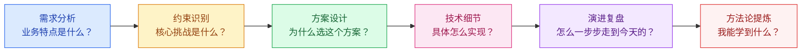

# 大厂案例

## 模块概述

大厂案例是面试中展示"架构思维深度"的最佳素材。当面试官问"你做过高并发项目吗"，即使你没有亲身经历，能深入分析 12306、双十一等经典案例，也能证明你的架构理解能力。

::: tip 核心思路
学习大厂案例不是为了"照搬"，而是为了**理解在特定约束下为什么做出这样的架构选择**，从而培养自己的架构决策能力。
:::

::: warning 面试重点
面试中谈大厂案例时，切忌泛泛而谈"他们用了微服务/Redis/Kafka"。要能说出：**业务特点 → 核心挑战 → 方案选择 → 技术细节 → 演进历程**。
:::

## 案例学习方法论

## 案例与架构知识点映射

| 案例 | 核心知识点 | 架构模式 |
|------|-----------|----------|
| 12306 票务系统 | 分布式库存、热点数据分片、最终一致性 | 分票仓、GTS 分布式事务 |
| 双十一大促 | 全链路压测、弹性伸缩、异地多活 | 单元化架构、LDC |
| 秒杀系统 | 缓存预热、队列削峰、限流降级 | 分层过滤、异步化 |

> 秒杀系统已在 [系统设计模块](/high-concurrency/system-design/seckill) 中详细讲解，本模块重点补充 12306 和双十一案例。

## 案例分析的五个关键问题

在分析任何大厂案例时，问自己这五个问题：

1. **业务特点**：这个系统的业务和普通系统有什么不同？
2. **核心挑战**：最大的技术难点在哪里？
3. **方案选择**：为什么选 A 方案而不是 B 方案？
4. **技术细节**：具体怎么实现？
5. **演进历程**：从简单到复杂经历了哪些阶段？

---

## 面试题

### 1. 大厂案例面试怎么回答？

**STAR+R 框架：**
- **Situation**：先描述业务场景和约束条件
- **Task**：说明要解决的核心问题
- **Action**：重点讲架构决策和为什么这么选
- **Result**：说明方案效果和量化成果
- **Reflection**：如果重新做，会在哪些方面改进

### 2. 如何从案例中提炼通用方法论？

不要停留在"12306 用了 Redis"这个层面，要提炼出可迁移的**模式**：
- 12306 的分票仓 → **热点数据分片模式**（适用于任何高竞争资源场景）
- 双十一的全链路压测 → **容量验证模式**（适用于任何大促保障场景）
- 秒杀的分层过滤 → **漏斗模式**（适用于任何流量削峰场景）

### 3. 架构演进的驱动力是什么？

架构演进的驱动力不是"技术追求"，而是**业务规模增长**：
- DAU 从 10 万 → 100 万 → 驱动单体拆分
- QPS 从 1000 → 10000 → 驱动缓存和异步
- 数据量从 GB → TB → 驱动分库分表
- 可用性要求从 99.9% → 99.99% → 驱动多活

**黄金法则**：架构是生长出来的，不是设计出来的。用 100 万用户的架构去服务 1000 用户是过度设计，反之则是灾难。

### 4. 如何判断一个方案是否适合自己公司？

**三个维度评估：**
1. **规模匹配**：方案解决的问题规模是否与你的业务规模匹配？大厂方案可能是为"亿级"设计的，你只有"万级"，ROI 很低
2. **团队能力**：团队是否能驾驭这个方案的复杂度？微服务不是银弹，团队小可能反而降低效率
3. **成本评估**：引入新技术/新架构的迁移成本、维护成本、学习成本是否可接受？

### 5. 大厂方案直接照搬有哪些坑？

1. **规模不匹配**：大厂为 10 亿 DAU 设计的方案，你可能只有 10 万 DAU——过度设计
2. **基础设施差异**：大厂有自研中间件和平台，你没有——需要评估替代方案
3. **组织能力差异**：大厂有专门的 SRE 团队、基础架构团队——你可能只有 3 个人
4. **业务复杂度差异**：大厂的方案往往是为解决极端复杂场景——你可能不需要
5. **成本差异**：大厂不计成本的高可用方案（多活、专线）——你可能负担不起