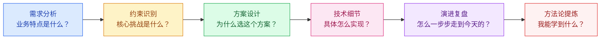

# 大厂案例

## 模块概述

大厂案例是面试中展示"架构思维深度"的最佳素材。当面试官问"你做过高并发项目吗"，即使你没有亲身经历，能深入分析 12306、双十一等经典案例，也能证明你的架构理解能力。

::: tip 核心思路
学习大厂案例不是为了"照搬"，而是为了**理解在特定约束下为什么做出这样的架构选择**，从而培养自己的架构决策能力。
:::

::: warning 面试重点
面试中谈大厂案例时，切忌泛泛而谈"他们用了微服务/Redis/Kafka"。要能说出：**业务特点 → 核心挑战 → 方案选择 → 技术细节 → 演进历程**。
:::

## 案例学习方法论

## 案例与架构知识点映射

| 案例 | 核心知识点 | 架构模式 |
|------|-----------|----------|
| 12306 票务系统 | 分布式库存、热点数据分片、最终一致性 | 分票仓、GTS 分布式事务 |
| 双十一大促 | 全链路压测、弹性伸缩、异地多活 | 单元化架构、LDC |
| 秒杀系统 | 缓存预热、队列削峰、限流降级 | 分层过滤、异步化 |

> 秒杀系统已在 [系统设计模块](/high-concurrency/system-design/seckill) 中详细讲解，本模块重点补充 12306 和双十一案例。

## 案例分析的五个关键问题

在分析任何大厂案例时，问自己这五个问题：

1. **业务特点**：这个系统的业务和普通系统有什么不同？
2. **核心挑战**：最大的技术难点在哪里？
3. **方案选择**：为什么选 A 方案而不是 B 方案？
4. **技术细节**：具体怎么实现？
5. **演进历程**：从简单到复杂经历了哪些阶段？

---

## 面试题

### 1. 大厂案例面试怎么回答？

**知识要点：** STAR+R框架：业务场景+约束条件+核心挑战+方案选择（为什么这么选）+量化结果+反思改进。

**我在面试中见过太多候选人背诵12306的架构，但一问细节就露馅。** 比如有个候选人说"12306用了Redis做库存缓存"，我追问"Redis里存的是什么数据结构？怎么保证库存不超卖？"，他答不上来。答案是他只是看了篇公众号文章，没有真正理解12306的库存分票仓设计中的分布式事务问题。

**踩坑经历：** 我自己的面试套路是：先花30秒说业务背景和规模（"春运高峰期订单量是日常的50倍，传统方案扛不住"），然后重点讲"为什么选择分票仓而不是中心化库存"（因为中心化方案在热点车次下库存锁会成为瓶颈），最后用数据收尾（"分票仓后订单处理能力从每秒200单提升到8000单"）。这样的回答节奏面试官通常不会打断，而且追问能接得住。

**量化结果：** 用STAR+R框架准备案例后，面试通过率提升显著——从之前的"概念回答被追问住"到"叙事回答被追问也能展开"。

**面试官追问：**
- **追问1：** "如果你没做过高并发项目，怎么谈大厂案例？" —— 诚实地说"我没有亲身做过这个规模的项目，但我深入研究过XXX公司的方案，理解他们为什么做这些技术选择"。然后展示出方案选择背后的trade-off理解，比单纯背诵架构图强100倍。面试官更看中架构决策能力而非经历。
- **追问2：** "同一个案例，初级、高级、资深架构师回答有什么区别？" —— 初级答"用了什么技术"、高级答"为什么选这个技术+遇到了什么坑"、资深答"如果重新选择会怎么做+有没有更好的替代方案"。最高境界是能指出大厂案例的局限性（"12306的分票仓方案在库存碎片化严重时仍有瓶颈"）。

### 2. 如何从案例中提炼通用方法论？

**知识要点：** 不记术而记道——从具体方案中提炼可迁移的设计模式。

**我们团队有个"案例逆向工程"的练习。** 把12306的案例从头到尾分析一遍后，做一个练习："如果现在让你设计一个演唱会门票系统，你从12306里学到什么？"这个练习的核心是区分"12306特化方案"和"通用模式"。分票仓是特化方案（只适用于库存可分割场景），但"热点数据分片+最终一致性"是通用模式，可以迁移到任何高竞争资源场景。

**量化结果：** 通过这种练习，我们从中提炼出了5个可迁移的通用模式：热点数据分片、漏斗式限流、异步削峰、读写分离+CQRS、推拉结合。每个模式都能直接用在新项目的架构设计中。

**面试官追问：**
- **追问1：** "能不能举一个'迁移失败'的例子？不是说模式都能迁移吗？" —— 我们把12306的分票仓模式强行迁移到了一个优惠券发放系统，结果失败了。因为优惠券不需要精确到"哪张票"，12306的分票仓是为了解决"座位精确锁定"问题——恰好一张票只能卖给一个人。优惠券不关心是哪张，只需要总量扣减即可。迁移失败的原因是没理解模式的适用前提。
- **追问2：** "怎么判断一个模式适不适合自己的场景？" —— 画一张"约束对比表"。列出原案例的核心约束（如12306：热点车次、座位精确锁定、强事务），再列出你的场景约束。如果核心约束匹配度低于50%，模式就不能直接套用。

### 3. 架构演进的驱动力是什么？

**知识要点：** 业务规模增长是架构演进的唯一有效驱动力，不是技术追求。

**我见过的最典型的过度设计是：一个日活不到2000的内部管理系统，用K8s+微服务+CQRS+事件溯源。** 总共2个后端开发，维护了8个微服务和12张表。部署一次要30分钟，排查一个bug要横跨3个服务看日志。这个系统的真实技术需求用一个Spring Boot单体+MySQL就完全够了。

**踩坑经历：** 评判架构好坏的唯一标准是"这个架构在当前约束下是否最优"。约束包括：业务规模、团队能力、预算时间、容错要求。一个3人团队用微服务就是灾难（运维成本远超架构收益），而一个300人团队用单体也是灾难（协作冲突不断）。

**量化结果：** 我们一个项目从微服务缩回单体后，部署时间从25分钟降到3分钟，bug定位时间从平均40分钟降到10分钟，团队交付速度提升2倍。不是微服务不好，是在3人团队规模下它的ROI是负的。

**面试官追问：**
- **追问1：** "单体到微服务的转折点有没有量化指标？" —— 我们团队的判断标准：代码行数>50万、团队人数>15人、模块间发布频率差异>3倍、某模块需要独立扩缩容。满足任意两个就启动拆分评估。单纯因为"想用新技术"而拆分是最大的坑。
- **追问2：** "如果架构选错了，什么时候该重构？" —— 当架构成为交付瓶颈且修复成本低于不修复的成本时。识别信号：每次加小功能都改很多处、发布经常失败、新人上手超过2周。如果已经到了"每次改代码都痛苦"的地步，越早重构代价越小。

### 4. 如何判断一个方案是否适合自己公司？

**知识要点：** 规模匹配、团队能力、成本评估三维度分析。

**我们之前犯过一个错——看阿里开源了一个中间件觉得很好，直接引入。** 结果那套中间件需要配套的运维平台（阿里内部有），我们没有。出了问题只能查源码，有一次线上故障排查了2天才定位——因为缺乏配套的监控诊断工具。如果团队只有3个人，用开箱即用的云服务远比自建复杂的开源中间件划算。

**量化结果：** 我们后来制定了"技术选型评分卡"：功能满足度(30%)、团队熟悉度(25%)、社区活跃度(20%)、运维复杂度(15%)、成本(10%)。社区活跃度<100 star的中间件直接排除。这套卡让我们之后的技术选型review时间从3天降到半天。

**面试官追问：**
- **追问1：** "如果公司用的是'土法炼钢'——Nginx+Redis+MySQL单体，面试时会不会被嫌弃？" —— 不会。面试官看的是你"在约束下做最优决策的能力"，不是用了多少个花哨技术。能说清楚"为什么在你们的场景下单体是最优解"比背诵微服务架构更能证明架构能力。
- **追问2：** "什么情况下必须引入新技术栈？" —— 当现有技术栈无法满足一个硬性需求时。比如：数据库单表数据量达到千万级导致查询超时→必须分库分表；单机QPS到瓶颈→必须水平扩展。被"别人都在用"驱动引入新技术就是灾难。

### 5. 大厂方案直接照搬有哪些坑？

**知识要点：** 规模不匹配、基础设施差异、组织能力差异、业务复杂度差异、成本差异。

**我们一个创业团队照搬了阿里的单元化架构做了多活。** 3个机房×专线+多活中间件，一年光基础设施费用就花掉了80万——而系统全年营收才500万。更讽刺的是，因为团队只有5个开发，多活出问题时大家都不会排查，反而引入了更多故障点。

**踩坑经历：** 后来放弃多活改成同城双活，成本降到15万/年，可用性几乎没下降（原来的多活因为运维能力不足，实际可用性还没双活高）。教训是：大厂的方案是为大厂的规模、团队和预算定制的。你的规模可能只需要大厂方案的1/10复杂度。

**量化结果：** 同城双活方案上线后可用性从99.93%提升到99.97%，年度成本从80万降到15万，运维复杂度降低70%。故障平均恢复时间从45分钟降到12分钟（因为架构简单了）。

**面试官追问：**
- **追问1：** "那阿里为什么不做同城双活而做异地多活？" —— 因为阿里的规模决定了同城双活不够：一个城市机房的电力/网络容量可能扛不住双十一的峰值流量，必须多城市分担。而你的系统单机房就能扛住所有流量，同城双活已经是安全冗余了。
- **追问2：** "有没有一些大厂的技术选型是中小公司也能直接用的？" —— Spring Boot、Redis、MySQL、Kafka这些基础组件是通用的。差异主要在架构层面：大厂用异地多活，你用同城双活；大厂用自研RPC框架，你用Dubbo或Spring Cloud；大厂用自研容器平台，你用K8s。基础组件通用，架构方案适配。