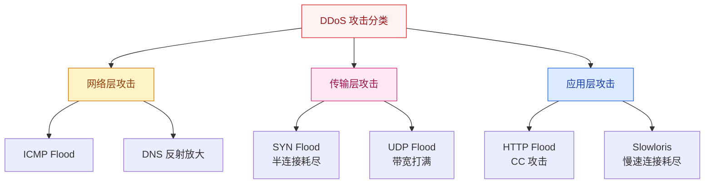
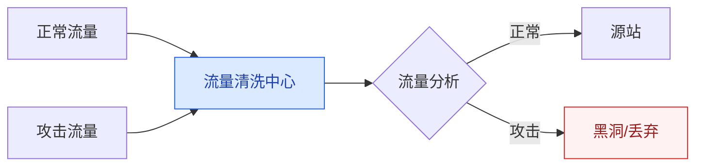
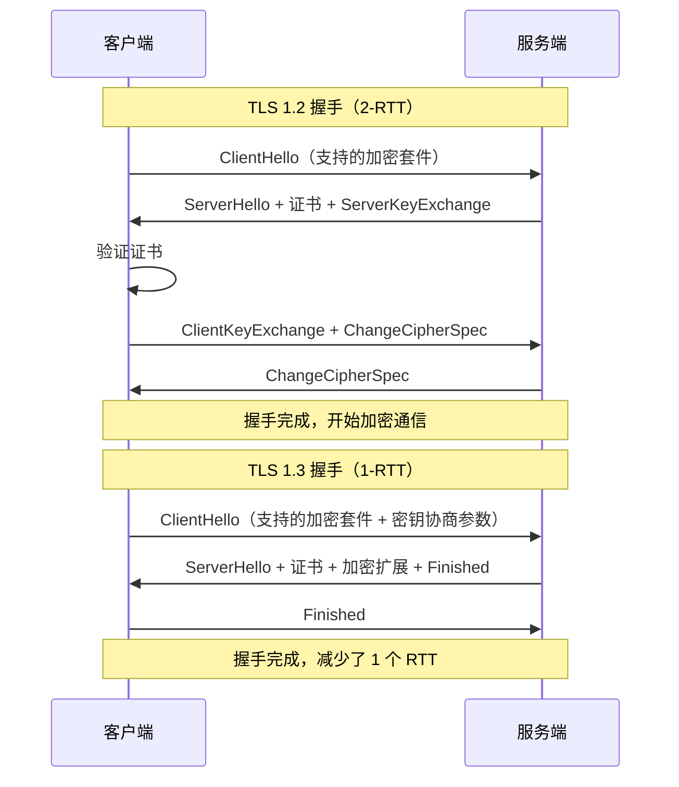
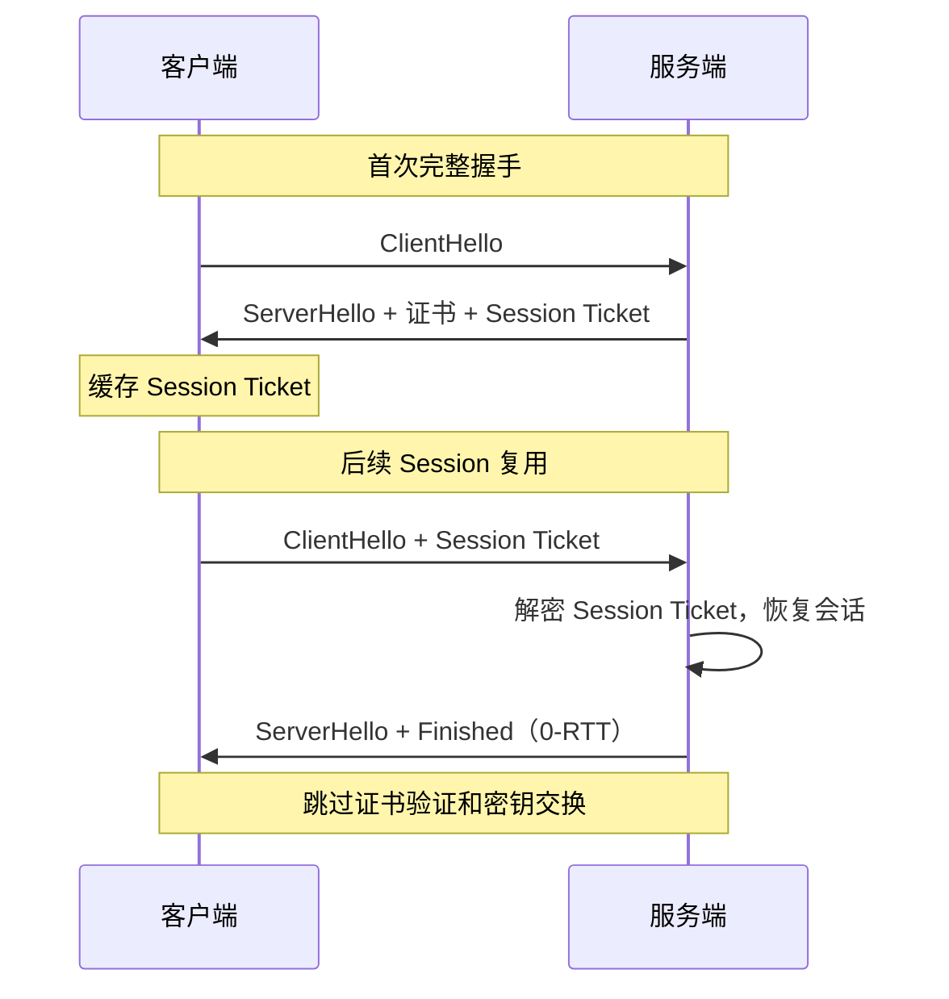

# 高并发场景下的网络安全

## 概述

高并发系统不仅要能"扛住"正常流量，还要能"防住"恶意流量。安全防护是架构设计中不可忽视的一环，尤其在面对 DDoS、CC 攻击时，安全策略直接决定了系统能否正常服务。

::: danger 关键认知
安全不是"加个防火墙就完事了"，而是**纵深防御**：网络层 → 应用层 → 业务层逐层设防。
:::

## 一、DDoS 攻击与防护

### 1.1 常见 DDoS 攻击类型

| 攻击类型 | 原理 | 防御手段 |
|----------|------|----------|
| **SYN Flood** | 伪造大量 SYN 包，耗尽服务端 SYN 队列 | SYN Cookie、SYN Proxy、连接限速 |
| **UDP Flood** | 大量 UDP 包占满带宽 | 流量清洗、黑洞路由 |
| **DNS 反射放大** | 伪造源 IP 向 DNS 服务器查询，响应放大到目标 | 源 IP 验证、限速 |
| **HTTP Flood（CC）** | 大量 HTTP 请求耗尽应用资源 | WAF、频率限制、验证码 |
| **Slowloris** | 慢速发送 HTTP 请求，占用连接不释放 | 连接超时、最大连接数限制 |

### 1.2 DDoS 防护架构

**防护层次：**
1. **运营商层级**：Anycast 分散流量到全球节点，近源清洗
2. **CDN 层级**：利用 CDN 的带宽和节点分散攻击流量
3. **高防 IP**：专业 DDoS 清洗服务，如阿里云高防、腾讯云大禹
4. **应用层级**：WAF + 限流 + 验证码

---

## 二、WAF（Web 应用防火墙）

### 2.1 WAF 核心原理

WAF 工作在应用层（HTTP/HTTPS），通过分析 HTTP 请求内容来识别和拦截攻击。

| 检测方式 | 原理 | 优缺点 |
|----------|------|--------|
| **规则引擎** | 基于正则匹配已知攻击模式（SQL 注入、XSS） | 准确但需维护规则库 |
| **语义分析** | 解析 SQL/JS 语法，判断是否恶意 | 准确率高，误报低 |
| **机器学习** | 基于历史数据训练模型 | 可检测未知攻击，但误报率较高 |
| **RASP** | 嵌入应用运行时，监控执行逻辑 | 精准但侵入性强 |

### 2.2 CC 攻击 vs 限流

| 维度 | CC 攻击 | 正常限流场景 |
|------|---------|-------------|
| **目的** | 恶意耗尽资源，让服务不可用 | 保护系统不被突发流量打垮 |
| **流量特征** | 请求简单，消耗资源少但频率极高 | 正常的业务请求，只是量大 |
| **防护手段** | WAF + 验证码 + IP 黑名单 | 令牌桶/漏桶限流 |
| **关键区别** | CC 攻击会绕过 CDN 缓存直接打到源站 | 限流是保护机制，不是攻击 |

---

## 三、HTTPS / TLS 优化

### 3.1 TLS 握手过程

### 3.2 TLS 优化策略

| 优化手段 | 原理 | 效果 |
|----------|------|------|
| **TLS 1.3** | 减少握手 RTT（2→1），移除不安全加密算法 | 减少 1 个 RTT |
| **Session 复用** | 客户端缓存 Session ID/Ticket，下次连接跳过完整握手 | 0-RTT 恢复 |
| **OCSP Stapling** | 服务端主动获取 OCSP 响应并附带在握手中 | 省去客户端查询证书状态 |
| **False Start** | 客户端在收到 Finished 前就开始发送数据 | 减少等待时间 |
| **证书链优化** | 精简证书链，减少传输大小 | 减少握手数据量 |
| **HTTP/2 多路复用** | 一个连接承载多个请求 | 减少 TLS 握手次数 |

### 3.3 Session 复用

---

## 四、API 安全

| 安全措施 | 实现方式 | 防护目标 |
|----------|----------|----------|
| **签名校验** | HMAC-SHA256 对请求参数签名 | 防篡改 |
| **Anti-Replay** | 请求携带 Timestamp + Nonce，服务端校验 | 防重放攻击 |
| **参数校验** | 输入长度/类型/范围校验 | 防注入 |
| **频率限制** | 基于 IP/用户/API Key 的令牌桶限流 | 防刷 |
| **HTTPS 强制** | 全站 HTTPS，HSTS 头 | 防中间人攻击 |

---

## 面试题

### 1. SYN Flood 攻击原理和防护方法？

**知识要点：** 攻击者伪造IP发送大量SYN不回复ACK，占满服务端SYN队列，正常请求无法建立连接。

**我们被SYN Flood攻击过一次，而且是"误伤"。** 一个大客户做活动，他们的客户端因为一个SDK bug在短时间内发起了大量TCP连接，每个连接都是正常的三次握手——但量太大（峰值约8万QPS），服务端SYN队列被打满，合法用户完全连不上来。

**踩坑经历：** 起初运维把`tcp_max_syn_backlog`从默认的1024调到了65535，确实扛住了更多SYN包，但系统内存被大量半连接占满。最终方案是开启SYN Cookie（`net.ipv4.tcp_syncookies=1`），服务端收到SYN后不分配资源，而是把连接信息加密后作为Cookie返回给客户端，客户端ACK时带回Cookie验证通过才分配资源。效果立竿见影。

**量化结果：** 开启SYN Cookie后，相同8万SYN QPS下内存占用从1.2GB降到200MB，正常用户的连接建立成功率从45%恢复到98%。TCP连接队列溢出导致的丢包从每秒3000+降到零。

**面试官追问：**
- **追问1：** "SYN Cookie有什么副作用？不能支持TCP窗口缩放吗？" —— 确实不能支持全部TCP选项（如大窗口Scale和SACK）。Cookie只有32位，只能编码基本的MSS和少量选项。所以SYN Cookie是"应急手段"不是"日常方案"——攻击时开启，平常关掉。
- **追问2：** "SYN Proxy和SYN Cookie有什么区别？" —— SYN Proxy是"中间人"：Proxy替服务端完成三次握手，握手成功后再把连接转发给后端。好处是后端完全无感，坏处是多了一跳+Proxy自己可能成为瓶颈。大厂一般用硬件设备（如F5）做SYN Proxy。

### 2. DDoS 流量清洗怎么做？

**知识要点：** 流量牵引→分析→清洗→回注，配合Anycast全球分散和近源清洗。

**我们经历过一次"不专业的流量清洗"。** 用的是阿里云高防IP，结果高防的阈值设太高了（10Gbps），一个500Mbps的CC攻击穿过高防直接打到了源站——因为高防以为这是正常流量波动。源站Nginx差点打挂。

**踩坑经历：** 重新调整阈值后采用了"自适应清洗"——不是固定阈值，而是基于过去24小时的流量基线和同比（上周同一时间的流量），超出基线200%才触发清洗。但自适应带来了新问题：日常流量高峰期和低峰期基线差异大，需要分时段设置基线。

**量化结果：** 自适应清洗上线后，DDoS误判率从15%降到3%，同时攻击漏判率从8%降到2%。一次真实的800Mbps CC攻击被成功拦截在清洗中心，源站流量没受到任何冲击。

**面试官追问：**
- **追问1：** "清洗会不会把正常流量也洗掉？" —— 会，这是一个trade-off。如果清洗策略太激进（如针对某个国家的流量全部清洗），会误杀正常用户。我们的做法是"分级清洗"：明显攻击特征（如某个IP每秒1000+请求）直接黑名单；疑似攻击（如请求模式异常但频率不高）先人机验证（JS挑战）。
- **追问2：** "自建清洗还是用云厂商的高防？" —— 低于10Gbps的DDoS可以自建（iptables+ngx+lua），高于10Gbps必须用云厂商高防或运营商清洗。因为攻击流量超过你的带宽上限时，运营商入口就先把你"黑洞"了——就算你的设备能处理，带宽也被占满了。

### 3. WAF 和限流有什么区别？

**知识要点：** WAF看请求内容（防注入/XSS），限流看请求频率（防过载），两者互补。

**我们用Nginx限流充当WAF，被安全团队指出来了。** Nginx的`limit_req`只能按频率拦截，不能检测请求内容——一个恶意请求如果频率不高（如每分钟一次SQL注入），限流根本拦不住。后来加了一层ModSecurity WAF，Nginx在前做频率控制，ModSecurity在后做内容分析。

**量化结果：** WAF上线后第一个月拦截了约1200次SQL注入尝试（大部分是自动化工具扫描）、约800次XSS尝试。平均每个被拦截请求的内容扫描耗时约3ms（ModSecurity基于正则匹配），对正常延迟影响不到2%。

**面试官追问：**
- **追问1：** "WAF规则太多会不会影响性能？" —— 会。我们测试过：100条规则时ModSecurity延迟约2ms，500条规则时约8ms，1000条规则时约20ms。所以线上只开启"高命中率规则"（OWASP核心规则集的Top 100），其余的作为可选规则报警但不拦截。
- **追问2：** "WAF误拦了正常业务怎么办？" —— 我们每周有约2-3次误拦。处理机制：一是WAF规则加白名单（如特定URL不检测指定规则），二是拦截时返回可自定义的错误页并带上requestId，客服可以根据requestId查找拦截原因并加白名单。

### 4. TLS 1.3 相比 1.2 有什么优化？

**知识要点：** 握手从2-RTT降到1-RTT（0-RTT恢复），移除RSA密钥交换等不安全算法。

**我们从TLS 1.2升级到1.3后，API网关的P99延迟下降了约30ms。** 移动端用户（4G网络，RTT约50ms）受益最大——1.2握手需要先TCP三次握手（1 RTT）+TLS握手（2 RTT）=3 RTT=150ms，1.3只需要TCP(1 RTT)+TLS(1 RTT)=2 RTT=100ms，少了50ms（一个来回）。

**踩坑经历：** 但升级过程中出现了一个兼容性问题——部分老旧的Android设备（Android 7以下）不支持TLS 1.3，连接直接失败。我们不得不保留TLS 1.2为fallback（Nginx配置`ssl_protocols TLSv1.2 TLSv1.3;`），让客户端和服务端在握手中协商选择。

**量化结果：** TLS 1.3使新客户端连接建立延迟P50减少约30%（150ms→100ms），API网关CPU因简化加密套件降低约10%。首次访问用户（无Session复用）的页面加载时间减少约25%。

**面试官追问：**
- **追问1：** "0-RTT有什么安全风险？" —— 0-RTT数据可能被重放攻击。攻击者截取0-RTT数据包后，可以重复发送给服务端，服务端会执行多次（如重复扣款）。解决方案是应用层做幂等性设计，或者对非幂等请求禁用0-RTT。
- **追问2：** "TLS 1.3的0-RTT和Session Ticket的0-RTT一样吗？" —— 本质一样。TLS 1.3的0-RTT依赖于PSK（Pre-Shared Key），Session Ticket机制是PSK的一种实现方式。不过1.3的0-RTT更标准化了。

### 5. Session 复用怎么减少握手开销？

**知识要点：** Session ID/Ticket缓存会话状态，后续连接跳过完整握手，实现0-RTT。

**我们在API网关压测时发现Session Ticket复用率只有30%。** 排查发现Nginx的`ssl_session_cache shared:SSL:10m`默认只存4000个Session，而我们的并发连接高峰超过2万，大量连接因为Session缓存满而走了完整握手。

**踩坑经历：** 把缓存调到50m（可存约2万个Session），复用率涨到78%。但内存占用涨了约40MB——对于Nginx来说可以接受。另外发现一个业务细节：移动端的Session Ticket有效期受App切换到后台的影响——App进后台一段时间后系统可能清除网络状态，Ticket丢失，下次冷启动又走完整握手。

**量化结果：** Session缓存调大后，API网关的TLS握手比例从70%降到22%，平均TLS延迟从120ms降到45ms。Nginx的CPU降低了约12%（省下的都是RSA/ECDSA密钥交换计算）。

**面试官追问：**
- **追问1：** "Session Ticket和Session ID哪个更好？" —— Session Ticket不需要服务端存储（加密后发给客户端），更适合分布式环境。Session ID需要服务端共享Session存储（如Redis），增加了复杂度。Nginx默认用Ticket模式。
- **追问2：** "如果Ticket的加密密钥泄露了怎么办？" —— 所有用这个密钥加密的历史Ticket都可以被解密，攻击者可以解密过去的所有会话（前向安全性问题）。所以Nginx可以配定时轮换密钥（默认配置下Nginx重启时生成新密钥，但不停机也可以手动触发重载）。

### 6. API 安全怎么防重放攻击？

**知识要点：** Timestamp校验时间窗口，Nonce保证唯一性，签名防止篡改，timestamp+nonce+签名三重锁。

**我们做的API签名方案在灰度上线时被绕过了一次。** 方案是请求参数+timestamp+nonce做签名，服务端验证签名+校验Nonce是否重复（存Redis防重）。结果压力测试发现Redis在5000 QPS下CPU飙到了40%——每个API请求都要Redis查一次Nonce是否存在。

**踩坑经历：** 优化方案是在应用本地内存中用布隆过滤器先预判Nonce是否见过（大多数Nonce是新的，Bloom Filter直接通过），只有Bloom Filter判断"可能存在"时才查Redis。Bloom Filter误判率设0.1%导致Redis查询降到了原来的5%。但Bloom Filter会随Nonce数量增长越来越大，通过定期清理（每小时重建，连同过期的timestamp window一起清除）控制内存。

**量化结果：** 防重放方案使Redis Nonce查询QPS从5000降到250，Redis CPU从40%降到5%。Bloom Filter内存占用约50MB（存储最近1小时的Nonce）。成功拦截过3次重放攻击尝试。

**面试官追问：**
- **追问1：** "时间窗口设多少合适？60秒太短用户时间不准怎么办？" —— 我们设120秒，覆盖了99.9%设备的时钟偏差。同时客户端在发请求前先调用`/api/time`获取服务端时间进行校正（误差超过120秒的强制更新本地时钟）。差旅场景下确实会遇到用户手机时间不对的情况，我们做了error message提示"您的设备时间与服务器时间偏差较大"。
- **追问2：** "如果攻击者在时间窗口内重放怎么办？" —— 120秒窗口内Nonce查Redis防重，120秒后Nonce过期自动从Redis清理。攻击者在窗口内截获合法请求重放，如果Nonce已经用过了就会被拦截。