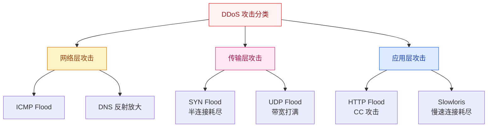
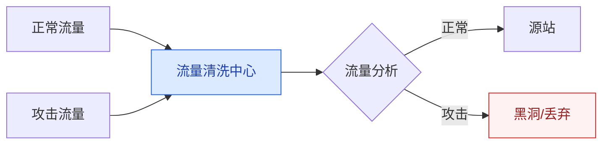
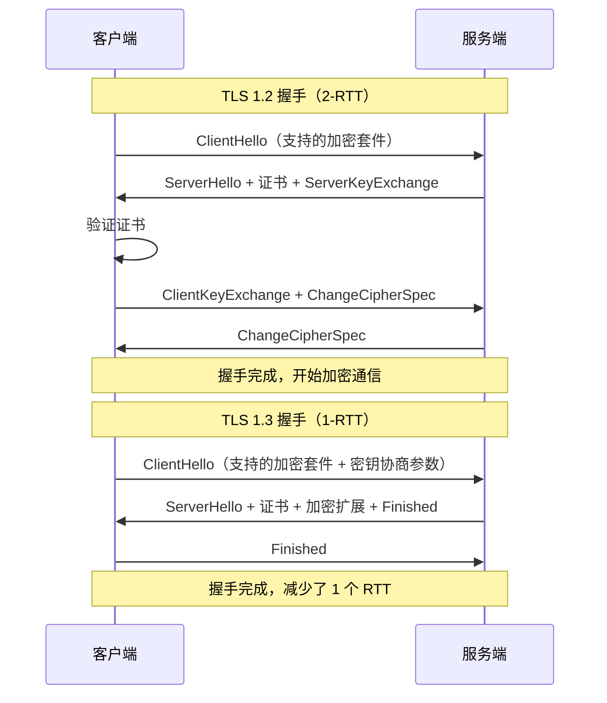
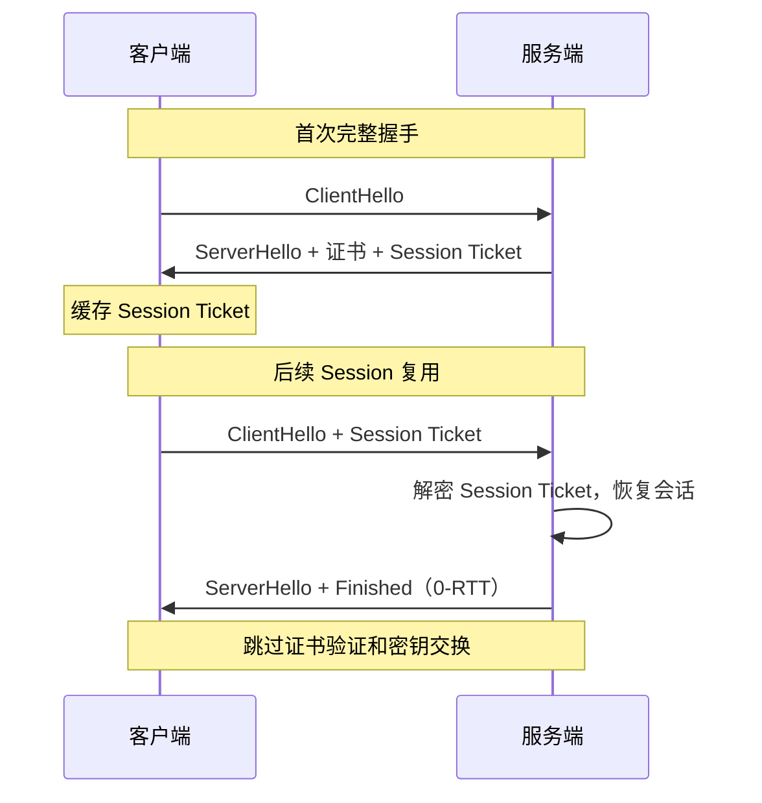

# 高并发场景下的网络安全

## 概述

高并发系统不仅要能"扛住"正常流量，还要能"防住"恶意流量。安全防护是架构设计中不可忽视的一环，尤其在面对 DDoS、CC 攻击时，安全策略直接决定了系统能否正常服务。

::: danger 关键认知
安全不是"加个防火墙就完事了"，而是**纵深防御**：网络层 → 应用层 → 业务层逐层设防。
:::

## 一、DDoS 攻击与防护

### 1.1 常见 DDoS 攻击类型

| 攻击类型 | 原理 | 防御手段 |
|----------|------|----------|
| **SYN Flood** | 伪造大量 SYN 包，耗尽服务端 SYN 队列 | SYN Cookie、SYN Proxy、连接限速 |
| **UDP Flood** | 大量 UDP 包占满带宽 | 流量清洗、黑洞路由 |
| **DNS 反射放大** | 伪造源 IP 向 DNS 服务器查询，响应放大到目标 | 源 IP 验证、限速 |
| **HTTP Flood（CC）** | 大量 HTTP 请求耗尽应用资源 | WAF、频率限制、验证码 |
| **Slowloris** | 慢速发送 HTTP 请求，占用连接不释放 | 连接超时、最大连接数限制 |

### 1.2 DDoS 防护架构

**防护层次：**
1. **运营商层级**：Anycast 分散流量到全球节点，近源清洗
2. **CDN 层级**：利用 CDN 的带宽和节点分散攻击流量
3. **高防 IP**：专业 DDoS 清洗服务，如阿里云高防、腾讯云大禹
4. **应用层级**：WAF + 限流 + 验证码

---

## 二、WAF（Web 应用防火墙）

### 2.1 WAF 核心原理

WAF 工作在应用层（HTTP/HTTPS），通过分析 HTTP 请求内容来识别和拦截攻击。

| 检测方式 | 原理 | 优缺点 |
|----------|------|--------|
| **规则引擎** | 基于正则匹配已知攻击模式（SQL 注入、XSS） | 准确但需维护规则库 |
| **语义分析** | 解析 SQL/JS 语法，判断是否恶意 | 准确率高，误报低 |
| **机器学习** | 基于历史数据训练模型 | 可检测未知攻击，但误报率较高 |
| **RASP** | 嵌入应用运行时，监控执行逻辑 | 精准但侵入性强 |

### 2.2 CC 攻击 vs 限流

| 维度 | CC 攻击 | 正常限流场景 |
|------|---------|-------------|
| **目的** | 恶意耗尽资源，让服务不可用 | 保护系统不被突发流量打垮 |
| **流量特征** | 请求简单，消耗资源少但频率极高 | 正常的业务请求，只是量大 |
| **防护手段** | WAF + 验证码 + IP 黑名单 | 令牌桶/漏桶限流 |
| **关键区别** | CC 攻击会绕过 CDN 缓存直接打到源站 | 限流是保护机制，不是攻击 |

---

## 三、HTTPS / TLS 优化

### 3.1 TLS 握手过程

### 3.2 TLS 优化策略

| 优化手段 | 原理 | 效果 |
|----------|------|------|
| **TLS 1.3** | 减少握手 RTT（2→1），移除不安全加密算法 | 减少 1 个 RTT |
| **Session 复用** | 客户端缓存 Session ID/Ticket，下次连接跳过完整握手 | 0-RTT 恢复 |
| **OCSP Stapling** | 服务端主动获取 OCSP 响应并附带在握手中 | 省去客户端查询证书状态 |
| **False Start** | 客户端在收到 Finished 前就开始发送数据 | 减少等待时间 |
| **证书链优化** | 精简证书链，减少传输大小 | 减少握手数据量 |
| **HTTP/2 多路复用** | 一个连接承载多个请求 | 减少 TLS 握手次数 |

### 3.3 Session 复用

---

## 四、API 安全

| 安全措施 | 实现方式 | 防护目标 |
|----------|----------|----------|
| **签名校验** | HMAC-SHA256 对请求参数签名 | 防篡改 |
| **Anti-Replay** | 请求携带 Timestamp + Nonce，服务端校验 | 防重放攻击 |
| **参数校验** | 输入长度/类型/范围校验 | 防注入 |
| **频率限制** | 基于 IP/用户/API Key 的令牌桶限流 | 防刷 |
| **HTTPS 强制** | 全站 HTTPS，HSTS 头 | 防中间人攻击 |

---

## 面试题

### 1. SYN Flood 攻击原理和防护方法？

**原理**：攻击者伪造大量不存在的 IP 向服务端发送 SYN 包，服务端回复 SYN-ACK 后进入 SYN_RECV 状态等待 ACK，但攻击者不回复。大量半连接耗尽服务端的 SYN 队列（backlog），导致正常请求无法建立连接。

**防护方法：**
1. **SYN Cookie**：服务端不分配资源，而是将连接信息编码到 Cookie 中返回，收到合法 ACK 后再重建连接
2. **SYN Proxy**：在服务端前部署代理，代理完成三次握手后再转发
3. **增大 backlog** + **缩短 SYN Timeout**：缓解但不能根治
4. **防火墙限速**：限制单 IP 的 SYN 包速率

### 2. DDoS 流量清洗怎么做？

**核心流程：**
1. **流量牵引**：通过 BGP 路由将流量引到清洗中心
2. **流量分析**：基于流量模型（包速率、协议分布、载荷特征）识别攻击
3. **流量清洗**：丢弃攻击流量，转发正常流量
4. **流量回注**：通过 GRE 隧道将清洗后的流量送回源站

**关键技术**：Anycast 将流量分散到全球多个清洗节点，近源清洗，减少骨干网压力。

### 3. WAF 和限流有什么区别？

| 维度 | WAF | 限流 |
|------|-----|------|
| 工作层级 | 应用层（HTTP 内容分析） | 网关/服务层 |
| 检测方式 | 规则匹配、语义分析、行为分析 | 频率计数 |
| 防护目标 | SQL 注入、XSS、命令注入等 | 流量过载 |
| 典型工具 | ModSecurity、阿里云 WAF | Sentinel、Nginx limit_req |
| 关系 | 互补：WAF 防恶意请求，限流防过载 |

### 4. TLS 1.3 相比 1.2 有什么优化？

1. **握手 RTT 减少**：1.2 需要 2-RTT，1.3 只需 1-RTT（0-RTT 模式下甚至 0-RTT）
2. **移除不安全算法**：废弃 RSA 密钥交换、CBC 模式、SHA-1 等
3. **加密更多握手信息**：1.3 中 ServerHello 之后的所有握手消息都是加密的
4. **简化加密套件**：只保留了 AEAD（认证加密）算法

### 5. Session 复用怎么减少握手开销？

**Session ID 机制**：服务端在首次握手后生成 Session ID 发给客户端，客户端下次连接时携带，服务端查找缓存恢复会话，跳过密钥交换。

**Session Ticket 机制**（更常用）：服务端将加密的会话状态作为 Ticket 发给客户端，客户端下次连接时直接发送 Ticket，服务端解密恢复会话。优点是服务端无需存储会话状态。

### 6. API 安全怎么防重放攻击？

**Timestamp + Nonce 方案：**
1. 客户端请求携带 `timestamp`（当前时间戳）和 `nonce`（随机字符串）
2. 服务端校验 `timestamp` 与服务器时间差不超过 60 秒
3. 服务端将 `nonce` 存入 Redis（带过期时间），相同 `nonce` 拒绝
4. 请求签名中也包含 `timestamp` 和 `nonce`，防篡改

> 差旅场景注意：客户端和服务端时间可能不一致，需要适当放宽时间窗口。