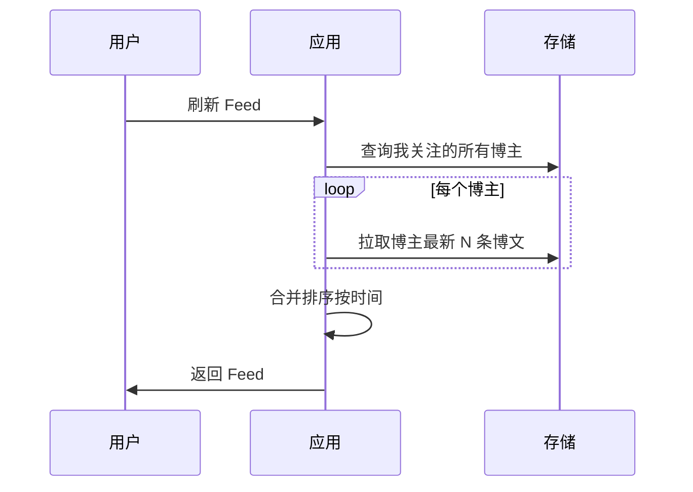
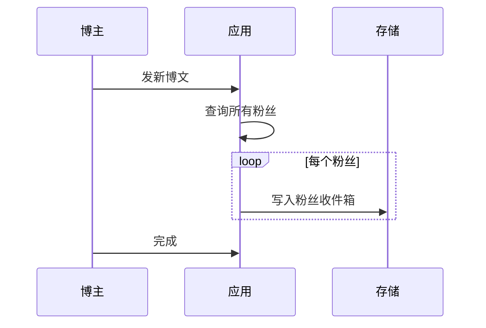
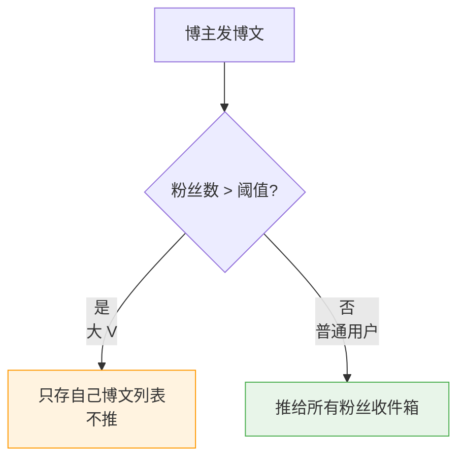
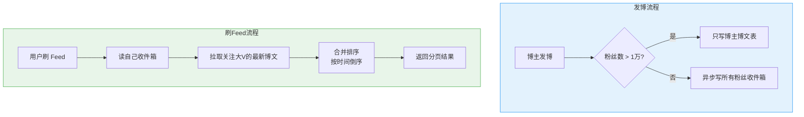

# Feed 流系统：推拉结合与 Timeline 排序

创建日期：2026-06-06

## 需求分析

### 功能需求

- 用户关注博主，博主发博文，粉丝在 Feed 流中看到。
- 按时间排序（Timeline）或热度排序。
- 下拉刷新、无限滚动分页。
- 百万级用户，千万级博文。

### 非功能需求

- **实时性**：博主发博，粉丝秒级看到。
- **QPS**：读 QPS 极高，亿级读请求。
- **容量**：存储海量博文，支持水平扩展。

## 三种实现方案对比

### 1. 拉模式（读扩散）

**原理：** 博主发博文，只存自己的博文列表。用户刷新 Feed，去所有关注博主的博文列表拉取，合并排序返回。



**优点：** 写操作简单，存储空间省。**缺点：** 读操作慢，用户关注越多越慢，实时性差。

---

### 2. 推模式（写扩散）

**原理：** 博主发博文，写给所有粉丝的 Feed 收件箱。用户刷新，直接读自己的收件箱。



**优点：** 读非常快，实时性好。**缺点：** 写放大，大 V 千万粉丝发一条写千万次，存储空间浪费。

---

### 3. 推拉结合（业界主流方案）

**核心思想：** 对不同用户区别对待：



**用户刷 Feed：**
1. 先读自己推来的收件箱，拿到一部分。
2. 大 V 的内容用户自己拉，合并进来。
3. 整体排序返回。

这就是微博、微信朋友圈用的方案。

### 三种方案对比

| 方案 | 写复杂度 | 读复杂度 | 空间 | 实时性 | 适用场景 |
|------|---------|---------|------|--------|---------|
| **拉模式** | O(1) | O(关注数) | 小 | 差 | 关注多、活跃少 |
| **推模式** | O(粉丝数) | O(1) | 大 | 好 | 粉丝少、活跃多 |
| **推拉结合** | 自适应 | 自适应 | 适中 | 好 | 大规模生产（推荐） |

## 关注关系存储

**Redis Set 存储：**

- 我关注了谁：`following:userId` → Set 存所有博主 ID。
- 谁关注了我：`followers:userId` → Set 存所有粉丝 ID。
- 判断是否关注：`SISMEMBER` O(1)。
- 增删关注：`SADD / SREM` O(1)。

Redis Set 适合这种关系型存储，查询快，操作简单。

## Timeline 排序 vs 热度排序

| 排序方式 | 原理 | 优点 | 缺点 |
|---------|------|------|------|
| **Timeline** | 按发布时间倒序 | 简单，用户不会漏内容 | 内容质量参差不齐 |
| **热度排序** | 按点赞、评论、转发计算热度分 | 热门内容优先，体验好 | 可能漏内容 |

**混合排序：** Timeline + 热度加权，最新的优先，热度高的也加权，兼顾实时和质量。

## 游标分页方案

Feed 流是无限下拉，必须分页。

### 为什么不用 offset？

```sql
-- offset 分页：offset 大了性能差，数据变动导致重复或漏项
SELECT * FROM feed ORDER BY time DESC LIMIT 20 OFFSET 40;
```

### 游标分页（推荐）

```sql
-- 用最后一条的时间戳做游标，利用索引，性能好
SELECT * FROM feed
WHERE time < #{lastCursor}
ORDER BY time DESC
LIMIT 20;
```

**处理相同时间戳：**

```sql
-- 加上 ID 二次排序，唯一确定位置
SELECT * FROM feed
WHERE (time < #{lastTime})
   OR (time = #{lastTime} AND id < #{lastId})
ORDER BY time DESC, id DESC
LIMIT 20;
```

| 对比项 | offset 分页 | 游标分页 |
|--------|------------|---------|
| 性能 | offset 大时慢 | 始终利用索引，快 |
| 数据变动 | 重复或漏项 | 不受影响 |
| 实现复杂度 | 简单 | 稍复杂 |

::: tip 结论
Feed 流推荐游标分页，性能好，不会重复不会漏。
:::

## 推拉结合实战架构



## 性能优化

- **热门 Feed 缓存**：Redis 缓存热点 Feed，减少 DB 压力。
- **存储拆分**：最近 Feed 存 Redis，旧数据归档到 MySQL / OSS。
- **异步推**：发博后，推粉丝收件箱异步做（MQ），发博快速返回。

---

## 经典高频面试题

### Q1：Feed 流的拉模式、推模式、推拉结合区别？业界为什么用推拉结合？

**参考答案：**

- **拉模式（读扩散）**：发博只写自己，用户刷的时候拉所有关注博主合并。写简单读复杂，用户关注越多越慢。
- **推模式（写扩散）**：发博写给所有粉丝收件箱。读简单写复杂，大 V 千万粉丝写放大严重。
- **推拉结合**：普通用户推，大 V 不拉。活跃用户推，不活跃拉。平衡读写压力，避免极端写放大，大多数用户体验好。所以业界生产环境都用推拉结合。

### Q2：什么是 Timeline？Feed 流为什么叫 Timeline？

**参考答案：**

Timeline 就是时间线，按发布时间倒序排列，最新的内容在最前面。关注页 Feed 流一般都是 Timeline 排序，用户按时间顺序看到关注的内容，所以叫 Timeline。

### Q3：Feed 流分页为什么不用 offset 用游标？

**参考答案：**

- offset 分页当 offset 大了，性能差，数据库要跳过很多行。
- 分页过程中如果有新博文插入，已经拉过的位置移动了，下拉会出现重复或者漏项。
- 游标分页用最后一条的时间戳做游标，查询利用索引，性能好，不会重复不会漏。所以 Feed 流都用游标分页。

### Q4：时间戳游标分页，如果两条时间戳相同怎么处理？

**参考答案：**

加上 ID 二次排序，因为 ID 肯定唯一。排序改成 `ORDER BY time DESC, id DESC`。游标存 `(last_time, last_id)`，查询条件 `WHERE (time < last_time) OR (time = last_time AND id < last_id)`，就能唯一确定分页位置，解决相同时间戳问题。

### Q5：大 V 千万粉丝为什么推模式不行？会有什么问题？

**参考答案：**

写放大，发一条要写千万次，每个粉丝收件箱写一份。写入压力扛不住，存储空间也浪费很多，很多不活跃用户永远不刷也写了。所以推模式扛不住千万粉丝大 V。推拉结合中大 V 只存自己列表，不推，粉丝读的时候自己拉，解决写放大问题。

### Q6：Feed 流怎么保证实时性？

**参考答案：**

推模式发完就写好收件箱，用户刷新就能看到，实时性好。推拉结合中，普通用户走推，所以大多数用户实时性还是好。大 V 走拉，用户拉的时候才能看到，实时性稍差但可以接受，因为大 V 本身少，影响不大。如果需要更高实时，可以用长连接推送提醒用户刷新。