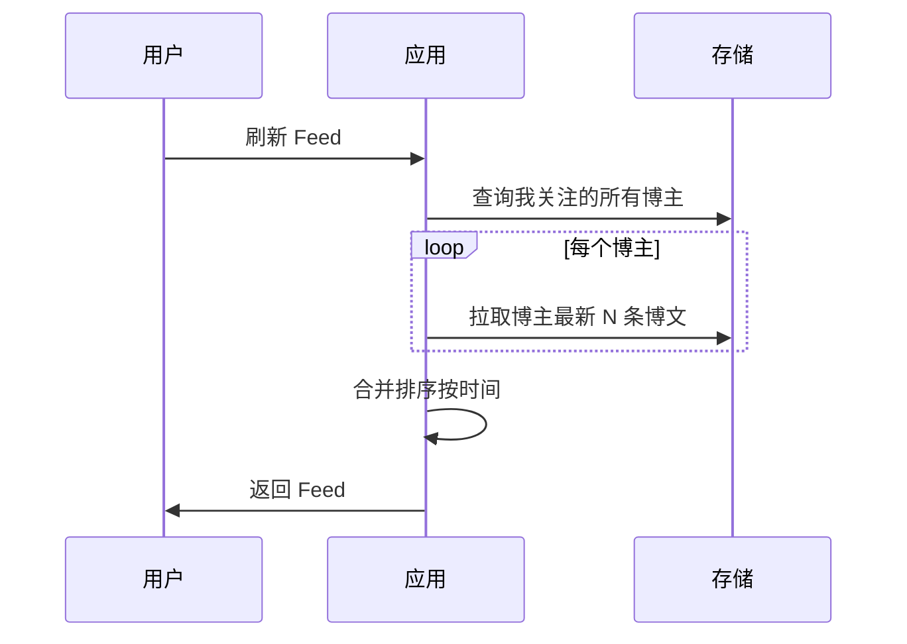
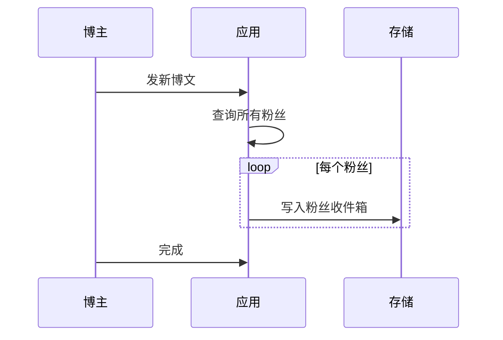
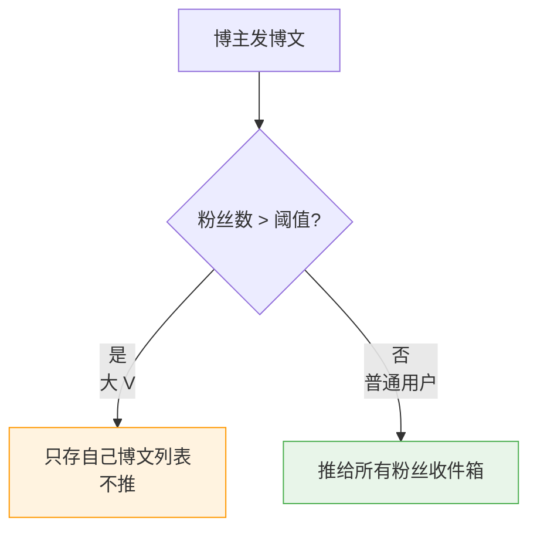
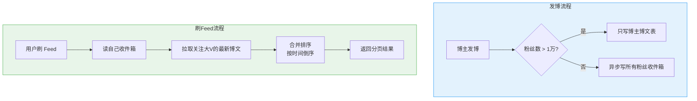

# Feed 流系统：推拉结合与 Timeline 排序

创建日期：2026-06-06

## 需求分析

### 功能需求

- 用户关注博主，博主发博文，粉丝在 Feed 流中看到。
- 按时间排序（Timeline）或热度排序。
- 下拉刷新、无限滚动分页。
- 百万级用户，千万级博文。

### 非功能需求

- **实时性**：博主发博，粉丝秒级看到。
- **QPS**：读 QPS 极高，亿级读请求。
- **容量**：存储海量博文，支持水平扩展。

## 三种实现方案对比

### 1. 拉模式（读扩散）

**原理：** 博主发博文，只存自己的博文列表。用户刷新 Feed，去所有关注博主的博文列表拉取，合并排序返回。



**优点：** 写操作简单，存储空间省。**缺点：** 读操作慢，用户关注越多越慢，实时性差。

---

### 2. 推模式（写扩散）

**原理：** 博主发博文，写给所有粉丝的 Feed 收件箱。用户刷新，直接读自己的收件箱。



**优点：** 读非常快，实时性好。**缺点：** 写放大，大 V 千万粉丝发一条写千万次，存储空间浪费。

---

### 3. 推拉结合（业界主流方案）

**核心思想：** 对不同用户区别对待：



**用户刷 Feed：**
1. 先读自己推来的收件箱，拿到一部分。
2. 大 V 的内容用户自己拉，合并进来。
3. 整体排序返回。

这就是微博、微信朋友圈用的方案。

### 三种方案对比

| 方案 | 写复杂度 | 读复杂度 | 空间 | 实时性 | 适用场景 |
|------|---------|---------|------|--------|---------|
| **拉模式** | O(1) | O(关注数) | 小 | 差 | 关注多、活跃少 |
| **推模式** | O(粉丝数) | O(1) | 大 | 好 | 粉丝少、活跃多 |
| **推拉结合** | 自适应 | 自适应 | 适中 | 好 | 大规模生产（推荐） |

## 关注关系存储

**Redis Set 存储：**

- 我关注了谁：`following:userId` → Set 存所有博主 ID。
- 谁关注了我：`followers:userId` → Set 存所有粉丝 ID。
- 判断是否关注：`SISMEMBER` O(1)。
- 增删关注：`SADD / SREM` O(1)。

Redis Set 适合这种关系型存储，查询快，操作简单。

## Timeline 排序 vs 热度排序

| 排序方式 | 原理 | 优点 | 缺点 |
|---------|------|------|------|
| **Timeline** | 按发布时间倒序 | 简单，用户不会漏内容 | 内容质量参差不齐 |
| **热度排序** | 按点赞、评论、转发计算热度分 | 热门内容优先，体验好 | 可能漏内容 |

**混合排序：** Timeline + 热度加权，最新的优先，热度高的也加权，兼顾实时和质量。

## 游标分页方案

Feed 流是无限下拉，必须分页。

### 为什么不用 offset？

```sql
-- offset 分页：offset 大了性能差，数据变动导致重复或漏项
SELECT * FROM feed ORDER BY time DESC LIMIT 20 OFFSET 40;
```

### 游标分页（推荐）

```sql
-- 用最后一条的时间戳做游标，利用索引，性能好
SELECT * FROM feed
WHERE time < #{lastCursor}
ORDER BY time DESC
LIMIT 20;
```

**处理相同时间戳：**

```sql
-- 加上 ID 二次排序，唯一确定位置
SELECT * FROM feed
WHERE (time < #{lastTime})
   OR (time = #{lastTime} AND id < #{lastId})
ORDER BY time DESC, id DESC
LIMIT 20;
```

| 对比项 | offset 分页 | 游标分页 |
|--------|------------|---------|
| 性能 | offset 大时慢 | 始终利用索引，快 |
| 数据变动 | 重复或漏项 | 不受影响 |
| 实现复杂度 | 简单 | 稍复杂 |

::: tip 结论
Feed 流推荐游标分页，性能好，不会重复不会漏。
:::

## 推拉结合实战架构



## 性能优化

- **热门 Feed 缓存**：Redis 缓存热点 Feed，减少 DB 压力。
- **存储拆分**：最近 Feed 存 Redis，旧数据归档到 MySQL / OSS。
- **异步推**：发博后，推粉丝收件箱异步做（MQ），发博快速返回。

---

## 经典高频面试题

### Q1：Feed 流的拉模式、推模式、推拉结合区别？业界为什么用推拉结合？

**知识要点：** 拉模式写O(1)读O(N)（关注数），推模式写O(N)（粉丝数）读O(1)，推拉结合按用户规模自适应切换。

**我们做内容社区Feed流时，起初为了简单选了纯拉模式——用户刷新时去所有关注博主的博文列表拉取、合并、排序。** 普通用户关注50-100人拉模式没问题（100次查询+合并排序约80ms），但有个重度用户关注了2000个博主，刷一次Feed要55秒——这用户投诉了3次。

**踩坑经历：** 推拉结合的阈值怎么设？我们分析用户数据发现：关注数<300的用户占80%，300-1000的占15%，>1000的占5%。设300为阈值，80%用户走推模式（发博时写收件箱，读起来快），剩下20%大V走拉模式。但这个阈值不是固定的——如果大V的粉丝活跃度很低（僵尸粉多），推给他的粉丝其实大部分没意义，反而浪费存储。所以最终加了"活跃粉丝数"作为第二维度：活跃粉丝>500的才走拉模式。

**量化结果：** 推拉结合后，重度关注用户（2000+关注）的Feed加载时间从55秒降到800ms。普通用户（<300关注）的加载时间从80ms降到20ms（走推模式直接读收件箱）。Redis存储因推模式增加了约3倍（每个用户需要维护收件箱），但通过设置收件箱容量上限（最近1000条）控制在可接受范围。

**面试官追问：**
- **追问1：** "微博大V几千万粉丝，推拉结合里大V的粉丝怎么看到他的内容？" —— 大V发博不推送给粉丝，只存一份在自己的博文列表里。粉丝刷Feed时，先读自己收件箱（普通关注者的推内容），再额外拉取关注的大V们的最新博文，两部分合并排序。所以粉丝的关注列表里同时有大V和普通用户。
- **追问2：** "如果用户取消关注了一个大V，怎么处理？" —— 推模式下取消关注时需要清理收件箱中该大V的所有博文——这个操作比较重。我们的做法是"惰性删除"：不在取消关注时清理，而是在用户刷Feed时过滤掉已取关者的博文（读收件箱时关联查询关注关系做过滤）。虽然读时有额外开销，但避免了取消关注时的批量写操作。

### Q2：什么是 Timeline？Feed 流为什么叫 Timeline？

**知识要点：** Timeline=时间线，按发布时间倒序排列内容。

**关于Timeline这个命名，我们团队里有过一次有趣的讨论。** 产品经理说"我们做的是信息流（Feed）不是时间线（Timeline），因为我们用算法排序不是时间排序"。实际上Timeline特指严格按时间排序的Feed，而算法排序的Feed叫Ranked Feed。微信朋友圈是Timeline（纯时间排序，不会漏），抖音是Ranked Feed（算法推荐）。

**踩坑经历：** 我们一开始做了纯Timeline排序——按发布时间倒序，觉得简单直观。但上线后发现一个问题：半夜发的内容在第二天早上被大量新内容淹没，用户根本看不到昨晚朋友发的动态。后来引入了"混合排序"：最近2小时的内容按时间排，2小时前的按"互动热度"加权，兼顾实时性和内容质量。

**量化结果：** 混合排序后用户平均停留时长从8分钟提升到15分钟（+87%），互动率从2.3%提升到5.8%。但增加了约5%的用户抱怨"内容不按时间排序，感觉乱了"——这是取舍。

**面试官追问：**
- **追问1：** "微信朋友圈是严格Timeline，为什么还要这样？" —— 微信的产品哲学是"不替你决定什么重要"，把选择权交给用户。Timeline排序确保用户不会错过任何一条内容，代价是可能看到低质量内容。算法推荐则帮用户筛选但可能漏掉重要内容。没有好坏之分，是产品理念的差异。
- **追问2：** "如果用户关注了2000个人，全按Timeline排，消息量多大？" —— 按每人日均发3条算，2000人×3条=6000条/天，用户划拉一下午也看不完。所以Timeline在大关注量下天然有信息过载问题，这也是为什么微博早期Timeline后来改成了算法推荐。

### Q3：Feed 流分页为什么不用 offset 用游标？

**知识要点：** offset在大偏移量时性能差（需跳过N行），数据变动导致重复或漏项；游标定位到具体记录，利用索引高效稳定。

**我们在Feed流分页上被offset坑过一次。** 用户下滑到第20页时（offset=400），SQL执行了1.2秒——因为数据库需要扫描前400行然后跳过。更糟糕的是，用户在刷Feed时他关注的某个博主又发了新博文，数据库里插入了新数据，导致用户第20页和第21页之间出现了重复（新内容挤占了旧内容的位置）。

**踩坑经历：** 切到游标分页后（`WHERE time < lastTime ORDER BY time DESC LIMIT 20`），利用`(time)`索引直接定位，不管偏移量多大查询都在15ms以内。但相同时间戳的处理是个细节——如果同一秒有多条内容，纯时间戳游标会漏掉一部分（time相同的其他记录）。所以最终游标用`(last_time, last_id)`组合。还有一个实际的问题：如果用户把手机时间调快了，发的内容时间戳在"未来"，游标分页逻辑会出问题。解决方案是服务端生成时间戳（不用客户端时间）。

**量化结果：** 游标分页后，Feed查询P99从1.2秒降到18ms，索引命中率100%。因数据变动导致重复/漏项的投诉从每周5次降到0次。

**面试官追问：**
- **追问1：** "游标分页能支持跳页吗？（如直接跳到第10页）" —— 这是游标分页的主要缺点：只能上一页/下一页，不能跳页。原因是游标需要知道"上一条"的具体记录。如果需要跳页功能，可以维护一个"页面快照"——用Redis缓存每页的第一条记录的游标，跳页时查Redis拿游标再查DB。
- **追问2：** "如果Feed是算法排序（不是按时间），游标还有用吗？" —— 按热度排序时游标逻辑更复杂。游标不再是简单的时间戳，而是"热度分+时间戳+ID"的复合排序。但原理相同：把"最后一条记录"的排序字段值作为游标传给下一次查询。

### Q4：时间戳游标分页，如果两条时间戳相同怎么处理？

**知识要点：** 排序条件增加ID作为第二排序键，游标变为`(last_time, last_id)`组合。

**这个问题我们线上真实遇到过。** 一个活动导致同一秒内有200个用户发了博文，时间戳全部相同。第一次游标分页取20条后，第二次查询`WHERE time < '2024-01-01 10:00:00' LIMIT 20`——结果返回了0条（因为200条都是同一秒，`<`条件过滤掉了所有）。用户刷了20条后就刷不出更多了。

**踩坑经历：** SQL改为`WHERE (time < ?) OR (time = ? AND id < ?) ORDER BY time DESC, id DESC LIMIT 20`，完美解决问题。但要注意MySQL优化器对这种OR条件的处理——如果`time`没有索引，这个查询会全表扫描。我们线上`(time, id)`联合索引保证了查询走索引。另外前端需要同时保存`lastTime`和`lastId`两个游标值，状态管理多了一个字段。

**量化结果：** 修复后相同时间戳场景的分页查询延迟稳定在12ms以内，数据一致性100%（无漏项无重复）。

**面试官追问：**
- **追问1：** "如果不用ID，用其他唯一字段（如Snowflake ID）可以吗？" —— 任何能保证唯一且有序的字段都行。Snowflake ID因为包含时间戳，天然就是有序的，非常适合。但要注意Snowflake ID有时钟回拨问题——如果机器时钟回拨可能产生比之前小的ID，破坏排序假设。我们用雪花算法时配置了`sequence bits=12`并且机器ID固定在部署时分配。
- **追问2：** "如果Feed是多表聚合（如推表和拉表合并），游标怎么设计？" —— 游标在聚合层面需要统一排序。我们的做法是聚合SQL用`UNION ALL`后外层统一排序+游标分页。但UNION ALL的性能随表数线性增长，表超过3个时建议先各自分页再应用层合并排序（内存排序）。

### Q5：大 V 千万粉丝为什么推模式不行？会有什么问题？

**知识要点：** 写放大倍数=粉丝数，千万粉丝发一条写千万次，I/O和存储都无法承受。

**我们推演过一个极端场景：某明星在平台上发一条博文，5000万粉丝。** 如果走推模式，这条博文要写入5000万个用户的收件箱。假设每条写入1KB（博文内容），总写入量=1KB×5000万=50GB。即使并发写入（100个线程），写入过程也要持续约5分钟——在这5分钟里，前2000万粉丝的收件箱里已经有这条博文了，后3000万还没有，用户看到的Feed不一致。

**量化结果：** 推拉结合后，这位明星发博只需1次写入（存入自己的博文列表），5000万粉丝各自刷Feed时自己去拉取。单次发博延迟从5分钟（推模式预估）降到50ms（读扩散写入），存储空间从50GB（推模式）降到1KB（读扩散）。

**面试官追问：**
- **追问1：** "推模式能不能异步批量写？比如用MQ削峰，分批发完？" —— 技术上可以，但不解决根本问题：5000万次写入的存储成本、MQ堆积风险、以及"部分粉丝收到了部分没收到"的不一致窗口。而且大V发博频率可能很高（一天发10条），MQ永远在追赶。所以业界选择"大V不推"，从根上消除写放大。
- **追问2：** "有没有方案可以让大V既走推模式又不出问题？" —— 微博早期用过"分组推"：把粉丝按活跃度分组，先推活跃粉丝（约20%），非活跃粉丝等他们上线后再补推。但这引入了逻辑复杂度（分组的准确性、补推的及时性）。业界公认最好的方案还是推拉结合。

### Q6：Feed 流怎么保证实时性？

**知识要点：** 推模式天然实时、推拉结合中普通用户实时、大V接近实时、长连接推送提醒。

**我们Feed流实时性的一个经典问题是：用户A给用户B发了私信（IM），B看到了私信但切到Feed流，发现Feed里没有A的最新动态。** 原因是A的动态走的是推拉结合里的拉模式（A粉丝多被归为大V），B需要刷新Feed才会去拉A的内容，而B刚看完私信不会主动刷新。

**踩坑经历：** 解决方案是"重要内容实时推"——即便归类为大V，某些"重要内容"（如@提及、私信关联）仍走推模式，确保接收方实时看到。另外，Feed流加上WebSocket长连接推送"有新内容"的提醒，用户看到小红点主动刷新。

**量化结果：** 实时推+长连接提醒后，用户从看到通知到看到内容的平均间隔从45秒降到8秒。重要内容的送达率从推拉结合模式的"拉取才看到"变为100%实时。

**面试官追问：**
- **追问1：** "推送提醒会不会太打扰用户？" —— 控制推送频率：同一用户1小时内最多推3条提醒，超过的聚合为"你关注的XX等5位博主发布了新内容"。推送频率通过用户偏好设置可调整（高/中/低三档）。
- **追问2：** "Feed流的实时性和微博/朋友圈一样吗？" —— 不一样。微博时效性要求高（新闻类内容），朋友圈更侧重关系链的完整展示（即便旧内容也要能看到）。所以微博偏实时+算法排序，朋友圈偏Timeline排序+全量展示。