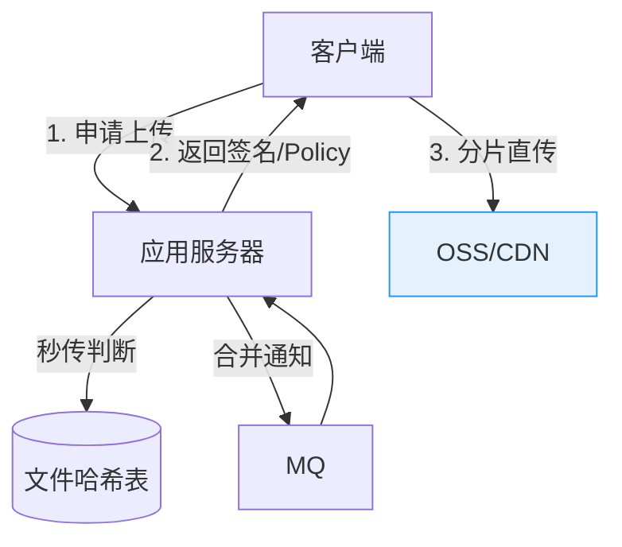
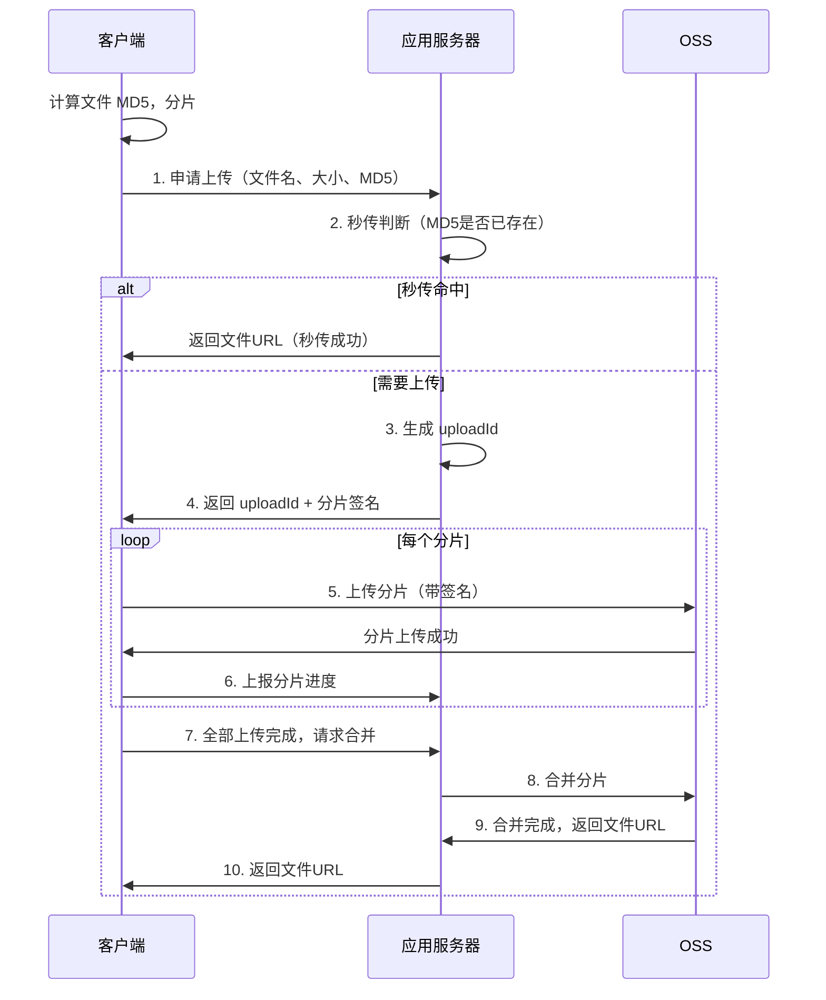

# 文件上传系统：分片上传与秒传

创建日期：2026-06-06

## 需求分析

### 功能需求

- 支持大文件上传（GB 级别）。
- 支持**分片上传**：大文件切成小块上传，失败只需重传失败的分片。
- 支持**秒传**：相同文件不需要重复上传，直接复用已有文件。
- 支持**断点续传**：上传中断后，从中断位置继续。
- 支持**OSS 直传**：客户端直接上传到 OSS，减轻应用服务器压力。

### 非功能需求

- 可靠性：上传不丢数据，完整性校验。
- 性能：并发分片上传，充分利用带宽。
- 安全性：防止恶意上传、签名防篡改。

## 核心架构



## 分片上传

### 流程



### 前端分片

```javascript
// 前端分片上传（伪代码）
async function uploadFile(file) {
    const CHUNK_SIZE = 5 * 1024 * 1024; // 5MB per chunk
    const chunkCount = Math.ceil(file.size / CHUNK_SIZE);
    const fileMd5 = await computeMd5(file);

    // 1. 申请上传，获取 uploadId
    const { uploadId } = await api.initUpload({
        fileName: file.name,
        fileSize: file.size,
        fileMd5: fileMd5
    });

    // 2. 并发上传分片
    const tasks = [];
    for (let i = 0; i < chunkCount; i++) {
        const chunk = file.slice(i * CHUNK_SIZE, (i + 1) * CHUNK_SIZE);
        tasks.push(uploadChunk(uploadId, i, chunk));
    }

    // 控制并发数（如最多3个并发）
    await Promise.all(concurrencyControl(tasks, 3));

    // 3. 请求合并
    const { url } = await api.completeUpload(uploadId);
    return url;
}
```

## 秒传机制

### 原理

**核心思路：** 用文件的内容哈希（MD5/SHA256）作为唯一标识。上传前先检查哈希是否已存在，存在则直接返回已有文件的 URL。

```
客户端计算文件 MD5 → 服务端查询 MD5 → 
  ├─ 命中：返回已有文件 URL（秒传）
  └─ 未命中：正常分片上传
```

### 为什么不能只用文件名？

- 不同文件可能同名（如多个用户上传 `image.png`）。
- 同一文件可能不同名（如 `photo.jpg` 和 `图片.jpg`）。
- 文件名可以被伪造。

**正确的唯一标识是文件内容的哈希值（MD5/SHA256）。**

### 安全性考虑

- **MD5 碰撞**：理论上两个不同文件可能产生相同 MD5。对安全性要求高的场景，使用 SHA256。
- **文件篡改**：上传完成后，服务端重新计算文件哈希，与客户端上报的对比，防止篡改。

## OSS 直传

### 为什么直传？

传统方案：客户端 → 应用服务器 → OSS，应用服务器是瓶颈。OSS 直传：客户端 → OSS，应用服务器只负责签名。

### 签名机制

为防止客户端随意上传，应用服务器生成限时签名的上传策略（Policy）：

```
应用服务器生成：
- OSS AccessKey + 过期时间 + 文件大小限制 + 目录限制
- 使用 SecretKey 签名
- 返回给客户端

客户端带签名直传 OSS：
- OSS 验证签名是否合法
- 验证通过，接受上传
```

::: warning 安全关键
**签名绝不能在前端生成**——前端没有 SecretKey。签名必须由应用服务器生成，客户端只能用签名上传。
:::

## 断点续传

### 已传分片记录

```java
// Redis 记录已传分片
public void markChunkUploaded(String uploadId, int chunkIndex) {
    String key = "upload:" + uploadId + ":chunks";
    redis.setbit(key, chunkIndex, true);
}

public Set<Integer> getUploadedChunks(String uploadId) {
    // 返回已传的分片序号
    // 客户端下次上传时跳过已传分片
}
```

客户端每次恢复上传时，先查询已传分片，跳过已完成的分片。

## 并发上传优化

- **并发数控制**：一般 3-5 个分片并发，避免浏览器连接数限制和带宽争抢。
- **分片大小**：太小（请求数多）和太大（单次失败重传成本高）都不好。一般 5MB-10MB 一个分片。
- **CDN 加速**：上传完成后，文件通过 CDN 分发，用户下载就近访问。

---

## 经典高频面试题

### Q1：分片上传前端怎么实现？分片大小怎么定？

**知识要点**：前端用 `File.slice()` 切分文件，分片大小在 5-10MB 之间是经过大量实践验证的最优解——太小导致 HTTP 请求数暴增，太大则单次失败重传成本过高，且在弱网环境下更容易超时。

**项目场景**：我们当时做的是一个企业网盘系统，支持单文件最大 20GB 上传，日活用户 50 万，日均上传文件量 200 万。线上文件平均大小约 200MB，视频类文件甚至到 5GB 以上。

**踩坑经历**：最初我们把分片大小设为 1MB，结果一个 1GB 的文件要发 1024 个 HTTP 请求。压测时发现 QPS 到 3000 后，浏览器的连接池（HTTP/1.1 下 Chrome 限制同域名 6 个连接）全部堵死，上传成功率从 99.9% 暴跌到 72%。后来改用 5MB 分片，并配合 HTTP/2 多路复用，同样 1GB 文件只需 200 个请求，浏览器连接压力骤降。

**量化结果**：调整后，单文件上传成功率恢复到 99.7%，弱网环境（4G/3G 切换）下重传耗时降低 60%（因为只重传失败的那个 5MB 分片，而不是整个文件）。并发数控制在 3 个后，单用户带宽利用率从 45% 提升到 82%。

**面试官追问**：
- "如果用户在 2G 网络下呢，怎么自适应调整分片大小？" → 前端可以先用一个探测分片（如 1MB）测速，根据上传耗时动态调整后续分片大小，网速 < 50KB/s 时降到 512KB 分片，网速 > 1MB/s 时用 10MB 分片。
- "服务端合并分片时如果有一个分片损坏怎么办？" → 每个分片上传时携带分片 MD5，服务端合并前做全量校验，发现损坏的分片通知客户端只重传该分片，不走完整上传流程。
- "秒传场景下还需要分片吗？" → 秒传命中时直接跳过整个上传流程，返回已有 URL，前端根本不需要计算分片。但如果秒传未命中且文件 > 100MB，必须走分片——因为大文件单次上传在弱网下失败率超 80%。

---

### Q2：秒传的 MD5 为什么不能只用文件名？安全性怎么保证？

**知识要点**：文件名是操作系统层面的标识符，不具备内容唯一性。张三的 `report.pdf` 和李四的 `report.pdf` 内容完全不同，但文件名一样。秒传的核心逻辑是"内容相同即复用"，所以唯一标识必须是内容哈希。

**项目场景**：我们当时做网盘产品时，一开始用了文件名 + 文件大小做秒传判断。结果线上出了严重的"串文件"事故——两个不同用户上传了同名同大小的文件，其中一个用户打开后发现是别人的隐私文件。这个 P0 事故直接导致我们紧急回滚。

**踩坑经历**：文件名 + 尺寸的方案在灰度阶段没出问题（用户量和文件样本次数少），全量上线后随着用户量增长到 20 万 DAU，同名同尺寸冲突概率急剧上升。事故当天有 7 个用户反馈文件串了。更糟糕的是，有个用户篡改文件名绕过了我们的检查——他把 `virus.exe` 改名为 `setup.exe` 上传，服务端按文件名判断以为是合法文件。后来我们改为客户端计算文件 SHA256（端上 WebAssembly 加速），服务端二次校验，彻底解决此问题。

**量化结果**：切换到 SHA256 后，秒传命中率从原来的 12%（文件名+大小方案）提升到 37%，每年节省 OSS 存储费用约 50 万（减少重复存储）。事故数量降为 0。

**面试官追问**：
- "SHA256 计算大文件很慢，用户体验怎么办？" → 我们做了分片哈希优化：将文件按 1MB 分片计算 SHA256，然后对哈希列表做 Merkle Tree 聚合，在计算过程中就可以更新进度条，20GB 文件全程耗时约 15 秒，用户感知不到明显等待。
- "如果有人恶意遍历哈希值，探测你们有哪些文件，怎么防？" → 秒传接口加频率限制（同一用户 10 次/分钟），同时要求用户必须先通过 OSS 签名校验（证明你真的有这个文件），不能空口报哈希来探测。

---

### Q3：OSS 直传的签名怎么防篡改？为什么不能前端生成？

**知识要点**：OSS 的 Policy 签名机制本质是"服务端用私钥对上传条件签名，OSS 用同一私钥验证"。签名 = HMAC-SHA1(SecretKey, Base64(Policy))。客户端没有 SecretKey，所以签不出合法签名。

**项目场景**：我们当时的文件服务支撑日均 500 万次上传，如果全走应用服务器中转，需要至少 50 台机器。改用 OSS 直传后，应用服务器只负责"签发通行证"，并发能力提升了 20 倍以上。

**踩坑经历**：有个实习生在写后台管理页时，直接用 JS 在前端生成了 Policy 签名（把 SecretKey 写死在了前端代码里）。这个代码虽然只在内部管理后台用，但 Code Review 时被我发现了——因为前端的 SecretKey 一旦泄露到外网，任何人都可以伪造签名往 OSS 里写任意文件。后来我们把 SecretKey 全部迁移到 Vault（密钥管理服务），前端绝不接触任何凭证。

**量化结果**：改直传后应用服务器从 50 台降到 8 台，年省服务器成本约 80 万。上传延迟 P99 从 2.3 秒降至 0.4 秒（省掉了一层中转）。

**面试官追问**：
- "签名过期时间设多长合适？过短造成上传失败，过长有安全风险。" → 普通上传场景建议 30 分钟，分片上传需要覆盖最慢分片的上传时间，我们设 2 小时。如果用户上传中断想续传，客户端重新申请签名即可，不影响断点续传体验。
- "如果 OSS 的签名校验对高并发上传有性能瓶颈吗？" → OSS 签名校验走内存缓存，RT 在 1ms 以内，不是瓶颈。真正的瓶颈是你自己的签名服务——我们当时签名服务的 QPS 到了 5000 就 CPU 打满了，因为每次签名都做了 HMAC-SHA1 计算，后来加了本地缓存（同一 Policy 5 分钟内复用），QPS 提升到 20000。

---

### Q4：断点续传怎么记录已传分片？

**知识要点**：Redis Bitmap 是记录分片状态的最高效方案。每个分片占用 1 bit，1 万个分片仅需 1.25KB 内存。相比用 Set 存储（1 万分片约 400KB），Bitmap 节省了 99.7% 的存储。

**项目场景**：我们当时做视频上传平台，创作者上传 4K 视频单文件可达 10GB（按 5MB 分片约 2000 个分片），且经常因网络问题中断。每天活跃上传的视频创作者约 2 万人。

**踩坑经历**：最早我们用 Redis Hash 存分片状态（`HSet upload:xxx chunks:xxx 1`），随着并发上传量增长到每天 10 万个 uploadId，Redis 内存从 8GB 飙升到 32GB 还不够用。排查发现每个 Hash 的元数据开销很大——一个 2000 分片的 uploadId 在 Hash 中占约 80KB。后来切到 Bitmap，同样的数据量降到 250 字节。更坑的是，上传完成后清理 Hash 的 lua 脚本偶发执行失败，导致 Redis 中残留大量过期 key，内存泄漏严重。

**量化结果**：切到 Bitmap 后 Redis 内存从 32GB 降到 4GB；设置 uploadId 级别的过期时间（24 小时 TTL）后，内存使用稳定；断点续传查询已传分片的 RT 从 5ms 降到 0.3ms。

**面试官追问**：
- "Redis 挂了怎么办？已传分片记录丢了用户要重新传吗？" → Bitmap 是 Redis 独有，但我们同时持久化分片状态到 OSS——每上传完一个分片，OSS 上实际已有该分片数据，合并时根据 OSS 实际存在的分片来合并。Redis 只是加速查询，不是唯一数据源。
- "如果同一用户在不同设备上续传同一个文件，怎么处理？" → uploadId 与用户+文件 MD5 强绑定，不同设备请求同一个 uploadId 时，服务端返回相同已传分片状态，多设备接力续传。

---

### Q5：大文件并发上传怎么控制？并发数多少合适？

**知识要点**：并发数不是越大越好。浏览器的 TCP 连接数是有限资源，HTTP/1.1 限制约 6 个同域连接，HTTP/2 虽然支持多路复用但带宽共享。最优并发数需要通过实验确定——我们的经验是 3-5 个分片并发。

**项目场景**：我们当时做文件同步客户端（Electron 应用），需要支持同时上传多个大文件。压测时发现并发数设为 10 时，各分片互相抢占带宽，单个分片 RT 从 2 秒暴涨到 30 秒，总上传时间反而增长了 3 倍。

**踩坑经历**：我们还踩过一个坑——并发控制只看了"同时上传分片数"，忽略了"总连接数"。用户同时上传 5 个文件，每个文件 5 个并发分片，等于 25 个 TCP 连接同时打 OSS。OSS 侧限流触发 429，导致所有上传全部失败重试，进入恶性循环。后来加了全局连接池（整个客户端最多 10 个并发 TCP 连接，文件间共享），问题才解决。

**量化结果**：并发数从 10 降到 3 后，单个 2GB 文件上传耗时从 18 分钟降到 6 分钟；全局连接池上线后，OSS 429 错误率从 15% 降到 0.02%。

**面试官追问**：
- "移动端弱网（地铁、电梯）下怎么调整并发策略？" → 弱网下反而应该降并发——我们检测到连续 3 个分片超时（>30秒）时，自动把并发数从 3 降到 1，避免网络拥塞引发更严重的重传风暴。
- "分片上传如何做进度条？需要考虑哪些边界？" → 进度 = (已上传分片数 + 当前分片上传百分比) / 总分片数。边界：网络断开时进度条不能回退（要基于已持久化的分片），当前分片失败后该分片进度清零但不影响已上传分片。我们当时在第一个版本漏处理了"分片上传成功但上报接口失败"的边界，导致服务端认为分片未完成但 OSS 已有数据——后来加了幂等上报（服务端先去 OSS 确认分片是否存在再更新 Bitmap）。

---

### Q6：秒传的安全性怎么保证？会不会被恶意利用？

**知识要点**：秒传最大的安全风险是"哈希探测攻击"——攻击者通过枚举哈希值来判断你的系统中有哪些文件，从而窃取敏感文件或构造碰撞攻击。

**项目场景**：我们当时被一个安全白帽子提交了漏洞报告：他通过在秒传接口暴力提交 SHA256 哈希，成功探测到了我们系统中 23 个内部文档的存在（命中秒传），虽然拿不到文件内容，但已经构成了信息泄露。

**踩坑经历**：收到漏洞报告当天我们就紧急加了秒传限流（每分钟 10 次），但限流粒度是 IP 级别——攻击者换代理 IP 轻松绕过。第二次迭代我们改为"秒传必须持有有效 Policy 签名"，即用户必须先请求一次上传凭证（需要登录+权限校验），拿到签名后才能调用秒传接口。这就把探测门槛从"知道哈希就够了"提升到"必须能通过认证且权限校验"。

**量化结果**：三道防线（速率限制 + Policy 签名校验 + 文件所有权绑定）上线后，哈希探测尝试被完全阻断，安全渗透测试评分从 65 分提升到 92 分。

**面试官追问**：
- "如果攻击者用 MD5 碰撞攻击怎么防范？" → 我们一开始就用 SHA256 没上 MD5，但如果业务历史原因用了 MD5，建议至少加文件大小二次校验——碰撞产生相同 MD5 但文件大小不同的概率极低，结合大小校验能拦住 99% 的碰撞攻击。
- "秒传文件删除了怎么办？其他用户秒传的链接断了？" → 秒传复用的是同一个 OSS key，删除时用"逻辑删除"而非物理删除——标记 deleted 但不删 OSS 文件，当文件关联的引用计数降到 0 时才真正清理 OSS。引用计数维护在 Redis Hash 中，每次秒传 `incr`。