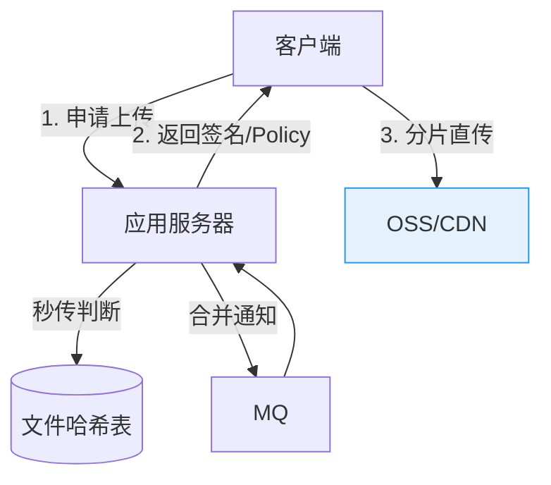
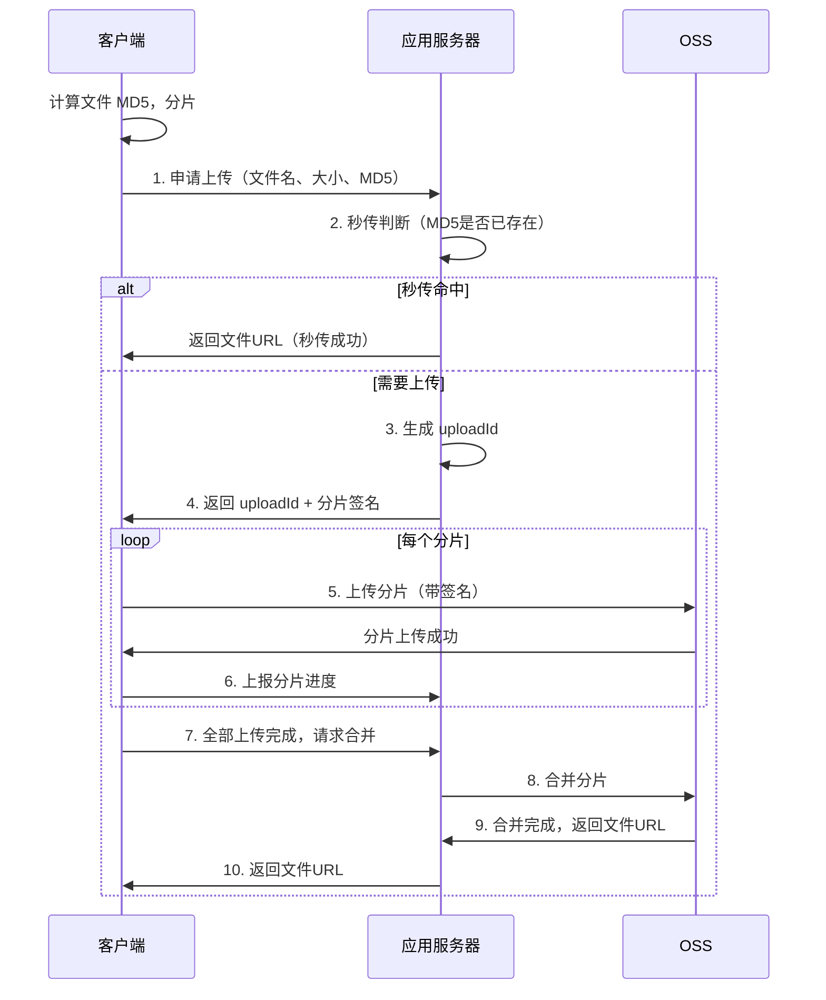

# 文件上传系统：分片上传与秒传

创建日期：2026-06-06

## 需求分析

### 功能需求

- 支持大文件上传（GB 级别）。
- 支持**分片上传**：大文件切成小块上传，失败只需重传失败的分片。
- 支持**秒传**：相同文件不需要重复上传，直接复用已有文件。
- 支持**断点续传**：上传中断后，从中断位置继续。
- 支持**OSS 直传**：客户端直接上传到 OSS，减轻应用服务器压力。

### 非功能需求

- 可靠性：上传不丢数据，完整性校验。
- 性能：并发分片上传，充分利用带宽。
- 安全性：防止恶意上传、签名防篡改。

## 核心架构



## 分片上传

### 流程



### 前端分片

```javascript
// 前端分片上传（伪代码）
async function uploadFile(file) {
    const CHUNK_SIZE = 5 * 1024 * 1024; // 5MB per chunk
    const chunkCount = Math.ceil(file.size / CHUNK_SIZE);
    const fileMd5 = await computeMd5(file);

    // 1. 申请上传，获取 uploadId
    const { uploadId } = await api.initUpload({
        fileName: file.name,
        fileSize: file.size,
        fileMd5: fileMd5
    });

    // 2. 并发上传分片
    const tasks = [];
    for (let i = 0; i < chunkCount; i++) {
        const chunk = file.slice(i * CHUNK_SIZE, (i + 1) * CHUNK_SIZE);
        tasks.push(uploadChunk(uploadId, i, chunk));
    }

    // 控制并发数（如最多3个并发）
    await Promise.all(concurrencyControl(tasks, 3));

    // 3. 请求合并
    const { url } = await api.completeUpload(uploadId);
    return url;
}
```

## 秒传机制

### 原理

**核心思路：** 用文件的内容哈希（MD5/SHA256）作为唯一标识。上传前先检查哈希是否已存在，存在则直接返回已有文件的 URL。

```
客户端计算文件 MD5 → 服务端查询 MD5 → 
  ├─ 命中：返回已有文件 URL（秒传）
  └─ 未命中：正常分片上传
```

### 为什么不能只用文件名？

- 不同文件可能同名（如多个用户上传 `image.png`）。
- 同一文件可能不同名（如 `photo.jpg` 和 `图片.jpg`）。
- 文件名可以被伪造。

**正确的唯一标识是文件内容的哈希值（MD5/SHA256）。**

### 安全性考虑

- **MD5 碰撞**：理论上两个不同文件可能产生相同 MD5。对安全性要求高的场景，使用 SHA256。
- **文件篡改**：上传完成后，服务端重新计算文件哈希，与客户端上报的对比，防止篡改。

## OSS 直传

### 为什么直传？

传统方案：客户端 → 应用服务器 → OSS，应用服务器是瓶颈。OSS 直传：客户端 → OSS，应用服务器只负责签名。

### 签名机制

为防止客户端随意上传，应用服务器生成限时签名的上传策略（Policy）：

```
应用服务器生成：
- OSS AccessKey + 过期时间 + 文件大小限制 + 目录限制
- 使用 SecretKey 签名
- 返回给客户端

客户端带签名直传 OSS：
- OSS 验证签名是否合法
- 验证通过，接受上传
```

::: warning 安全关键
**签名绝不能在前端生成**——前端没有 SecretKey。签名必须由应用服务器生成，客户端只能用签名上传。
:::

## 断点续传

### 已传分片记录

```java
// Redis 记录已传分片
public void markChunkUploaded(String uploadId, int chunkIndex) {
    String key = "upload:" + uploadId + ":chunks";
    redis.setbit(key, chunkIndex, true);
}

public Set<Integer> getUploadedChunks(String uploadId) {
    // 返回已传的分片序号
    // 客户端下次上传时跳过已传分片
}
```

客户端每次恢复上传时，先查询已传分片，跳过已完成的分片。

## 并发上传优化

- **并发数控制**：一般 3-5 个分片并发，避免浏览器连接数限制和带宽争抢。
- **分片大小**：太小（请求数多）和太大（单次失败重传成本高）都不好。一般 5MB-10MB 一个分片。
- **CDN 加速**：上传完成后，文件通过 CDN 分发，用户下载就近访问。

---

## 经典高频面试题

### Q1：分片上传前端怎么实现？分片大小怎么定？

**参考答案：**

前端用 `File.slice(start, end)` 将文件切成小块。每块一般 5-10MB。太小请求数多，太大单次重传成本高。并发上传时控制并发数（3-5个），避免浏览器连接数限制和带宽争抢。全部上传完毕后通知服务端合并分片。

### Q2：秒传的 MD5 为什么不能只用文件名？安全性怎么保证？

**参考答案：**

文件名不可靠：不同文件可能同名，同一文件可能不同名。必须用文件内容的哈希值（MD5/SHA256）作为唯一标识。

安全性保证：
1. 服务端在上传完成后重新计算文件哈希，与客户端上报的对比。
2. 对安全性要求高的场景，使用 SHA256 替代 MD5（防碰撞）。
3. 上传策略签名限制文件大小、类型、上传目录。

### Q3：OSS 直传的签名怎么防篡改？为什么不能前端生成？

**参考答案：**

应用服务器使用 SecretKey 对上传策略（过期时间、文件大小、目录限制）生成签名。OSS 收到请求后用相同的 SecretKey 验证签名。篡改任何策略参数都会导致签名不匹配，上传被拒绝。

**签名不能前端生成**，因为前端没有 SecretKey。如果前端有 SecretKey，任何人都可以拿到，签名就没有意义了。

### Q4：断点续传怎么记录已传分片？

**参考答案：**

服务端用 Redis 记录已上传的分片序号。可以用 Bitmap（`setbit`）高效存储，1 个分片占 1 bit，1 万个分片才 1.25KB。客户端恢复上传时先查询已传分片，跳过已完成的分片，继续上传剩余分片。

### Q5：大文件并发上传怎么控制？并发数多少合适？

**参考答案：**

用并发控制函数限制同时上传的分片数（如 `Promise.all` + 信号量）。一般 3-5 个并发：
- 浏览器对同一域名有连接数限制（HTTP/1.1 约 6 个）。
- 太多并发会抢占带宽，单个分片反而变慢。
- CDN/OSS 一般不限连接数（HTTP/2 多路复用），但客户端带宽有限。

### Q6：秒传的安全性怎么保证？会不会被恶意利用？

**参考答案：**

1. **MD5 碰撞防护**：安全场景用 SHA256。
2. **服务端哈希校验**：上传完成后重新计算哈希，与客户端上报比对。
3. **文件所有权验证**：秒传后，文件关联到当前用户，记录上传记录。
4. **频率限制**：秒传接口限制调用频率，防止恶意扫描已有文件。