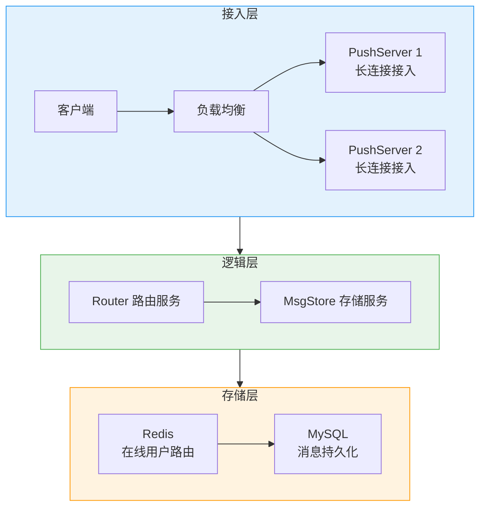
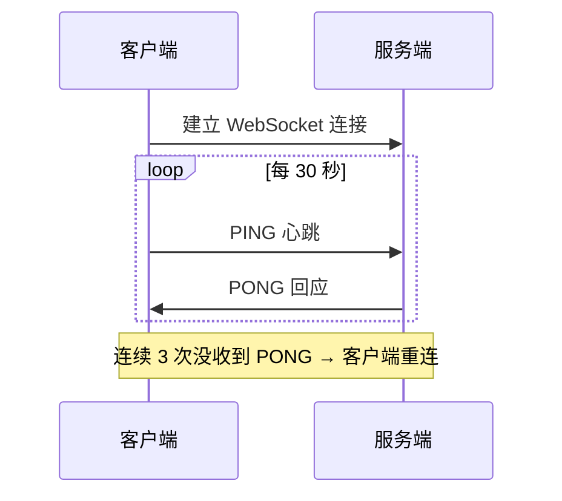
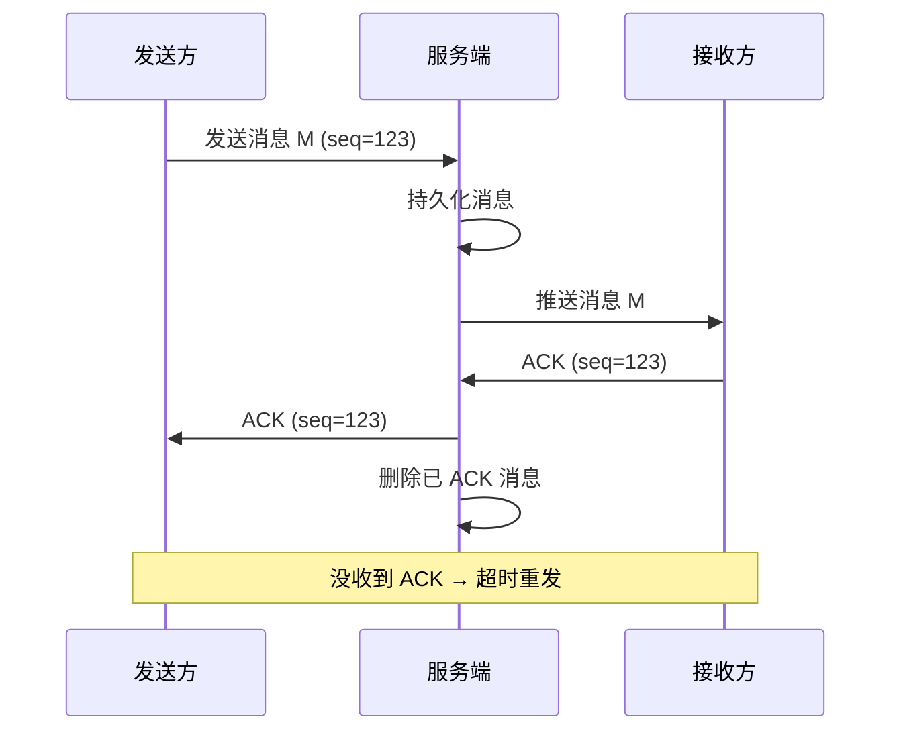
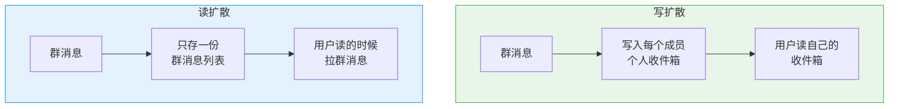

# IM 系统：长连接、可靠投递与群聊扩散

创建日期：2026-06-06

## 需求分析

### 功能需求

- 单聊：用户 A 给用户 B 发消息，实时送达。
- 群聊：多人群组聊天。
- 消息已读 / 未读状态。
- 多端同步：手机、PC 同时在线，消息同步到所有端。
- 离线消息：用户不在线，上线后能拉到。

### 非功能需求

- **实时性**：消息发出后，对方秒级收到。
- **可靠性**：消息不丢、不重、不乱序。
- **并发**：百万级在线用户。
- **可用性**：99.9% 以上。

## 整体架构



## WebSocket 长连接与心跳

### 为什么用长连接？

- 轮询：客户端定期拉，延迟大，大量无效请求，浪费带宽。
- WebSocket：全双工，连接建立后一直保持，服务端可以主动推，延迟低，省带宽。

### 心跳保活

**为什么需要心跳？** 网络中间设备（防火墙、LB）会把长时间不活跃的 TCP 连接断开。

**心跳设计：**



**为什么客户端发心跳？** 服务端如果给每个连接都开定时器，百万连接需要百万定时器，资源消耗大。客户端发，服务端只需回应，节省服务端资源。

## 消息可靠投递

怎么保证消息不丢？



**核心点：**

1. **消息持久化**：服务端收到消息先存，ACK 之前不删。
2. **客户端 ACK**：收到消息回 ACK，服务端删存储。
3. **超时重传**：没收到 ACK，超时重发。
4. **去重**：客户端按消息 ID 去重，避免重复。

**离线消息处理：** 用户不在线，消息存在离线队列（Redis List）。用户上线，拉取所有离线消息，后清空离线队列。

## 已读未读设计

每条消息分配全局递增 seq。每个会话，维护一个最大已读 seq：

- 总消息数 - 已读 seq = 未读数。
- 用户已读，更新自己会话的 `last_read_seq`。
- 多端同步：`last_read_seq` 存在服务端，所有端都能读到。

**未读数计数：** Redis 对每个用户维护未读数 `unread:userId`。新消息来了 incr，已读了清零。客户端拉取首页直接拿到未读数。

## 群聊扩散机制

### 写扩散 vs 读扩散



### 对比分析

| 对比项 | 写扩散 | 读扩散 |
|--------|--------|--------|
| 写入放大 | N 倍（N = 群成员数） | 1 倍 |
| 读延迟 | 低（直接读自己） | 稍高（需要过滤） |
| 空间占用 | 大（存多份） | 小（存一份） |
| 已读未读 | 好做 | 需要记每个用户游标 |
| 适用 | 中小群（几百人以内） | 大群、万人群 |

### 业界实践：推拉结合

- **中小群**：写扩散，发博时推给所有成员，读起来快。
- **大群（万人群）**：读扩散，消息只存一份，成员自己拉。
- 微信等主流 IM 都支持两种模式，自动适配。

## 多端同步

- 每个消息全局唯一递增 seq。
- 每个端记录自己已同步到哪个 seq。
- 上线后拉取比本地 seq 大的消息，同步到本地。
- 不管哪个端发消息，seq 全局递增，所有端都能按顺序同步。
- 已读状态也同步：哪个端读了，更新服务端 `last_read_seq`，其它端看到就标记已读。

## 在线用户路由

用户连接在哪台 PushServer 怎么找？

**Redis 存储用户连接信息：**

```
user:1001 → {server_id: "server-1", conn_id: "xxx"}
```

- A 给 B 发消息，查 Redis 知道 B 连在哪台 Server。
- 直接把消息推给那台 Server，那台 Server 推给 B。
- 如果 B 不在 Redis，说明不在线，存离线消息。

**架构优势：** PushServer 无状态，可以水平扩展。用户多了加机器，Redis 路由表自动更新。

---

## 经典高频面试题

### Q1：IM 为什么要用 WebSocket 长连接？轮询不行吗？

**知识要点：** 轮询延迟大、无效请求多；WebSocket全双工、服务端可主动推送、延迟低。

**我们做过一个实验对比轮询和WebSocket的差距。** 一个客服IM系统，初期用短轮询（每3秒拉一次），5000在线用户每秒产生1667个HTTP请求，但只有约8%的请求拉到了新消息——92%的请求是空轮询。Nginx的CPU被打到70%但没产生任何价值。用户还反馈"消息延迟很大"——对方发了消息要等最多3秒才能看到。

**踩坑经历：** 切到WebSocket后效果立竿见影，但上线第一周就遇到一个致命bug——Nginx的`proxy_read_timeout`默认60秒，WebSocket连接超过60秒没消息时被Nginx强制断开，而前端没处理重连，结果用户聊着聊着就"掉线"了。解决方案是：Nginx配置`proxy_read_timeout 3600s`（1小时），同时前端实现WebSocket重连（指数退避1s→2s→4s→8s，最多16s）。

**量化结果：** WebSocket方案后，Nginx CPU从70%降到15%，带宽消耗从85Mbps降到12Mbps（减少了空轮询），消息端到端延迟P99从3秒降到120ms（实时推送）。

**面试官追问：**
- **追问1：** "HTTP/2的Server Push和SSE（Server-Sent Events）能不能替代WebSocket？" —— SSE是单向的（服务端→客户端），适合消息推送但不适合IM（IM需要双向通信）。HTTP/2 Server Push主要用于推送静态资源，不是长连接。所以WebSocket仍然是IM的最佳选择。
- **追问2：** "移动端WebSocket在后台被杀怎么办？" —— iOS/Android在App进入后台后会断开网络连接，WebSocket必然断。我们的方案是：App前台用WebSocket，App后台切换到APNs/FCM推送通道。用户回到前台后WebSocket重连+拉取离线消息进行同步。

### Q2：心跳机制为什么需要？谁发心跳？为什么？

**知识要点：** 中间网络设备会断开不活跃TCP连接；客户端发心跳比服务端发更节省资源（不需要百万定时器）。

**我们对心跳机制的第一印象来自一次生产事故。** 60万在线用户平稳运行了3个月，突然某天开始大量用户投诉"收不到消息"。排查发现是云服务商的SLB（负载均衡）做了一次升级，把空闲连接超时时间从默认的900秒改成了300秒。我们的WebSocket连接很多处于"已连接但5分钟没发消息"的静默状态（用户在看消息不回复），满300秒后被SLB静默断开——但客户端和PushServer都不知道连接已经断了。

**踩坑经历：** 修复方案是客户端每30秒发一次Ping，服务端回Pong。但一开始心跳间隔设了10秒，60万连接每10秒产生12万次心跳消息（Ping+Pong），PushServer的CPU额外消耗了8%。后来调到30秒，心跳CPU开销降到2.5%，同时排查是否30秒内有网络设备会断开（查了SLB/NAT/防火墙的超时配置，最小是300秒，30秒完全覆盖）。

**量化结果：** 心跳保活上线后，"静默掉线"问题从每天约8000次降到0次。30秒心跳间隔下，PushServer CPU额外开销2.5%，内存零增长（心跳只是收发一个简单帧）。到后期80万连接时心跳仍占CPU不到3%。

**面试官追问：**
- **追问1：** "为什么不是服务端发心跳？业界有服务端发的吗？" —— 有些IM是服务端发（如企业微信的部分场景），原因是服务端可以更精确控制心跳频率和检测离线。但代价是服务端需要为每个连接维护定时器，百万连接时定时器管理成本很高。Netty中可以使用`IdleStateHandler`来实现，但我们的基准测试表明：客户端发心跳时PushServer的处理能力比服务端发心跳高约22%（因为不需要主动管理定时器）。
- **追问2：** "心跳间隔30秒，那如果连接在两次心跳之间断了，最多30秒后才能发现？" —— 是的，这是心跳机制的天然延迟。我们的补偿方案是：消息发送时如果发现连接已断（send失败），立即标记为断开+写离线消息。所以对于活跃连接（经常发消息），断连几乎实时感知；对于静默连接，最多30秒。

### Q3：怎么保证消息不丢？说一下可靠投递方案。

**知识要点：** 服务端先持久化再推送→接收方ACK→超时重传→客户端按msgId去重。

**我们在可靠投递上踩过一个"看似不丢实则丢了"的大坑。** 方案是：发送方→服务端存DB→推送接收方→接收方ACK→删除消息。这套流程压测时100%可靠。但生产环境上线后发现约0.03%的消息"丢了"——用户A发消息显示已送达，用户B却没收到。追查发现是服务端写DB和推送给B之间的时间窗口内，PushServer重启了——消息已写DB但推送还没完成，进程重启后消息既没有标记为"已推送"也没有进入离线队列。

**踩坑经历：** 修复方案是在PushServer重启时扫描"状态=已存储但未推送"的消息，自动重新推送。另外引入了消息确认的三段式状态机：已接收（S端）→ 已推送（已发给B）→ 已确认（B回了ACK）。任何一段中断都可以通过定时任务扫描中间状态重试。

**量化结果：** 三段式状态机+重启补偿后，消息丢失率从0.03%降到0.0005%（约每20万条丢1条，通常在极端网络中断下发生）。消息端到端确认延迟P99从300ms降到180ms（优化了DB写+推送的并发度）。

**面试官追问：**
- **追问1：** "消息去重怎么做？如果重传的消息ID重复怎么办？" —— 客户端维护一个已接收msgId的Bloom Filter（或LRU缓存最近1000条消息的msgId），收到新消息先查Bloom Filter，已存在则丢弃。Bloom Filter误判导致的去重失败概率极低（<0.01%），且即使重复显示一条消息用户也基本感知不到。
- **追问2：** "TCP本身有ACK机制，为什么还要应用层ACK？" —— TCP的ACK只保证数据包到了服务端，不保证消息被接收方应用层处理。例如：TCP数据到了B的PushServer，但B的WebSocket连接恰好断了，消息通过TCP ACK确认了但B实际上没收到。应用层ACK才能确保端到端的可靠投递。

### Q4：群聊的写扩散和读扩散区别？怎么选型？

**知识要点：** 写扩散=发一条写N份（读快写慢），读扩散=发一条存一份（写快读慢），推拉结合是业界主流。

**我们刚开始做群聊时全用写扩散——发一条消息就拷贝给所有群成员的收件箱。** 200人的群还好（200次写入），但有个5000人的大群发一条消息——那台负责写扩散的机器CPU瞬间飙到95%，Redis的写入QPS暴增到5000，而且那5000次写入中有3000次是写给离线用户的（他们根本没上线，写了也白写），存储空间也浪费了。

**踩坑经历：** 改造为推拉结合：群成员>500人时用读扩散（消息只存一份到群消息列表），成员<500人时用写扩散。但分界线是500吗？我们通过线上数据发现，200-500人的群，写扩散延迟还在可接受范围（P99 < 100ms），超过500人后P99指数增长。所以设了300人作为阈值（留了余量）。另外读扩散时用户已读游标的设计也有坑——不能用群消息总数判断未读数（成员入群前的消息不该算未读），而应该记录每个成员的`入群时间`和`last_read_time`。

**量化结果：** 推拉结合后，大群发消息的延迟从P99 800ms降到P99 45ms（读扩散一条写入）。Redis写入QPS降低了约70%（大群不再做写扩散）。存储空间减少了约40%（消息只存一份）。

**面试官追问：**
- **追问1：** "300人的阈值是怎么得出来的？" —— 基于线上数据回归。我们统计了不同群规模下写扩散的P99延迟：100人→35ms、200人→80ms、300人→150ms、500人→420ms、1000人→1200ms。150ms以下用户可以接受，500ms以上就有明显延迟。300人正好在150ms的安全区内。
- **追问2：** "读扩散时用户拉取1万条消息后再来新消息，怎么知道有新消息？" —— 不靠用户主动拉取。读扩散模式下，新消息到达后服务端通过WebSocket推送一个"有新消息"的通知（只通知不推送消息内容），用户看到提示后主动拉取最新的一批（通常10-20条），不需要拉全量。

### Q5：已读未读怎么设计？未读数怎么来的？

**知识要点：** 每条消息全局递增seq，每个会话维护last_read_seq，总消息数减去已读seq=未读数。

**我们在已读未读功能上线初期出现过严重的性能问题。** 初期实现是所有用户的`last_read_seq`存在MySQL的一张表里，每次进入聊天列表页要查出所有会话的未读数和最新消息。用户有200个会话时，这条SQL（IN查询200个会话ID）耗时800ms，页面加载慢到用户以为是bug。

**踩坑经历：** 改成了Redis方案：每个用户一个Hash（`unread:userId`），field是会话ID，value是最新消息seq和未读数。页面加载时一次`HGETALL`拿到所有会话的未读数（200个会话约3ms）。但Redis内存是个问题——活跃用户2000万，每人平均50个会话，每个Hash约2KB，总计约40GB。最终方案是"热用户走Redis（近7天活跃），冷用户走MySQL（缓存命中率低但访问少）"。

**量化结果：** 列表页加载时间从800ms降到35ms（Redis替代MySQL）。Redis内存占用40GB（8台×8GB Redis集群），活跃用户覆盖率94%，冷用户MySQL查询P99在120ms以内（冷用户访问少，可接受）。

**面试官追问：**
- **追问1：** "多端已读怎么同步？手机读了，PC端也显示已读？" —— `last_read_seq`存在服务端（不以端为单位区分），手机读了更新服务端的`last_read_seq`，PC端下次同步时发现服务端的seq比本地大，自动更新UI为已读。这需要每个端定时（或WebSocket推送通知）从服务端同步已读状态。
- **追问2：** "群聊里500个群成员，每个人有不同的已读seq，怎么展示"513人未读"？" —— 群聊的未读数用反推法：`未读数 = 总消息数 - 已读人数`（按seq统计有多少人的last_read_seq >= 某条消息的seq），而不是遍历所有人的seq。这个统计可以用Redis的ZSet实现：Score=last_read_seq，ZCOUNT就能算出多少人的seq超过某个阈值。

### Q6：百万级在线长连接怎么扩展？

**知识要点：** PushServer无状态水平扩展，Redis存储用户连接路由表，消息通过路由表找到目标Server。

**我们PushServer的扩展经历分三个阶段。** 第一阶段：单机扛1万连接，没有任何问题。第二阶段：5台机器扛5万连接，用户在线/离线状态开始不同步（A显示在线但B显示离线），因为路由表出现了脏数据。第三阶段：20台机器扛60万连接，Redis路由表成了瓶颈——每次发消息都要查Redis（O(1)操作看起来快，但60万在线用户每秒产生约10万次查询）。

**踩坑经历：** 解决路由表瓶颈的方案是：PushServer本地缓存路由信息（`ConcurrentHashMap<userId, nodeId>`），定期从Redis全量同步（每10秒），消息路由时优先走本地缓存（减少99%的Redis查询）。Redis只在用户上下线时更新（连接建立/断开 → 更新Redis），本地缓存同步在后台异步进行。

**量化结果：** 本地缓存方案使路由表Redis QPS从10万降到1000（99%命中本地缓存），Redis CPU从52%降到5%。单台PushServer（4核8G）从最多承载1.5万连接提升到3.5万连接（节省了路由查Redis的CPU开销），20台机器承载到70万+连接。

**面试官追问：**
- **追问1：** "如果用户重连到了不同机器，本地缓存没更新怎么办？" —— 重连时连接建立到新机器，新机器通知Redis更新路由表（`userId → newNodeId`），旧机器在收到"连接断开"事件时从本地缓存删除该用户。最坏情况：旧机器在10秒同步周期内不知道用户已迁移，会尝试推送到旧连接（连接已断，推送失败），再fallback到查Redis一次——多了一次Redis查询但不会丢消息。
- **追问2：** "单机3.5万连接，内存和文件描述符够吗？" —— Netty的每个WebSocket连接约占用8-15KB内存（取决于附加的上下文数据），3.5万连接约占350MB-525MB，加上JVM堆和堆外内存，4核8G机器绰绰有余。文件描述符通过`ulimit -n 65535`调大，3.5万连接只需要3.5万个fd，远没到上限。