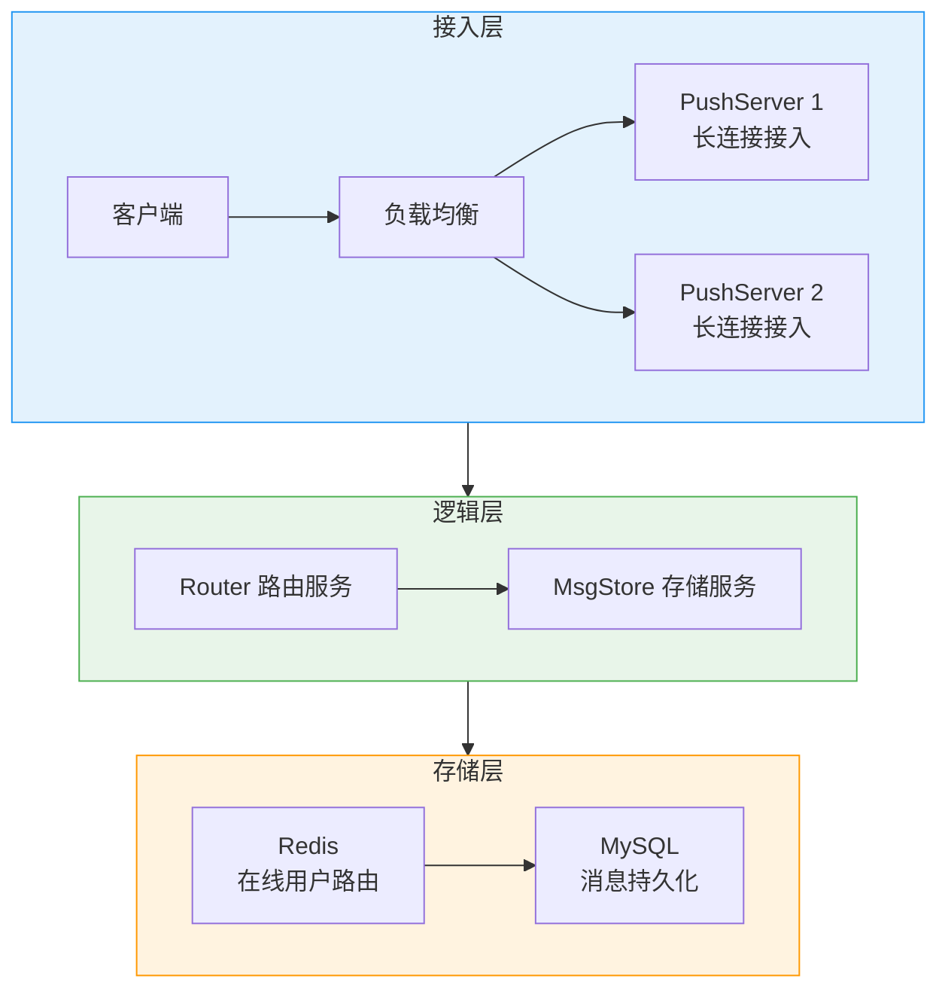
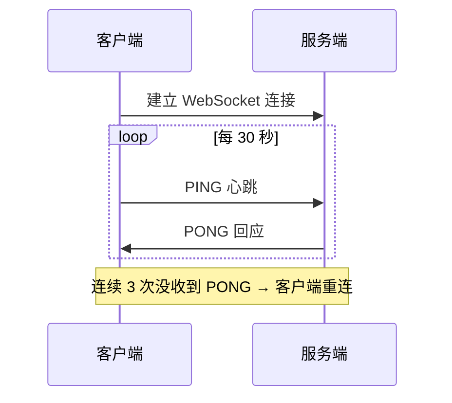
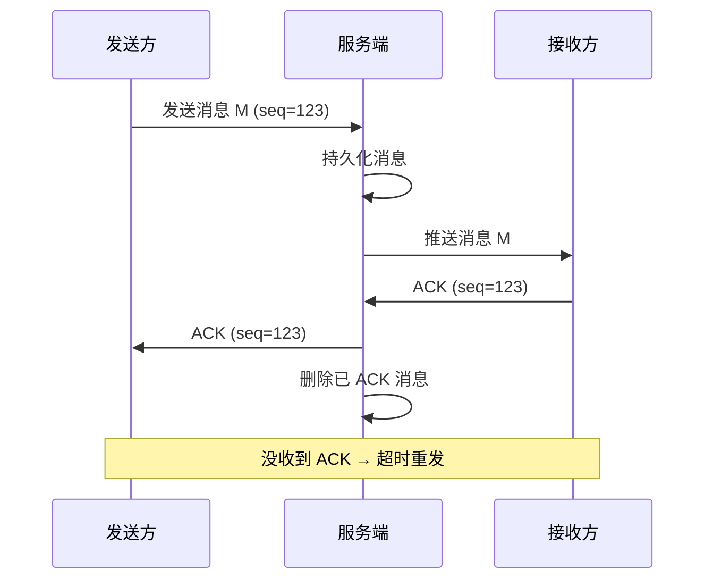
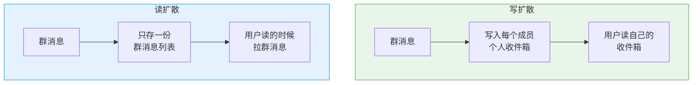

# IM 系统：长连接、可靠投递与群聊扩散

创建日期：2026-06-06

## 需求分析

### 功能需求

- 单聊：用户 A 给用户 B 发消息，实时送达。
- 群聊：多人群组聊天。
- 消息已读 / 未读状态。
- 多端同步：手机、PC 同时在线，消息同步到所有端。
- 离线消息：用户不在线，上线后能拉到。

### 非功能需求

- **实时性**：消息发出后，对方秒级收到。
- **可靠性**：消息不丢、不重、不乱序。
- **并发**：百万级在线用户。
- **可用性**：99.9% 以上。

## 整体架构



## WebSocket 长连接与心跳

### 为什么用长连接？

- 轮询：客户端定期拉，延迟大，大量无效请求，浪费带宽。
- WebSocket：全双工，连接建立后一直保持，服务端可以主动推，延迟低，省带宽。

### 心跳保活

**为什么需要心跳？** 网络中间设备（防火墙、LB）会把长时间不活跃的 TCP 连接断开。

**心跳设计：**



**为什么客户端发心跳？** 服务端如果给每个连接都开定时器，百万连接需要百万定时器，资源消耗大。客户端发，服务端只需回应，节省服务端资源。

## 消息可靠投递

怎么保证消息不丢？



**核心点：**

1. **消息持久化**：服务端收到消息先存，ACK 之前不删。
2. **客户端 ACK**：收到消息回 ACK，服务端删存储。
3. **超时重传**：没收到 ACK，超时重发。
4. **去重**：客户端按消息 ID 去重，避免重复。

**离线消息处理：** 用户不在线，消息存在离线队列（Redis List）。用户上线，拉取所有离线消息，后清空离线队列。

## 已读未读设计

每条消息分配全局递增 seq。每个会话，维护一个最大已读 seq：

- 总消息数 - 已读 seq = 未读数。
- 用户已读，更新自己会话的 `last_read_seq`。
- 多端同步：`last_read_seq` 存在服务端，所有端都能读到。

**未读数计数：** Redis 对每个用户维护未读数 `unread:userId`。新消息来了 incr，已读了清零。客户端拉取首页直接拿到未读数。

## 群聊扩散机制

### 写扩散 vs 读扩散



### 对比分析

| 对比项 | 写扩散 | 读扩散 |
|--------|--------|--------|
| 写入放大 | N 倍（N = 群成员数） | 1 倍 |
| 读延迟 | 低（直接读自己） | 稍高（需要过滤） |
| 空间占用 | 大（存多份） | 小（存一份） |
| 已读未读 | 好做 | 需要记每个用户游标 |
| 适用 | 中小群（几百人以内） | 大群、万人群 |

### 业界实践：推拉结合

- **中小群**：写扩散，发博时推给所有成员，读起来快。
- **大群（万人群）**：读扩散，消息只存一份，成员自己拉。
- 微信等主流 IM 都支持两种模式，自动适配。

## 多端同步

- 每个消息全局唯一递增 seq。
- 每个端记录自己已同步到哪个 seq。
- 上线后拉取比本地 seq 大的消息，同步到本地。
- 不管哪个端发消息，seq 全局递增，所有端都能按顺序同步。
- 已读状态也同步：哪个端读了，更新服务端 `last_read_seq`，其它端看到就标记已读。

## 在线用户路由

用户连接在哪台 PushServer 怎么找？

**Redis 存储用户连接信息：**

```
user:1001 → {server_id: "server-1", conn_id: "xxx"}
```

- A 给 B 发消息，查 Redis 知道 B 连在哪台 Server。
- 直接把消息推给那台 Server，那台 Server 推给 B。
- 如果 B 不在 Redis，说明不在线，存离线消息。

**架构优势：** PushServer 无状态，可以水平扩展。用户多了加机器，Redis 路由表自动更新。

---

## 经典高频面试题

### Q1：IM 为什么要用 WebSocket 长连接？轮询不行吗？

**参考答案：**

轮询是客户端定时拉，延迟大，用户发消息到对方收到要等一个轮询间隔。而且很多轮询是没有消息的，浪费带宽。WebSocket 是全双工，连接建立后一直保持，服务端可以主动推，延迟低，省带宽。所以实时 IM 都用 WebSocket 长连接。

### Q2：心跳机制为什么需要？谁发心跳？为什么？

**参考答案：**

网络中间设备（防火墙、负载均衡）会把长时间不活跃的 TCP 连接断开，所以需要心跳维持连接，检测对方是否在线。

一般**客户端发心跳**，因为服务端如果给每个连接都开定时器，百万连接需要百万定时器，资源消耗大。客户端发，服务端只需要回应，节省服务端资源。

### Q3：怎么保证消息不丢？说一下可靠投递方案。

**参考答案：**

- 消息发送后，服务端先持久化，再推送。
- 接收方必须回 ACK。
- 发送方超时没收到 ACK 就重发。
- 接收方按消息 ID 去重，避免重发导致重复。
- 这样就能保证消息至少送达一次，不丢。

### Q4：群聊的写扩散和读扩散区别？怎么选型？

**参考答案：**

- **写扩散**：发一条给每个群成员都写一份到个人信箱。读的时候直接读自己的，读快。但写放大 N 倍，万人群写一万次，存储浪费。适合几百人以内中小群。
- **读扩散**：消息只存一份，每个人读的时候自己拉，按自己游标读。写一次就好，适合大群万人群，节省存储和写入。
- 选型：中小群写扩散，读起来快，体验好；大群读扩散，省资源。

### Q5：已读未读怎么设计？未读数怎么来的？

**参考答案：**

每条消息分配递增 seq。每个会话每个用户记录 `last_read_seq`。最大 seq 减去 `last_read_seq` 就是未读数。

Redis 可以对每个用户维护未读数计数，incr 新增，decr 已读，拉取很快。多端同步就是把 `last_read_seq` 存在服务端，所有端都能读到，所以状态同步。

### Q6：百万级在线长连接怎么扩展？

**参考答案：**

水平扩展，加 PushServer 机器。每个连接分散到不同机器，Redis 存储用户在哪台机器的路由表。消息路由通过 Redis 找机器，然后推送。每个 PushServer 是无状态的，可以随时加机器扩容。TCP 长连接每个连接占用内存不多，万级连接单机没问题，百万连接需要十几台机器就能扛。