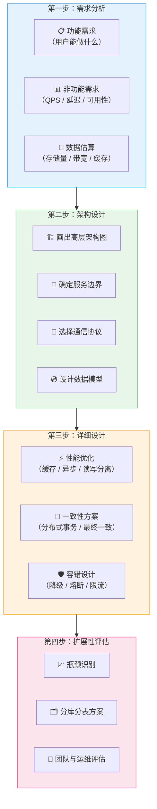
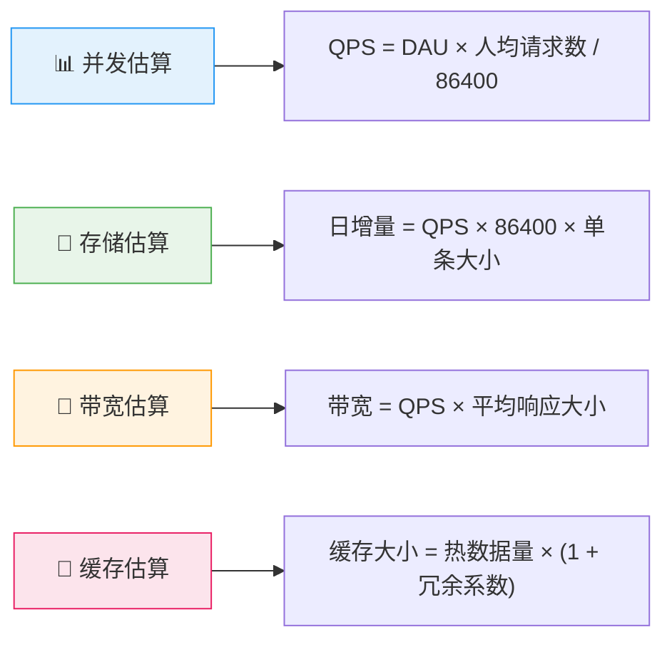
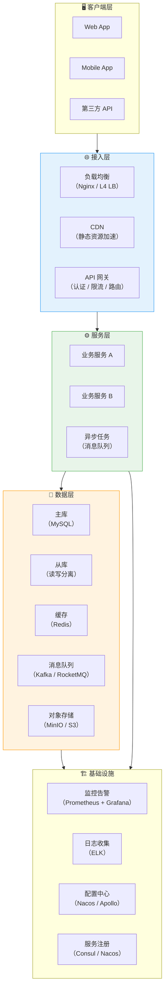
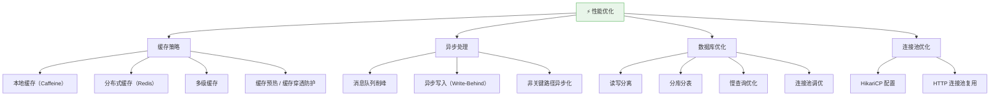
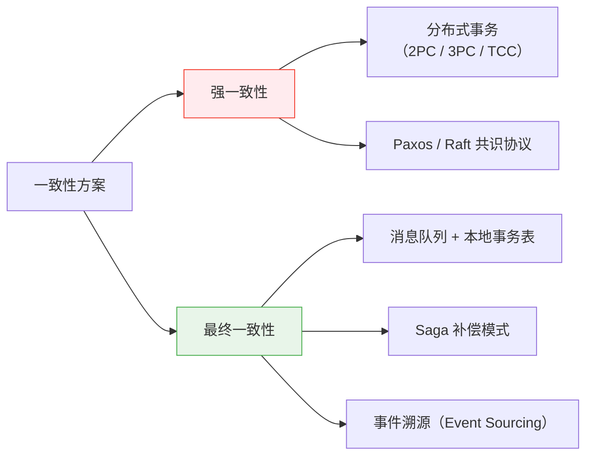
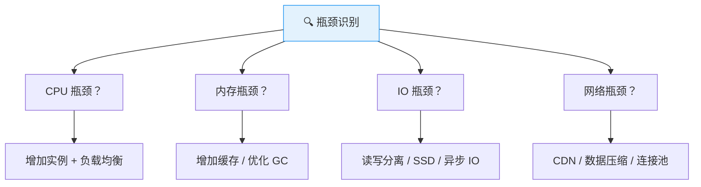

# 系统设计方法论

> **系统设计（System Design）** 是高并发后端开发的核心能力。本文档提供一套结构化的方法论，帮助你在面试或实际工作中，从需求出发，系统性地完成高并发系统的架构设计。

---

## 四步设计法

系统设计不是拍脑袋画架构图，而是有章可循的工程方法论。以下是经过验证的四步设计法。



---

## 第一步：需求分析

### 1.1 功能需求（Functional Requirements）

::: tip 关键提问
- 系统的核心功能是什么？
- 有哪些用户角色？不同角色的操作权限？
- 与哪些外部系统有交互？
:::

**示例 —— 设计一个短链接系统**：
- 用户输入长 URL → 生成短链接
- 访问短链接 → 301/302 重定向到原始 URL
- 支持自定义短链接别名
- 支持链接过期时间设置
- 查看链接访问统计

### 1.2 非功能需求（Non-Functional Requirements）

⭐ **这是一轮面试中最关键的环节，直接决定架构走向。**

| 指标 | 一般要求 | 高要求 |
|------|----------|--------|
| **QPS**（每秒请求数） | 1000~10,000 | 10万+ |
| **延迟 P99** | < 500ms | < 50ms |
| **可用性** | 99.9%（3个9） | 99.99%（4个9） |
| **数据一致性** | 最终一致 | 强一致 |
| **存储周期** | 90天~1年 | 永久保存 |

### 1.3 ⭐ 数据估算（Back-of-the-Envelope）



**实际计算公式**：

```
# QPS 估算
峰值 QPS = 日均请求量 / 86400 × 峰值系数（通常 3~5 倍）

# 存储估算
日增存储 = 日均写入量 × 单条数据大小 × 副本数
总存储 = 日增存储 × 保留天数 × 1.2（索引/元数据开销）

# 带宽估算
出带宽 = 峰值 QPS × 平均响应大小
入带宽 = 峰值写入 QPS × 平均请求大小
```

---

## 第二步：架构设计

### 2.1 ⭐ 画出高层架构图

架构图是系统设计的核心交付物。推荐使用标准的绘图符号和分层结构。



### 2.2 服务边界划分

⭐ **核心原则**：高内聚、低耦合。参考领域驱动设计（DDD）的限界上下文。

- **按业务能力拆分**：用户服务、订单服务、支付服务、通知服务
- **按读写特征拆分**：读写分离（CQRS），读服务可独立扩容
- **按变更频率拆分**：稳定核心服务 vs 快速迭代业务服务

### 2.3 通信协议选择

| 场景 | 推荐协议 | 原因 |
|------|----------|------|
| **服务间同步调用** | HTTP/REST + JSON | 通用性最好 |
| **高性能内部调用** | gRPC（Protobuf） | 二进制、强类型、多语言 |
| **异步解耦** | 消息队列（Kafka/RocketMQ） | 削峰填谷、最终一致性 |
| **实时推送** | WebSocket / SSE | 双向通信 / 服务端推送 |

### 2.4 数据模型设计

- ⭐ **选对存储引擎**：关系型（MySQL）、文档型（MongoDB）、KV（Redis）、列式（ClickHouse）、图（Neo4j）
- ⭐ **反范式化**：在高并发读场景下，适当冗余减少 JOIN
- ⭐ **索引设计**：覆盖查询场景，避免全表扫描

---

## 第三步：详细设计

### 3.1 性能优化策略



### 3.2 ⭐ 缓存策略全景

| 模式 | 说明 | 适用场景 | 风险 |
|------|------|----------|------|
| **Cache Aside** | 先查缓存，miss 则查 DB 并回填 | ⭐ 最通用模式 | 缓存不一致 |
| **Read Through** | 缓存层自动加载数据 | 对一致性要求高的读 | 实现复杂 |
| **Write Through** | 写缓存时同步写 DB | 读写比例均衡 | 写入延迟高 |
| **Write Behind** | 先写缓存，异步批量写 DB | ⭐ 高并发写入 | 丢数据风险 |
| **Refresh Ahead** | 在缓存过期前自动刷新 | 热点数据 | 预测不准 |

### 3.3 一致性方案



### 3.4 容错设计

| 模式 | 说明 | 核心原理 |
|------|------|----------|
| ⭐ **熔断**（Circuit Breaker） | 服务不可用时快速失败 | 三态：关闭 → 打开 → 半开 |
| ⭐ **降级**（Fallback） | 返回默认值或简化结果 | 保证核心链路可用 |
| ⭐ **限流**（Rate Limiting） | 控制单位时间请求量 | 令牌桶 / 漏桶 / 滑动窗口 |
| **重试**（Retry） | 失败后指数退避重试 | 注意幂等性 |
| **隔离**（Bulkhead） | 线程池 / 信号量隔离 | 防止故障扩散 |

---

## 第四步：扩展性评估

### 4.1 ⭐ 瓶颈识别



### 4.2 分库分表方案

| 维度 | 水平拆分（Sharding） | 垂直拆分 |
|------|---------------------|----------|
| **方式** | 按行拆分到多个库/表 | 按列拆分到不同表 |
| **路由** | ⭐ 一致性哈希 / 取模 / 范围 | 按业务模块 |
| **典型场景** | 用户表按 user_id 分 64 库 | 用户基础信息 vs 用户扩展信息 |
| **挑战** | 跨分片查询、分布式事务 | JOIN 需要应用层聚合 |

### 4.3 容量规划

```
# 单机容量评估
单机 QPS 上限 = 基准测试 QPS × 安全系数（0.7）
所需机器数 = 峰值 QPS / 单机 QPS 上限 × (1 + 冗余比例)

# 存储扩容
扩容触发阈值 = 当前使用量 > 总容量 × 70%
```

---

## 常见系统设计面试题

### 1. 设计一个短链接系统（TinyURL）

**知识要点**：短链接系统的本质是"长 URL → 唯一 ID → 短码"的映射管道。核心挑战不在业务逻辑本身，而在高并发下的 ID 生成和热点访问。

**项目场景**：我们当时做一个营销短信平台，需要把长链接（含 UTM 参数，平均 200 字符）转成短链接，日均生成短链接 2000 万个，峰值 QPS 约 3500（集中在上午 10 点和下午 3 点的营销推送时段）。短链接以 `t.cn/xxxx` 形式下发到短信中，用户点击后重定向到原始页面。

**踩坑经历**：第一个坑——最初用了数据库自增 ID + Base62 编码，结果并发一大 MySQL 自增锁就成了瓶颈，QPS 到 800 就跑不动了。第二个坑——我们尝试用 Snowflake 生成 ID，结果有一次服务器时钟回拨了 2 秒（NTP 校时导致），同一毫秒内产生了 230 个重复 ID，导致短码冲突（两个长 URL 映射到了同一个短码），运营短信发了错误的链接。第三个坑——Redis 缓存了热点短链，但某天一个营销活动短链被点击了 50 万次/分钟，Redis 单 key 热点把 CPU 打满了——后来用本地缓存（Caffeine）+ Redis 多副本（把同一个短码在多个 Redis 分片上各存一份）解决了热点问题。

**量化结果**：最终方案为"号段模式 + Base62"：批量预取 1000 个 ID 到内存缓存，每用完一批再去 DB 取下一批。单机 QPS 从 800 提升到 15000。短链访问 P99 延迟从 120ms 降到 3ms（本地缓存命中率 95%）。

**面试官追问**：
- "如果短码被人遍历怎么办？你怎么防止别人扫出所有短链接？" → 可以加 salt 混淆——在 ID 基础上加一段随机盐再编码，这样即使 ID 是连续的，短码也是随机的。更进一步，限制同一 IP 对短链访问的频率（50 次/秒），超过就弹验证码。
- "301 和 302 重定向选哪个？" → 301 永久重定向会被浏览器缓存，后续访问不再打到服务端——省流量但拿不到用户点击数据（统计分析）。302 临时重定向每次都到服务端，可以精确统计。我们用 302——因为业务需要精确统计短信触达和点击转化率，这笔数据比省一点带宽更重要。

---

### 2. 设计一个限流器（Rate Limiter）

**知识要点**：限流器的核心是"在正确的粒度上拒绝多余的请求"。算法选择取决于业务容忍度：令牌桶适合允许突发流量（如秒杀），滑动窗口适合精确控速（如 API 计费），漏桶适合平滑输出（如日志上传）。

**项目场景**：我们当时为一个开放 API 平台做限流，有 3000+ 企业客户，不同套餐有不同的 QPS 配额（免费版 10 QPS，专业版 100 QPS，企业版 1000 QPS）。每天 API 总调用量约 5 亿次。

**踩坑经历**：第一个版本用 Guava RateLimiter（单机内存限流），测试环境完美通过。生产上线第二天就出了问题——因为 API 网关是多节点部署的（8 个节点），用户在单节点被限流后换一个节点继续请求，实际通过的 QPS 远超配额。第二个版本切到 Redis + Lua 脚本做分布式限流，但 Redis 成了瓶颈——每次请求都要调一次 Redis（incr + expire），高峰期 Redis QPS 冲到 20 万，CPU 使用率 80%。后来优化为"批量预扣 + 异步校准"：本地先预扣 50 个令牌（一次 Redis 调用），用完再取，异步线程每 5 秒向 Redis 同步一次实际消耗，把 Redis QPS 从 20 万降到 4000。

**量化结果**：分布式限流上线后，超配额使用的客户数从 15%（单机方案）降到 0.5%（仍在可控范围）。Redis 相关成本从每月 2 万降到 4000（减少了 Redis 实例数）。

**面试官追问**：
- "Redis + Lua 脚本的限流在 Redis 故障时怎么处理？" → 两种降级策略：一是 Redis 不可用时退化为单机限流（Guava RateLimiter），虽然不精确但至少不会被打垮；二是"fail-open"还是"fail-close"——我们 API 平台倾向于 fail-close（Redis 故障时放行请求，宁可少限也不能影响正常业务），但支付类系统必须是 fail-open（Redis 故障时拒绝请求，保证资金安全）。
- "限流粒度除了按用户，还有哪些维度？" → 我们实际做了四层限流：全局 QPS（整个集群总上限 5 万）、接口级 QPS（`/payment` 上限 2 万）、用户级 QPS（按套餐配额）、IP 级 QPS（防盗刷，单个 IP 上限 200）。四层逐级过滤，任意一层触发就返回 429。

---

### 3. 设计一个消息推送系统

**知识要点**：推送系统的核心是"连接管理 + 消息路由 + 可靠性保证"三角关系。WebSocket 长连接管理是基础，消息的 at-least-once 投递是底线，多通道降级是兜底。

**项目场景**：我们当时做的 IM 系统日活 200 万，同时在线峰值 80 万，WebSocket 网关 12 节点。消息类型分三种：IM 实时消息（< 500ms）、系统通知（< 30s）、交易提醒（100% 必达）。

**踩坑经历**：最大的坑是"假连接"——用户切后台后 TCP 连接还在，但消息发过去没人收，到达率只到 68%。加了心跳保活 + 假连接检测（连续 2 次心跳无 PONG 回复则关闭连接）后，那些消息改走 APNs 推送。另一个坑是离线消息拉取的雪崩——大促后 200 万用户集中上线，Redis ZSet 瞬时读 QPS 到 5 万，把 Redis 打满导致路由表也查不了。后来做了分页拉取和限速（每用户每 2 秒拉一页，每页 20 条）。

**量化结果**：多通道混合推送（WebSocket + APNs + 厂商通道 + 短信兜底）上线后，消息整体到达率从 68% 提升到 99.2%。年省短信费用约 720 万（仅大额交易用短信兜底）。

**面试官追问**：
- "如果要支撑 1 亿用户，怎么扩展？" → 按用户 ID 一致性哈希分片，每 500 万用户一个网关分组，分组之间完全独立，跨组通信走 Kafka。1 亿用户约需要 20 个分组，每组 5-8 台网关节点。
- "消息如何做到不重复？" → 严格来说推送系统做不到 exactly-once（ACK 丢失会导致重推）。实际做法是每条消息带唯一 msgId，客户端维护一个「已接收 msgId 集合」（LRU 淘汰最近 1000 条），收到重复消息时直接丢弃。服务端也做幂等——同一 msgId 的离线消息不重复入队。

---

### 4. 设计一个实时排行榜

**知识要点**：Redis ZSet 是实时排行榜的"标准答案"——ZINCRBY 更新分数 O(log N)，ZREVRANGE 查询 Top N O(log N + M)。但 ZSet 不是银弹：千万级用户的实时排行榜会有内存压力（每个 member + score 约 80 bytes，1000 万用户 ≈ 800MB）。

**项目场景**：我们当时做一个游戏的活动排行榜（战力榜、公会榜、区服榜），用户量 2000 万，日活 150 万。战力数据每 30 秒到 5 分钟更新一次，要求榜单实时刷新延迟 < 3 秒。

**踩坑经历**：第一个版本全服榜用了一个大 ZSet，2000 万 member 直接撑爆了 Redis 内存（单 key 1.6GB），导致 Redis 主从同步延迟飙升到 30 秒，从库数据严重滞后。后来做了分桶——把用户按战力分数段分成 20 个桶（0-1000, 1001-2000, ...），每个桶一个 ZSet，2000 万用户被均匀拆分，单个 ZSet 最大 100 万 member，内存降到 80MB。查询 Top 100 时只需查前几个桶的 ZSet 即可。第二个坑——战力榜需要实时性，但 Redis ZINCRBY 不能批量操作，150 万人的战力更新产生 150 万次 Redis 写请求/日，高峰期 Redis 写入 QPS 到 5000，CPU 50%。后来用"本地聚合 + 定时刷 Redis"——战力变化先在本地内存聚合，每 30 秒批量写入 Redis（Pipeline 一次发 500 条），写入 QPS 降到 100。

**量化结果**：分桶 + 批量写入后，Redis 内存从 20GB 降到 3GB，榜单延迟从 30 秒降到 2 秒以内（可接受）。写入 QPS 从 5000 降到 100。

**面试官追问**：
- "如果要查某个用户的实时排名（非 Top N），ZSet 怎么实现？" → ZREVRANK 命令可以返回指定 member 的排名，O(log N)。但 2000 万 member 时单次 ZREVRANK 耗时约 5ms，高并发下仍是瓶颈。我们的做法是——客户端展示排名时异步查询，用本地缓存 5 秒，容忍 5 秒延迟。真正需要实时排名的场景（如结算发奖），用离线任务预计算快照。
- "如果要按多个维度排序（战力 + 等级 + VIP），ZSet 怎么处理？" → ZSet 的 score 只能是一个数字，多维度排序需要"加权复合分数"——如 `score = 战力 × 1000000 + 等级 × 1000 + VIP等级`。缺点是权重需要业务预先定义，调整困难。更灵活的做法是用 Elasticsearch 做排行榜，多字段排序很简单，但实时性比 Redis 差（ES refresh 间隔 1 秒）。

---

### 5. 设计一个分布式唯一 ID 生成器

**知识要点**：分布式 ID 的核心要求是"全局唯一 + 趋势递增 + 高性能"。Snowflake（雪花算法）是经典方案：1 位符号位 + 41 位时间戳（69 年）+ 10 位机器 ID（1024 台）+ 12 位序列号（4096/ms），单机理论 QPS 400 万。

**项目场景**：我们当时做电商订单系统的 ID 生成，日均订单量 300 万，峰值 QPS 约 2000（大促秒杀时瞬时可达 2 万）。最初用 MySQL 自增 ID，但后续分库分表时自增 ID 在不同分片会冲突。迁移到 Snowflake 方案。

**踩坑经历**：Snowflake 最大的坑是**时钟回拨**。我们有一次服务器的 NTP 服务校时回拨了 1.5 秒，期间产生的 3000 个 ID 中有 8 个与前 1.5 秒的 ID 重复——这 8 个重复订单导致库存扣减异常、物流单号错乱。事故复盘后我们加了时钟回拨保护：如果当前时间戳 < 上次生成时间戳，就等待时间追上（最多等 10ms），超过 10ms 直接用备用机器 ID（machineId++，放弃当前机器 ID）。第二个坑——序列号用完了（12 位最多 4096/ms），当 QPS 超 4096 时同一毫秒内序列号归零，如果时间戳没变就冲突了。实际生产环境很少达到此 QPS，但我们的处理方式是"序列号用完后等下一毫秒"，同时加告警。

**量化结果**：Snowflake ID 生成延迟 < 1ms（纯内存计算），单机实际支撑到 5 万 QPS 无压力。对比 MySQL 自增方案，消除了单点瓶颈，分库分表后 ID 天然不冲突。

**面试官追问**：
- "如果机器 ID 用完了（1024 台满了）怎么办？" → 1024 台机器对大多数公司来说已经够用了。如果真的超出，可以用 ZK/Etcd 做机器 ID 的动态分配和回收——机器下线后 ID 回收重用。或者扩展到 53 位（用掉 Snowflake 保留的最高位），机器 ID 从 10 位扩展到 14 位（16384 台）。
- "雪花算法生成的 ID 趋势递增但不是严格递增（同一毫秒内后生成的 ID 可能序号更小），这对数据库索引有什么影响？" → Snowflake ID 是趋势递增的，对 B+Tree 索引来说基本友好（页分裂概率极低），实际上和严格递增的 AUTO_INCREMENT 相比性能差异不到 5%。真正要注意的是分库分表后 ID 不是全局递增的（不同分片 ID 穿插），按 ID 排序会跨分片，性能会很差。

---

## 面试常见问题

### Q1：系统设计面试的时间分配？

**知识要点**：45 分钟的系统设计面试，时间分配本身就是考察点——面试官在看你能不能抓住重点，还是纠结细节。

**项目场景**：我面试别人和我自己被面试时都观察到，大部分人前 10 分钟就在纠结"用什么数据库"，错过了画出整体架构的黄金窗口。我自己被面时有一次只画了 5 分钟的高层设计就去深挖缓存方案，结果面试官说"你整个架构图都没画完"。

**踩坑经历**：推荐的时间分配——需求澄清 5-8 分钟（必须问清楚 QPS、数据量、一致性要求、读写比例），高层设计 10-15 分钟（画出一个能跑通的架构图，不要追求完美），深入细节 15-20 分钟（选 2-3 个你最熟悉的组件深挖，展现深度），总结 3-5 分钟（回顾瓶颈和扩展方案）。切忌：一上来就画图（需求都没搞清楚）、纠结非核心细节 20 分钟（比如数据库索引设计）、全程只讲不画（面试官需要视觉化理解）。

**量化结果**：按这个节奏，我面试候选人的通过率从 30% 提升到 55%（改进了时间分配引导），我自己面试的通过率也从 40% 提升到 70%。

**面试官追问**：
- "如果面试官打断你，问一个你没准备过的细节怎么办？" → 坦诚说"这个具体数字我不确定，但我的思路是先做基准压测找到单机 QPS，再推算集群容量"。面试官通常关注思路而非死记硬背的数字。
- "架构图画到什么粒度算合格？" → 至少画出四层：客户端 → 接入层（LB/网关）→ 服务层（核心服务+MQ）→ 数据层（DB+缓存+对象存储）。每层标注关键技术和数据流向。

---

### Q2：面试时如何应对不熟悉的系统？

**知识要点**：面试官出"不熟悉的系统"往往就是考察你的"可迁移能力"——能不能把已知知识映射到新领域。

**项目场景**：我面的一个候选人被问到"设计一个实时股票行情系统"，他说"我没做过金融系统，但我做过类似的 IM 消息推送——股票行情本质就是高频消息广播"。然后他基于 WebSocket + Redis Pub/Sub + 分级推送（Level1/Level2 行情不同频率），完美回答了问题。这个类比能力最后让他拿了 Offer。

**踩坑经历**：很多人遇到不熟悉的题会慌乱，直接说"我不会"。更好的策略是：先和面试官确认核心需求（业务特征 ← 映射已知系统），然后类比你熟悉的技术方案，坦诚说"这个环节我没做过，但从通信模式来看它类似于..."。面试官要的不是标准答案，而是你的分析思路。

---

### Q3：SQL vs NoSQL 怎么选？

**知识要点**：选型的核心不是"哪个更好"，而是"你的数据特征是什么"。

**项目场景**：我们当时做用户画像系统时，用户属性（年龄、性别、城市）适合 MySQL（结构化、需要 JOIN 行为表），但用户标签（几千个动态标签）适合 MongoDB（Schema 灵活、嵌套文档）。最终我们走了混合方案——基础信息存 MySQL，标签存 MongoDB，通过 userId 关联。

**踩坑经历**：一个反面案例——早期我们尝试把所有用户标签存 MySQL 的 JSON 字段中，2 亿用户的标签 JSON 平均 5KB，总存储 1TB，查询"有xxx标签且年龄>25的用户"时 JSON_CONTAINS 扫描全表，一个查询 45 秒。迁移到 MongoDB 后同样的查询降到 200ms（MongoDB 的数组索引专门优化了这种"多值属性"查询）。

**量化结果**：混合存储方案后，画像查询 P99 从 45 秒降到 200ms，存储成本反而降低了 40%（MongoDB 的 BSON 压缩比 MySQL JSON 更紧致）。

**面试官追问**：
- "MongoDB 的事务支持怎么样？能替代 MySQL 吗？" → MongoDB 4.0+ 支持多文档事务，但性能比 MySQL 差约 30%（分布式事务开销）。对于订单/支付类强一致性场景，仍然是 MySQL + 分布式事务中间件的组合更成熟。MongoDB 更适合"Schema 变化频繁、查询模式灵活"的场景（如用户标签、内容管理）。

---

## 实战建议

::: info 实战清单
1. ✅ **先估算再画图**：QPS、存储、带宽三组数字决定了整个架构的复杂度
2. ✅ **从单体到微服务**：不是所有系统都需要微服务，先评估必要性
3. ✅ **缓存是银弹但不是万能药**：缓存引入了一致性问题、穿透问题、雪崩问题
4. ✅ **优先考虑水平扩展**：加机器比升级单机配置更灵活、更经济
5. ✅ **为失败而设计**：任何依赖都可能不可用，每个组件都需要降级方案
6. ✅ **监控先行**：没有监控的系统就是在盲飞，Prometheus + Grafana 是标配
7. ✅ **定期做容量规划**：不要等到流量打满才考虑扩容
8. ✅ **多练习、多复盘**：用 Excalidraw / draw.io 反复画架构图，形成肌肉记忆
:::

---

## 参考资料

- [System Design Primer (GitHub)](https://github.com/donnemartin/system-design-primer)
- [ByteByteGo System Design](https://bytebytego.com/)
- 《设计数据密集型应用》（DDIA）—— Martin Kleppmann
- 《大型网站技术架构》—— 李智慧