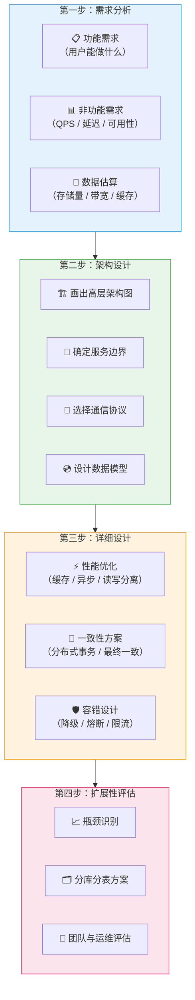
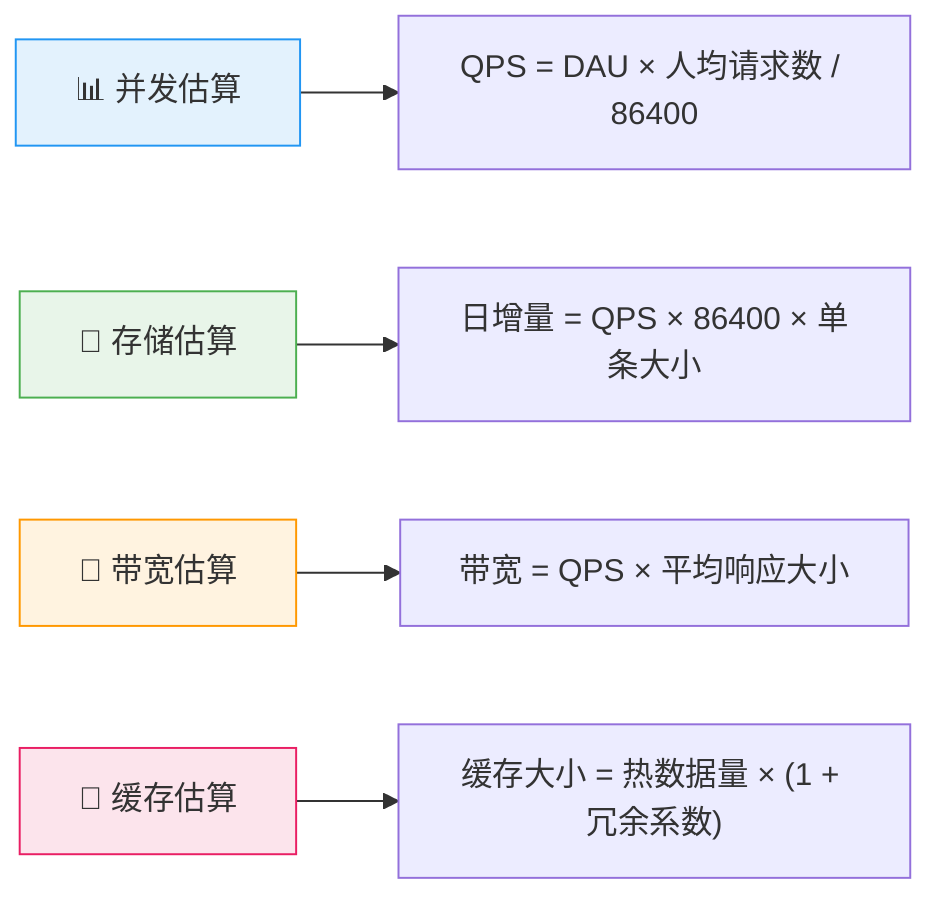
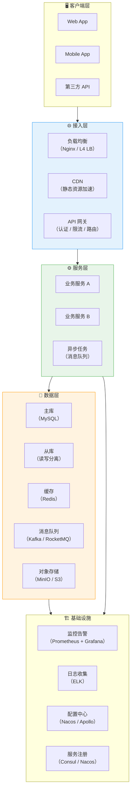
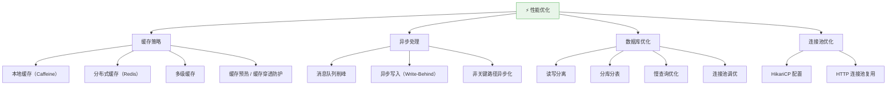
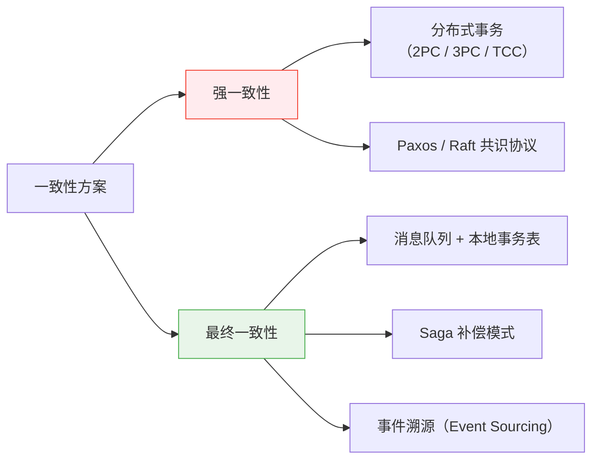
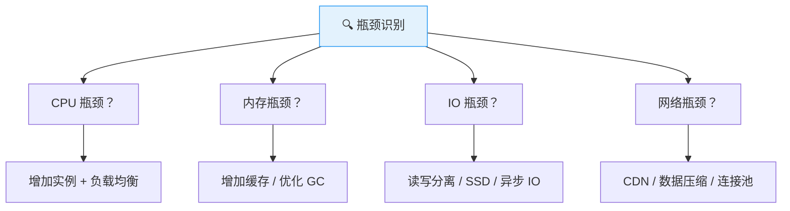
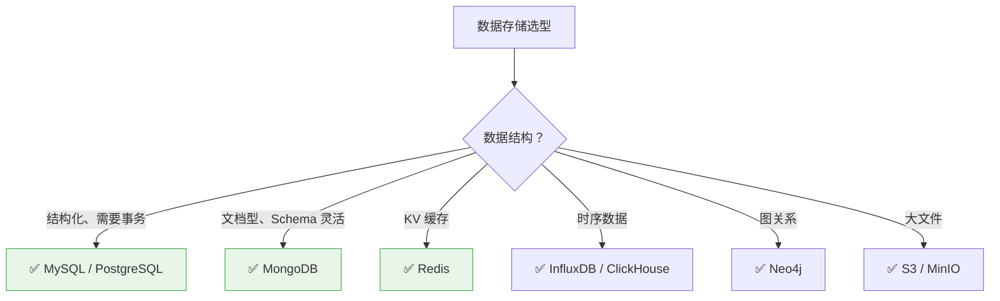

# 系统设计方法论

> **系统设计（System Design）** 是高并发后端开发的核心能力。本文档提供一套结构化的方法论，帮助你在面试或实际工作中，从需求出发，系统性地完成高并发系统的架构设计。

---

## 四步设计法

系统设计不是拍脑袋画架构图，而是有章可循的工程方法论。以下是经过验证的四步设计法。



---

## 第一步：需求分析

### 1.1 功能需求（Functional Requirements）

::: tip 关键提问
- 系统的核心功能是什么？
- 有哪些用户角色？不同角色的操作权限？
- 与哪些外部系统有交互？
:::

**示例 —— 设计一个短链接系统**：
- 用户输入长 URL → 生成短链接
- 访问短链接 → 301/302 重定向到原始 URL
- 支持自定义短链接别名
- 支持链接过期时间设置
- 查看链接访问统计

### 1.2 非功能需求（Non-Functional Requirements）

⭐ **这是一轮面试中最关键的环节，直接决定架构走向。**

| 指标 | 一般要求 | 高要求 |
|------|----------|--------|
| **QPS**（每秒请求数） | 1000~10,000 | 10万+ |
| **延迟 P99** | < 500ms | < 50ms |
| **可用性** | 99.9%（3个9） | 99.99%（4个9） |
| **数据一致性** | 最终一致 | 强一致 |
| **存储周期** | 90天~1年 | 永久保存 |

### 1.3 ⭐ 数据估算（Back-of-the-Envelope）



**实际计算公式**：

```
# QPS 估算
峰值 QPS = 日均请求量 / 86400 × 峰值系数（通常 3~5 倍）

# 存储估算
日增存储 = 日均写入量 × 单条数据大小 × 副本数
总存储 = 日增存储 × 保留天数 × 1.2（索引/元数据开销）

# 带宽估算
出带宽 = 峰值 QPS × 平均响应大小
入带宽 = 峰值写入 QPS × 平均请求大小
```

---

## 第二步：架构设计

### 2.1 ⭐ 画出高层架构图

架构图是系统设计的核心交付物。推荐使用标准的绘图符号和分层结构。



### 2.2 服务边界划分

⭐ **核心原则**：高内聚、低耦合。参考领域驱动设计（DDD）的限界上下文。

- **按业务能力拆分**：用户服务、订单服务、支付服务、通知服务
- **按读写特征拆分**：读写分离（CQRS），读服务可独立扩容
- **按变更频率拆分**：稳定核心服务 vs 快速迭代业务服务

### 2.3 通信协议选择

| 场景 | 推荐协议 | 原因 |
|------|----------|------|
| **服务间同步调用** | HTTP/REST + JSON | 通用性最好 |
| **高性能内部调用** | gRPC（Protobuf） | 二进制、强类型、多语言 |
| **异步解耦** | 消息队列（Kafka/RocketMQ） | 削峰填谷、最终一致性 |
| **实时推送** | WebSocket / SSE | 双向通信 / 服务端推送 |

### 2.4 数据模型设计

- ⭐ **选对存储引擎**：关系型（MySQL）、文档型（MongoDB）、KV（Redis）、列式（ClickHouse）、图（Neo4j）
- ⭐ **反范式化**：在高并发读场景下，适当冗余减少 JOIN
- ⭐ **索引设计**：覆盖查询场景，避免全表扫描

---

## 第三步：详细设计

### 3.1 性能优化策略



### 3.2 ⭐ 缓存策略全景

| 模式 | 说明 | 适用场景 | 风险 |
|------|------|----------|------|
| **Cache Aside** | 先查缓存，miss 则查 DB 并回填 | ⭐ 最通用模式 | 缓存不一致 |
| **Read Through** | 缓存层自动加载数据 | 对一致性要求高的读 | 实现复杂 |
| **Write Through** | 写缓存时同步写 DB | 读写比例均衡 | 写入延迟高 |
| **Write Behind** | 先写缓存，异步批量写 DB | ⭐ 高并发写入 | 丢数据风险 |
| **Refresh Ahead** | 在缓存过期前自动刷新 | 热点数据 | 预测不准 |

### 3.3 一致性方案



### 3.4 容错设计

| 模式 | 说明 | 核心原理 |
|------|------|----------|
| ⭐ **熔断**（Circuit Breaker） | 服务不可用时快速失败 | 三态：关闭 → 打开 → 半开 |
| ⭐ **降级**（Fallback） | 返回默认值或简化结果 | 保证核心链路可用 |
| ⭐ **限流**（Rate Limiting） | 控制单位时间请求量 | 令牌桶 / 漏桶 / 滑动窗口 |
| **重试**（Retry） | 失败后指数退避重试 | 注意幂等性 |
| **隔离**（Bulkhead） | 线程池 / 信号量隔离 | 防止故障扩散 |

---

## 第四步：扩展性评估

### 4.1 ⭐ 瓶颈识别



### 4.2 分库分表方案

| 维度 | 水平拆分（Sharding） | 垂直拆分 |
|------|---------------------|----------|
| **方式** | 按行拆分到多个库/表 | 按列拆分到不同表 |
| **路由** | ⭐ 一致性哈希 / 取模 / 范围 | 按业务模块 |
| **典型场景** | 用户表按 user_id 分 64 库 | 用户基础信息 vs 用户扩展信息 |
| **挑战** | 跨分片查询、分布式事务 | JOIN 需要应用层聚合 |

### 4.3 容量规划

```
# 单机容量评估
单机 QPS 上限 = 基准测试 QPS × 安全系数（0.7）
所需机器数 = 峰值 QPS / 单机 QPS 上限 × (1 + 冗余比例)

# 存储扩容
扩容触发阈值 = 当前使用量 > 总容量 × 70%
```

---

## 常见系统设计面试题

### 1. 设计一个短链接系统（TinyURL）

::: details 设计要点
- ⭐ **ID 生成**：分布式 ID 生成器（Snowflake / 号段模式）
- ⭐ **短码生成**：Base62 编码 或 预生成短码池
- **重定向**：301（永久）vs 302（临时），301 会被浏览器缓存
- **缓存**：热点短链接缓存在 Redis 中
- **分库分表**：按短码哈希分片
- **QPS 估算**：假设 DAU 1 亿，人均 1 次，峰值 QPS ≈ 1亿/86400 × 5 ≈ 6000
:::

### 2. 设计一个限流器（Rate Limiter）

::: details 设计要点
- ⭐ **算法选择**：令牌桶（允许突发流量）vs 滑动窗口（精确）vs 漏桶（平滑）
- **单机实现**：Guava RateLimiter / Semaphore
- **分布式实现**：Redis + Lua 脚本（原子操作）
- **存储**：Redis（key = user_id, value = 计数 + 时间窗口）
- **返回**：429 Too Many Requests + Retry-After 头
:::

### 3. 设计一个消息推送系统

::: details 设计要点
- ⭐ **连接管理**：WebSocket 长连接，心跳保活
- ⭐ **推送流程**：业务服务 → 消息队列 → 推送服务 → 用户设备
- **在线判断**：Redis 存储用户连接状态
- **离线消息**：推送到消息队列暂存，用户上线后拉取
- **扩展性**：推送服务无状态，按用户 ID 一致性哈希路由
- **QPS 估算**：1 亿用户在线，160W QPS（以推特峰值经验推算）
:::

### 4. 设计一个实时排行榜

::: details 设计要点
- ⭐ **数据结构**：Redis Sorted Set（ZSet），O(log N) 更新和查询
- **实时更新**：ZINCRBY 增加分数
- **Top N 查询**：ZREVRANGE 0 N-1 WITHSCORES
- **分段排行榜**：全服榜 + 好友榜 + 区服榜
- **历史榜单**：定时快照 → MySQL 归档
- **数据量大时**：分桶 + 近似排名（Redis 的 ZSet 可支撑千万级）
:::

### 5. 设计一个分布式唯一 ID 生成器

::: details 设计要点
- ⭐ **雪花算法（Snowflake）**：时间戳（41bit）+ 机器 ID（10bit）+ 序列号（12bit）
- ⭐ **号段模式**：批量预取 ID 段，减少 DB 访问
- **数据库自增**：单点瓶颈，适合小规模
- **UUID**：无序，不利于索引
- **时钟回拨处理**：等待 / 拒绝服务 / 备用机器 ID
:::

---

## 面试常见问题

### Q1：系统设计面试的时间分配？

⭐ 建议按以下比例分配 45 分钟面试：

| 阶段 | 时间 | 重点 |
|------|------|------|
| 需求澄清 | 5~8 分钟 | 问清楚 QPS、数据量、一致性要求 |
| 高层设计 | 10~15 分钟 | 画出核心架构图 |
| 深入细节 | 15~20 分钟 | 聚焦 2~3 个关键组件深挖 |
| 总结收尾 | 3~5 分钟 | 回顾瓶颈、扩展方案 |

### Q2：面试时如何应对不熟悉的系统？

1. ⭐ **先问清楚需求**：把问题框定在自己理解的范围内
2. **类比已知系统**：推特就是大号微博，短链接就是哈希映射
3. **先搭框架再细化**：不要一上来就纠结于某个细节
4. **坦诚交流**：可以说"这个细节我不熟悉，但我的思路是..."

### Q3：SQL vs NoSQL 怎么选？



---

## 实战建议

::: info 实战清单
1. ✅ **先估算再画图**：QPS、存储、带宽三组数字决定了整个架构的复杂度
2. ✅ **从单体到微服务**：不是所有系统都需要微服务，先评估必要性
3. ✅ **缓存是银弹但不是万能药**：缓存引入了一致性问题、穿透问题、雪崩问题
4. ✅ **优先考虑水平扩展**：加机器比升级单机配置更灵活、更经济
5. ✅ **为失败而设计**：任何依赖都可能不可用，每个组件都需要降级方案
6. ✅ **监控先行**：没有监控的系统就是在盲飞，Prometheus + Grafana 是标配
7. ✅ **定期做容量规划**：不要等到流量打满才考虑扩容
8. ✅ **多练习、多复盘**：用 Excalidraw / draw.io 反复画架构图，形成肌肉记忆
:::

---

## 参考资料

- [System Design Primer (GitHub)](https://github.com/donnemartin/system-design-primer)
- [ByteByteGo System Design](https://bytebytego.com/)
- 《设计数据密集型应用》（DDIA）—— Martin Kleppmann
- 《大型网站技术架构》—— 李智慧