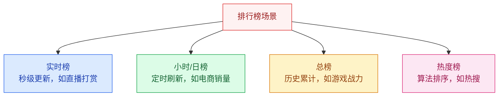
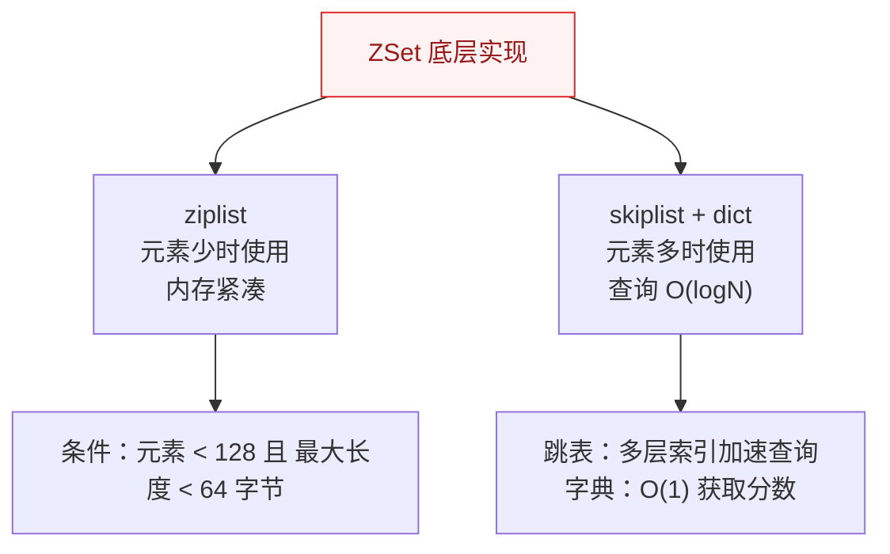
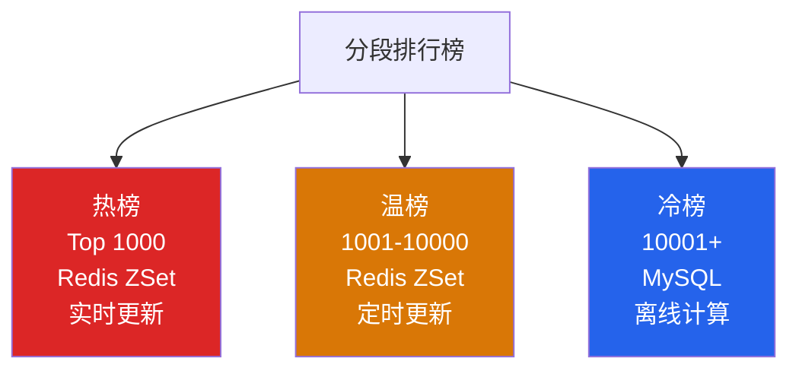
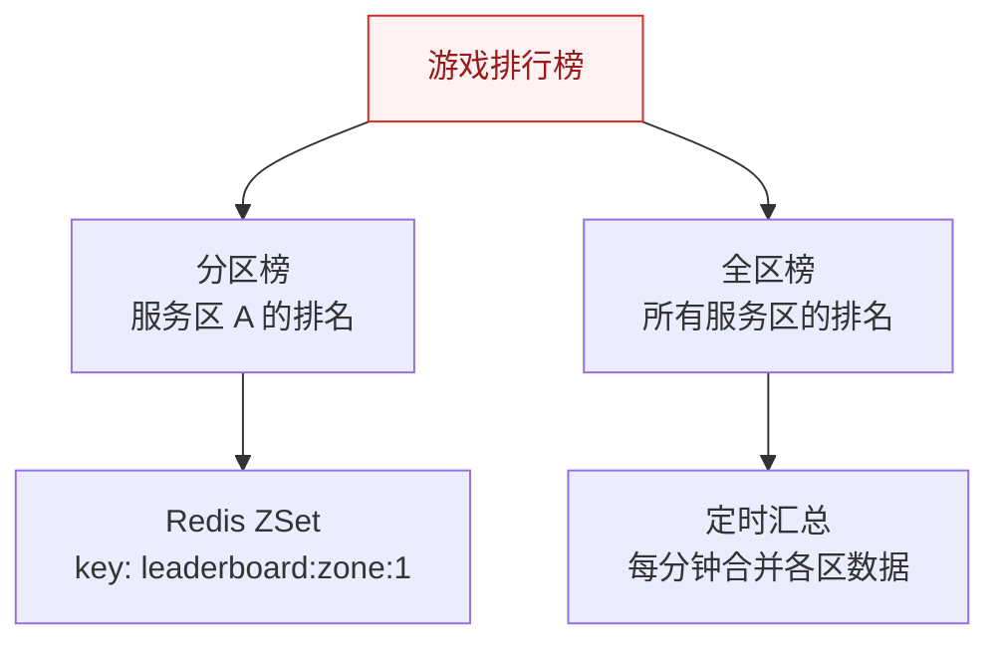

# 排行榜系统设计

## 概述

排行榜是互联网产品中最常见的功能之一：游戏战力榜、直播打赏榜、电商销量榜、社交媒体热榜。看似简单的"排名"背后，隐藏着实时性、海量数据、高并发写入等挑战。

::: tip 核心思路
排行榜设计的核心是**数据结构的选择**：不同场景（实时/历史、全量/分段）需要不同的存储方案。
:::

## 一、排行榜场景分类



| 类型 | 更新频率 | 数据量 | 典型方案 |
|------|----------|--------|----------|
| 实时榜 | 秒级 | 万级 | Redis ZSet |
| 小时/日榜 | 定时 | 十万级 | Redis ZSet + 定时归档 MySQL |
| 总榜 | 实时 | 百万级+ | 分段排行榜 |
| 热度榜 | 定时 | 十万级 | 定时计算 + 热度算法 |

## 二、Redis ZSet 实现

### 2.1 核心命令

```bash
# 更新分数（如果用户存在则更新，不存在则新增）
ZADD leaderboard 100 user:1

# 增加分数（原子操作）
ZINCRBY leaderboard 10 user:1

# 查询 Top 10
ZREVRANGE leaderboard 0 9 WITHSCORES

# 查询用户排名（从 0 开始）
ZREVRANK leaderboard user:1

# 查询用户分数
ZSCORE leaderboard user:1

# 查询分数范围内的用户
ZREVRANGEBYSCORE leaderboard 100 50 WITHSCORES
```

### 2.2 ZSet 底层数据结构



**跳表原理**：通过多层索引，将链表的 O(N) 查找优化到 O(logN)，类似于二分查找。

### 2.3 实时排行榜实现

```java
@Service
public class LeaderboardService {
    
    @Autowired
    private StringRedisTemplate redisTemplate;
    
    private static final String LEADERBOARD_KEY = "leaderboard:realtime";
    
    // 更新分数
    public void updateScore(String userId, double score) {
        redisTemplate.opsForZSet().add(LEADERBOARD_KEY, userId, score);
    }
    
    // 增加分数
    public void incrementScore(String userId, double delta) {
        redisTemplate.opsForZSet().incrementScore(LEADERBOARD_KEY, userId, delta);
    }
    
    // 获取 Top N
    public List<RankItem> getTopN(int n) {
        Set<ZSetOperations.TypedTuple<String>> topN = 
            redisTemplate.opsForZSet()
                .reverseRangeWithScores(LEADERBOARD_KEY, 0, n - 1);
        
        return topN.stream()
            .map(t -> new RankItem(t.getValue(), t.getScore()))
            .collect(Collectors.toList());
    }
    
    // 获取用户排名（从 0 开始，+1 显示从 1 开始）
    public Long getUserRank(String userId) {
        Long rank = redisTemplate.opsForZSet()
            .reverseRank(LEADERBOARD_KEY, userId);
        return rank == null ? null : rank + 1;
    }
}
```

## 三、分段排行榜

### 3.1 为什么需要分段？

Redis ZSet 在百万级数据量时性能仍然不错，但**内存占用**是问题。分段排行榜可以解决海量用户的排名问题。



### 3.2 分段实现

```java
// 分段策略
public class SegmentedLeaderboard {
    
    // 热榜：Top 1000，实时更新
    public void updateHotScore(String userId, double score) {
        // 1. 更新 Redis ZSet
        redisTemplate.opsForZSet().add("leaderboard:hot", userId, score);
        // 2. 同时记录到 MySQL
        jdbcTemplate.update(
            "INSERT INTO leaderboard (user_id, score) VALUES (?, ?) " +
            "ON DUPLICATE KEY UPDATE score = ?", 
            userId, score, score);
    }
    
    // 定时任务：将热榜外用户同步到温榜
    @Scheduled(cron = "0 */5 * * * ?")  // 每 5 分钟
    public void syncToWarmList() {
        // 1. 获取热榜 Top 1000
        Set<String> hotUsers = redisTemplate.opsForZSet()
            .reverseRange("leaderboard:hot", 0, 999);
        
        // 2. 从 MySQL 查询 1001-10000
        List<RankItem> warmUsers = jdbcTemplate.query(
            "SELECT user_id, score FROM leaderboard " +
            "WHERE user_id NOT IN (?) " +
            "ORDER BY score DESC LIMIT 9000", 
            new Object[]{hotUsers}, rowMapper);
        
        // 3. 更新温榜 Redis ZSet
        warmUsers.forEach(u -> 
            redisTemplate.opsForZSet().add("leaderboard:warm", u.userId, u.score));
    }
}
```

## 四、海量用户排名（近似排名）

### 4.1 分段桶方案

当用户量达到亿级时，精确排名成本太高，可以采用**分段桶近似排名**。

```
用户分数：856
→ 分数 / 桶大小 = 856 / 100 = 8
→ 落入第 8 号桶
→ 排名 ≈ 第 8 号桶之前的总人数 + 桶内排名

桶 0 [0-100]   桶 1 [101-200]   ...   桶 8 [801-900]   ...
```

```java
// 近似排名计算
public long approximateRank(String userId, double score) {
    int bucketSize = 100;  // 每桶 100 分
    int bucketId = (int) (score / bucketSize);
    
    // 1. 获取前面桶的总人数
    long totalBefore = 0;
    for (int i = 0; i < bucketId; i++) {
        String bucketKey = "leaderboard:bucket:" + i;
        totalBefore += redisTemplate.opsForValue()
            .get(bucketKey) != null ? 
            Long.parseLong(redisTemplate.opsForValue().get(bucketKey)) : 0;
    }
    
    // 2. 桶内排名
    String currentBucketKey = "leaderboard:bucket:" + bucketId + ":users";
    Long rankInBucket = redisTemplate.opsForZSet()
        .reverseRank(currentBucketKey, userId);
    
    return totalBefore + (rankInBucket != null ? rankInBucket + 1 : 0);
}
```

## 五、热度算法

### 5.1 常见热度算法

| 算法 | 公式 | 适用场景 |
|------|------|----------|
| **Hacker News** | `Score = (P-1) / (T+2)^1.5` | 技术社区，注重新鲜度 |
| **Reddit** | `Score = log10(ups - downs) + sign * seconds/45000` | 社区，投票决定 |
| **Wilson 置信区间** | 考虑样本量和置信度 | 评价系统，小样本可信 |
| **时间衰减** | `Score = base_score * e^(-λt)` | 通用，时间越久分数越低 |

### 5.2 Hacker News 算法实现

```java
// Hacker News 热度算法
public double hackerNewsScore(int upvotes, int downvotes, long submitTime) {
    int points = upvotes - downvotes;
    double hoursAgo = (System.currentTimeMillis() - submitTime) / 3600000.0;
    double gravity = 1.8;
    
    // Score = (P - 1) / (T + 2)^G
    return (points - 1) / Math.pow(hoursAgo + 2, gravity);
}
```

## 六、游戏排行榜（分区 + 全区）



**赛季重置：**
```bash
# 赛季结束时
RENAME leaderboard:current leaderboard:season:2024:S1
# 新赛季从零开始
```

---

## 面试题

### 1. Redis ZSet 底层数据结构是什么？

ZSet 底层有两种实现：
- **ziplist（压缩列表）**：当元素数量 < 128 且每个元素 < 64 字节时使用，内存紧凑
- **skiplist（跳表）+ dict（字典）**：元素较多时使用，跳表负责范围查询（O(logN)），dict 负责单点查询（O(1)）

跳表通过多层索引将链表 O(N) 查找优化到 O(logN)。

### 2. 排行榜怎么做到实时更新？

使用 Redis ZSet 的 `ZINCRBY` 原子操作，每次用户行为触发时直接更新分数和排名。Redis ZSet 内部自动维护排序，查询 Top N 只需 `ZREVRANGE`，时间复杂度和数据量是 O(logN + M)（M 为返回数量）。

关键优化：对于高频写入场景（如直播打赏），可以**本地聚合 + 定时批量更新**，减少 Redis 写入压力。

### 3. 分段排行榜怎么设计？

**热-温-冷三层架构：**
1. **热榜（Top 1000）**：Redis ZSet 实时更新，查询走 Redis
2. **温榜（1001-10000）**：定时（5 分钟）从 MySQL 同步到 Redis ZSet
3. **冷榜（10001+）**：MySQL 存储，离线计算，按需查询

**分段的好处**：热榜数据量小，查询快；温榜定期更新，减轻 Redis 压力；冷榜走 MySQL，成本低。

### 4. 海量用户排名怎么近似计算？

**分段桶方案：**
1. 将分数范围按固定大小（如 100 分）分成多个桶
2. 每个桶维护一个计数器（桶内人数）和一个 ZSet（桶内用户详情）
3. 用户排名 ≈ 前面桶的总人数 + 桶内排名

**误差来源**：桶内排名是精确的，但桶与桶之间的边界是近似的。桶越小，精度越高，但桶数量越多。

### 5. 热度算法怎么设计？

**核心要素：**
1. **互动量**：点赞、评论、分享等
2. **时间衰减**：新内容比旧内容更容易上榜
3. **权重**：不同行为权重不同（分享 > 评论 > 点赞）

**Hacker News 算法**是最经典的实现：`Score = (P-1) / (T+2)^G`，其中 P 是投票数，T 是发布时间（小时），G 是重力因子（控制衰减速度）。

### 6. 赛季重置怎么实现？

**方案一：RENAME**
```bash
# 赛季结束时，将当前榜重命名为历史榜
RENAME leaderboard:current leaderboard:season:2024:S1
# 新赛季自动从空榜开始
```

**方案二：前缀切换**
```java
// 赛季标识作为 Key 前缀
String currentSeason = "2024-S2";
String key = "leaderboard:" + currentSeason;
// 赛季切换时只需更换 season 变量
```

**历史数据保留**：将历史赛季数据归档到 MySQL 或 Redis 持久化，前端展示"历史赛季"入口。